# 6 可视化数量

> 原文： [https://serialmentor.com/dataviz/visualizing-amounts.html](https://serialmentor.com/dataviz/visualizing-amounts.html)

在许多情况下，我们对某些数字的大小感兴趣。例如，我们可能需要想像不同品牌汽车的总销量，或生活在不同城市的总人数，或从事不同运动的奥林匹克运动员的年龄。在所有这些情况下，我们都有一组类别（例如，汽车，城市或运动）和每个类别的定量值。我将这些情况称为可视化数量，因为这些可视化中的主要重点将放在定量值的大小上。此场景中的标准可视化是条形图，它有多种变体，包括简单条形以及分组和堆叠条形。条形图的替代方案是散点图和热图。

## 6.1 条形图

为了启发条形图的概念，请考虑特定周末最受欢迎电影的总票房销量。表 6.1 显示了 2017 年圣诞周末前五周的总票房销量。电影“Star Wars: The Last Jedi”是本周末最受欢迎的电影，远远超过第四名和第五名的电影“The Greatest Showman”和“Ferdinand”差不多 10 倍。

表 6.1：2017 年 12 月 22 日至 24 日周末的最高票房电影。数据来源：[Box Office Mojo](http://www.boxofficemojo.com/)，经许可使用

| 排名 | 标题 | 周末总票房 |
| :-: | :-- | --: |
| 1 | Star Wars: The Last Jedi | $71,565,498 |
| 2 | Jumanji: Welcome to the Jungle | $36,169,328 |
| 3 | Pitch Perfect 3 | $19,928,525 |
| 4 | The Greatest Showman | $8,805,843 |
| 5 | Ferdinand | $7,316,746 |

这种数据通常用垂直条形图显示。对于每部电影，我们绘制一个从零开始的条形图，并一直延伸到该电影的周末总值的美元值（图 6.1）。该可视化称为条形图。

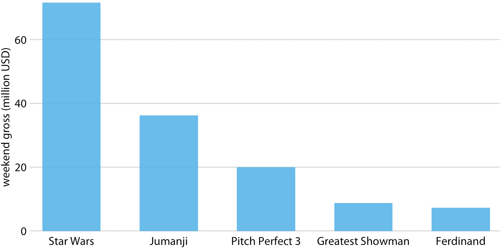

图 6.1：2017 年 12 月 22 日至 24 日周末的最高票房电影。数据来源：[Box Office Mojo](http://www.boxofficemojo.com/)，经许可使用

我们通常遇到的垂直条形的一个问题是，标注每个条形的标签占用了大量的水平空间。事实上，我不得不将图 6.1 设置得相当宽，并将条形的间距变大，以便我可以将电影标题放在下面。为了节省水平空间，我们可以将条形放在一起并旋转标签（图 6.2 ）。但是，我不是旋转标签的大力支持者。我发现最终的绘图很难阅读。而且，根据我的经验，每当标签太长而不能水平放置时，它们看起来也不好看。

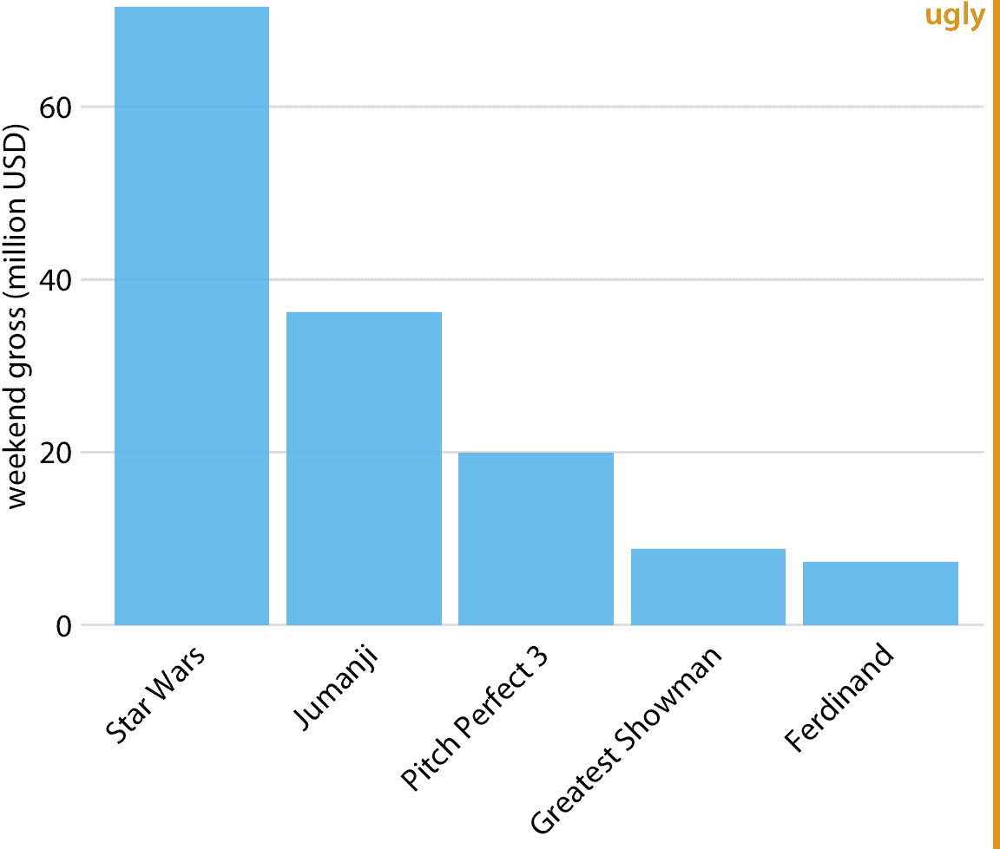

图 6.2：2017 年 12 月 22 日至 24 日周末的最高票房电影，显示为带有旋转轴刻度标签的条形图。旋转轴刻度标签往往难以阅读，并且需要使用绘图下方的笨拙的空间。出于这些原因，我通常认为旋转刻度标签的图表很难看。数据来源：[Box Office Mojo](http://www.boxofficemojo.com/)，经许可使用

长标签的更好解决方案通常是交换 *x* 和 *y* 轴，使条形水平放置（图 6.3）。在交换轴之后，我们获得了一个紧凑的图形，其中所有可视元素（包括所有文本）都是水平方向的。因此，该图比图 6.2 或甚至图 6.1 更容易阅读。

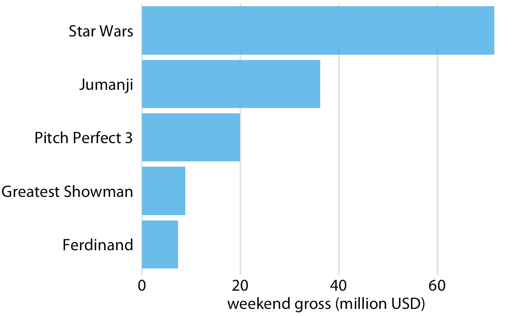

图 6.3：2017 年 12 月 22 日至 24 日周末的最高票房电影，显示为水平条形图。数据来源：Box Office Mojo（ [http://www.boxofficemojo.com/](http://www.boxofficemojo.com/) ）。经许可使用

无论我们是垂直还是水平放置条形，我们都需要注意条形排列的顺序。我经常看到条形图，其中条形图是任意排列的，或者是在图形的上下文中没有意义的某些标准。一些绘图程序默认按标签的字母顺序排列条形图，其他类似的任意排列也是可能的（图 6.4 ）。一般而言，所得到的数字比按其大小排列的条形图更加混乱且不太直观。

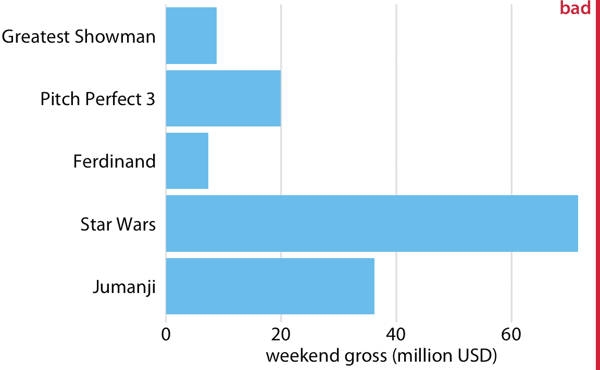

图 6.4：2017 年 12 月 22 日至 24 日周末的最高票房电影，显示为水平条形图。这里，条形按照电影标题长度降序排列。这种条形排列是任意的，它没有用于有意义的目的，并且它使得所得图形比图 6.3 更不直观。数据来源：[Box Office Mojo](http://www.boxofficemojo.com/)，经许可使用

然而，当条形表示的类别没有自然排序时，我们应该仅仅重新排列条形。每当存在自然排序时（即，当我们的类别变量是有序因子时），我们应该在可视化中保留该排序。例如，图 6.5 显示了按年龄组划分的美国年收入中位数。在这种情况下，条形应按年龄升序排列。按照条形高度排序同时改变年龄组是没有意义的（图 6.6）。

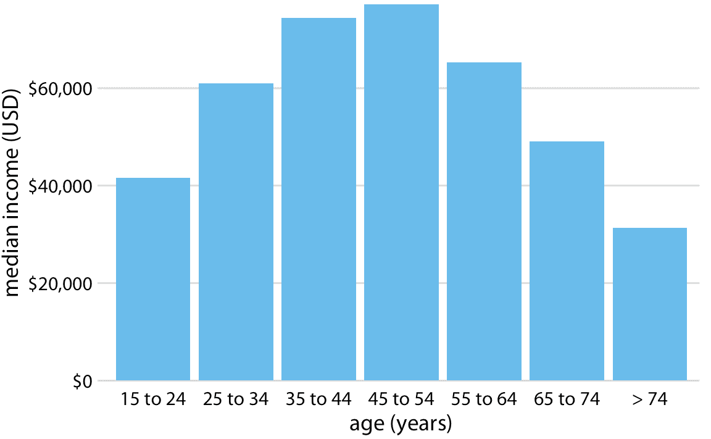

图 6.5：2016 年美国家庭年收入中位数，按年龄组划分。 45-54 岁年龄组的收入中位数最高。数据来源：美国人口普查局

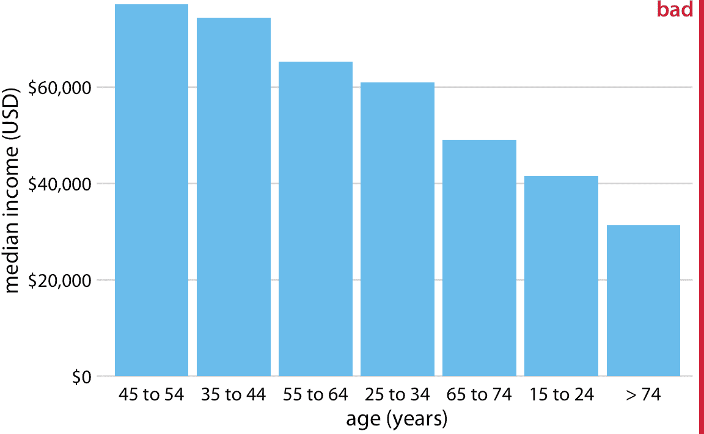

图 6.6：2016 年美国家庭年收入中位数，按年龄组年龄组，按收入排序。虽然这种条形的顺序看起来很有吸引力，但是年龄组的顺序现在令人困惑。数据来源：美国人口普查局

注意条形顺序。如果条形表示无序类别，则按照数据值的升序或降序对它们进行排序。

## 6.2 分组和堆叠条形

前一小节中的所有示例都显示了定量数量如何根据一个类别变量而变化。然而，我们经常同时对两个类别变量感兴趣。例如，美国人口普查局提供按年龄和种族划分的中位数收入水平。我们可以用分组条形图（图 6.7）可视化该数据集。在分组条形图中，我们在 *x* 轴的每个位置绘制一组条形图，由一个类别变量确定，然后我们根据另一个类别变量在每个组内绘制条形图。

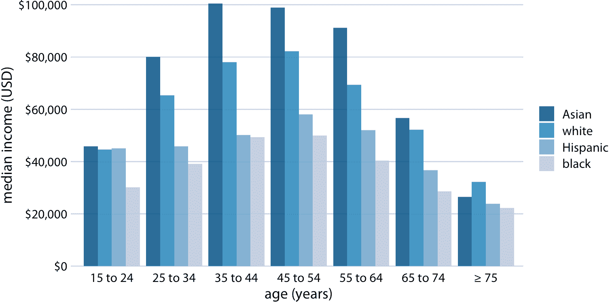

图 6.7：2016 年美国家庭年收入中位数，按年龄组和种族划分。年龄组沿着 *x* 轴显示，并且对于每个年龄组，有四个条形，分别对应于亚洲人，白人，拉美人和黑人的中位数收入。数据来源：美国人口普查局

分组条形图一次显示大量信息，它们可能令人困惑。事实上，即使我没有将图 6.7 标记为坏或丑，我觉得很难阅读。特别是，对于特定的种族分组，很难比较不同年龄组的中位数收入。因此，只有当我们主要关注种族分组的收入水平差异（分别针对特定年龄组）时，这个图表才适用。如果我们更关心种族分组收入水平的总体模式，可能最好沿着 *x* 轴显示种族，并在每个种族分组中显示年龄为不同的条形图（图 6.8）。

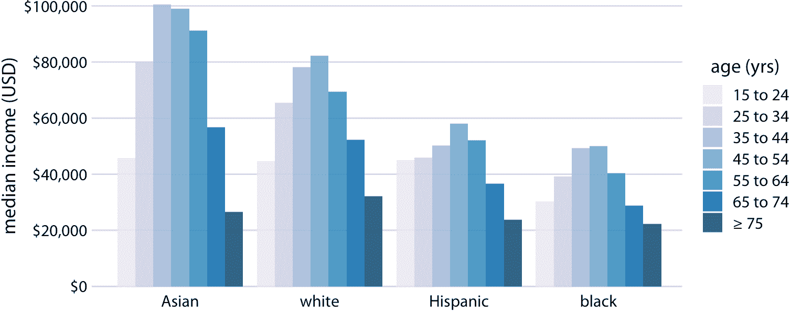

图 6.8：2016 年美国家庭年收入中位数，按年龄组和种族划分。与图 6.7 相反，现在沿着 *x* 轴显示种族，并且对于每个种族，我们根据七个年龄组显示七个条形。数据来源：美国人口普查局

图 6.7 和 6.8 均沿着 *x* 轴的位置编码一个类别变量，另一个按条形颜色编码。在这两种情况下，按位置编码都很容易阅读，而按条颜色编码则需要更多精力，因为我们必须在精神上匹配条形图颜色与图例中的颜色。我们可以通过显示四个单独的常规条形图而不是一个分组条形图来避免这种额外的心理负担（图 6.9）。我们选择哪种不同的选择最终是品味问题。我可能会选择图 6.9 ，因为它避免了不同条形颜色的需要。

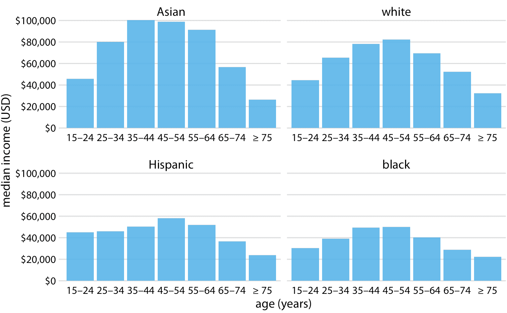

图 6.9：2016 年美国家庭年收入中位数，按年龄组和种族划分。我们现在将数据显示为四个单独的常规条形图，而不是将这些数据显示为分组条形图，如图 6.7 和 6.8 。这种选择的优点是，我们不需要用条形颜色编码类别变量。数据来源：美国人口普查局

比起并排绘制条组，有时最好将条形堆叠在一起。当各个堆叠条形表示的数量之和本身就是一个有意义的数量时，堆叠就很有用。因此，虽然堆叠图 6.7 的中位收入值（两个中位收入值的总和不是一个有意义的值）是没有意义的，但堆叠图 6.1 的周末总值可能是有意义的。 （两部电影的周末总值之和是这两部电影合计的总票数）。当单个条形表示计数时，堆叠也是合适的。例如，在人口数据集中，我们可以单独统计男性或女性，也可以将它们统计在一起。如果我们在表示男性人数的条形图上堆叠代表女性人数的条形图，则组合条形的高度表示不论性别的人数。

我将使用 1912 年 4 月 15 日沉没的跨大西洋远洋轮船泰坦尼克号乘客的数据集来证明这一原则。船上约有 1300 名乘客，不包括船员。乘客在三个舱位（第一，第二或第三）中的一个旅行，并且船上的女性乘客几乎是男性的两倍。为了按舱位和性别可视化乘客的细分，我们可以为每个舱位和性别绘制单独的条形图，然后对于每个舱位，将代表男性的条形图堆叠在代表女性的条形图上（图 6.10）。组合条形代表每个舱位的乘客总数。

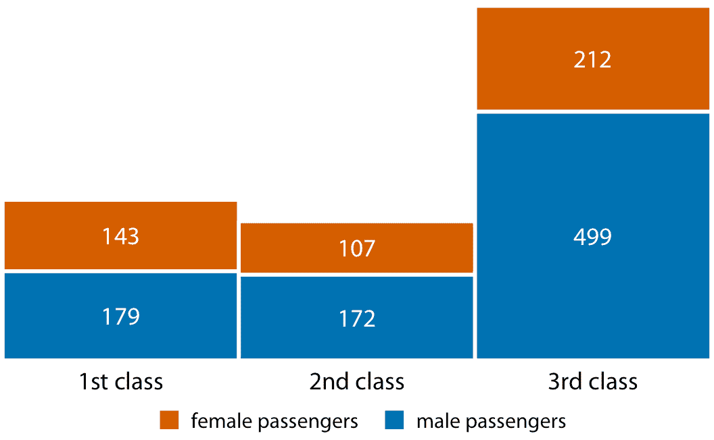

图 6.10：泰坦尼克号的一，二，三等舱的男女乘客人数。

图 6.10 与我之前显示的条形图的不同之处在于没有明确的 *y* 轴。我已经显示了每个条形代表的实际数值。每当绘图仅显示少量不同的值时，将实际数字添加到绘图中是有意义的。这大大增加了绘图传达的信息量，而没有增加太多的视觉噪声，并且它消除了对显式 *y* 轴的需要。

## 6.3 点图和热图

条形图不是可视化数量的唯一选项。条形的一个重要限制是它们需要从零开始，因此条形长度与所示的量成比例。对于某些数据集，这可能不切实际或可能会模糊关键功能。在这种情况下，我们可以通过在 *x* 或 *y* 轴的适当位置放置点来指示量。

图 6.11 演示了这种可视化方法，用于美洲 25 个国家的预期寿命数据集。这些国家的公民的预期寿命在 60 到 81 岁之间，每个人的预期寿命值在 *x* 轴的适当位置显示为蓝点。通过将轴范围限制在 60 至 81 年的间隔，该图突出了该数据集的主要特征：加拿大在所有列出的国家中具有最高的预期寿命，而玻利维亚和海地的预期寿命远低于所有其他国家。如果我们使用了条形而不是点（图 6.12 ），我们已经做了一个不太引人注目的数字。因为这个图中的条纹很长，并且它们都具有几乎相同的长度，所以眼睛被吸引到条形的中间而不是它们的端点，并且该图形无法传达其信息。

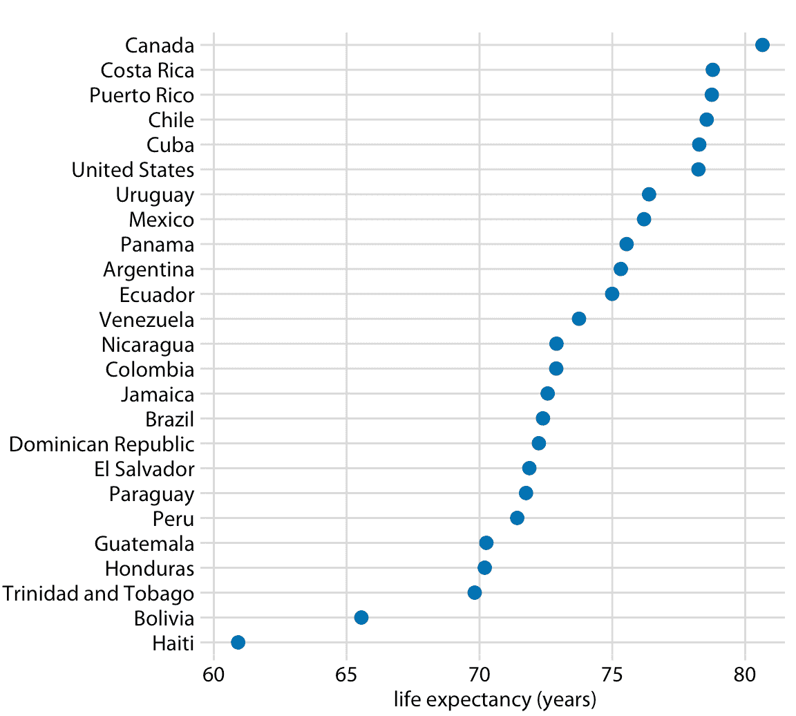

图 6。11：2007 年美洲国家的预期寿命。数据来源：Gapminder 项目

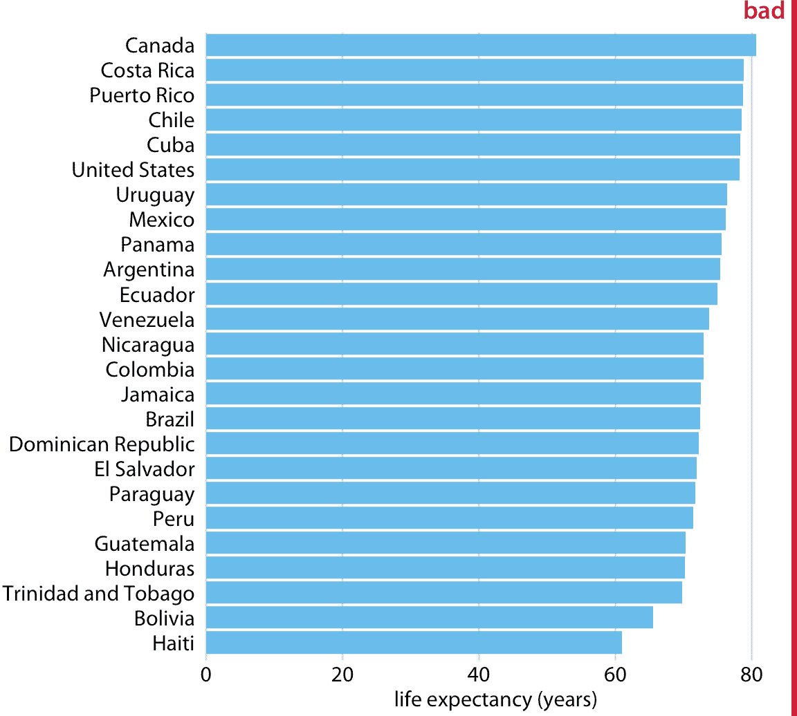

图 6.12：2007 年美洲国家的预期寿命，以条形图表示。此数据集不适合用条形图显示。这些酒吧太长了，他们将注意力从数据的关键特征，不同国家的预期寿命差异中吸引过来。数据来源：Gapminder 项目

然而，无论我们使用条形还是圆形，我们都需要注意数据值的排序。在图 6.11 和 6.12 中，各国按照预期寿命的降序排列。如果我们按字母顺序对它们进行排序，我们最终会得到混乱的点云，这些点令人困惑并且无法传达明确的信息（图 6.13 ）。

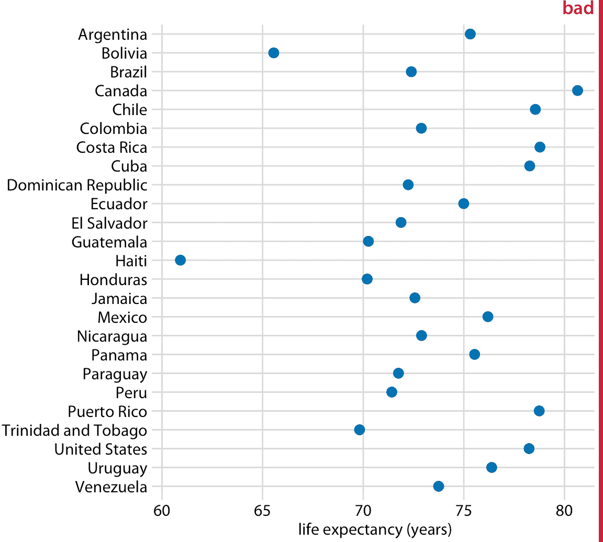

图 6.13：2007 年美洲国家的预期寿命。这里，按字母顺序排列国家，这会导致点形成无序的点云。这使得数字难以阅读，因此它应该被标记为“不好”。数据来源：Gapminder 项目

到目前为止，所有示例都表示沿位置刻度的位置量，通过条形的终点或点的位置。对于非常大的数据集，这些选项都不合适，因为结果数字会变得太忙。我们已经在图 6.7 中看到，只有七组四个数据值可能会导致图形复杂且不易读取。如果我们有 20 组 20 个数据值，那么类似的数字可能会非常混乱。

作为通过条形或点将数据值映射到位置的替代方法，我们可以将数据值映射到颜色上。这样的图称为 _ 热图 _。图 6.14 使用这种方法显示了从 1994 年到 2016 年在 20 个国家和 23 年中互联网用户的百分比。虽然这种可视化使得更难确定所显示的确切数据值（例如，什么是 2015 年美国互联网用户的确切百分比？），它突出了更广泛的趋势。我们可以清楚地看到哪些国家早期开始使用互联网，哪些国家没有，我们也可以清楚地看到哪些国家在数据集覆盖的最后一年具有较高的互联网渗透率（2016 年）。

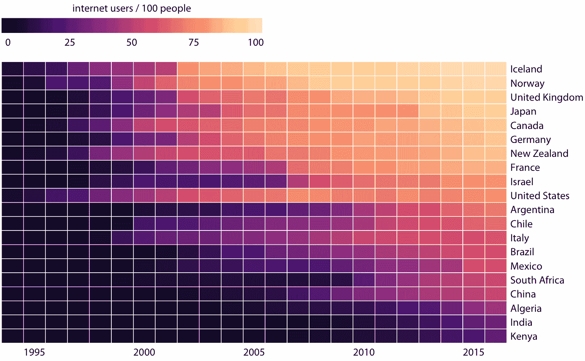

图 6.14：部分国家/地区的互联网采用情况。颜色表示相应国家/地区和互联网用户的百分比。 2016 年按互联网用户百分比排序国家。数据来源：世界银行

与本章讨论的所有其他可视化方法一样，我们需要在制作热图时注意分类数据值的排序。在图 6.14 中，各国按 2016 年互联网用户的百分比排序。此订单将英国，日本，加拿大和德国置于美国之上，因为所有这些国家在 2016 年的互联网普及率都较高虽然美国在较早的时候看到了大量的互联网使用，但是比美国的确如此。或者，我们可以通过他们开始看到重要的互联网使用的早期订购国家。在图 6.15 中，各国按照互联网使用率首次上升至 20％以上的年份进行排序。在这个数字中，美国从顶部进入第三位，与 2016 年早期的互联网使用情况相比，2016 年的互联网使用率相对较低。意大利也可以看到类似的模式。相比之下，以色列和法国起步较晚，但迅速取得了进展。

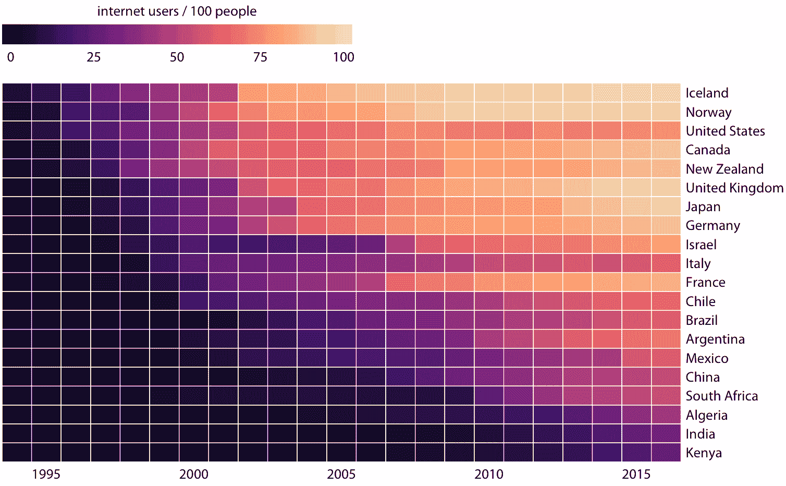

图 6.15：针对特定国家/地区的互联网采用情况。按照互联网使用率首次超过 20％的年份订购国家。数据来源：世界银行

图 6.14 和 6.15 都是数据的有效表示。哪一个是首选取决于我们想传达的故事。如果我们的故事是关于 2016 年的互联网使用，那么数字 6.14 可能是更好的选择。但是，如果我们的故事是关于互联网的早期或晚期采用与当前使用情况有关，那么图 6.15 是优选的。