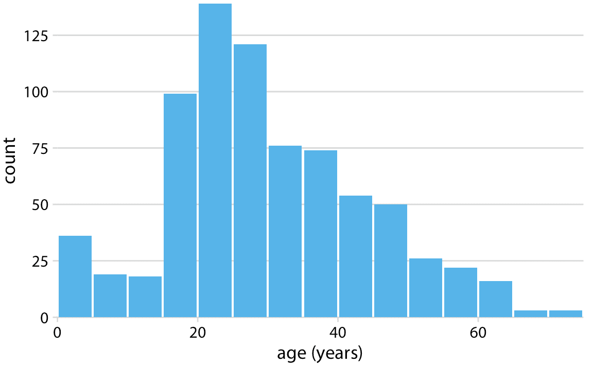
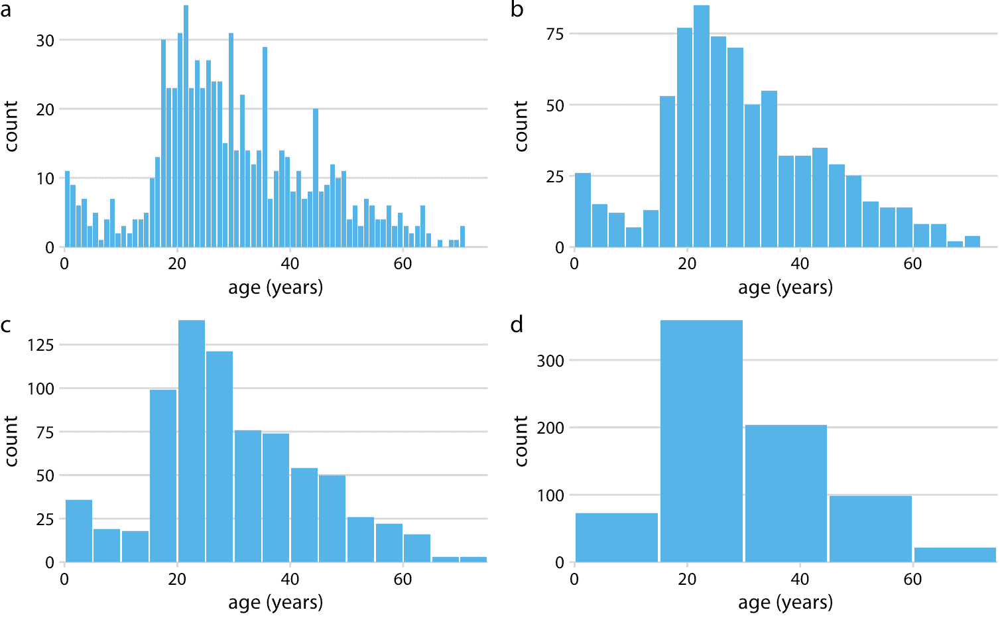
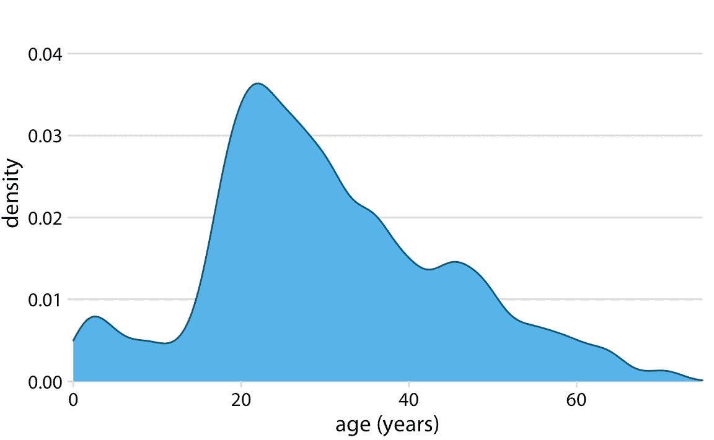
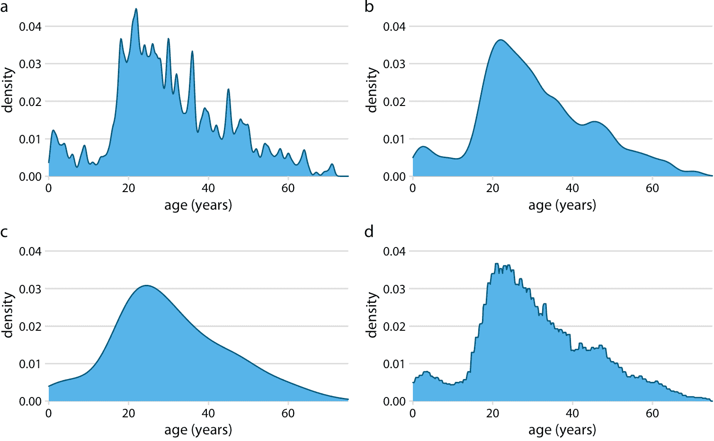
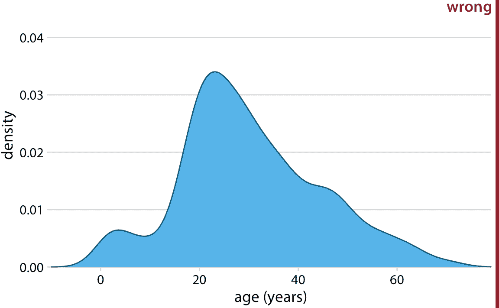
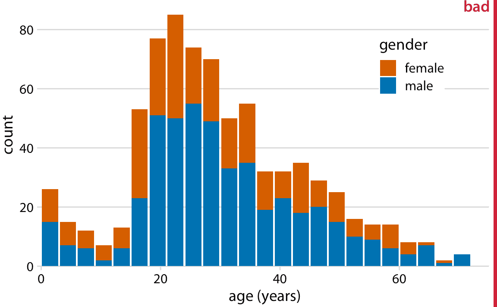
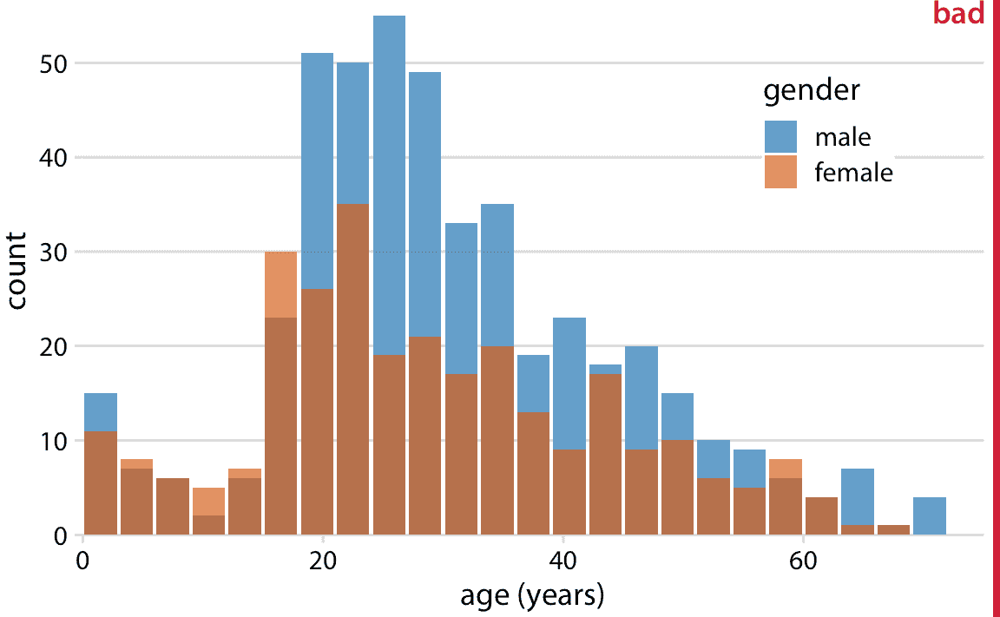
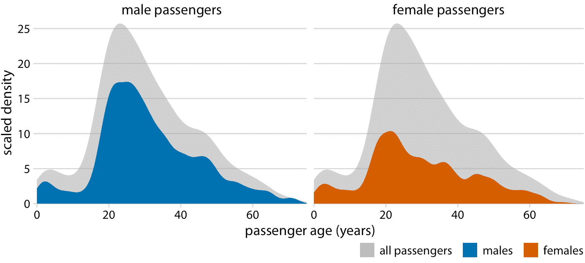
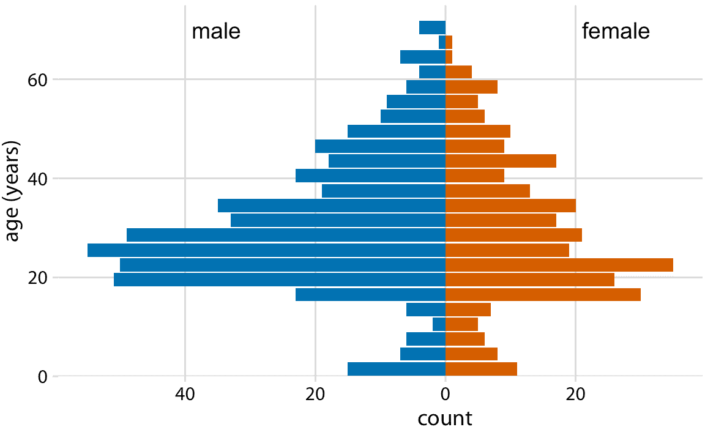
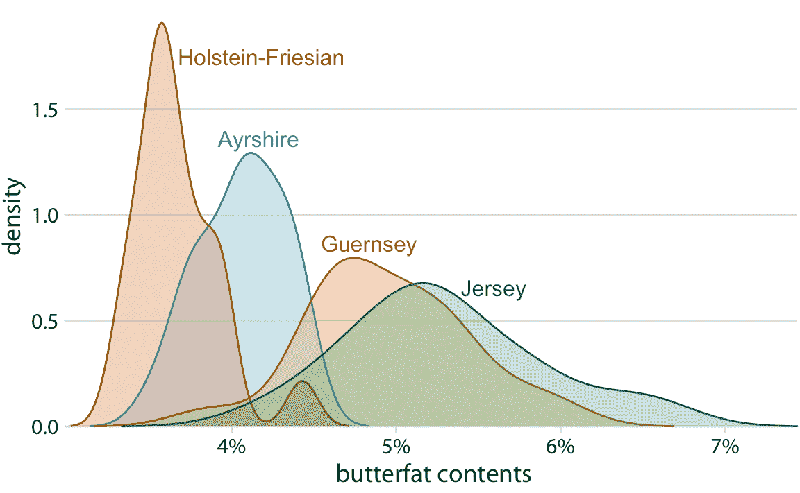

# 7 可视化分布：直方图和密度图

> 原文： [https://serialmentor.com/dataviz/histograms-density-plots.html](https://serialmentor.com/dataviz/histograms-density-plots.html)

我们经常遇到这样的情况：我们想要了解特定变量如何在数据集中分布。举一个具体的例子，我们将考虑泰坦尼克号的乘客，这是我们在章节 [6](visualizing-amounts.html#visualizing-amounts) 中已经遇到的数据集。泰坦尼克号上有大约 1300 名乘客（不包括船员），我们已经报告了 756 名乘客的年龄。我们可能想知道有多少乘客在泰坦尼克号上有多少年龄，即有多少儿童，年轻人，中年人，老年人等等。我们将乘客的 _ 年龄分布 _ 中不同年龄的相对比例称为乘客。

## 7.1 可视化单个分布

我们可以通过将所有乘客分组到具有可比年龄的箱子中然后计算每个箱中的乘客数量来获得乘客之间的年龄分布感。该程序产生如表 [7.1](histograms-density-plots.html#tab:titanic-ages) 的表格。

<caption>Table 7.1: Numbers of passenger with known age on the Titanic.</caption>
| 

&#124; 年龄范围 &#124; 计数 &#124;
&#124; :-- &#124; --: &#124;
&#124; 0-5 &#124; 36 &#124;
&#124; 6-10 &#124; 19 &#124;
&#124; 11-15 &#124; 18 &#124;
&#124; 16-20 &#124; 99 &#124;
&#124; 21-25 &#124; 139 &#124;
&#124; 26 -30 &#124; 121 &#124;

 | 

&#124; 年龄范围 &#124; 计数 &#124;
&#124; :-- &#124; --: &#124;
&#124; 31-35 &#124; 76 &#124;
&#124; 36-40 &#124; 74 &#124;
&#124; 41-45 &#124; 54 &#124;
&#124; 46-50 &#124; 50 &#124;
&#124; 51-55 &#124; 26 &#124;
&#124; 56 -60 &#124; 22 &#124;

 | 

&#124; 年龄范围 &#124; 计数 &#124;
&#124; :-- &#124; --: &#124;
&#124; 61-65 &#124; 16 &#124;
&#124; 66-70 &#124; 3 &#124;
&#124; 71-75 &#124; 3 &#124;

 |

我们可以通过绘制填充的矩形来显示该表，这些矩形的高度对应于计数，其宽度对应于年龄段的宽度（图 [7.1](histograms-density-plots.html#fig:titanic-ages-hist1) ）。这种可视化称为直方图。 （请注意，所有容器必须具有相同的宽度，以使可视化成为有效的直方图。）

图 7.1：泰坦尼克号乘客年龄的直方图。

因为直方图是通过对数据进行分箱生成的，所以它们的确切视觉外观取决于箱宽的选择。生成直方图的大多数可视化程序默认选择一个 bin 宽度，但是对于您可能想要制作的任何直方图，bin 宽度可能不是最合适的。因此，始终尝试不同的 bin 宽度以验证结果直方图是否准确反映基础数据至关重要。通常，如果箱宽度太小，则直方图变得过于尖锐并且视觉上繁忙，并且数据中的主要趋势可能被模糊。另一方面，如果箱宽度太大，则数据分布中的较小特征（例如 10 年左右的下降）可能消失。

对于泰坦尼克号乘客的年龄分布，我们可以看到一年的箱宽度太小，十五年的箱宽度太大，而箱子宽度在三到五年之间工作正常（图 [7.2](histograms-density-plots.html#fig:titanic-ages-hist-grid) ]）。

图 7.2：直方图取决于所选的箱宽。在这里，泰坦尼克号乘客的年龄分布相同，有四种不同的箱宽：（a）一年; （b）三年; （c）五年; （d）十五年。

制作直方图时，请始终探索多个纸槽宽度。

自至少 18 世纪以来，直方图一直是流行的可视化选项，部分原因在于它们很容易通过手工生成。最近，由于笔记本电脑和手机等日常设备已经具备了广泛的计算能力，我们发现它们越来越多地被密度图取代。在密度图中，我们尝试通过绘制适当的连续曲线来显示数据的基本概率分布（图 [7.3](histograms-density-plots.html#fig:titanic-ages-dens1) ）。该曲线需要从数据中估计，并且用于该估计过程的最常用方法称为 _ 核密度估计。_ 在核密度估计中，我们在每个数据点的位置画一个小宽度的连续曲线（内核）（由一个名为 _ 带宽 _ 的参数控制），然后我们将所有这些加起来曲线以获得最终密度估计。最广泛使用的内核是高斯内核（即高斯钟形曲线），但还有许多其他选择。

图 7.3：泰坦尼克号上乘客年龄分布的核密度估计。缩放曲线的高度，使得曲线下面积等于 1。密度估计用高斯核进行，带宽为 2。

与直方图的情况一样，密度图的确切视觉外观取决于内核和带宽选择（图 [7.4](histograms-density-plots.html#fig:titanic-ages-dens-grid) ）。带宽参数的行为类似于直方图中的 bin 宽度。如果带宽太小，则密度估计可能变得过于尖锐并且视觉上很忙，并且数据中的主要趋势可能被模糊。另一方面，如果带宽太大，则数据分布中的较小特征可能消失。此外，核的选择会影响密度曲线的形状。例如，高斯核将倾向于产生看起来像高斯的密度估计，具有平滑的特征和尾部。相比之下，矩形核可以在密度曲线中产生步骤的外观（图 [7.4](histograms-density-plots.html#fig:titanic-ages-dens-grid) d）。通常，数据集中的数据点越多，内核的选择就越少。因此，密度图对于大型数据集来说往往是非常可靠和有用的信息，但对于只有几个点的数据集可能会产生误导。

图 7.4：内核密度估计取决于所选的内核和带宽。这里，显示了这些参数的四种不同组合的泰坦尼克号乘客的相同年龄分布：（a）高斯核，带宽= 0.5; （b）高斯核，带宽= 2; （c）高斯核，带宽= 5; （d）矩形内核，带宽= 2。

密度曲线通常按比例缩放，使得曲线下面积等于 1。这种惯例会使 _y_ 轴刻度混乱，因为它取决于 _x_ 轴的单位。例如，在年龄分布的情况下， _x_ 轴上的数据范围从 0 到大约 75.因此，我们期望密度曲线的平均高度为 1/75 = 0.013。实际上，当观察年龄密度曲线时（例如，图 [7.4](histograms-density-plots.html#fig:titanic-ages-dens-grid) ），我们看到 _y_ 值的范围从 0 到大约 0.04，平均值接近 0.01。

核密度估计有一个我们需要注意的陷阱：它们倾向于产生不存在数据的外观，特别是在尾部。因此，不小心使用密度估计值很容易导致产生无意义陈述的数字。例如，如果我们不注意，我们可能会生成包含负年龄的年龄分布的可视化（图 [7.5](histograms-density-plots.html#fig:titanic-ages-dens-negative) ）。

图 7.5：内核密度估计可以将分布的尾部扩展到没有数据且甚至没有数据的区域。在这里，密度估计已被允许延伸到负年龄范围。这显然是荒谬的，应该避免。

始终验证您的密度估计值不能预测无意义数据值的存在。

那么你应该使用直方图或密度图来显示分布吗？可以就这个主题进行激烈的讨论。有些人强烈反对密度图，并认为它们是任意的和误导性的。其他人意识到直方图可能同样具有任意性和误导性。我认为选择主要取决于品味，但有时候一个或另一个选项可能更准确地反映手头数据中感兴趣的具体特征。也有可能既不使用也不选择经验累积密度函数或 q-q 图（章 [8](ecdf-qq.html#ecdf-qq) ）。最后，我相信，一旦我们想要一次可视化多个分布，密度估计就会比直方图具有固有的优势（见下一节）。

## 7.2 同时可视化多个分布

在许多情况下，我们有多个分布，我们希望同时可视化。例如，假设我们想看看泰坦尼克号乘客的年龄如何在男女之间分配。男性和女性乘客一般是同龄人，还是性别之间存在年龄差异？在这种情况下，一种常用的可视化策略是堆积直方图，我们在男性的条形图上绘制不同颜色的女性直方图条（图 [7.6](histograms-density-plots.html#fig:titanic-age-stacked-hist) ）。

图 7.6：按性别分层的泰坦尼克号乘客年龄的直方图。这个数字被标记为“坏”，因为堆积的直方图很容易与重叠的直方图混淆（另见图 [7.7](histograms-density-plots.html#fig:titanic-age-overlapping-hist) ）。另外，代表女性乘客的条的高度不容易彼此比较。

在我看来，应该避免这种类型的可视化。这里有两个关键问题：首先，从仅仅看一下这个数字，就不会完全清楚这些条纹的确切位置。它们是从颜色变化开始还是从零开始？换句话说，是否有大约 25 名女性，年龄在 18-20 岁或者几乎有 80 岁？ （前者就是这种情况。）其次，女性计数的高度不能直接相互比较，因为这些都是从不同高度开始的。例如，男性平均年龄大于女性，这一事实在图 [7.6](histograms-density-plots.html#fig:titanic-age-stacked-hist) 中根本不可见。

我们可以尝试通过让所有条形从零开始并使条形部分透明来解决这些问题（图 [7.7](histograms-density-plots.html#fig:titanic-age-overlapping-hist) ）。

图 7.7：男性和女性泰坦尼克号乘客的年龄分布，显示为两个重叠的直方图。这个数字被标记为“坏”，因为没有明确的视觉指示，所有蓝条都以 0 开始计数。

但是，这种方法会产生新的问题。现在看来实际上有三个不同的组，而不仅仅是两组，我们仍然不完全确定每个栏的开始和结束位置。重叠的直方图不能很好地工作，因为在另一个上面绘制的半透明条看起来不像半透明条，而是像用不同颜色绘制的条。

重叠密度图通常不具有重叠直方图所具有的问题，因为连续密度线有助于眼睛保持分布分离。然而，对于这个特定的数据集，男性和女性乘客的年龄分布在 17 岁左右几乎相同，然后发散，因此产生的可视化仍然不理想（图 [7.8](histograms-density-plots.html#fig:titanic-age-overlapping-dens) ）。

图 7.8：男性和女性泰坦尼克号乘客年龄的密度估计值。为了突出显示男性乘客多于女性乘客，密度曲线按比例缩放，使得每条曲线下的面积对应于已知年龄的男性和女性乘客的总数（分别为 468 和 288）。

适用于该数据集的解决方案是分别显示男性和女性乘客的年龄分布，每个乘客占总年龄分布的比例（图 [7.9](histograms-density-plots.html#fig:titanic-age-fractional-dens) ）。这种可视化直观而清晰地表明，在泰坦尼克号上，20-50 岁年龄段的女性比男性少得多。

图 7.9：男性和女性泰坦尼克号乘客的年龄分布，以乘客总数的比例显示。彩色区域分别显示男性和女性乘客年龄的密度估计值，灰色区域显示总乘客年龄分布。

最后，当我们想要准确地可视化两个分布时，我们还可以制作两个单独的直方图，将它们旋转 90 度，并使一个直方图中的条形指向另一个直方图的相反方向。这种技巧通常用于可视化年龄分布，结果图通常称为 _ 年龄金字塔 _（图 [7.10](histograms-density-plots.html#fig:titanic-age-pyramid) ）。

图 7.10：可视化为年龄金字塔的男性和女性泰坦尼克号乘客的年龄分布。

重要的是，当我们想要同时显示两个以上的发行版时，这个技巧不起作用。对于多个分布，直方图往往变得高度混乱，而密度图只要分布有些不同且连续就能很好地工作。例如，为了可视化来自四个不同牛品种的奶牛的乳脂百分比分布，密度图很好（图 [7.11](histograms-density-plots.html#fig:butterfat-densitites) ）。

图 7.11：四种牛品种牛奶中乳脂百分比的密度估算值。数据来源：加拿大纯种奶牛的性能记录

为了一次可视化几个分布，核密度图通常比直方图更好。