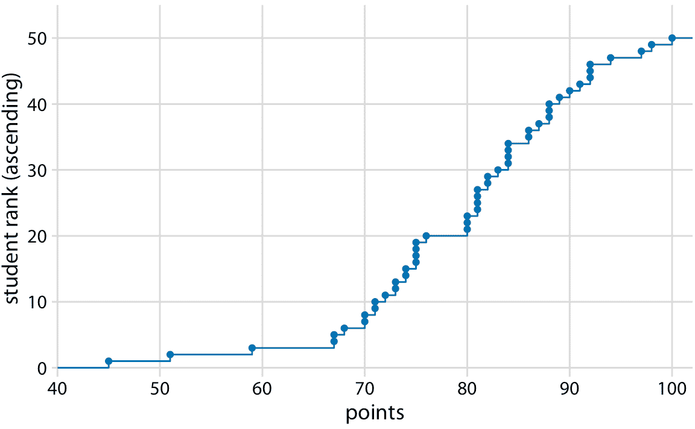
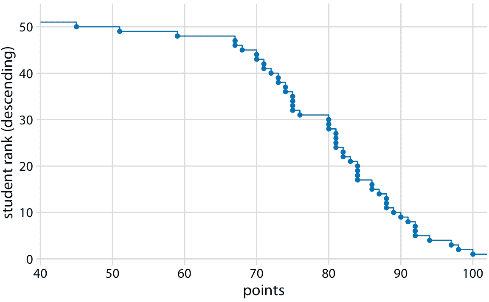
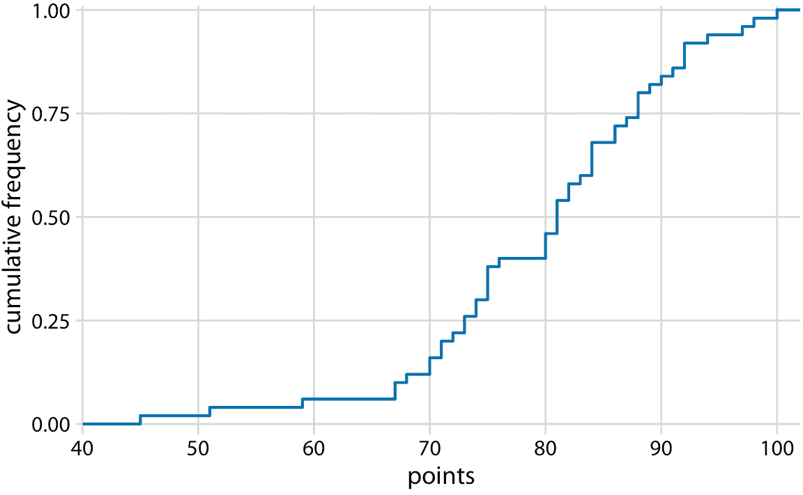
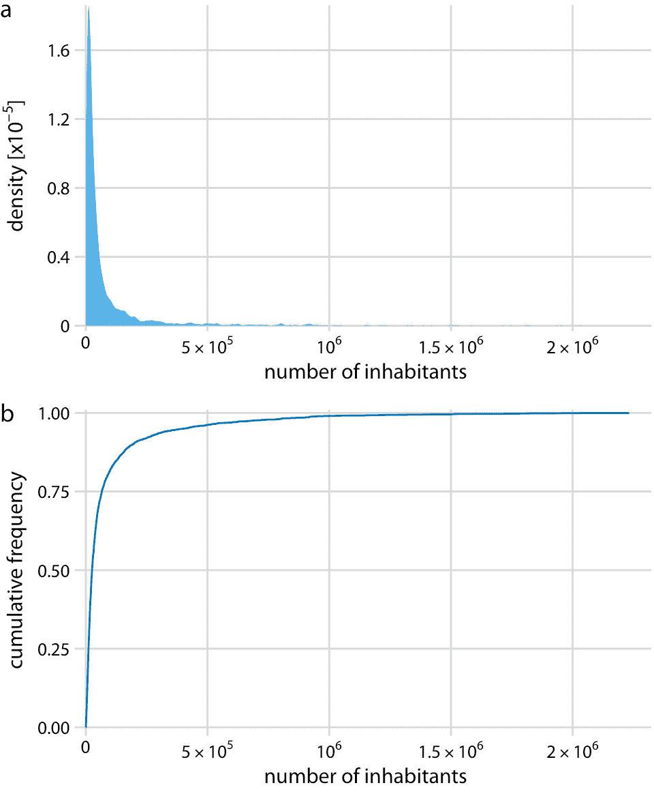
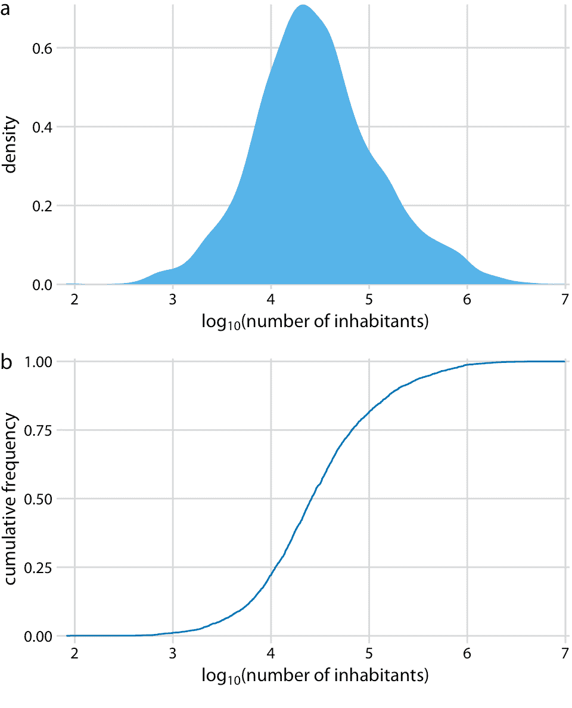
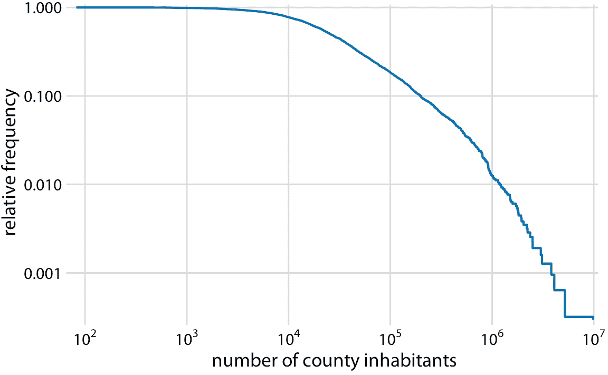
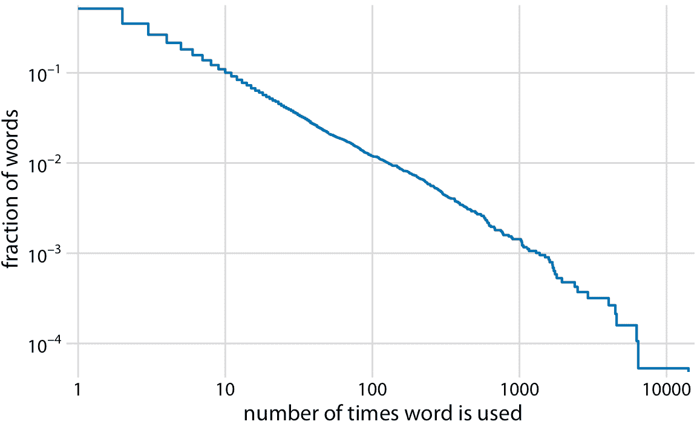
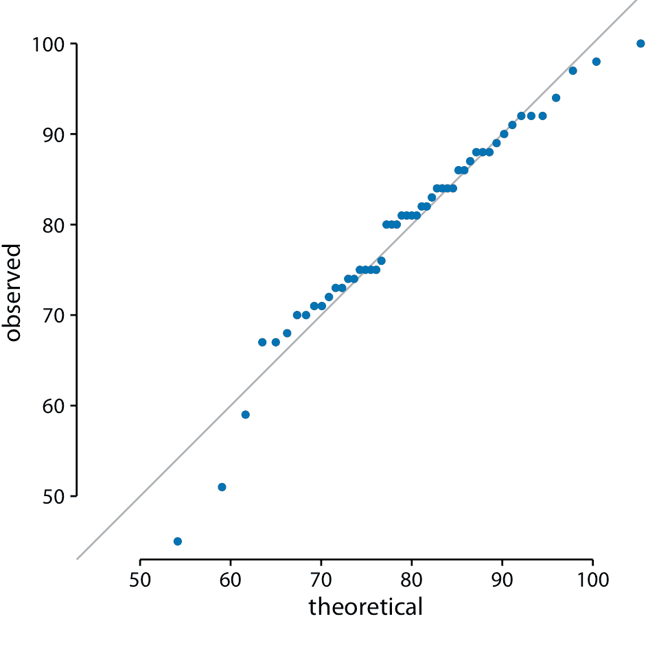
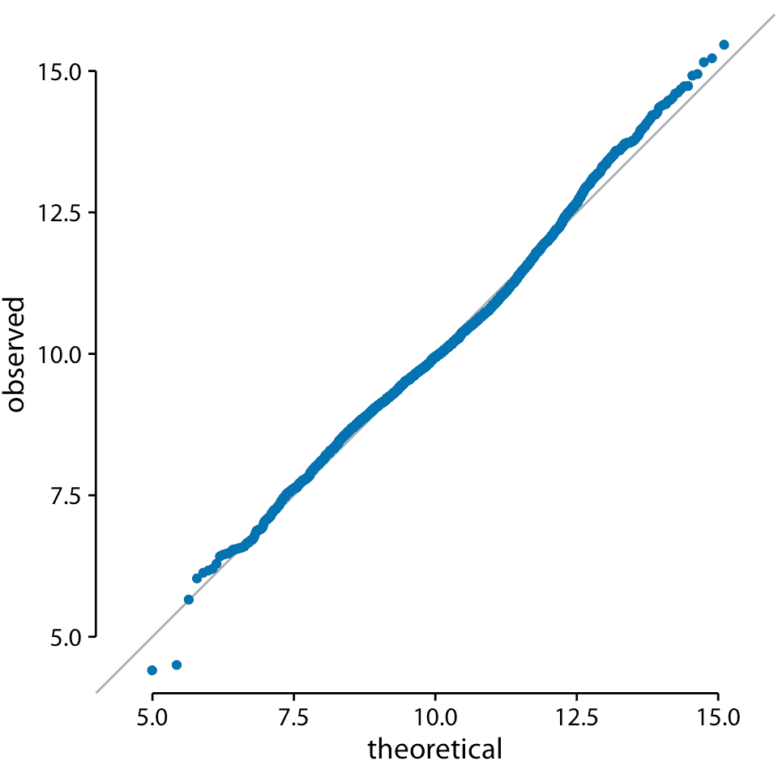

# 8 可视化分布：经验累积分布函数和 q-q 图

> 原文： [https://serialmentor.com/dataviz/ecdf-qq.html](https://serialmentor.com/dataviz/ecdf-qq.html)

在章节 [7](histograms-density-plots.html#histograms-density-plots) 中，我描述了如何使用直方图或密度图来可视化分布。这两种方法都非常直观且具有视觉吸引力。然而，正如该章中所讨论的，它们都共享限制，即所得数字在很大程度上取决于用户必须选择的参数，例如直方图的箱宽度和密度图的带宽。因此，两者都必须被视为对数据的解释，而不是数据本身的直接可视化。

作为使用直方图或密度图的替代方法，我们可以简单地将所有数据点单独显示为点云。但是，对于非常大的数据集，这种方法变得难以处理，并且在任何情况下，聚合方法中都有值突出显示分布的属性而不是单个数据点。为了解决这个问题，统计学家发明了经验累积分布函数（ecdfs）和分位数 - 分位数（q-q）图。这些类型的可视化不需要任意参数选择，它们一次显示所有数据。不幸的是，它们比直方图或密度图更不直观，我不认为它们在高技术出版物之外经常使用。不过，他们在统计学家中很受欢迎，我认为任何对数据可视化感兴趣的人都应该熟悉这些技术。

## 8.1 经验累积分布函数

为了说明累积的经验分布函数，我将从一个假设的例子开始，该例子是在我作为教室教授处理的很多内容之后的模型：学生成绩的数据集。假设我们的假设班有 50 名学生，学生们刚刚完成了考试，他们可以在 0 到 100 分之间得分。我们如何才能最好地可视化课堂表现，例如确定适当的成绩界限？

我们可以绘制最多获得一定数量积分的学生总数与所有可能的积分。该图将是一个升序函数，从 0 开始为 0 点，从 50 开始为 100 点。关于这种可视化的另一种思考方式如下：我们可以按所获得的点数按升序对所有学生进行排名（因此，得分最低的学生得分最低，得分最高的学生最高） ，然后绘制等级与获得的实际点数。结果是 _ 经验累积分布函数 _（ecdf）或简单地 _ 累积分布。_ 每个点代表一个学生，并且线条可视化观察到的任何可能的点值的最高学生等级（图 [8.1](ecdf-qq.html#fig:student-grades) ）。

图 8.1：假设的 50 名学生的学生成绩的经验累积分布函数。

你可能想知道如果我们按照相反的顺序对学生进行排序，会发生什么。这个排名简单地翻转了它的功能。结果仍然是经验累积分布函数，但现在这些线表示对任何可能的点值观察到的最低学生等级（图 [8.2](ecdf-qq.html#fig:student-grades-desc) ）。

图 8.2：作为降序 ecdf 绘制的学生成绩分布。

升序累积分布函数比下降函数更广为人知，更常用，但两者都有重要的应用。当我们想要显示高度偏斜的分布时，下降累积分布函数是至关重要的（参见章节 [8.2](ecdf-qq.html#skewed-distributions) ）。

在实际应用中，绘制 ecdf 而不突出显示各个点并通过最大等级对等级进行归一化是很常见的，因此 _y_ 轴代表累积频率（图 [8.3](ecdf-qq.html#fig:student-grades-normalized) ]）。

图 8.3：学生成绩的 Ecdf。学生等级已经标准化为学生总数，因此绘制的 _y_ 值对应于班级中具有最多多个点的学生的分数。

我们可以直接从该图中读取学生成绩分布的关键属性。例如，大约四分之一的学生（25％）得到的不到 75 分。中值点值（对应于 0.5 的累积频率）是 81.大约 20％的学生得到 90 分或更多。

我发现 ecdfs 可以方便地分配等级边界，因为它们可以帮助我找到最小化学生不快乐的确切截止点。例如，在这个例子中，在 80 点以下有一条相当长的水平线，接着是 80 点的急剧上升。这个特征是由三名学生在考试中获得 80 分而另一名表现较差的学生只获得 76 分。在这种情况下，我可能会认为得分为 80 或者以上的每个人都会得到一个 B 而且每个 79 或者更少的人都会得到 C.这三个 80 分的学生很高兴他们刚做了一个 B，而那个学生有 76 个。意识到他们必须表现得更好才能没有得到 C.如果我把截止值设定为 77，那么字母等级的分布就完全一样了，但我可能会找到 76 分的学生来我办公室希望谈判他们的成绩。同样，如果我将截止值设置为 81，我可能会在我的办公室里有三名学生试图谈判他们的成绩。

## 8.2 高度偏斜的分布

许多经验数据集显示高度偏斜的分布，特别是右边的重尾，这些分布可能具有挑战性。此类分布的示例包括居住在不同城市或县的人数，社交网络中的联系人数，单个单词出现在书中的频率，不同作者撰写的学术论文数量，净值个体，以及蛋白质 - 蛋白质相互作用网络中单个蛋白质的相互作用伙伴的数量（ Clauset，Shalizi 和 Newman（ [2009](#ref-Clauset-et-al-2009) ））。所有这些分布的共同点是它们的右尾衰减比指数函数慢。实际上，这意味着非常大的值并不罕见，即使分布的平均值很小。一类重要的此类分布是 _ 幂律 _ 分布，其中观察 _x_ 值大于某些参考点的值的可能性下降为 _x 的幂 _。举一个具体的例子，考虑美国的净值，根据幂指数 2 的指数分配。在任何给定的净值水平（比如 100 万美元），净值一半的人是频率的四倍和净值两倍的人是频繁的四分之一。重要的是，如果我们使用 10,000 美元作为参考点或者我们使用 1 亿美元，那么同样的关系就成立了。因此，幂律分布也称为 _ 无标度 _ 分布。

根据 2010 年美国人口普查，我将首先讨论生活在美国各州的人数。这种分布在右边有一个很长的尾巴。尽管大多数县的居民人数相对较少（中位数为 25,857），但仍有少数县拥有极大数量的居民（例如洛杉矶县，居民人数为 9,818,605）。如果我们试图将人口计数的分布可视化为密度图或 ecdf，我们获得的数据基本上是无用的（图 [8.4](ecdf-qq.html#fig:county-populations) ）。

图 8.4：根据 2010 年美国人口普查，美国各县的居民人数分布。 （a）密度图。 （b）经验累积分布函数。

密度图（图 [8.4](ecdf-qq.html#fig:county-populations) a）在 0 处显示一个尖峰，几乎没有可见的分布细节。类似地，ecdf（图 [8.4](ecdf-qq.html#fig:county-populations) b）在 0 附近显示快速上升，并且再次没有可见的分布细节。对于此特定数据集，我们可以对数据进行对数转换并可视化对数转换值的分布。这种转变在这里起作用，因为县里的人口数量实际上并不是幂律，而是遵循近乎完美的对数正态分布（参见 [8.3](ecdf-qq.html#qq-plots) 部分）。实际上，对数变换值的密度图显示出良好的钟形曲线，相应的 ecdf 显示出良好的 S 形形状（图 [8.5](ecdf-qq.html#fig:county-populations-log) ）。

图 8.5：美国各县居民人数的对数分布。 （a）密度图。 （b）经验累积分布函数。

为了看到这个分布不是幂律，我们将其绘制为具有对数 _x_ 和 _y_ 轴的下降 ecdf。在此可视化中，幂律显示为完美的直线。对于县里的人口数量，右尾在降序 log-log ecdf 图上形成几乎但不是一条直线（图 [8.6](ecdf-qq.html#fig:county-populations-tail-log-log) ）。

图 8.6：至少有许多居民的县与县居民数量的相对频率。

作为第二个例子，我将使用出现在小说“白鲸记”中的所有单词的词频分布。这种分布遵循完善的幂律。当绘制为具有对数轴的下降 ecdf 时，我们看到几乎完美的直线（图 [8.7](ecdf-qq.html#fig:word-counts-tail-log-log) ）。

图 8.7：小说“白鲸记”中字数的分布。显示的是在小说中至少出现多次的单词的相对频率与使用单词的次数。

## 8.3 分位数分位数图

当我们想要确定观察到的数据点在何种程度上遵循给定分布时，分位数分位数（q-q）图是有用的可视化。就像 ecdfs 一样，q-q 图也基于对数据进行排名并可视化排名和实际值之间的关系。但是，在 q-q 图中，我们不直接绘制等级，如果数据是根据指定的参考分布分布的，我们使用它们来预测给定数据点应该落在哪里。最常见的是，使用正态分布作为参考构建 q-q 图。举一个具体的例子，假设实际数据值的平均值为 10，标准差为 3.然后，假设正态分布，我们预计排在第 50 百分位数的数据点位于第 10 位（平均值） ，第 84 百分位的数据点位于第 13 位（高于平均值一个标准差），第 2.3 百分位的数据点位于第 4 位（平均值以下两个标准差）。我们可以对数据集中的所有点执行该计算，然后将观察值（即，数据集中的值）与理论值（即，给定每个数据点的等级和假定的参考分布预期的值）进行绘制。

当我们从本章开头对学生成绩分布执行此程序时，我们得到图 [8.8](ecdf-qq.html#fig:student-grades-qq) 。

图 8.8：学生成绩的 q-q 图。

这里的实线不是回归线，而是表示 _x_ 等于 _y_ 的点，即观察值等于理论值的点。如果点落在该线上，则数据遵循假设分布（此处为正常）。我们发现学生的成绩主要是正常分布，在底部和顶部有一些偏差（少数学生的表现比预期更差）。高端分布的偏差是由假设检验中的最大点值 100 引起的;无论最好的学生有多好，他或她最多可以获得 100 分。

我们还可以使用 q-q 图来测试我在本章前面的断言，即美国各县的人口数量遵循对数正态分布。如果这些计数是对数正态分布的，那么它们的对数变换值是正态分布的，因此应该直接落在 _x_ = _y_ 线上。在制作这个图时，我们看到观察值与理论值之间的一致性是异常的（图 [8.9](ecdf-qq.html#fig:county-populations-qq) ）。这表明县之间人口数量的分布确实是对数正态的。

图 8.9：美国各县居民人数对数的 q-q 图。

### 参考

Clauset，A.，C。R. Shalizi 和 M. E. J. Newman。 “经济数据中的幂律分布。” _SIAM Review_ 51：661-703。