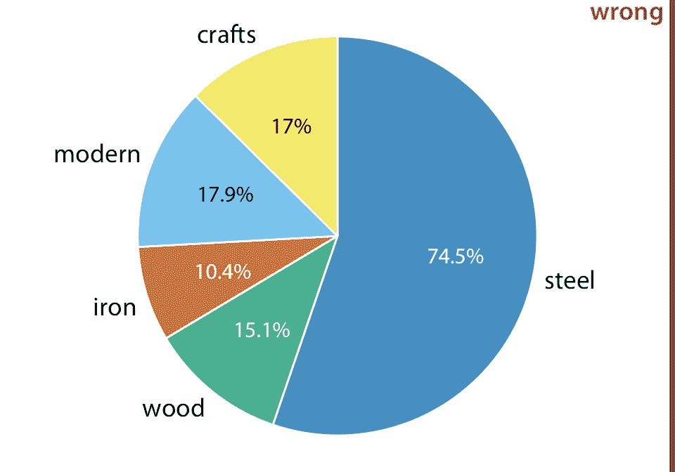
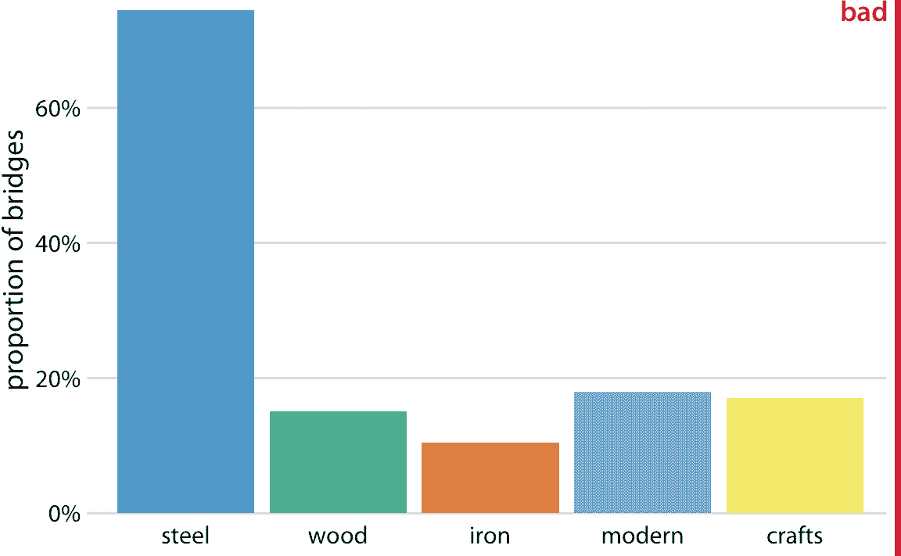
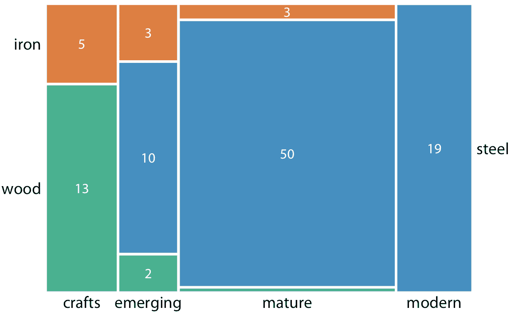
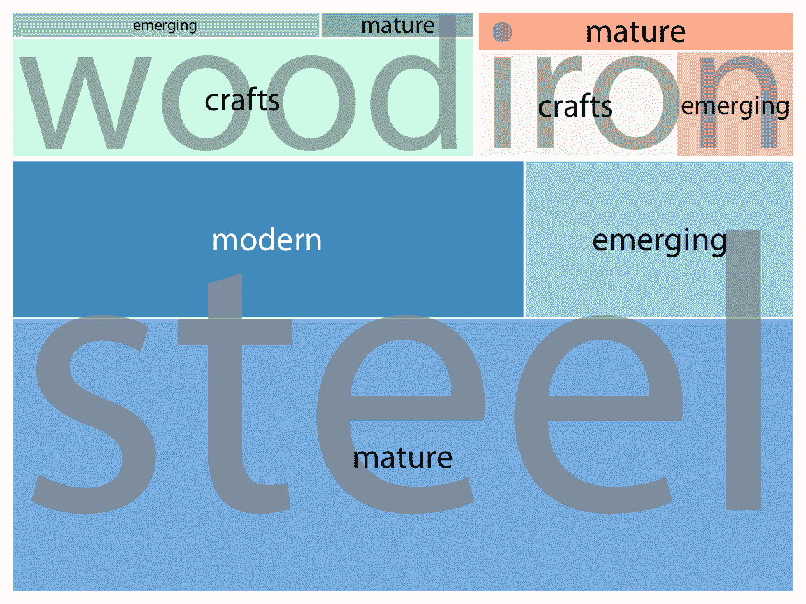
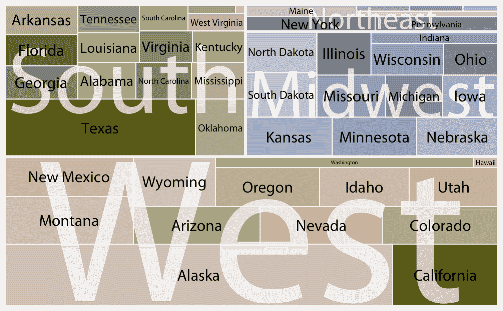
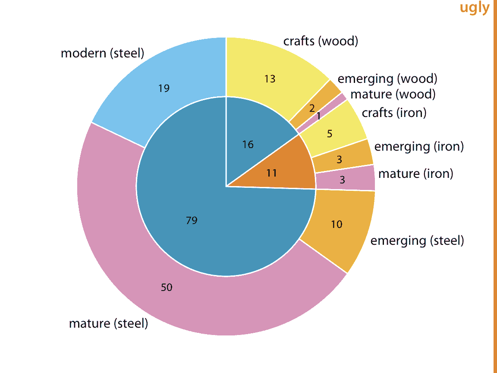
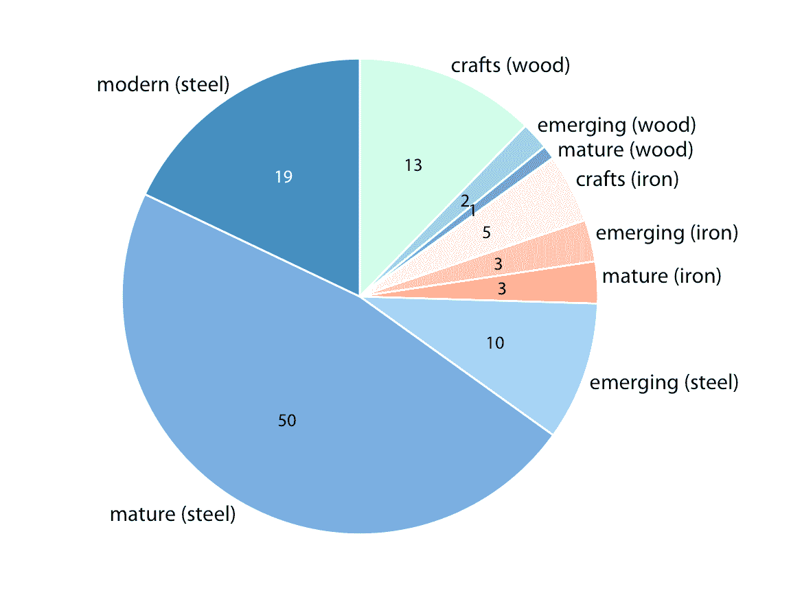
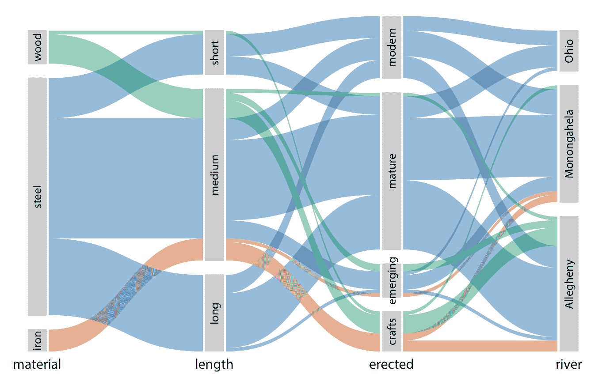
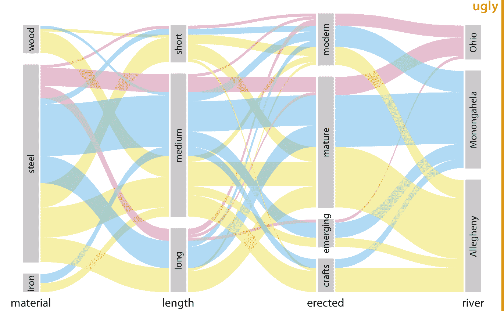
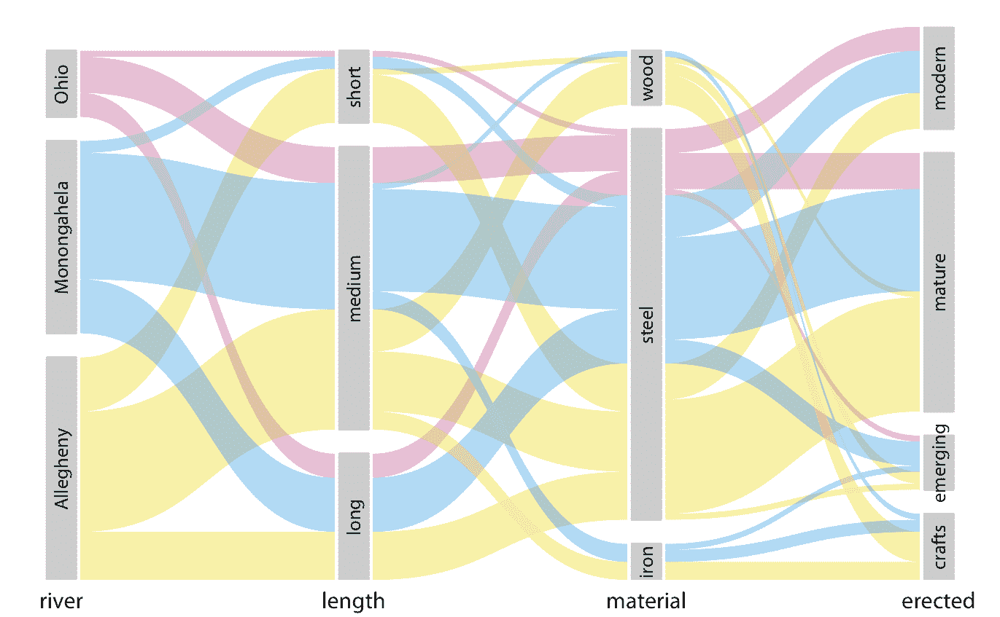

# 11 可视化嵌套比例

> 原文： [https://serialmentor.com/dataviz/nested-proportions.html](https://serialmentor.com/dataviz/nested-proportions.html)

在前一章中，我讨论了一个方案，将数据集分解为由一个类别变量定义的片段，例如政党，公司或健康状况。然而，我们想要深入探索，并一次按多个类别变量分解数据集，这并不罕见。例如，就议会席位而言，我们可能会对党派席位的比例和代表的性别感兴趣。同样，对于人们的健康状况，我们可以询问健康状况如何进一步影响婚姻状况。我将这些场景称为嵌套比例，因为我们添加的每个附加类别变量，都会创建一个更精细的嵌套在先前比例中的数据细分。有几种合适的方法可视化这种嵌套比例，包括马赛克图，树形图和平行集。

## 11.1 嵌套比例产生了错误

我将首先展示两种有缺陷的嵌套比例可视化方法。虽然这些方法对于任何有经验的数据科学家来说都是荒谬的，但我已经在现实中看到它们，因此认为它们值得讨论。在本章中，我将使用匹兹堡 106 座桥梁的数据集。该数据集包含桥梁的各种信息，例如构造它们的材料（钢，铁或木材）以及它们建成的年份。根据建成年份，桥梁被分为不同的类别，例如 1870 年之前建造的手工桥梁和 1940 年后建造的现代桥梁。

让我们假设，我们希望可视化由钢，铁或木材制成的桥梁比例，以及手工或现代的比例。我们可能想通过绘制组合饼图来做到这一点（图 11.1 ）。但是，此可视化无效。饼图中的所有切片必须加起来为 100%，此处切片的总和达到 135%。我们的总百分比超过 100% ，因为我们正在重复计算桥梁。数据集中的每个桥梁都由钢，铁或木材制成，因此这三个切片已经表示 100% 的桥梁。每个手工或现代桥梁也是钢桥，铁桥或木桥，因此在饼图中计算两次。

图 11.1：匹兹堡的桥梁，按照建筑材料（钢，木材，铁）和建造日期（手工，1870 年之前，现代，1940 年之后）划分，以饼图展示。数字代表所有桥梁中给定类型的桥梁的百分比。此图表无效，因为百分比加起来超过 100%。建筑材料与施工日期之间存在重叠。例如，所有现代桥梁均由钢制成，大多数手工桥梁由木材制成。数据来源：Yoram Reich 和 Steven J. Fenves，UCI 机器学习库（Dua 和 Karra Taniskidou 2017）

如果我们选择不要求比例加起来是 100% 的可视化，则重复计算不一定是个问题。如前一章所述，并排条形符合此标准。我们可以在一个图中将不同比例的桥梁显示为条形图，这个图在技术上不是错误的（图 11.2）。尽管如此，我还是将其标记为“不好”，因为它并未立即显示某些类别之间存在重叠。一个不经意的观察者可能从图 11.2 得出结论，有五种不同类型的桥梁，例如，现代桥梁既不是由钢制成，也不是由木头或铁制成。

图 11.2：匹兹堡的桥梁，按照建筑材料（钢，木材，铁）和施工日期（手工，1870 年之前，现代，1940 年之后）划分，显示为条形图。与图 11.1 不同，这种可视化在技术上并不是错误的，因为它并不意味着条形高度需要加起来达到 100%。但是，它也没有明确表明不同分组之间的重叠，因此我将其标记为“不好”。数据来源：Yoram Reich 和 Steven J. Fenves，UCI 机器学习库（Dua 和 Karra Taniskidou 2017）

## 11.2 马赛克图和树形图

每当我们有重叠的类别时，最好清楚地显示它们之间的相互关系。这可以用马赛克图完成（图 11.3）。乍一看，马赛克图看起来类似于堆叠条形图（例如，图 10.5）。然而，与堆叠条形图不同，在马赛克图中，各个阴影区域的高度和宽度都不同。请注意，在图 11.3 中，我们看到两个额外的建造时代，新兴（从 1870 年到 1889 年）和成熟（1890 年至 1939 年）。结合手工和现代，这些建造时代涵盖了数据集中的所有桥梁，三种建筑材料也是如此。这是马赛克图的关键条件：显示的每个类别变量必须涵盖数据集中的所有观测。

图 11.3：匹兹堡的桥梁，由建筑材料（钢，木材，铁）和建造时代（手工，新兴，成熟，现代）划分，显示为马赛克图。每个矩形的宽度与那个时代建造的桥梁的数量成比例，并且高度与使用该材料构造的桥梁的数量成比例。数字代表每个类别中的桥梁数量。数据来源：Yoram Reich 和 Steven J. Fenves，UCI 机器学习库（Dua 和 Karra Taniskidou 2017）

为了绘制马赛克图，我们首先在 *x* 轴上放置一个类别变量（这里是桥梁的建造时代），并按照该类别的相对比例细分 *x* 轴。然后我们将另一个类别变量沿着 *y* 轴（这里是建筑材料）放置，并且在 *x* 轴的每个类别中，按照 *y* 变量（类别）的相对比例将 *y* 轴细分。结果是一组矩形，其面积与情况数量成比例，它们表示两个类别变量的每个可能的组合。

桥梁数据集也可以以相关但不同的格式可视化，称为树形图。在树形图中，就像马赛克图中的情况一样，我们采用一个封闭的矩形并将其细分为较小的矩形，其面积代表比例。然而，与马赛克图相比，将较小矩形放入较大矩形的方法是不同的。在树形图中，我们以递归方式将矩形嵌套在彼此内部。例如，在匹兹堡桥梁的情况下，我们可以首先将总区域细分为三个部分，代表三种建筑材料，木材、铁和钢。然后，我们进一步细分每个区域，以代表每种建筑材料所代表的建造时代（图 11.4 ）。原则上，我们可以继续在彼此内部嵌套更小的细分，但结果相对很快将变得笨拙或混乱。

图 11.4：匹兹堡的桥梁，由建筑材料（钢，木材，铁）和建造时代（手工，新兴，成熟，现代）划分，显示为树形图。每个矩形的面积与该类型的桥梁数量成比例。数据来源：Yoram Reich 和 Steven J. Fenves，UCI 机器学习库（Dua 和 Karra Taniskidou  2017）

虽然马赛克图和树形图密切相关，但它们具有不同的重点和不同的应用领域。在这里，马赛克图（图 11.3）强调从手工时代到现代时期吗，建筑材料使用的时间演变，而树形图（图 11.4 ）强调钢桥，木桥和铁桥的总数。

更一般地，马赛克图假设，所示的所有比例可以通过两个或更多个类别变量的正交组合来确定。例如，在图 11.3 中，每个桥梁都可以通过选择建筑材料（木材，铁，钢）和时代（手工，新兴，成熟，现代）来描述。而且，原则上这两个变量的每个组合都是可能的，即使在实践中不一定是这种情况。 （这里没有钢质手工桥梁，也没有木质或铁质的现代桥梁。）相比之下，树形图不存在这样的要求。实际上，当通过组合多个类别变量无法有意义地描述比例时，树形图往往能够工作得很好。例如，我们可以将美国分为四个区域（西部，东北部，中西部和南部），每个区域分为不同的州，但一个地区的州与另一个地区的州没有关系（图 11.5）。

图 11.5：美国的州，可视化为树形图。每个矩形代表一个州，每个矩形的面积与状态的地表面积成比例。这些州分为四个地区，西部，东北部，中西部和南部。颜色与每个州的居民数量成比例，较暗的颜色代表较大数量的居民。数据来源：2010 年美国人口普查

马赛克图和树形图都是常用的并且可以是启发性的，但是它们具有与堆叠条形相似的限制（10.1 节）：条件之间的直接比较可能是困难的，因为不同的矩形不一定为视觉比较共享基线。在马赛克图或树形图中，由于不同矩形的形状可以变化，这个问题更加严重。例如，在新兴桥梁和成熟桥梁之间存在相同数量的铁桥（三个），但这在马赛克图中很难辨别（图 11.3），因为代表三个桥梁的这两组的这两个矩形，具有完全不同的形状。没有必要解决这个问题 - 可视化嵌套比例可能很棘手。只要有可能，我建议在图上显示实际的计数或百分比，以便读者可以验证，它们对阴影区域的直观解释是否正确。

## 11.3 嵌套饼图

在本章的开头，我用一个有缺陷的饼图（图 11.1）可视化桥梁数据集，然后我认为马赛克图或树形图更合适。但是，后两种绘图类型都与饼图密切相关，因为它们都使用面积来表示数据值。主要区别在于坐标系的类型，在饼图的情况下为极坐标，在马赛克图或树形图的情况下为笛卡尔坐标。这些不同图之间的这种紧密关系引发了一个问题，即饼图的某些变体是否可用于可视化此数据集。

有两种可能性。首先，我们可以绘制一个由内圈和外圈组成的饼图（图 11.6 ）。内圆圈用一个变量（这里是建筑材料）显示数据的细分，外圆圈用第二个变量（这里是桥梁构造的时代）显示内圆的每个切片的细分。这种可视化是合理的，但我有我的保留，因此我将其标记为“丑陋”。最重要的是，两个独立的圆圈模糊了数据集中的每个桥都具有建筑材料和桥梁构造时代的事实。实际上，在图 11.6 中，我们仍在对每个桥进行重复计算。如果我们将两个圆圈中显示的所有数字相加，我们得到 212，这是数据集中桥梁数量的两倍。

图 11.6：匹兹堡的桥梁由建筑材料（钢，木，铁，内圈）和建造时代（工艺，新兴，成熟，现代，外圈）击穿。数字代表每个类别中的桥梁数量。数据来源：Yoram Reich 和 Steven J. Fenves，通过 UCI 机器学习库（Dua 和 Karra Taniskidou [2017](#ref-UCI_repo_2017) ）

或者，我们可以首先根据一个变量（例如材料）将馅饼切成表示比例的碎片，然后根据另一个变量（构造时代）进一步细分这些切片（图 11.7 ）。通过这种方式，实际上我们正在制作一个包含大量小饼图的普通饼图。但是，我们可以使用着色来指示饼图的嵌套特性。在图 11.7 中，绿色代表木桥，橙色代表铁桥，蓝色代表钢桥。每种颜色的黑暗代表建造时代，较暗的颜色对应于最近建造的桥梁。通过以这种方式使用嵌套色标，我们可以通过主要变量（构造材料）和次要变量（构造时代）可视化数据的细分。

图 11.7：匹兹堡的桥梁由建筑材料（钢，木材，铁）和建造时代（工艺，新兴，成熟，现代）破坏。数字代表每个类别中的桥梁数量。数据来源：Yoram Reich 和 Steven J. Fenves，通过 UCI 机器学习库（Dua 和 Karra Taniskidou [2017](#ref-UCI_repo_2017) ）

图 11.7 的饼图表示桥数据集的合理可视化，但是与等效树形图直接比较（图 11.4 ）我认为树形图是更可取的。首先，树形图的矩形形状允许它更好地利用可用空间。图 11.4 和 11.7 具有完全相同的大小，但在图 11.7 中，大部分图被浪费为空白区域。图 11.4 ，树形图，几乎没有多余的空白区域。这很重要，因为它使我能够将标签放在树形图中的阴影区域内。内部标签总是使用数据创建比外部标签更强的可视单元，因此是首选。其次，图 11.7 中的一些饼图非常薄，因此很难看到。相比之下，图 11.4 中的每个矩形都具有合理的尺寸。

## 11.4 并行设置

当我们想要显示由两个以上类别变量描述的比例时，马赛克图，树形图和饼图都会很快变得难以处理。在这种情况下，可行的替代方案可以是 _ 平行组图 _。在并行集图中，我们展示了总数据集如何按每个单独的类别变量分解，然后我们绘制阴影带，显示子组如何相互关联。有关示例，请参见图 11.8 。在这个图中，我用建筑材料（铁，钢，木材），每个桥梁的长度（长，中，短），每个桥梁建造的时代（工艺，新兴，成熟，现代）分解桥梁数据集），每座桥跨越河流（Allegheny，Monongahela，俄亥俄州）。连接平行组的带由建筑材料着色。例如，这表明木桥大部分中等长度（有一些短桥），主要是在工艺期间竖立（在新兴和成熟期间竖立了一些中等长度的桥梁），并主要跨越 Allegheny 河（有一些跨越 Monongahela 河的工艺品桥梁）。相比之下，铁桥的长度都是中等长度，主要是在工艺时期竖立起来的，跨越阿勒格尼河和莫农加希拉河的比例大致相等。

图 11.8：匹兹堡的桥梁由建筑材料，长度，建造时代和它们跨越的河流划分，显示为平行组图。带的着色突出了不同桥梁的建筑材料。数据来源：Yoram Reich 和 Steven J. Fenves，通过 UCI 机器学习库（Dua 和 Karra Taniskidou [2017](#ref-UCI_repo_2017) ）

如果我们按照不同的标准着色，例如通过河流（图 11.9 ），相同的可视化看起来很不一样。这个数字在视觉上很繁忙，有许多纵横交错的乐队，但我们确实看到几乎所有类型的桥梁都可以跨越每条河流。

图 11.9：匹兹堡的桥梁按建筑材料，长度，施工时间和跨越河流划分。这个数字类似于图 11.8 ，但现在乐队的着色突出了不同桥梁跨越的河流。该图标记为“丑陋”，因为图中间的彩色条带的布置非常繁忙，并且还因为需要从右向左读取条带。数据来源：Yoram Reich 和 Steven J. Fenves，通过 UCI 机器学习库（Dua 和 Karra Taniskidou [2017](#ref-UCI_repo_2017) ）

我将图 11.9 标记为“丑陋”，因为我觉得它过于复杂和令人困惑。首先，因为我们习惯于从左到右阅读，所以我认为定义着色的集合应该一直显示在左边，而不是右边。这样可以更容易地查看着色的起源位置以及它如何在数据集中流动。其次，改变集合的顺序是一个好主意，这样可以最大限度地减少交叉带的数量。按照这些原则，我得出图 11.10 ，我认为它比图 11.9 更可取。

图 11.10：匹兹堡河流桥梁，建造时代，长度和建筑材料的故障。该图与图 11.9 的不同之处仅在于并联组的顺序。但是，修改后的订单会产生更易于阅读且不太繁忙的数字。数据来源：Yoram Reich 和 Steven J. Fenves，通过 UCI 机器学习库（Dua 和 Karra Taniskidou [2017](#ref-UCI_repo_2017) ）

### 参考

Dua，D。和 E. Karra Taniskidou。 2017.“UCI 机器学习库。”加州大学欧文分校信息学院;计算机科学。 [https://archive.ics.uci.edu/ml](https://archive.ics.uci.edu/ml) 。