# 12 可视化两个或多个定量变量之间的关联

> 原文： [https://serialmentor.com/dataviz/visualizing-associations.html](https://serialmentor.com/dataviz/visualizing-associations.html)

许多数据集包含两个或更多个定量变量，我们可能对这些变量如何相互关联感兴趣。例如，我们可能有一个不同动物的量化测量数据集，例如动物的身高，体重，身高和日常能量需求。仅绘制两个这样的变量的关系，例如：高度和重量，我们通常会使用散点图。如果我们想一次显示两个以上的变量，我们可能会选择气泡图，散点图矩阵或相关图。最后，对于非常高维的数据集，执行降维可能是有用的，例如以主成分分析的形式。

## 12.1 散点图

我将使用在 123 只蓝色杰伊鸟上进行的测量数据集来演示基本散点图及其若干变体。数据集包含诸如头部长度（从头部的尖端到头部后部测量），头骨尺寸（头部长度减去纸币长度）以及每只鸟的体重等信息。我们希望这些变量之间存在关系。例如，具有较长钞票的鸟类预计具有较大的颅骨尺寸，具有较高体重的鸟类应具有比具有较低体重的鸟类更大的钞票和头骨。

为了探索这些关系，我先从头部长度与体重的关系图开始（图 12.1 ）。在该图中，沿 _y_ 轴显示头长度，沿 _x_ 轴显示体重，每只鸟用一个点表示。 （注意术语：我们说我们绘制沿 _y_ 轴显示的变量与 _x_ 轴上显示的变量。）点形成一个分散的云（因此术语 _ 散点图 _），但毫无疑问，体重较高的鸟类有更长的头部趋势。头部最长的鸟接近观察到的最大体重，头部最短的鸟接近观察到的最小体重。

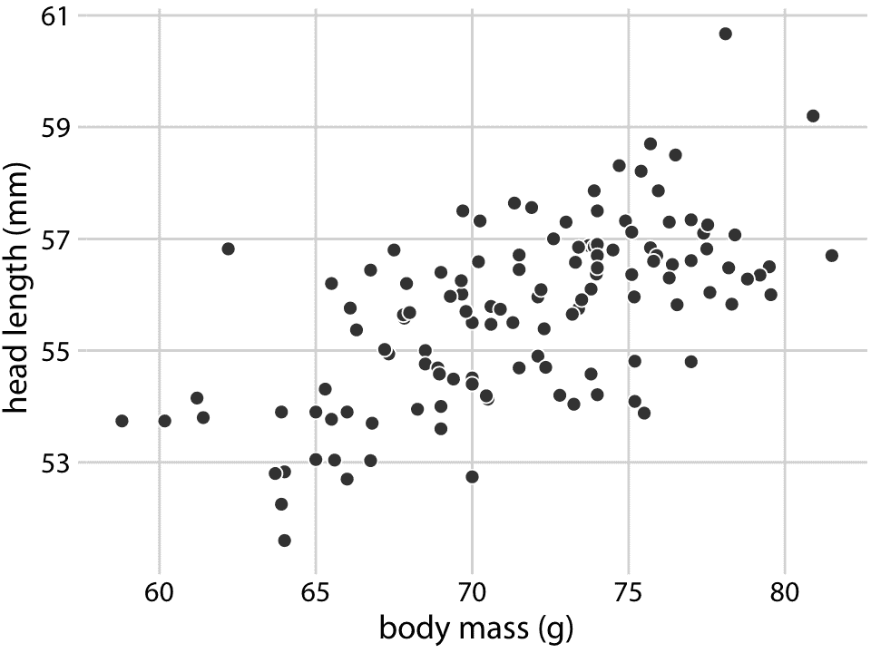

图 12.1：头部长度（从钞票尖端到头部后部测量，单位为 mm）与体重（以克为单位），123 蓝色标记。每个点对应一只鸟。较重的鸟类有较长的头部倾向。数据来源：欧柏林学院的 Keith Tarvin

蓝色杰伊数据集包含雄鸟和雌鸟，我们可能想知道每个性别的头长和体重之间的总体关系是否分别保持。为了解决这个问题，我们可以通过鸟的性别对散点图中的点进行着色（图 12.2 ）。该图显示头部长度和体重的总体趋势至少部分是由鸟类的性别驱动的。在相同的体重下，女性的头部往往比男性短。与此同时，女性平均比男性轻。

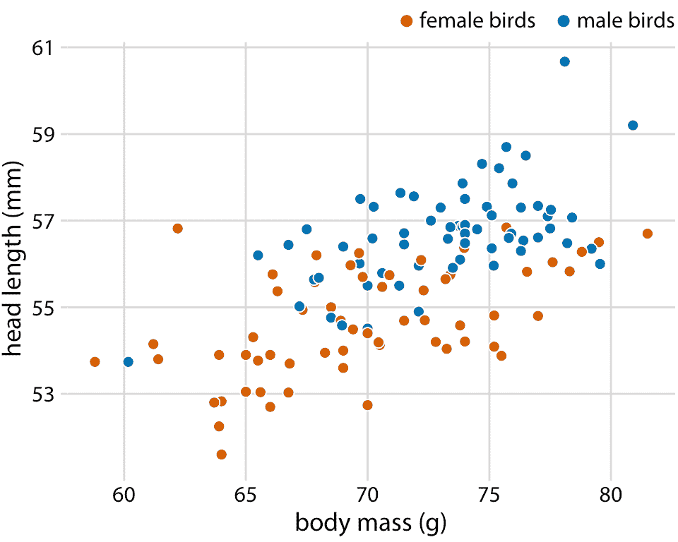

图 12.2：123 只蓝鸟的头长与体重的关系。鸟的性别用颜色表示。在相同的体重下，雄鸟往往比雌鸟具有更长的头（特别是更长的纸币）。数据来源：欧柏林学院的 Keith Tarvin

因为头部长度被定义为从喙尖到头部后部的距离，所以较大的头部长度可能意味着较长的喙，较大的颅骨或两者。我们可以通过查看数据集中的另一个变量（头骨大小）来解开账单长度和头骨大小，这与头长相似但不包括账单。由于我们已经将 _x_ 位置用于体重，头部长度的 _y_ 位置和鸟类性别的点颜色，我们需要另一种美学我们可以绘制头骨大小。一种选择是使用点的大小，产生称为 _ 气泡图 _ 的可视化（图 12.3 ）。

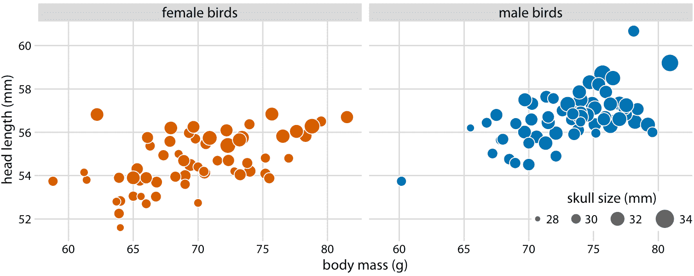

图 12.3：123 只蓝鸟的头长与体重的关系。鸟的性别用颜色表示，鸟的头骨大小用符号大小表示。头部长度测量包括账单的长度，而头骨尺寸测量则不包括。头部长度和头骨大小往往是相关的，但是有些鸟类的头骨尺寸非常长或短。数据来源：欧柏林学院的 Keith Tarvin

气泡图的缺点是它们显示相同类型的变量，定量变量，具有两种不同类型的比例，位置和大小。这使得难以在视觉上确定各种变量之间的关联强度。此外，编码为气泡大小的数据值之间的差异比编码为位置的数据值之间的差异更难以察觉。因为即使最大的气泡与总的图形尺寸相比也需要稍微小一些，即使最大和最小气泡之间的尺寸差异也必然很小。因此，数据值的较小差异将对应于实际上不可能看到的非常小的尺寸差异。在图 12.3 中，我使用了一个尺寸映射，可以直观地放大最小的头骨（大约 28mm）和最大的头骨（大约 34mm）之间的差异，但很难确定头骨之间的关系。尺寸和体重或头部长度。

作为气泡图的替代方案，最好显示一个反对所有的散点图矩阵，其中每个单独的图显示两个数据维度（图 12.4 ）。该图清楚地表明，除了雌鸟往往稍微小一些之外，雌性和雄性鸟的头骨大小和体重之间的关系是相当的。然而，头部长度和体重之间的关系也是如此。性别明显分离。雄性鸟类比雌性鸟类的长度往往更长，其他条件相同。

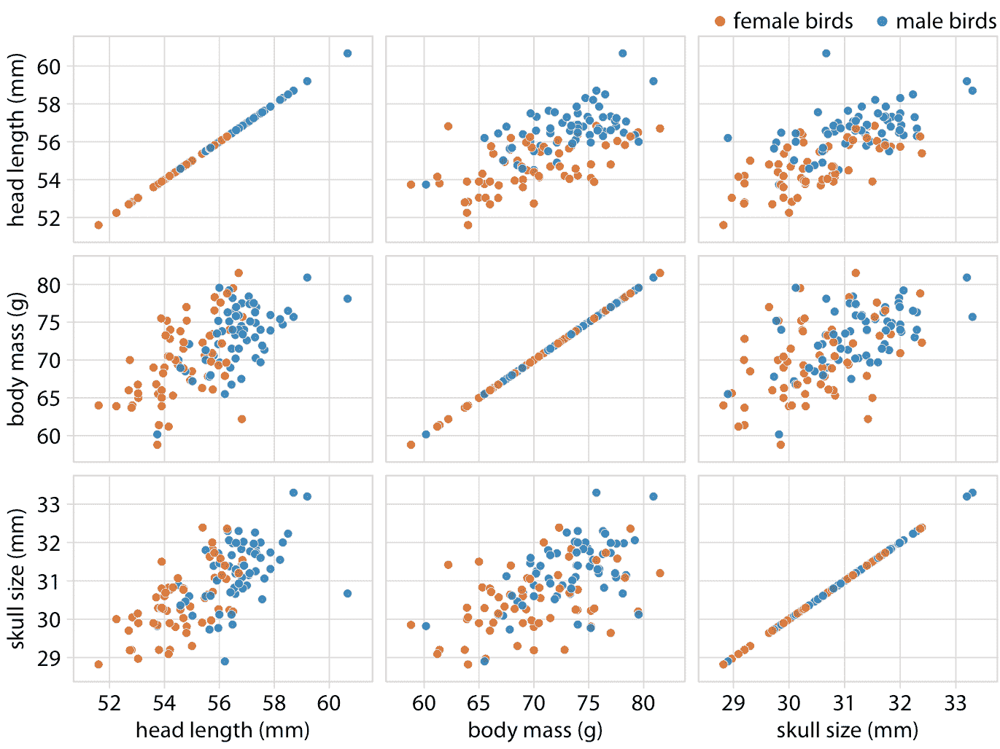

图 12.4：123 种蓝鸟的头部长度，体重和头骨大小的全反对散点图矩阵。该图显示了与图 12.2 完全相同的数据。然而，因为我们在判断位置方面比符号大小更好，所以在成对散点图中，头骨大小和其他两个变量之间的相关性比图 12.2 更容易察觉。数据来源：欧柏林学院的 Keith Tarvin

## 12.2 Correlograms

当我们有超过三到四个量化变量时，全对抗散点图矩阵很快变得难以处理。在这种情况下，量化变量对之间的关​​联量并使该数量可视化而不是原始数据更有用。一种常见的方法是计算 _ 相关系数 _。相关系数 _r_ 是介于-1 和 1 之间的数字，用于衡量两个变量的变化程度。 _r_ = 0 的值意味着没有任何关联，并且值 1 或-1 表示完美关联。相关系数的符号表示变量是 _ 相关 _（一个变量中的较大值与另一个变量中的较大值一致）或 _ 反相关 _（一个变量中的较大值与较小值一致）在另一个）。为了提供不同相关强度的可视化示例，在图 12.5 中，我显示了随机生成的点集，这些点在 _x_ 和 _y 的程度上有很大差异 _ 值是相关的。

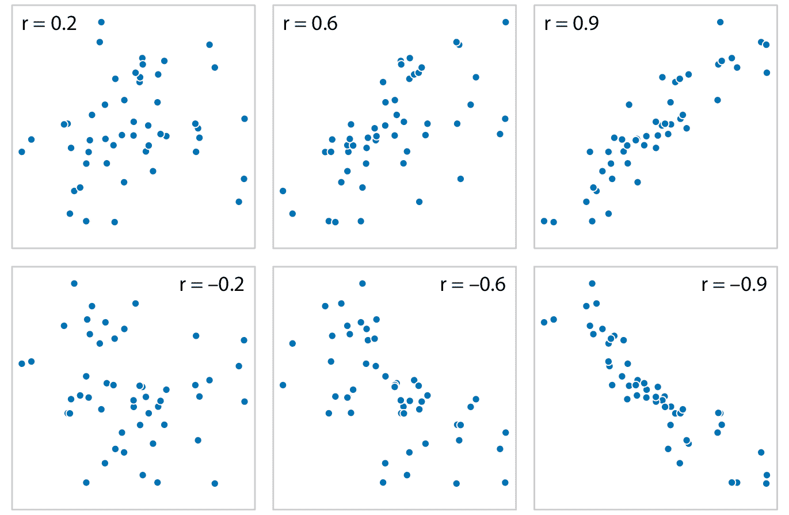

图 12.5：不同幅度和方向的相关性示例，以及相关的相关系数 _r_ 。在这两行中，从左到右的相关性从弱到强。在顶行中，相关性为正（一个量的较大值与另一个量的较大值相关联），在底行中它们为负值（一个量的较大值与另一个量的较小值相关联）。在所有六个图中， _x_ 和 _y_ 值的组是相同的，但是个体 _x_ 和 _y_ 值之间的配对已经重组以产生指定的相关系数。

相关系数定义为

\ [r = \ frac {\ sum_i（x_i - \ bar x）（y_i - \ bar y）} {\ sqrt {\ sum_i（x_i- \ bar x）^ 2} \ sqrt {\ sum_i（y_i - \ bar y）^ 2}}，\] 其中 \（x_i \）和 \（y_i \）是两组观察和 \（ \ bar x \）和 \（\ bar y \）是相应的样本均值。我们可以从这个公式中做出一些观察。首先，公式在 \（x_i \）和 \（y_i \）中是对称的，因此 _x_ 与 _y_ 的相关性与 _y_ 与 _x_ 的相关性相同。其次，单个值 \（x_i \）和 \（y_i \）仅在相应样本均值的差异上下文中输入公式，因此如果我们移动整个数据集以恒定的量，例如对于某些常数 \（C \），我们用 \（x_i'= x_i + C \）替换 \（x_i \），相关系数保持不变。第三，如果我们重新调整数据， \（x_i'= C x_i \），相关系数也保持不变，因为常数 \（C \）将出现在分子中和公式的分母因此可以取消。

相关系数的可视化称为 _ 相关图 _。为了说明相关图的使用，我们将考虑在法医工作期间获得的 200 多个玻璃碎片的数据集。对于每个玻璃片段，我们测量其组成，表示为各种矿物氧化物的重量百分比。我们测量了七种不同的氧化物，总共产生 6 + 5 + 4 + 3 + 2 + 1 = 21 对成对相关性。我们可以将这 21 个相关性一次显示为彩色瓦片矩阵，其中每个瓦片代表一个相关系数（图 12.6 ）。该相关图允许我们快速掌握数据的趋势，例如镁与几乎所有其他氧化物负相关，并且铝和钡具有强烈的正相关性。

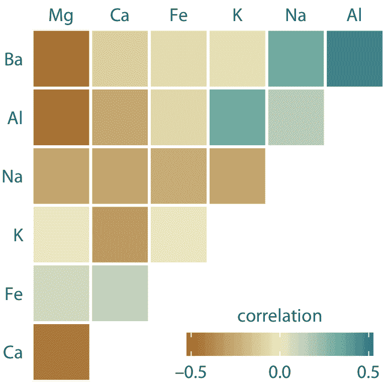

图 12.6：法医工作期间获得的 214 个玻璃碎片样品的矿物质含量相关性。该数据集包含七个变量，用于测量每个玻璃片段中发现的镁（Mg），钙（Ca），铁（Fe），钾（K），钠（Na），铝（Al）和钡（Ba）的量。彩色图块表示这些变量对之间的相关性。数据来源：B。德语

图 12.6 的相关图的一个弱点是低相关性，即与零附近的绝对值的相关性，不如它们应该的那样在视觉上被抑制。例如，镁（Mg）和钾（K）完全没有相关性，但图 12.6 没有立即显示出来。为了克服这个限制，我们可以将相关性显示为彩色圆圈，并使用相关系数的绝对值来缩放圆形大小（图 12.6 ）。以这种方式，低相关性被抑制并且高相关性更好地突出。

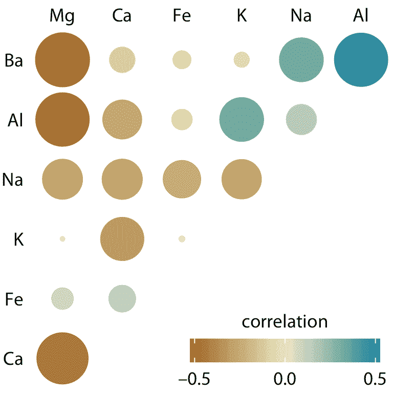

图 12.7：法医玻璃样品中矿物质含量的相关性。色标与图 12.6 相同。但是，现在每个相关的幅度也以彩色圆圈的大小编码。这种选择在视觉上不强调相关性接近于零的情况。数据来源：B。德语

所有相关图都有一个重要的缺点：它们相当抽象。虽然它们向我们展示了数据中的重要模式，但它们也隐藏了基础数据点，并可能导致我们得出错误的结论。最好是可视化原始数据，而不是从中计算出的抽象的派生数量。幸运的是，我们经常可以在显示重要模式和通过应用降维技术显示原始数据之间找到一个中间立场。

## 12.3 尺寸减小

维度减少依赖于关键洞察力，即大多数高维数据集由多个相关变量组成，这些变量传达重叠信息。这样的数据集可以减少到较少数量的关键维度，而不会丢失太多关键信息。作为一个简单直观的例子，考虑一个人的多种身体特征的数据集，包括每个人的身高和体重，手臂和腿的长度，腰部，臀部和胸部的周长等数量。我们可以理解立即所有这些数量将首先与每个人的总体规模相关。在其他条件相同的情况下，较大的人会更高，体重更重，手臂和腿更长，腰围，臀部和胸围更大。下一个重要的方面是人的性别。男性和女性的测量值对于相当大小的人来说是显着不同的。例如，女人的臀围往往比男人高，其他一切都是平等的。

有许多减少尺寸的技术。我将在这里讨论一种最常用的技术，称为 _ 主成分分析 _（PCA）。 PCA 通过数据中原始变量的线性组合引入一组新的变量（称为主成分，PC），标准化为零均值和单位方差（参见图 12.8 ，用于二维玩具示例） 。选择 PC 使得它们不相关，并且对它们进行排序，使得第一组件捕获数据中尽可能大的变化量，并且随后的组件捕获越来越少。通常，只能从前两台或三台 PC 看到数据中的关键功能。

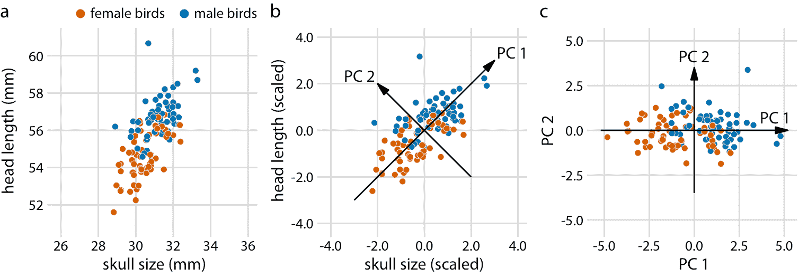

图 12.8：二维示例主成分（PC）分析。 （a）原始数据。作为示例数据，我使用蓝鸟队数据集中的头长和头骨大小测量值。雌鸟和雄鸟以颜色区分，但这种区别对 PC 分析没有影响。 （b）作为 PCA 的第一步，我们将原始数据值缩放为零均值和单位方差。然后，我们沿着数据的最大变化方向定义新变量（主要组件，PC）。 （c）最后，我们将数据投影到新坐标中。在数学上，该投影相当于原点周围的数据点的旋转。在此处显示的 2D 示例中，数据点顺时针旋转 45 度。

当我们执行 PCA 时，我们通常对两条信息感兴趣：（i）PC 的组成和（ii）主要组件空间中各个数据点的位置。让我们看一下法医玻璃数据集的 PC 分析中的这两部分。

首先，我们来看组件组成（图 12.9 ）。在这里，我们只考虑前两个组件，PC 1 和 PC 2.因为 PC 是原始变量的线性组合（在标准化之后），我们可以将原始变量表示为箭头，指示它们对 PC 的贡献程度。在这里，我们看到钡和钠主要贡献于 PC 1 而不是 PC 2，钙和钾主要贡献于 PC 2 而不是 PC 1，其他变量对两种成分的贡献不同（图 [12.9）](visualizing-associations.html#fig:forensic-PCA-rotation) ）。箭头的长度各不相同，因为有两台以上的 PC。例如，铁的箭头特别短，因为它主要用于高阶 PC（未示出）。

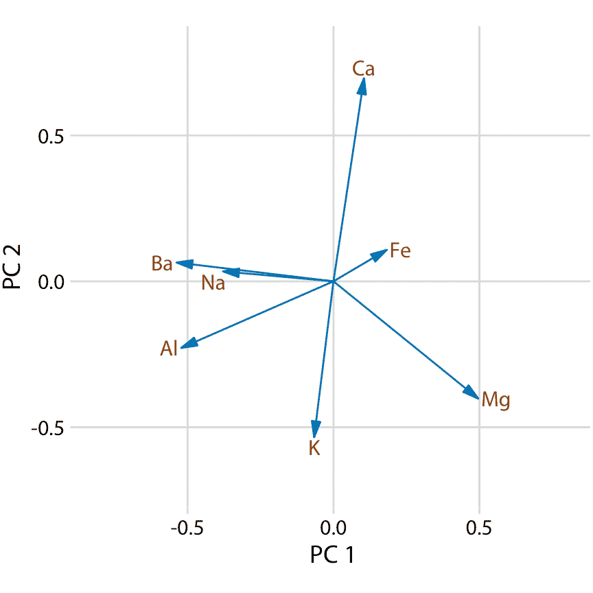

图 12.9：法医玻璃数据集的主成分分析（PCA）中前两个成分的组成。组分 1（PC 1）主要测量玻璃碎片中铝，钡，钠和镁含量，而组分 2（PC 2）主要测量钙和钾含量，并在一定程度上测量铝的含量和镁。

接下来，我们将原始数据投影到主要组件空间（图 12.10 ）。我们在该图中看到了不同类型的玻璃碎片的清晰聚类。来自前照灯和车窗的碎片落入 PC 图中清晰描绘的区域，几乎没有异常值。来自餐具和容器的碎片更加分散，但与前照灯和窗户碎片明显不同。通过比较图 12.10 和图 12.9 ，我们可以得出结论，窗口样品的镁含量高于平均值，低于平均钡，铝和钠含量，而相反的是适用于前照灯样品。

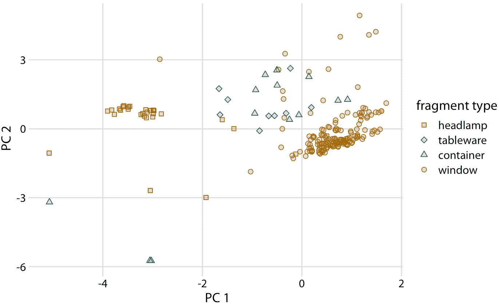

图 12.10：在 12.9 中定义的主要成分空间中可视化的单个玻璃碎片的组成。我们看到不同类型的玻璃样品聚集在 PC 1 和 2 的特征值上。特别是，前照灯的特征在于负 PC 1 值，而窗口倾向于具有正 PC 1 值。餐具和容器的 PC 1 值接近零，并且往往具有正 PC 2 值。但是，有一些例外情况，容器碎片同时具有负 PC 1 值和负 PC 2 值。这些碎片的组成与所分析的所有其他碎片完全不同。

## 12.4 配对数据

多变量定量数据的一个特例是配对数据：在略微不同的条件下有两个或多个相同数量的测量值的数据。示例包括每个受试者的两个可比较的测量值（例如，人的右臂和左臂的长度），在不同时间点对同一受试者重复测量（例如，一年中两个不同时间的人的体重），或测量两个密切相关的科目（例如，两个同卵双胞胎的高度）。对于配对数据，可以合理地假设属于一对的两个测量值彼此更相似，而不是属于其他对的测量值。两个双胞胎大约相同的高度，但高度与其他双胞胎不同。因此，对于配对数据，我们需要选择可突出显示配对测量之间任何差异的可视化。

在这种情况下，一个很好的选择是在对角线上标记 _x_ = _y_ 的简单散点图。在这样的图中，如果每对的两次测量之间的唯一差异是随机噪声，那么样本中的所有点将围绕该线对称地散射。相比之下，配对测量之间的任何系统差异将在数据点相对于对角线向上或向下的系统移位中可见。例如，考虑一下 1970 年和 2010 年 166 个国家的人均二氧化碳排放量（CO &lt;sub&gt;2&lt;/sub&gt; ）（图 12.11 ）。此示例突出显示配对数据的两个常见功能。首先，大多数点相对接近对角线。尽管各国的 CO &lt;sub&gt;2&lt;/sub&gt; 排放量差异超过近四个数量级，但在 40 年的时间跨度内，每个国家的排放量相当一致。其次，这些点相对于对角线系统地向上移动。在所考虑的 40 年中，大多数国家的 CO &lt;sub&gt;2&lt;/sub&gt; 排放量增加。

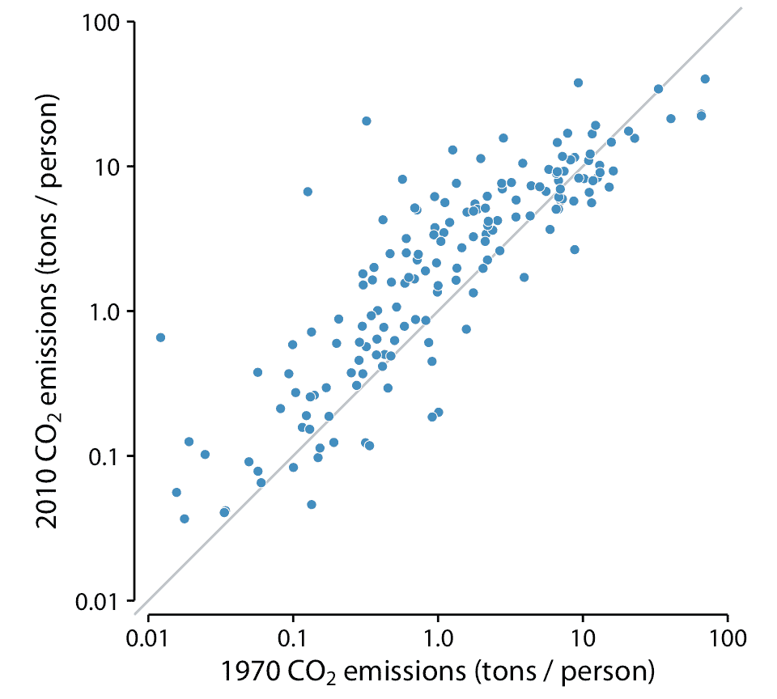

图 12。11：1970 年和 2010 年，166 个国家的人均二氧化碳排放量（CO &lt;sub&gt;2&lt;/sub&gt; ）。每个点代表一个国家。对角线表示 1970 年和 2010 年相同的 CO &lt;sub&gt;2&lt;/sub&gt; 排放。这些点相对于对角线系统地向上移动：在大多数国家，2010 年的排放量高于 1970 年。数据来源：碳二氧化碳信息分析中心

当我们有大量数据点和/或对整个数据集与零期望的系统偏差感兴趣时，图 12.11 等散点图很有效。相比之下，如果我们只有少量的观察结果并且主要对每个案例的身份感兴趣，那么 _ 斜率图 _ 可能是更好的选择。在斜率图中，我们将各个测量值绘制为排列成两列的点，并通过将成对的点与线连接来指示配对。每条线的斜率突出了变化的幅度和方向。图 12.12 使用这种方法显示 2000 年至 2010 年间人均 CO &lt;sub&gt;2&lt;/sub&gt; 排放量差异最大的 10 个国家。

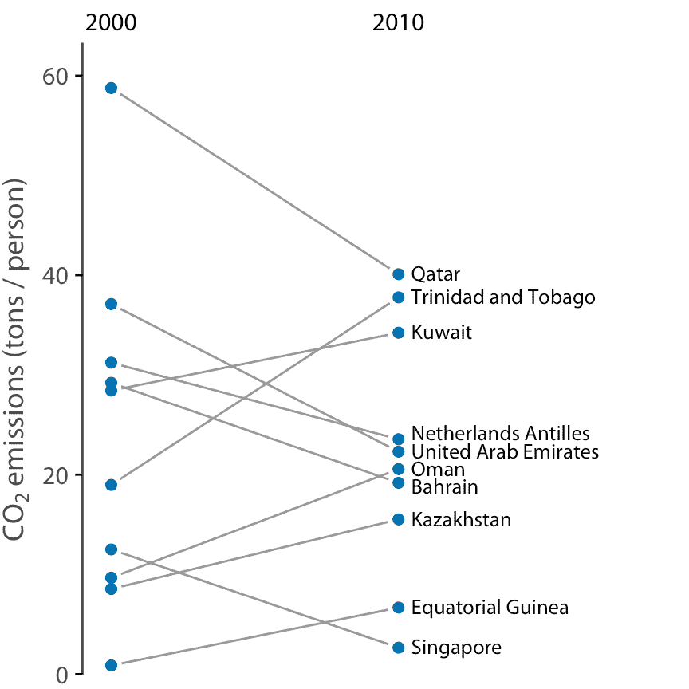

图 12.12：2000 年和 2010 年人均二氧化碳排放量（CO &lt;sub&gt;2&lt;/sub&gt; ），这两年间差异最大的十个国家。数据来源：二氧化碳信息分析中心

与散点图相比，坡度图具有一个重要优势：它们可用于一次比较两个以上的测量值。例如，我们可以修改图 12.12 以显示三个时间点的 CO &lt;sub&gt;2&lt;/sub&gt; 排放，这里是 2000 年，2005 年和 2010 年（图 12.13 ）。这一选择突出了整个十年排放量发生重大变化的国家以及卡塔尔或特立尼达和多巴哥等国家，其中第一个五年间隔和第二个周期的变化存在很大差异。

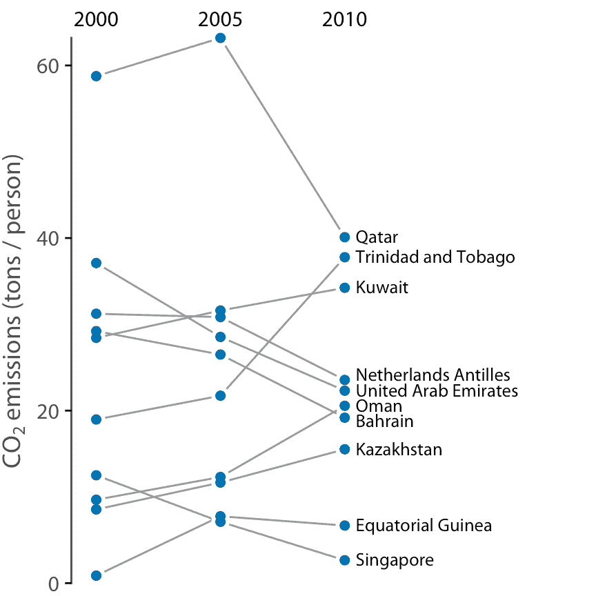

图 12。13：2000 年，2005 年和 2010 年人均 CO &lt;sub&gt;2&lt;/sub&gt; 排放量，对于 2000 年至 2010 年间差异最大的 10 个国家。数据来源：二氧化碳信息分析中心