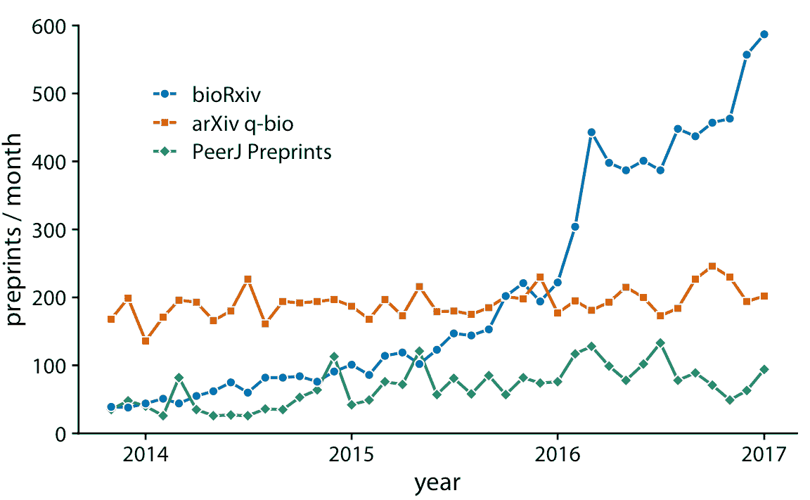
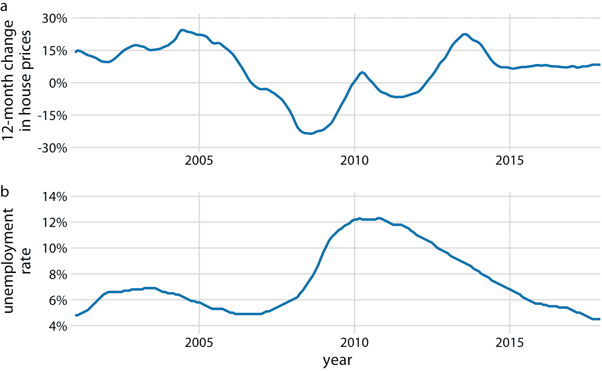

# 13 可视化自变量的时间序列和其他函数

> 原文： [https://serialmentor.com/dataviz/time-series.html](https://serialmentor.com/dataviz/time-series.html)

前一章讨论了散点图，其中我们绘制了一个定量变量与另一个定量变量。当两个变量中的一个可以被认为是时间时会出现一种特殊情况，因为时间会对数据施加额外的结构。现在数据点具有固有的顺序;我们可以按照增加时间的顺序排列点，并为每个数据点定义前导和后继。我们经常想要想象这个时间顺序，我们用线图来实现。然而，线图不限于时间序列。只要一个变量对数据进行排序，它们就是合适的。例如，在受控实验中也出现这种情况，其中将治疗变量有目的地设定为一系列不同的值。如果我们有多个依赖于时间的变量，我们可以绘制单独的线图，也可以绘制规则的散点图，然后绘制线以及时连接相邻的点。

## 13.1 个人时间序列

作为时间序列的第一次演示，我们将考虑生物学中每月预印本提交的模式。预印本是研究人员在正式同行评审和在科学期刊上发表之前在线发表的科学文章。预印本服务器 bioRxiv 成立于 2013 年 11 月，专门为从事生物科学研究的研究人员而设，自那以后，每月提交的作品大幅增长。我们可以通过制作一种散点图来形象化这种增长（章节 [12](visualizing-associations.html#visualizing-associations) ），其中我们绘制了代表每个月提交数量的点（图 [13.1](time-series.html#fig:biorxiv-dots) ）。

图 13.1：从 2014 年 11 月开始到 2018 年 4 月，预印本服务器 bioRxiv 的每月提交。每个点代表一个月内提交的数量。在整个 4。5 年期间，提交量一直在稳步增加。数据来源：Jordan Anaya， [http://www.prepubmed.org/](http://www.prepubmed.org/)

然而，图 [13.1](time-series.html#fig:biorxiv-dots) 与章节 [12](visualizing-associations.html#visualizing-associations) 中讨论的散点图之间存在重要差异。在图 [13.1](time-series.html#fig:biorxiv-dots) 中，点沿着 _x_ 轴均匀分布，并且它们之间有一个确定的顺序。每个点只有一个左边和一个右边的邻居（除了最左边和最右边的点，每个点只有一个邻居）。我们可以通过用线连接相邻点来在视觉上强调这个顺序（图 [13.2](time-series.html#fig:biorxiv-dots-line) ）。这样的图被称为 _ 线图 _。

图 13.2：每月提交给预打印服务器 bioRxiv，显示为由线连接的点。这些线不代表数据，但仅作为眼睛的指南。通过用线连接各个点，我们强调点之间有一个顺序，每个点恰好有一个前面的相邻点和后面的一个相邻点。数据来源：Jordan Anaya， [http://www.prepubmed.org/](http://www.prepubmed.org/)

有些人反对在点之间绘制线条，因为线条不代表观察到的数据。特别是，如果只有很少的观测距离相隔很远，那么在中间时间进行观测时，它们可能不会精确地落在所示的线上。因此，在某种意义上，线对应于补充数据。然而，当点间隔很远或间距不均匀时，它们可能有助于感知。我们可以通过在图标题中指出它来解决这个难题，例如通过写“线条作为眼睛的指导”（参见图 [13.2](time-series.html#fig:biorxiv-dots-line) 的标题）。

然而，使用线来表示时间序列是通常可接受的做法，并且通常完全省略点（图 [13.3](time-series.html#fig:biorxiv-line) ）。没有点，该图更加强调数据的整体趋势，而不是个人观察。没有圆点的图形在视觉上也不那么繁忙。一般来说，时间序列越密集，用点来表示个人的痴迷就越不重要。对于此处显示的预印本数据集，我认为省略这些点很好。

图 13.3：每月提交给预打印服务器 bioRxiv，显示为没有点的线图。省略点强调整体时间趋势，同时在特定时间点强调个别观察。当时间点非常密集地间隔时，它特别有用。数据来源：Jordan Anaya， [http://www.prepubmed.org/](http://www.prepubmed.org/)

我们也可以用纯色填充曲线下面积（图 [13.4](time-series.html#fig:biorxiv-line-area) ）。这种选择进一步强调了数据的总体趋势，因为它在视觉上将曲线上方的区域与下方区域分开。但是，此可视化仅在 _y_ 轴从零开始时有效，因此每个时间点的阴影区域的高度表示该时间点的数据值。

图 13.4：每月提交给预打印服务器 bioRxiv，显示为下面填充区域的折线图。通过填充曲线下面积，我们更加强调总体时间趋势，而不是仅仅画一条线（图 [13.3](time-series.html#fig:biorxiv-line) ）。数据来源：Jordan Anaya， [http://www.prepubmed.org/](http://www.prepubmed.org/)

## 13.2 多个时间序列和剂量反应曲线

我们经常有多个时间课程，我们想要一次显示。在这种情况下，我们必须更加谨慎地绘制数据，因为数字可能会变得混乱或难以阅读。例如，如果我们想要向多个预打印服务器显示每月提交的内容，则散点图不是一个好主意，因为各个时间课程相互碰撞（图 [13.5](time-series.html#fig:bio-preprints-dots) ）。用线连接点可以缓解这个问题（图 [13.6](time-series.html#fig:bio-preprints-lines) ）。

图 13.5：每月提交三份涉及生物医学研究的预印本服务器：bioRxiv，arXiv 的 q-bio 部分和 PeerJ Preprints。每个点代表一个月内提交给相应预打印服务器的数量。这个数字被标记为“坏”，因为这三个时间过程在视觉上相互干扰并且难以阅读。数据来源：Jordan Anaya， [http://www.prepubmed.org/](http://www.prepubmed.org/)

图 13.6：每月提交三份预印本服务器，涵盖生物医学研究。通过图 [13.5](time-series.html#fig:bio-preprints-dots) 中的点与线连接，我们帮助观众按照每个时间进程。数据来源：Jordan Anaya， [http://www.prepubmed.org/](http://www.prepubmed.org/)

图 [13.6](time-series.html#fig:bio-preprints-lines) 表示预印本数据集的可接受的可视化。但是，单独的图例会产生不必要的认知负担。我们可以通过直接标记线来减少这种认知负荷（图 [13.7](time-series.html#fig:bio-preprints-direct-label) ）。我们还消除了该图中的各个点，结果比原始起点更加流线型和易读，图 [13.5](time-series.html#fig:bio-preprints-dots) 。

图 13.7：每月提交三份预印本服务器，涵盖生物医学研究。通过直接标记线条而不是提供图例，我们减少了读取图形所需的认知负荷。消除传奇消除了对不同形状点的需求。因此，我们可以通过消除点来进一步简化数字。数据来源：Jordan Anaya， [http://www.prepubmed.org/](http://www.prepubmed.org/)

线图不限于时间序列。只要数据点具有沿 _x_ 轴显示的变量反映的自然顺序，它们就是合适的，因此相邻点可以用线连接。例如，在剂量 - 反应曲线中出现这种情况，其中我们测量如何改变实验中的一些数值参数（剂量）影响感兴趣的结果（响应）。图 [13.8](time-series.html#fig:oats-yield) 显示了这种类型的经典实验，根据增加的受精量来测量燕麦产量。线图可视化突出了剂量 - 响应曲线如何对于所考虑的三种燕麦品种具有相似的形状，但在没有受精的情况下起点不同（即，一些品种具有比其他品种更高的产量）。

图 13.8：剂量 - 反应曲线显示了粪肥施肥后燕麦品种的平均产量。粪便作为氮源，燕麦产量通常随着氮的增加而增加，无论种类多少。这里，粪肥施用量以每英亩（cwt（百）重）计。百分之一是一个旧的英制单位，等于 112 磅或 50.8 千克。数据源：耶茨（ [1935](#ref-Yates1935) ）

## 13.3 两个或多个响应变量的时间序列

在前面的例子中，我们只处理了一个响应变量的时间过程（例如，每月的预印本提交或燕麦产量）。但是，拥有多个响应变量并不罕见。这种情况通常出现在宏观经济学中。例如，我们可能对过去 12 个月房价的变化感兴趣，因为它与失业率有关。我们可以预期，当失业率较低时房价会上涨，反之亦然。

鉴于前面小节中的工具，我们可以将这些数据可视化为两个相互叠加的独立线图（图 [13.9](time-series.html#fig:house-price-unemploy) ）。该图直接显示了两个感兴趣的变量，并且可以直接解释。但是，因为这两个变量显示为单独的折线图，所以它们之间的绘图比较可能很麻烦。如果我们想要在两个变量在相同或相反的方向上移动时识别时间区域，我们需要在两个图形之间来回切换并比较两条曲线的相对斜率。

图 13。9：2001 年 1 月至 2017 年 12 月房价（a）和失业率（b）随时间变化 12 个月。数据来源：美国劳工统计局 Freddie Mac 房价指数。

作为显示两个单独的折线图的替代方法，我们可以将两个变量相互绘制，绘制从最早的时间点到最晚的路径（图 [13.10](time-series.html#fig:house-price-path) ）。这种可视化被称为 _ 连接散点图 _，因为我们在技术上将两个变量的散点图相互对比，然后连接相邻点。物理学家和工程师经常将其称为 _ 相位图 _，因为在他们的学科中，它通常用于表示相空间中的运动。我们之前在章节 [3](coordinate-systems-axes.html#coordinate-systems-axes) 中遇到了连接的散点图，其中我们绘制了休斯顿，TX 的日常温度法线与加利福尼亚州圣地亚哥的日常温度法线（图 [3.3](coordinate-systems-axes.html#fig:temperature-normals-Houston-San-Diego) ）。

图 13。10：2001 年 1 月至 2017 年 12 月房价与失业率的 12 个月变化，显示为连通散点图。较暗的色调代表最近几个月。图 [13.9](time-series.html#fig:house-price-unemploy) 中看到的房价和失业率之间的反相关导致连通的散点图形成两个逆时针圆。数据来源：美国劳工统计局 Freddie Mac 房价指数。原始图概念：Len Kiefer

在连通的散点图中，从左下角到右上角的方向上的线表示两个变量之间的相关运动（当一个变量增长时，另一个变量增长），并且从左上角开始沿垂直方向前进的线在右下方，表示反相关运动（随着一个变量增长，另一个变量收缩）。如果两个变量具有某种循环关系，我们将在连接的散点图中看到圆或螺旋。在图 [13.10](time-series.html#fig:house-price-path) 中，我们看到 2001 年至 2005 年的一个小圆圈和剩余时间路线的一个大圆圈。

绘制连接的散点图时，重要的是我们指示数据的方向和时间尺度。如果没有这样的提示，情节可能变成毫无意义的涂鸦（图 [13.11](time-series.html#fig:house-price-path-bad) ）。我在这里使用（在图 [13.10](time-series.html#fig:house-price-path) 中）颜色逐渐变暗以指示方向。或者，可以沿着路径绘制箭头。

图 13。11：从 2001 年 1 月到 2017 年 12 月，房价与失业率的 12 个月变化。这个数字被标记为“坏”，因为没有图 [13.10](time-series.html#fig:house-price-path) 的日期标记和颜色阴影，我们可以既不看数据的方向也不看速度。数据来源：美国劳工统计局房地美价格指数。

使用连接的散点图或两个单独的线图是否更好？单独的线图往往更容易阅读，但是一旦人们习惯连接散点图，他们就可以提取某些模式（例如具有一些不规则性的循环行为），这些模式很难在线图中找到。事实上，对我来说，房价变化和失业率之间的周期性关系很难在图 [13.9](time-series.html#fig:house-price-unemploy) 中看到，但图 [13.10](time-series.html#fig:house-price-path) 中的逆时针螺旋清楚地表明了这一点。研究报告说，读者更容易混淆连通散点图中的顺序和方向而不是线图，并且不太可能报告相关性（Haroz，Kosara 和 Franconeri [2016](#ref-Haroz_et_al_2016) ）。另一方面，连接的散点图似乎导致更高的参与度，因此这些图可能是吸引读者进入故事的有效工具（Haroz，Kosara 和 Franconeri [2016](#ref-Haroz_et_al_2016) ）。

即使连接的散点图一次只能显示两个变量，我们也可以使用它们来可视化更高维的数据集。诀窍是首先应用降维（见章节 [12](visualizing-associations.html#visualizing-associations) ）。然后，我们可以在尺寸减小的空间中绘制连接的散点图。作为这种方法的一个例子，我们将可视化由圣路易斯联邦储备银行提供的 100 多个宏观经济指标的月度观察数据库。我们对所有指标进行主成分分析（PCA），然后绘制 PC 2 与 PC 1 的连通散点图（图 [13.12](time-series.html#fig:fred-md-PCA) a）和 PC 3（图 [13.12](time-series.html#fig:fred-md-PCA) b） ）。

图 13.12：将高维时间序列可视化为主成分空间中的连通散点图。该路径表明 1990 年 1 月至 2017 年 12 月期间 100 多个宏观经济指标的联合运动。经济衰退和复苏的时间以颜色表示，三次经济衰退的终点（1991 年 3 月，2001 年 11 月和 2009 年 6 月）也被标记。 （a）PC 2 与 PC 1.（b）PC 2 与 PC 3.数据来源：M。W. McCracken，St. Louis Fed

值得注意的是，图 [13.12](time-series.html#fig:fred-md-PCA) a 看起来几乎像一个常规线图，时间从左到右。这种模式是由 PCA 的一个共同特征引起的：第一个组件通常测量系统的整体大小。在这里，PC 1 大致衡量经济的总体规模，这种规模很少随着时间的推移而减少。

通过衰退和恢复时间对连通的散点图进行着色，我们可以看到衰退与 PC 2 下降有关，而回收率与 PC 1 或 PC 2 中的明显特征无关（图 [13.12](time-series.html#fig:fred-md-PCA) ] 一个）。然而，回收率似乎与 PC 3 的下降相对应（图 [13.12](time-series.html#fig:fred-md-PCA) b）。此外，在 PC 2 与 PC 3 图中，我们看到该线遵循顺时针螺旋的形状。这种模式强调了经济的周期性，经济复苏后出现衰退，反之亦然。

### 参考

Yates，F。1935.“复杂实验。”_“皇家统计学会期刊”_ 2：181-247 的补充。 doi： [10.2307 / 2983638](https://doi.org/10.2307/2983638) 。

Haroz，S.，R。Kosara 和 S. Franconeri。 2016.“用于呈现成对时间序列的连通散点图。” _IEEE 可视化和计算机图形学交易 _ 22：2174-86。 doi： [10.1109 / TVCG.2015.2502587](https://doi.org/10.1109/TVCG.2015.2502587) 。