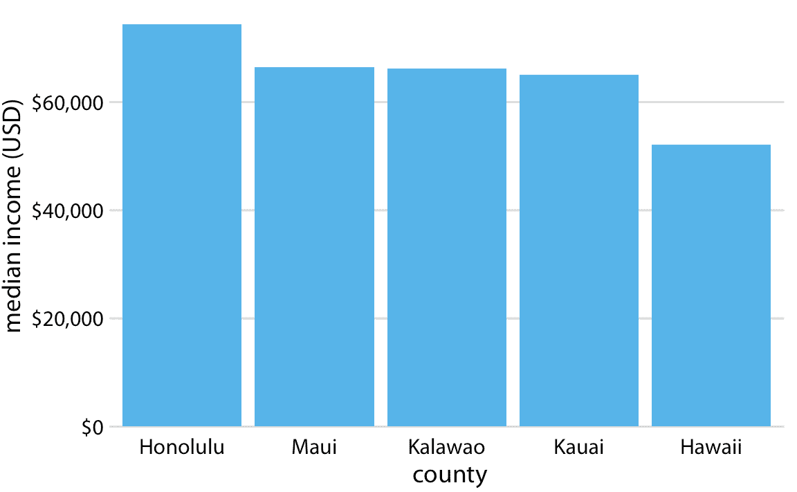
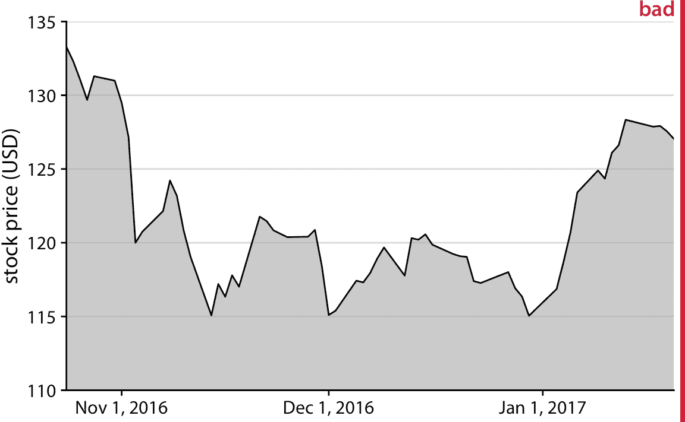
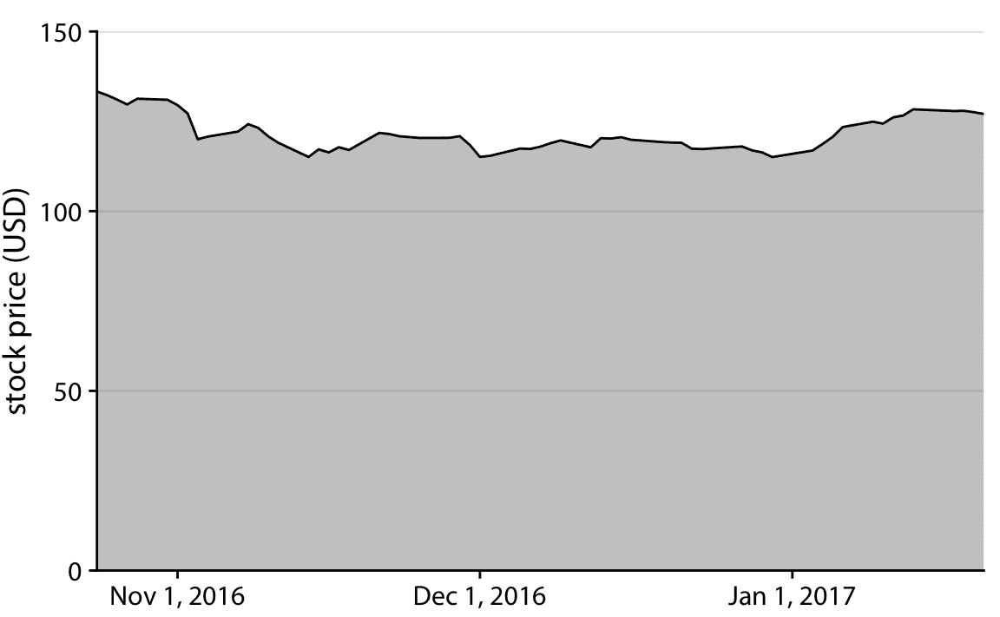
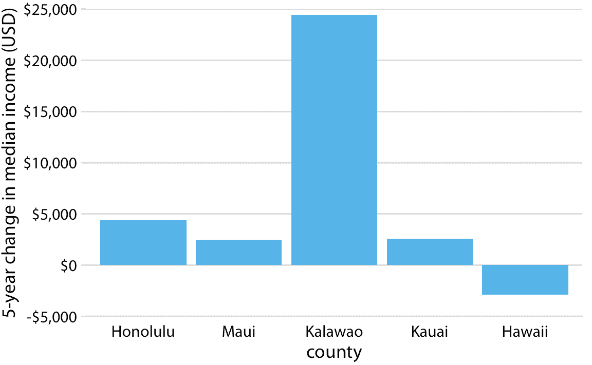
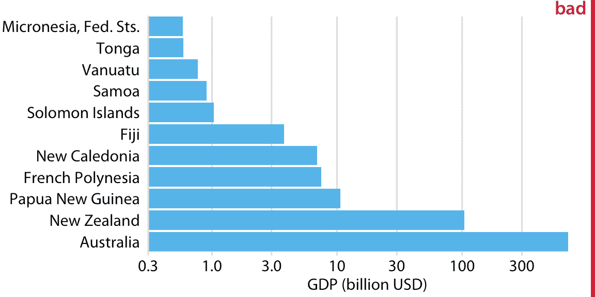
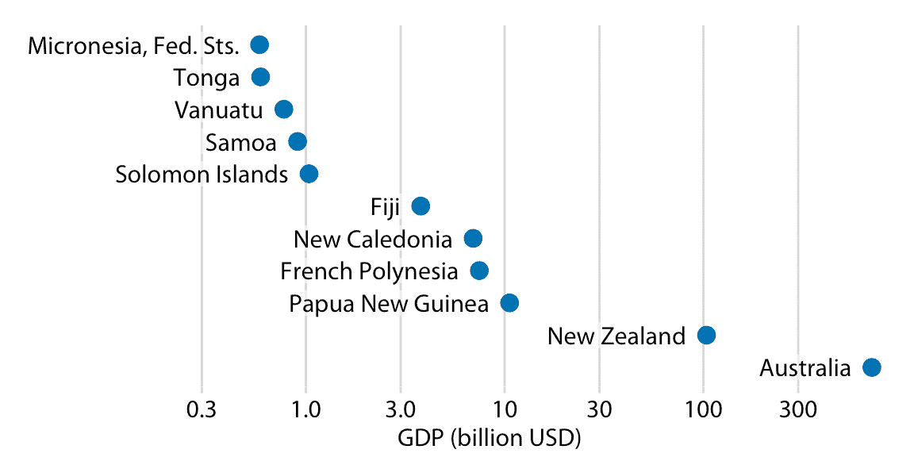
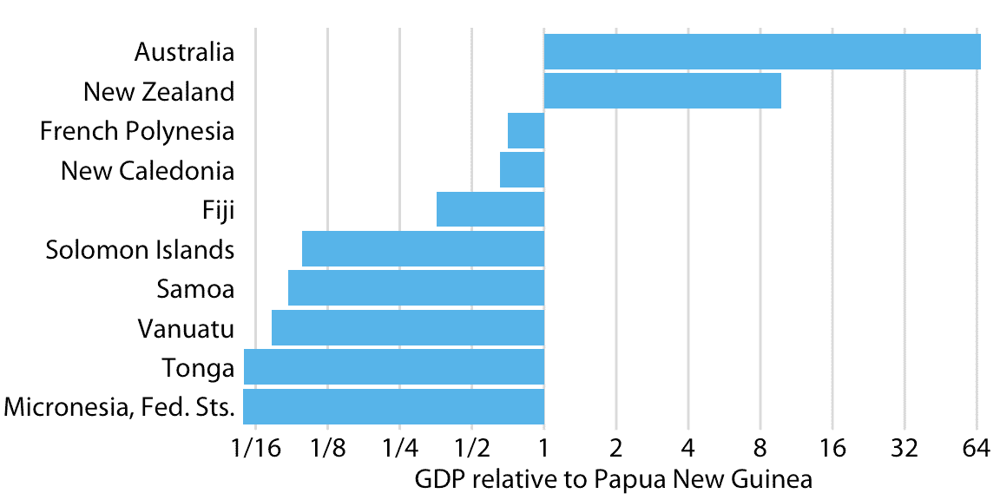
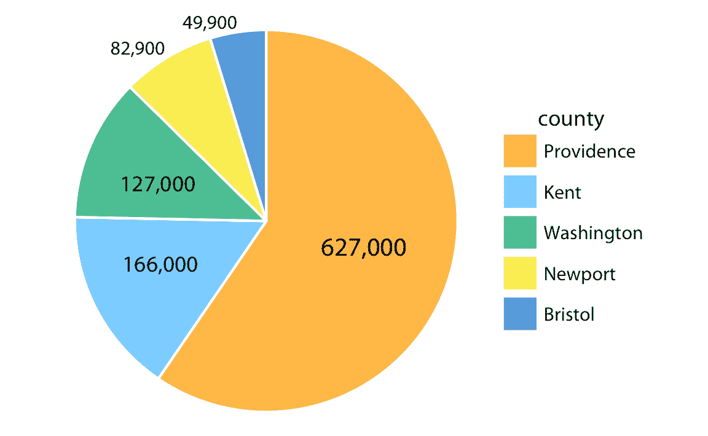
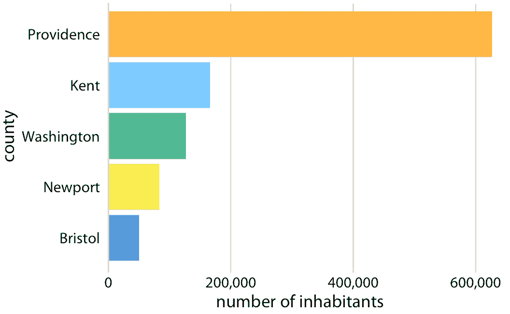
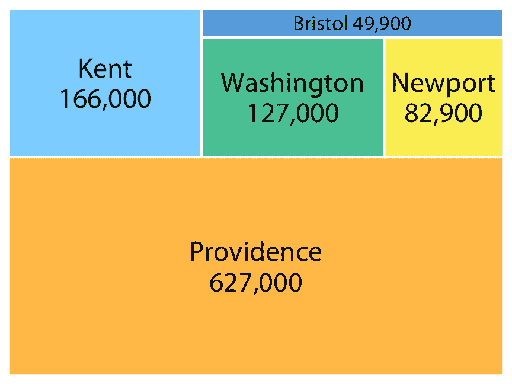

# 17 比例墨水的原理

> 原文： [https://serialmentor.com/dataviz/proportional-ink.html](https://serialmentor.com/dataviz/proportional-ink.html)

在许多不同的可视化场景中，我们通过图形元素的范围来表示数据值。例如，在条形图中，我们绘制从 0 开始并以它们代表的数据值结束的条形图。在这种情况下，数据值不仅在条形的终点编码，而且在条形的高度或长度中编码。如果我们绘制一个以不同于 0 的值开始的条形图，则条形和条形终点的长度将传达矛盾的信息。这些数字在内部不一致，因为它们显示具有相同图形元素的两个不同值。将此与我们使用点可视化数据值的情况进行对比。在这种情况下，该值仅在点的位置编码，而不是在点的大小或形状中编码。

每当我们使用图形元素（如条形，矩形，任意形状的阴影区域）或任何其他具有明显可视范围的元素时，都会出现类似的问题，这些元素可能与所显示的数据值一致或不一致。在所有这些情况下，我们需要确保没有不一致。这个概念被 Bergstrom 和 West 称为 _ 比例墨水原理 _ （Bergstrom 和 West [2016](#ref-BergstromWest2016) ）：

> **比例墨水的原理：**可视化中阴影区域的大小需要与它们所代表的数据值成比例。

（通常的做法是使用“墨水”一词来指代偏离背景颜色的可视化的任何部分。这包括线条，点，共享区域和文本。然而，在本章中，我们主要讨论的是阴影区域。）违反这一原则的情况非常普遍，特别是在大众媒体和金融界。

## 17.1 沿线性轴可视化

我们首先考虑最常见的情景，即沿线性比例的金额可视化。图 [17.1](proportional-ink.html#fig:hawaii-income-bars-bad) 显示构成夏威夷州的五个县的收入中位数。这是报纸文章中可能遇到的典型人物。快速浏览一下这个数字表明，夏威夷的县非常贫穷，而檀香山的县比其他县富裕得多。然而，图 [17.1](proportional-ink.html#fig:hawaii-income-bars-bad) 相当具有误导性，因为所有金条都以 50,000 美元的中位收入开始。因此，虽然每个酒吧的终点正确地代表了每个县的实际收入中位数，但酒吧高度代表中位数收入超过 50,000 美元的程度，这是一个任意数字。并且人类感知是这样的：条形高度是我们在观察该图时所感知的关键数量，而不是相对于 _y_ 轴的条形终点的位置。

图 17.1：夏威夷州五个县的中位数收入。这个数字具有误导性，因为 _y_ 轴刻度从 50,000 美元而不是 0 美元开始。结果，酒吧高度与所示数值不成比例，夏威夷县与其他四个县之间的收入差距看起来比实际大得多。数据来源：2015 年五年美国社区调查。

这些数据的适当可视化使得故事不那么激动（图 [17.2](proportional-ink.html#fig:hawaii-income-bars-good) ）。虽然各州之间的收入中位数存在差异，但它们远远没有图 [17.1](proportional-ink.html#fig:hawaii-income-bars-bad) 所暗示的那么大。总体而言，不同县的收入中位数有些可比。

图 17.2：夏威夷州五个县的中位数收入。这里， _y_ 轴刻度从 0 美元开始，因此准确显示了五个县的中位数收入的相对大小。数据来源：2015 年五年美国社区调查。

线性刻度上的条应始终从 0 开始。

在时间序列的可视化中经常出现类似的可视化问题，例如股票价格的可视化问题。图 [17.3](proportional-ink.html#fig:fb-stock-drop-bad) 表明 Facebook 股票价格在 2016 年 11 月 1 日左右大幅下挫。实际上，相对于股票总价格，价格下跌幅度较小（图 [17.4](proportional-ink.html#fig:fb-stock-drop-good) ]）。即使没有曲线下方的阴影，图 [17.3](proportional-ink.html#fig:fb-stock-drop-bad) 中的 _y_ 轴范围也会有问题。但随着阴影，这个数字变得特​​别成问题。阴影强调从 _x_ 轴的位置到所示的特定 _y_ 值的距离，因此它产生视觉印象，即给定日期阴影区域的高度代表那天的股票价格。相反，它只代表股票价格与基线的差异，图 [17.3](proportional-ink.html#fig:fb-stock-drop-bad) 为 110 美元。

图 17.3：Facebook（FB）的股票价格从 2016 年 10 月 22 日到 2017 年 1 月 21 日。这个数字似乎意味着 Facebook 股票价格在 2016 年 11 月 1 日左右崩溃。但是，这是误导性的，因为 _y_ 轴的起价为 110 美元而不是 0 美元。

图 17。4：2016 年 10 月 22 日至 2017 年 1 月 21 日 Facebook（FB）的股票价格。通过显示 _y_ 等级的股票价格从 0 美元到 150 美元，这个数字更准确地传递了幅度 2016 年 11 月 1 日左右的 FB 价格下跌。

图 [17.2](proportional-ink.html#fig:hawaii-income-bars-good) 和图 [17.4](proportional-ink.html#fig:fb-stock-drop-good) 的例子可能表明条形和阴影区域不能用于表示随时间的微小变化或条件之间的差异，因为我们总是需要画出整条或从 0 开始的区域。但事实并非如此。使用条形或阴影区域来显示条件之间的差异是完全有效的，只要我们明确说明我们显示的差异。例如，我们可以使用条形图来显示 2010 年至 2015 年夏威夷县收入中位数的变化（图 [17.5](proportional-ink.html#fig:hawaii-income-change) ）。对于除卡拉沃以外的所有县，这一变化不到 5000 美元。 （卡拉沃是一个不同寻常的县，人口不到 100 人，从少数人进出该县可以获得中等收入的大幅波动。）对于夏威夷县，这种变化是负面的，即 2015 年的收入中位数低于 2010 年。我们通过绘制相反方向的条形来表示负值，即从 0 向下而不是向上延伸。

图 17。5：2010 年至 2015 年夏威夷县收入中位数的变化。数据来源：2010 年和 2015 年五年美国社区调查。

同样，我们可以将 Facebook 股票价格随时间的变化与 2016 年 10 月 22 日的临时高点区别开来（图 [17.6](proportional-ink.html#fig:fb-stock-drop-inverse) ）。通过对表示距离高点的距离的区域进行着色，我们可以准确地表示价格下降的绝对值，而不会对价格下降相对于总股价的幅度做出任何隐含的陈述。

图 17.6：Facebook（FB）股票价格相对于 2016 年 10 月 22 日价格的损失。2016 年 11 月 1 日至 2017 年 1 月 1 日期间，价格比 10 月份的高点低约 15 美元。2016 年 1 月 22 日。但随后价格在 2017 年 1 月开始复苏。

## 17.2 沿对数轴的可视化

当我们沿线性刻度可视化数据时，条形，矩形或其他形状的区域自动与数据值成比例。如果我们使用对数标度，则情况并非如此，因为数据值不是沿轴线性间隔的。因此，有人可能会争辩说，例如，对数刻度上的条形图本质上存在缺陷。另一方面，每个条的面积将与数据值的对数成比例，因此对数刻度上的条形图满足对数变换坐标中的比例墨水原理。在实践中，我认为这两个参数都不能解决对数比例条形图是否合适。相反，相关的问题是我们是否想要可视化数量或比率。

在章节 [3](coordinate-systems-axes.html#coordinate-systems-axes) 中，我已经解释了对数刻度是可视化比率的自然尺度，因为沿对数尺度的单位步长对应于乘以或除以常数因子。然而，在实践中，对数标度通常不是专门用于可视化比率，而是因为显示的数字在很多数量级上变化。例如，考虑大洋洲国家的国内生产总值（GDP）。 2007 年，这些数字从不到 10 亿美元（USD）到超过 3000 亿美元不等（图 [17.7](proportional-ink.html#fig:oceania-gdp-logbars) ）。以线性尺度可视化这些数字是行不通的，因为 GDP 最大的两个国家（新西兰和澳大利亚）将主导这一数字。

图 17。7：2007 年大洋洲国家的国内生产总值。条形的长度不能准确反映所显示的数据值，因为条形起始于 3 亿美元的任意值。数据来源：Gapminder。

但是，对数刻度上带条形的可视化（图 [17.7](proportional-ink.html#fig:oceania-gdp-logbars) ）也不起作用。条形起始于 3 亿美元的任意值，并且至少该数字受到图 [17.1](proportional-ink.html#fig:hawaii-income-bars-bad) 的相同问题的影响，条形长度不代表数据值。然而，对数刻度增加的难度在于我们不能简单地让条形从 0 开始。在图 [17.7](proportional-ink.html#fig:oceania-gdp-logbars) 中，值 0 将无限远地位于左侧。因此，我们可以通过进一步推动它们的原点来使我们的条纹任意长，参见例如图 [17.8](proportional-ink.html#fig:oceania-gdp-logbars-long) 。当我们尝试在对数尺度上可视化量（这是 GDP 值是什么）时，总会出现这个问题。

图 17。8：2007 年大洋洲国家的国内生产总值。条形的长度不能准确反映所示的数据值，因为条形起始于任意值 10 &lt;sup&gt;-9&lt;/sup&gt; 十亿美元。数据来源：Gapminder。

对于图 [17.7](proportional-ink.html#fig:oceania-gdp-logbars) 的数据，我认为条形图是不合适的。相反，我们可以简单地在每个国家 GDP 的比例尺的适当位置放置一个点，并完全避免条形长度问题（图 [17.9](proportional-ink.html#fig:oceania-gdp-dots) ）。重要的是，通过将国家名称放在点的旁边而不是沿着 _y_ 轴，我们避免产生从国家名称到点的距离所传达的幅度的视觉感知。

图 17。9：2007 年大洋洲国家的国内生产总值。数据来源：Gapminder。

但是，如果我们想要显示比率而不是数量，那么对数刻度上的柱是一个非常好的选择。实际上，在这种情况下，它们优于线性标尺上的条形。例如，让我们想象一下大洋洲国家的 GDP 值相对于巴布亚新几内亚的 GDP。由此产生的数字很好地突出了各国 GDP 之间的关键关系（图 [17.10](proportional-ink.html#fig:oceania-gdp-relative) ）。我们可以看到新西兰的巴布亚新几内亚和澳大利亚的国内生产总值超过 64 倍，而汤加和密克罗尼西亚联邦的国内生产总值不到巴布亚新几内亚国内生产总值的十六分之一。法属波利尼西亚和新喀里多尼亚相近，但国内生产总值略低于巴布亚新几内亚。

图 17。10：2007 年大洋洲国家的国内生产总值，相对于巴布亚新几内亚的国内生产总值。数据来源：Gapminder。

图 [17.10](proportional-ink.html#fig:oceania-gdp-relative) 还突出显示对数刻度的自然中点为 1，条形表示大于 1 的数字在一个方向上进行，条形表示低于 1 的数字在另一个方向上进行。对数刻度上的条形表示比率，并且必须始终从 1 开始，线性刻度上的条形表示金额，并且必须始终从 0 开始。

在对数刻度上绘制条形时，它们表示比率，需要从 1 开始绘制，而不是 0。

## 17.3 直接区域可视化

所有前述示例沿一个线性维度可视化数据，使得数据值沿着 _x_ 或 _y_ 轴由区域和位置编码。在这些情况下，我们可以将区域编码视为数据值的位置编码的偶然和次要编码。然而，其他可视化方法主要或直接由区域表示数据值，而没有相应的位置映射。最常见的是饼图（图 [17.11](proportional-ink.html#fig:RI-pop-pie) ）。尽管从技术上讲，数据值被映射到角度，这些角度由沿着圆轴的位置表示，但实际上我们通常不会判断饼图的角度。相反，我们注意到的主要视觉特性是每个饼形楔形区域的大小。

图 17.11：罗德岛县的居民人数，以饼图表示。每个饼形楔的角度和面积都与各个县的居民数量成比例。数据来源：2010 年美国十年普查。

因为每个饼形楔的面积与其角度成比例，该角度与楔形所代表的数据值成比例，所以饼图满足比例墨水的原理。但是，我们认为饼图中的区域与条形图中的相同区域不同。根本原因是人类感知主要判断距离而不是区域。因此，如果数据值完全被编码为距离，如条形长度的情况，我们比通过共同创建区域的两个或更多个距离的组合编码数据值时更准确地感知它。为了看到这种差异，比较图 [17.11](proportional-ink.html#fig:RI-pop-pie) 和图 [17.12](proportional-ink.html#fig:RI-pop-bars) ，它显示与条形相同的数据。普罗维登斯县和其他县之间居民人数的差异在图 [17.12](proportional-ink.html#fig:RI-pop-bars) 中比在图 [17.11](proportional-ink.html#fig:RI-pop-pie) 中更大。

图 17.12：罗德岛县的居民人数，以条形图表示。每个酒吧的长度与各自县的居民数量成比例。数据来源：2010 年美国十年普查。

人类感知在判断距离方面比在判断区域更好的问题也出现在树形图中（图 [17.13](proportional-ink.html#fig:RI-pop-treemap) ），可以将其视为饼图的方形版本。同样，与图 [17.12](proportional-ink.html#fig:RI-pop-bars) 相比，各县居民数量的差异在图 [17.13](proportional-ink.html#fig:RI-pop-treemap) 中显得不太明显。

图 17.13：罗德岛县的居民人数，以树形图显示。每个矩形的面积与相应县的居民数量成比例。数据来源：2010 年美国十年普查。

### 参考

Bergstrom，C。T.和 J. West。 2016.“比例墨水原理。” [http://callingbullshit.org/tools/tools_proportional_ink.html](http://callingbullshit.org/tools/tools_proportional_ink.html) 。