# 18 处理重叠点

> 原文： [https://serialmentor.com/dataviz/overlapping-points.html](https://serialmentor.com/dataviz/overlapping-points.html)

当我们想要显示大型或非常大的数据集时，我们经常遇到这样的挑战：简单的 _x_ - _y_ 散点图不能工作得很好，因为许多点位于彼此的顶部并且部分或完全重叠。如果以低精度或四舍五入的方式记录数据值，即使在小数据集中也会出现类似的问题，这样多个观察值具有完全相同的数值。通常用于描述这种情况的技术术语是“过度绘图”，即，将许多点绘制在彼此之上。在这里，我将描述您在遇到此挑战时可以采取的几种策略。

## 18.1 局部透明和抖动

我们首先考虑的是仅具有中等数量的数据点但具有大量舍入的场景。我们的数据集包含 1999 年至 2008 年间发布的 234 种流行车型的城市驾驶和发动机排量的燃油经济性（图 18.1 ）。在此数据集中，燃油经济性以英里/加仑（mpg）为单位进行测量，并四舍五入到最接近的整数值。发动机排量以升为单位测量，并四舍五入到最接近的分升值。由于这种四舍五入，许多车型具有完全相同的值。例如，共有 21 辆汽车，2.0 升发动机排量，作为一组，他们只有四种不同的燃油经济性值，19,20,21 或 22 英里/加仑。因此，在图 18.1 中，这 21 辆汽车仅由四个不同的点代表，因此 2.0 升发动机看起来比实际上更不受欢迎。此外，该数据集包含两个带 2.0 升发动机的四轮驱动车，以黑点表示。然而，这些黑点完全被黄点遮挡，因此看起来没有配备 2.0 升发动机的四轮驱动车。

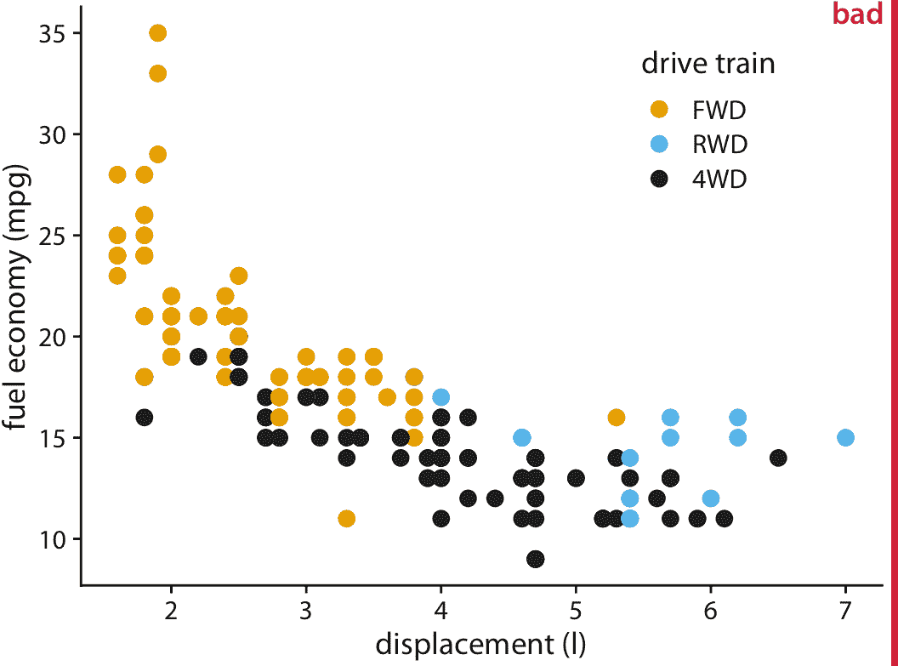

图 18.1：1999 年至 2008 年间发布的流行汽车的城市燃油经济性与发动机排量。每个点代表一辆汽车。点颜色编码传动系：前轮驱动（FWD），后轮驱动（RWD）或四轮驱动（4WD）。该图标记为“不良”，因为许多点都是在其他点上绘制的并且模糊了它们。

改善此问题的一种方法是使用部分透明度。如果我们使各个点部分透明，则过度绘制的点显示为较暗的点，因此点的阴影反映了图形位置中点的密度（图 18.2 ）。

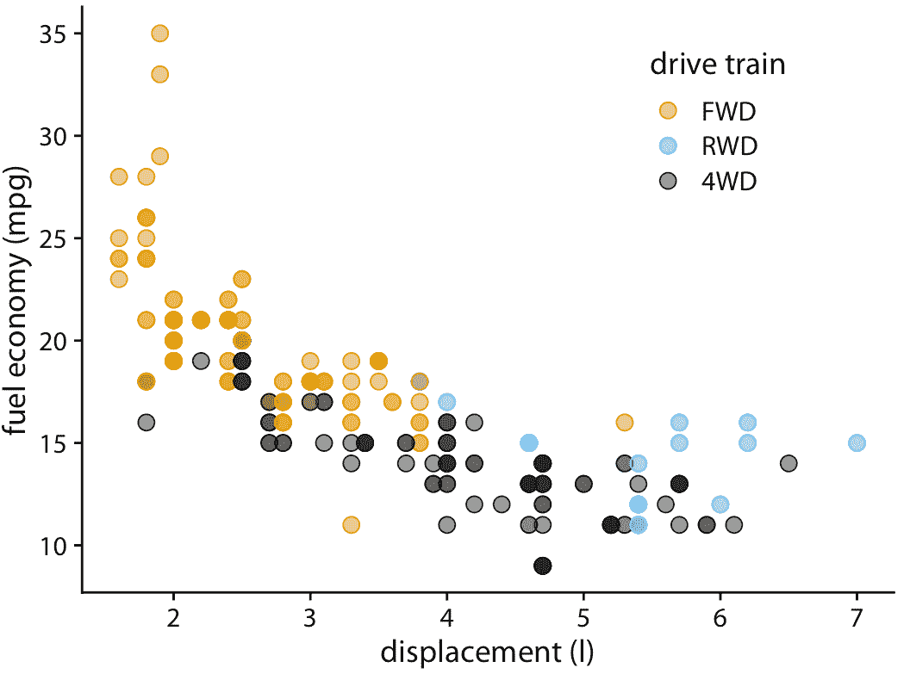

图 18.2：城市燃油经济性与发动机排量。因为点已经部分透明，所以位于其他点之上的点现在可以通过其较暗的阴影来识别。

然而，使点部分透明并不总是足以解决过度绘图的问题。例如，尽管我们可以在图 18.2 中看到某些点的阴影比其他点更暗，但很难估计每个位置在彼此的顶部绘制了多少个点。此外，虽然阴影的差异清晰可见，但它们并不是不言自明的。一个第一次看到这个数字的读者可能会想知道为什么有些点比其他点更暗，并且不会意识到这些点实际上是多个点叠在一起。在这种情况下有用的一个简单技巧是对点施加少量抖动，即在 _x_ 或 _y_ 中随机移动少量点。方向或两者。对于抖动，很明显，较暗的区域来自彼此重叠的点（图 18.3 ）。此外，现在，第一次代表具有 2.0 升发动机的四轮驱动汽车的黑点清晰可见。

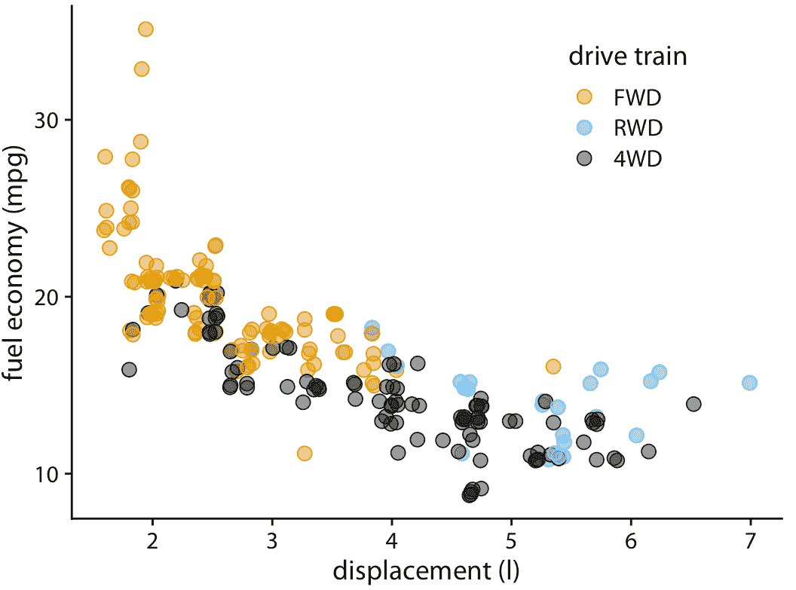

图 18.3：城市燃油经济性与发动机排量的关系。通过向每个点添加少量抖动，我们可以使得过度绘制的点更清晰可见，而不会显着扭曲绘图的消息。

抖动的一个缺点是它确实会改变数据，因此必须小心执行。如果我们抖动太多，我们最终会在不代表底层数据集的位置放置点。结果是误导了数据的可视化。参见图 18.4 作为示例。

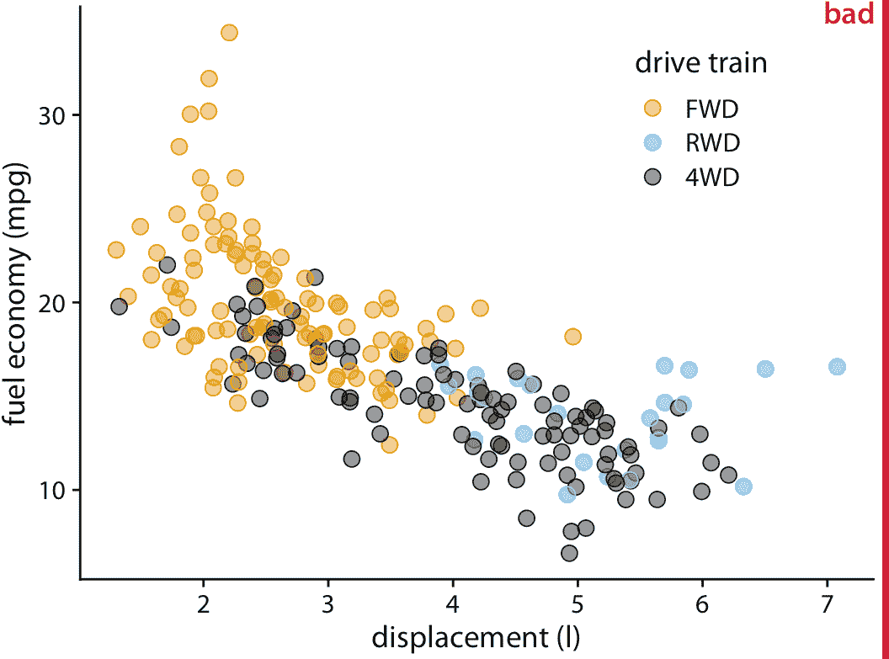

图 18.4：城市燃油经济性与发动机排量。通过向点添加过多抖动，我们创建了一个无法准确反映底层数据集的可视化。

## 18.2 2D 直方图

当单个点的数量变得非常大时，部分透明度（有或没有抖动）将不足以解决过度绘图问题。通常会发生的是，具有高点密度的区域将显示为深色的均匀斑点，而在具有低点密度的区域中，各个点几乎不可见（图 18.5 ）。而改变个别点的透明度水平将改善这些问题中的一个或另一个，同时使另一个问题恶化;没有透明度设置可以同时解决这两个问题。

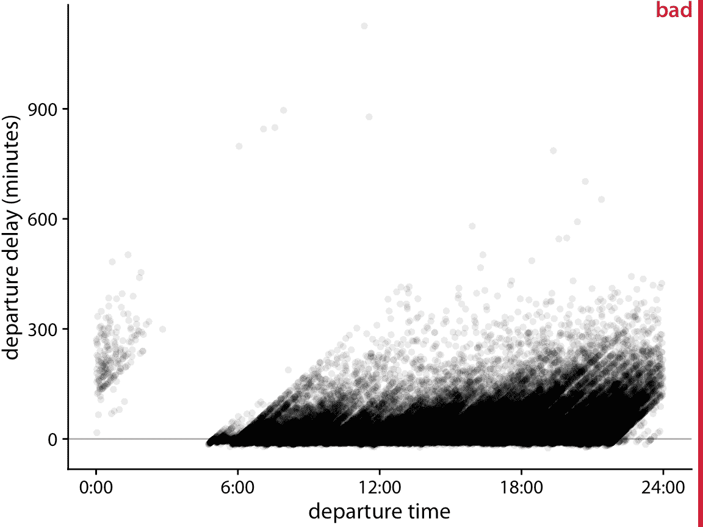

图 18.5：2013 年所有从纽瓦克机场（EWR）起飞的航班的出发延误（以分钟为单位）与航班起飞时间的关系。每个点代表一次出发。

图 18.5 显示超过 100,000 个单独航班的出发延误，每个点代表一次航班起飞。尽管我们已经使各个点相当透明，但是它们中的大多数只是在 0 到 300 分钟的出发延迟之间形成黑带。该频段模糊了大多数航班是否准时出发或大幅延迟（比如 50 分钟或更长时间）。同时，由于点的透明度，最延迟的航班（延迟 400 分钟或更长时间）几乎看不到。

在这种情况下，我们可以制作 2D 直方图，而不是绘制单个点。 2D 直方图在概念上类似于第一章 [7](histograms-density-plots.html#histograms-density-plots) 中讨论的一维直方图，但现在我们将数据分为二维。我们将整个 _x_ - _y_ 平面细分为小矩形，计算每个观察落入的观察数量，然后按该计数对矩形进行着色。图 18.6 显示了这种离场延迟数据方法的结果。该可视化清晰地突出了航班起飞数据的几个重要特征。首先，白天（早上 6 点到晚上 9 点）的绝大多数出发实际上是在没有延迟甚至提前（负面延迟）的​​情况下离开的。然而，适度的离职数量有很大的延迟。此外，一架飞机在当天离开的时间越多，它就越有延迟。重要的是，出发时间是实际的出发时间，而不是预定的出发时间。所以这个数字并不一定告诉我们计划提早离开的飞机从未经历过延误。然而，它告诉我们的是，如果飞机早早出发，它要么没有延迟，要么在极少数情况下延迟大约 900 分钟。

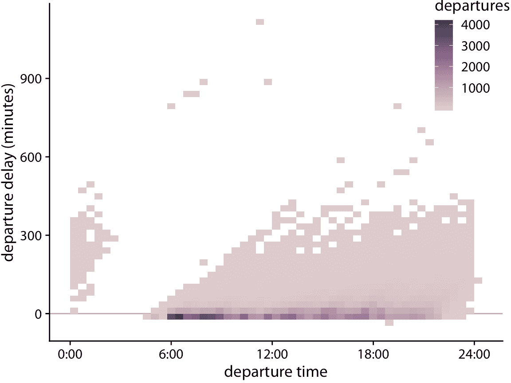

图 18.6：以分钟为单位的出发延误与航班起飞时间的关系。每个彩色矩形代表当时离开的所有航班和出发延误。着色表示该矩形表示的飞行数。

作为将数据合并为矩形的替代方法，我们也可以将其分成六边形。这种方法首先由 Carr 等人提出。 （ [1987](#ref-Carr-et-al-1987) ）具有以下优点：六边形中的点平均比等面积方形中的点更接近六边形中心到达正方形的中心。因此，彩色六边形比彩色矩形更准确地表示数据。图 18.7 显示六边形装箱而非矩形装箱的航班起飞数据。

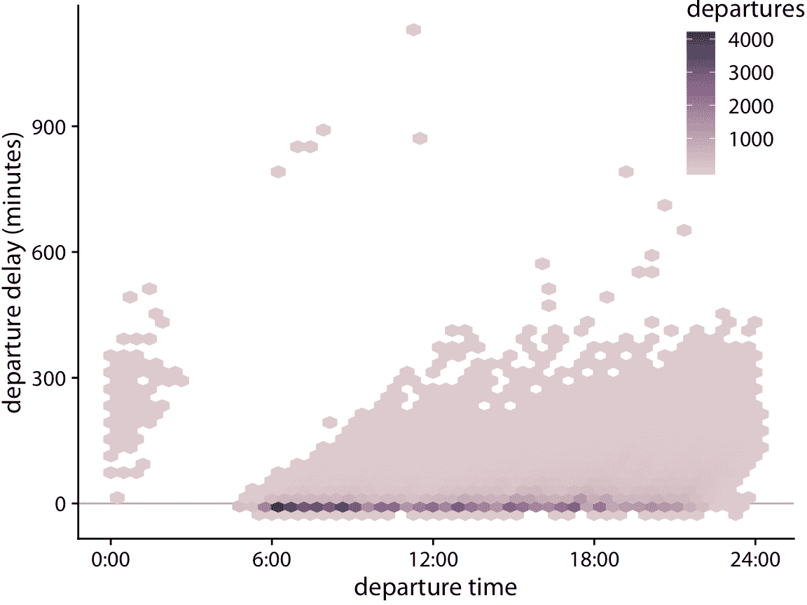

图 18.7：以分钟为单位的出发延误与航班起飞时间的关系。每个彩色六边形代表当时离开的所有航班和出发延误。着色表示由该六边形表示的飞行次数。

## 18.3 轮廓线

我们还可以估算绘图区域内的点密度，并用轮廓线指示不同点密度的区域，而不是将数据点分组为矩形或六边形。当点密度在 _x_ 和 _y_ 维度上缓慢变化时，该技术很有效。

作为这种方法的一个例子，我们返回第 [12](visualizing-associations.html#visualizing-associations) 章节中的蓝鸟队数据集。图 12.1 显示了 123 只蓝鸟的头长和体重之间的关系，并且这些点之间存在一些重叠。我们可以通过使点更小和部分透明来更清楚地突出点的分布，并将它们绘制在描绘相似点密度区域的等高线之上（图 18.8 ）。我们可以通过对由轮廓线包围的区域进行着色来进一步增强对点密度变化的感知，对于表示较高点密度的区域使用较暗的颜色（图 18.9 ）。

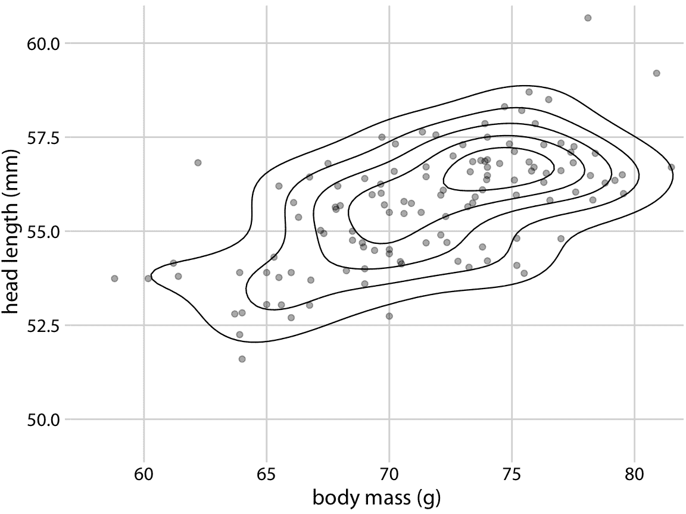

图 18.8：123 个蓝鸟的头长与体重的关系，如图 12.1 所示。每个点对应一只鸟，线表示相似点密度的区域。点密度朝着图的中心增加，接近体重 75g，头长在 55mm 和 57.5mm 之间。数据来源：欧柏林学院的 Keith Tarvin

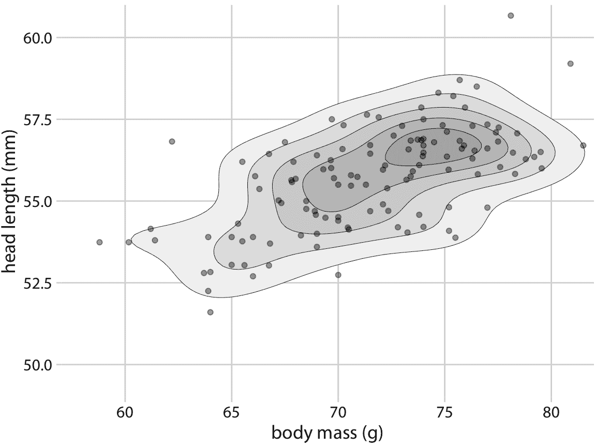

图 18.9：123 个蓝鸟的头长与体重的关系。这个图与图 12.1 几乎相同，但现在轮廓线包围的区域用越来越深的灰色阴影着色。这种阴影产生了更强的视觉印象，即朝向点云的中心增加点密度。数据来源：欧柏林学院的 Keith Tarvin

在章节 [12](visualizing-associations.html#visualizing-associations) 中，我们还分别研究了雄鸟和雌鸟的头长和体重之间的关系（图 12.2 ）。我们可以通过为雄鸟和雌鸟分别绘制彩色轮廓线来绘制轮廓线（图 18.10 ）。

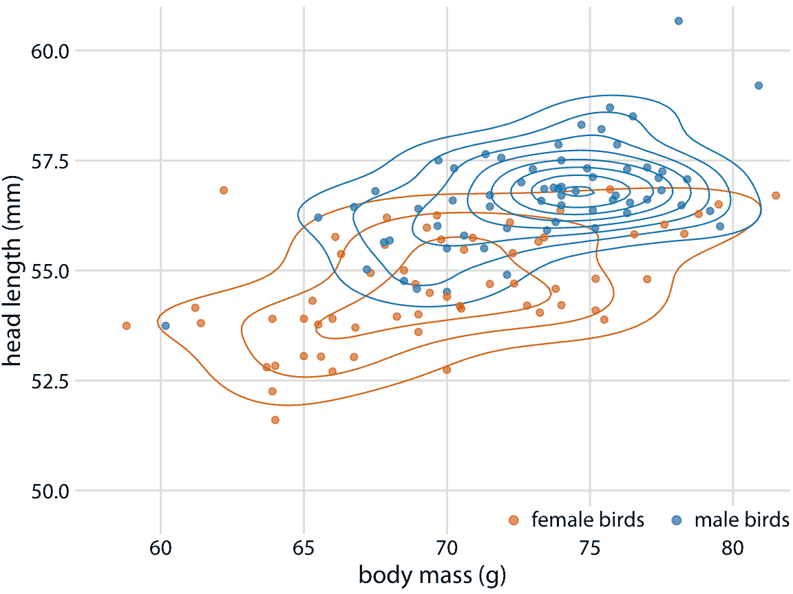

图 18.10：123 个蓝鸟的头长与体重的关系。如图 12.2 ，我们还可以在绘制轮廓线时通过颜色指示鸟类的性别。该图突出显示了雄鸟和雌鸟的点分布是如何不同的。特别是，雄性鸟类在地块区域的一个区域中更密集地聚集，而雌性鸟类则更加分散。数据来源：欧柏林学院的 Keith Tarvin

绘制不同颜色的多组轮廓线可以是一次显示多个点云分布的强大策略。但是，这种技术需要谨慎使用。它仅在具有不同颜色的组的数量较小（两到三个）并且组明确分开时才有效。否则，我们最终会得到一条颜色不同的毛球，它们彼此交叉，并且根本不显示任何特定的图案。

为了说明这个潜在的问题，我将使用钻石数据集，其中包含 53,940 颗钻石的信息，包括它们的价格，重量（克拉）和切割。图 18.11 将此数据集显示为散点图。我们看到了过度绘图的明显问题。有许多不同颜色的点在彼此之上，除了钻石落在价格克拉谱上的整体大纲之外，不可能辨别出任何东西。

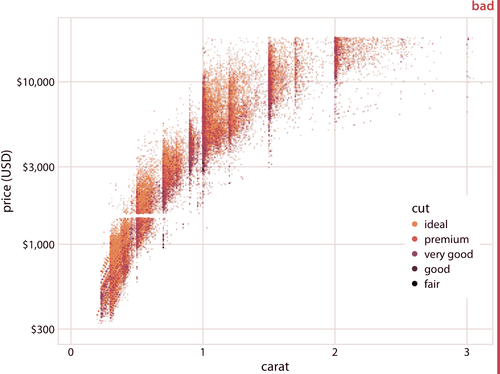

图 18.11：钻石价格与其克拉值的比值，为 53,940 枚单颗钻石。每颗钻石的切割都用颜色表示。该图被标记为“坏”，因为广泛的过度绘图使得无法辨别出不同钻石切割中的任何图案。数据来源：Hadley Wickham，ggplot2

我们可以尝试为不同的切割质量绘制彩色轮廓线，如图 18.10 。但是，在钻石数据集中，我们有五种不同的颜色，这些组强烈重叠。因此，等高线图（图 18.12 ）并没有比原始散点图好很多（图 18.11 ）。

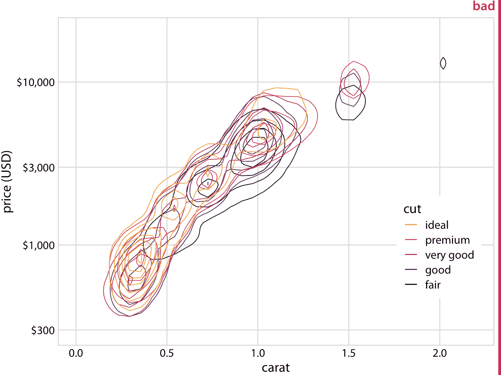

图 18.12：钻石价格与克拉价值的关系。如图 18.11 ，但现在个别点已被轮廓线所取代。得到的图仍然标记为“坏”，因为轮廓线全部位于彼此之上。无论是单个切割的点分布还是整体点分布都不能被辨别出来。数据来源：Hadley Wickham，ggplot2

这有助于在自己的绘图面板中绘制每个切割质量的轮廓线（图 18.13 ）。在一个面板中绘制它们的目的可能是为了实现组之间的视觉比较，但是图 18.12 非常繁忙，无法进行比较。相反，在图 18.13 中，背景网格使我们能够通过关注轮廓线相对于网格线的确切位置来对切割质量进行比较。 （通过在每个面板中绘制部分透明的单个点而不是轮廓线，可以实现类似的效果。）

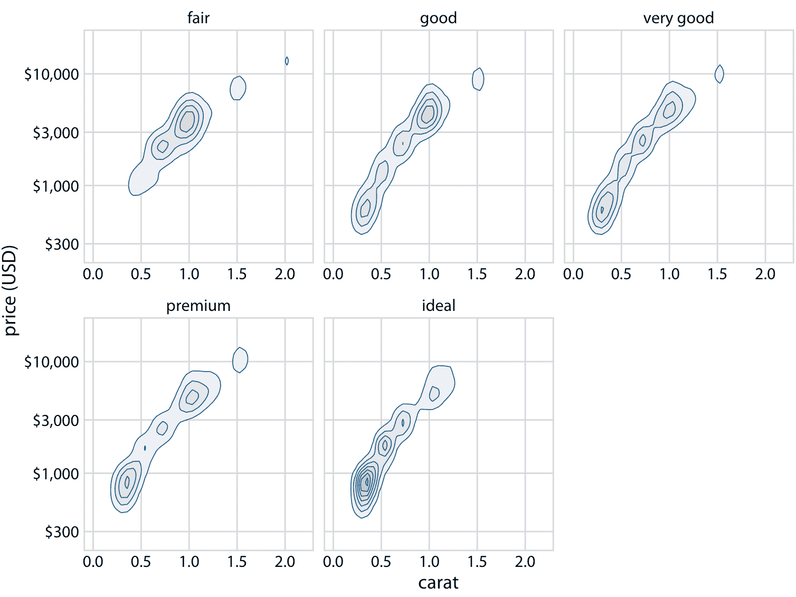

图 18.13：钻石价格与克拉价值的关系。在这里，我们从图 18.12 中获取了密度轮廓，并为每次切割分别绘制它们。我们现在可以看到，更好的削减（非常好，优质，理想）往往比较差的削减（公平，良好）具有更低的克拉值，但是每克拉的价格更高。数据来源：Hadley Wickham，ggplot2

我们可以提出两个主要趋势。首先，更好的削减（非常好，优质，理想）往往比较差的削减（公平，良好）具有更低的克拉值。回想一下克拉是衡量钻石重量的指标（1 克拉= 0.2 克）。更好的切割往往会导致较轻的钻石（平均而言），因为需要更多的材料去除它们。其次，在相同的克拉值下，更好的削减倾向于提高价格。要查看此模式，请查看 0.5 克拉的价格分布示例。分布向上移动以获得更好的切割，特别是对于具有理想切割的钻石而言，其分布比具有公平或良好切割的钻石高得多。

### 参考

Carr，D.B.，R.J。Littlefield，W。L. Nicholson 和 J. S. Littlefield。 “大型 N 的散点图矩阵技术” _J. Am。统计。协会。_ 82：424-36。