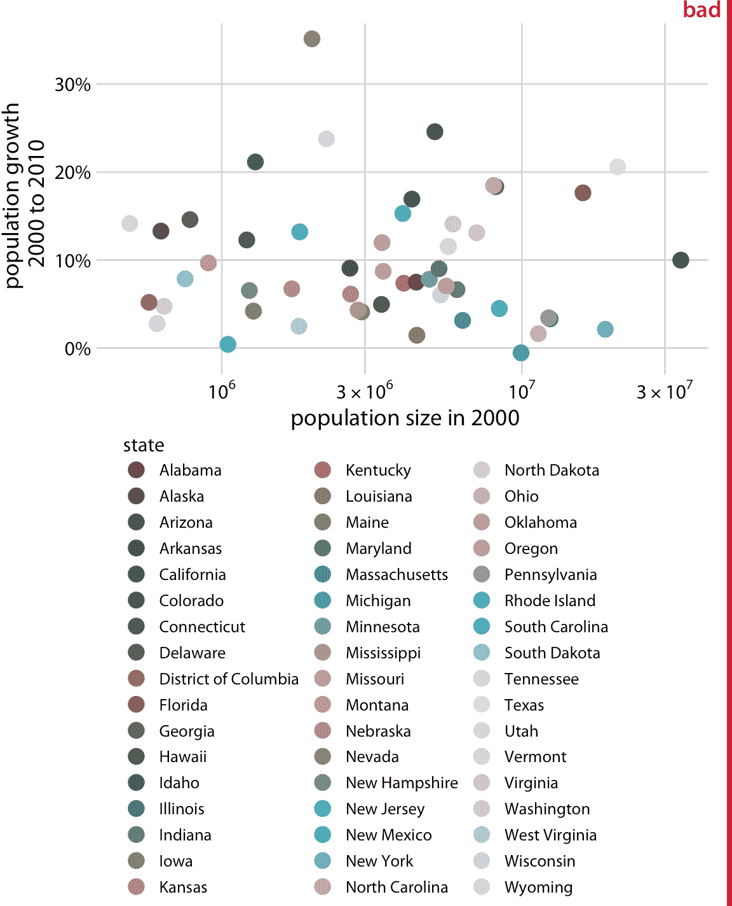
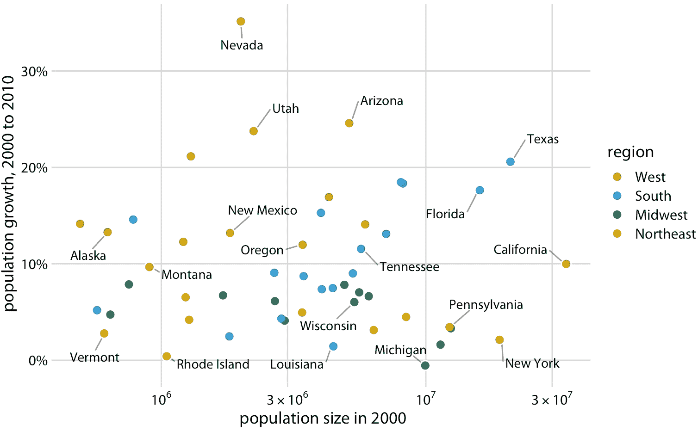
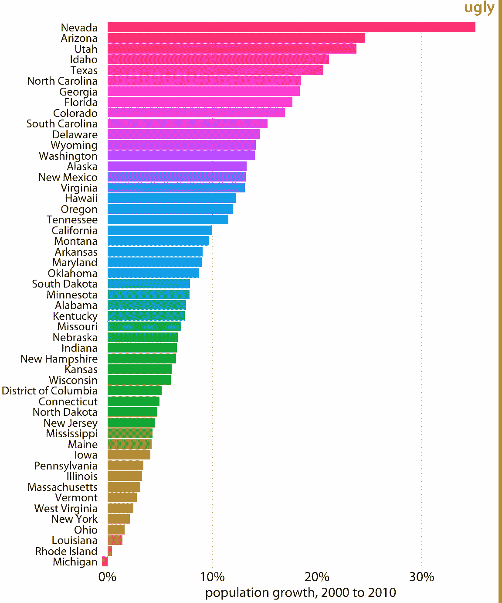
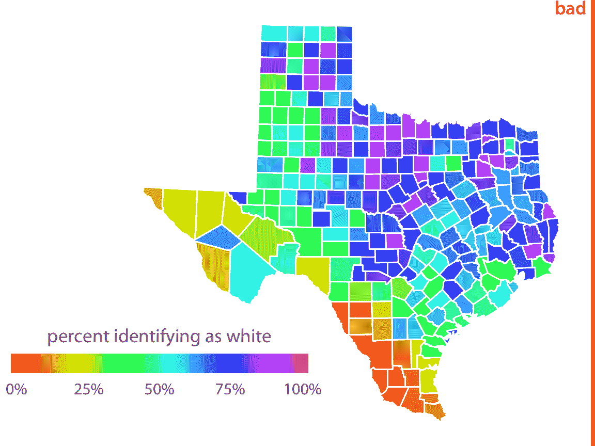
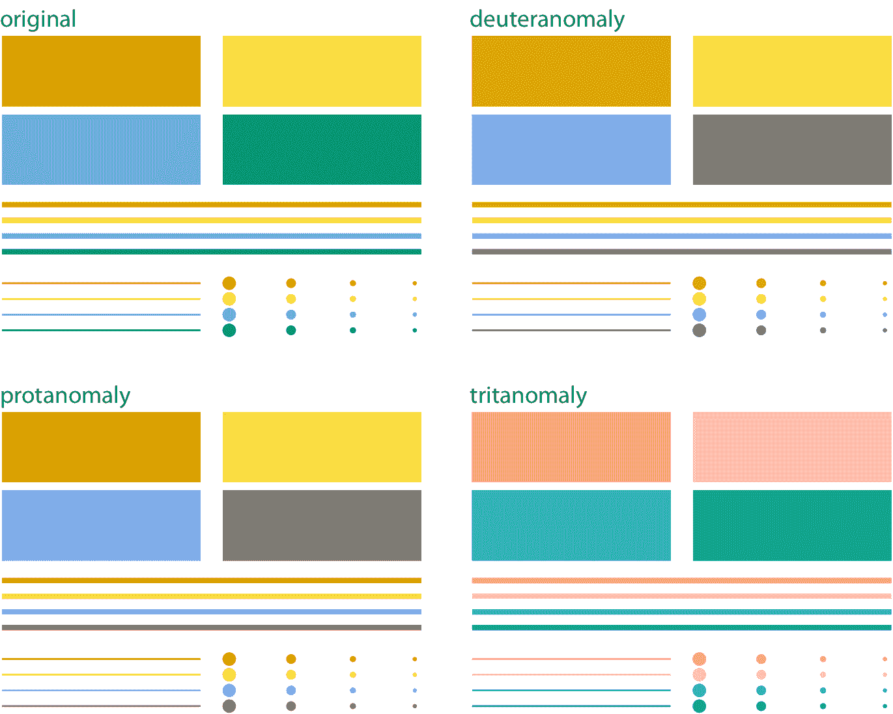

# 19 颜色使用的常见缺陷

> 原文： [https://serialmentor.com/dataviz/color-pitfalls.html](https://serialmentor.com/dataviz/color-pitfalls.html)

颜色可以是一种非常有效的工具来增强数据可视化。同时，糟糕的颜色选择会破坏其他优秀的可视化效果。颜色需要用于达到目的，必须清晰，并且不得分散注意力。

## 19.1 编码过多或无关的信息

一个常见的错误是尝试通过编码太多不同颜色的不同项目来为颜色提供一个太大而无法处理的工作。例如，考虑图 19.1 。它显示了美国所有 50 个州和哥伦比亚特区的人口增长与人口规模。我试图通过给它自己的颜色来识别每个状态。但是，结果不是很有用。即使我们可以通过查看情节和图例中的彩色点来猜测哪个状态，但要在两者之间来回试图匹配它们需要花费很多精力。有太多不同的颜色，其中许多颜色彼此非常相似。即使付出了很多努力，我们也可以准确地确定哪个状态是哪个，这种可视化会破坏着色的目的。我们应该使用颜色来增强数字并使它们更容易阅读，而不是通过创建视觉谜题来模糊数据。

图 19。1：2000 年至 2010 年的人口增长与 2000 年的人口规模，美国所有 50 个州以及哥伦比亚的判决。每个州都标有不同的颜色。由于状态太多，因此很难将图例中的颜色与散点图中的点进行匹配。数据来源：美国人口普查局

根据经验，当有三到五个不同类别需要着色时，定性色标最有效。一旦我们达到八到十个不同类别或更多类别，将颜色与类别匹配的任务变得过于繁琐而无用，即使颜色保持足够不同以在原则上可区分。对于图 19.1 的数据集，最好仅使用颜色来指示每个州的地理区域，并通过直接标记识别各个州，即通过在数据点附近放置适当的文本标签（图 19.2 ）。即使我们不能在不使人物过于拥挤的情况下标记每个州​​，直接标签也是这个数字的正确选择。通常，对于诸如此类的数字，我们不需要标记每个数据点。标记代表性子集就足够了，例如我们特别想要在图中附带的文本中调用的一组状态。如果我们想确保读者完全可以访问它，我们总是可以选择将基础数据作为表提供。

图 19.2：2000 年至 2010 年的人口增长与 2000 年的人口规模相比。与图 19.1 相比，我现在按区域着色状态并直接标记了一个状态子集。大部分州都没有标记，以防止这个数字过度拥挤。数据来源：美国人口普查局

当您需要区分超过大约八个分类项目时，请使用直接标注而不是颜色。

第二个常见问题是为了着色而着色，而没有明确的颜色目的。例如，考虑图 19.3 ，它是图 4.2 的变体。然而，现在我没有按地理区域对条形图进行着色，而是给每个条形图赋予了自己的颜色，因此总体来说，条纹会产生彩虹效果。这可能看起来像一个有趣的视觉效果，但它不会创建任何新的数据洞察或使图形更容易阅读。

图 19。3。3：2000 年至 2010 年美国的人口增长。国家的彩虹着色没有任何意义，令人分心。此外，颜色过度饱和。数据来源：美国人口普查局

除了无偿使用不同颜色外，图 19.3 还有第二个与颜色相关的问题：所选择的颜色过于饱和且强烈。这种颜色强度使人物难以看清。例如，如果没有将我们的眼睛吸引到州名旁边的大而强烈着色的区域，就很难阅读州名。类似地，难以将条的端点与下面的网格线进行比较。

避免大面积过饱和的填充区域。它们使您的读者难以仔细检查您的身材。

## 19.2 使用非单调色标来编码数据值

在第 [4](color-basics.html#color-basics) 章节中，我列出了设计可以表示数据值的连续色标的两个关键条件：颜色需要清楚地指示哪些数据值大于或小于其他数据值，以及颜色之间的差异需要可视化数据值之间的相应差异。不幸的是，一些现有的色标 - 包括非常受欢迎的色标 - 违反了这些条件中的一个或两个。最流行的这种尺度是彩虹尺度（图 19.4 ）。它贯穿色谱中的所有可能颜色。这意味着规模实际上是圆形的;开头和结尾的颜色几乎相同（深红色）。如果这两种颜色在图中彼此相邻，我们本能地将它们视为表示最大间隔的数据值。此外，规模高度非单调。它有颜色变化非常缓慢的区域，以及颜色变化很快的区域。如果我们看一下灰度级的色标，这种单调性的缺乏就变得特别明显（图 19.4 ）。比例从中等黑暗到浅到非常暗，再到中等黑暗，并且有大的延伸，其中亮度变化很小，然后是相对狭窄的延伸，亮度变化很大。

图 19.4：彩虹色标高度非单调。通过将颜色转换为灰度值，可以清楚地看到这一点。从左到右，比例从适度的黑暗到浅色到非常暗，然后回到中等黑暗。另外，亮度的变化非常不均匀。刻度的最亮部分（对应于黄色，浅绿色和青色）占据整个刻度的近三分之一，而最暗部分（对应于深蓝色）集中在刻度的狭窄区域。

在实际数据的可视化中，彩虹比例倾向于模糊数据特征和/或突出数据的任意方面（图 19.5 ）。另外，彩虹标度中的颜色也过度饱和。在任何延长的时间内看图 19.5 可能会非常不舒服。

图 19.5：在德克萨斯州县中被识别为白人的百分比。彩虹色标不是可视化连续数据值的合适比例，因为它倾向于强调数据的任意特征。在这里，它强调了大约 75％的人口认定为白人的县。数据来源：2010 年美国十年普查

## 19.3 不设计色觉缺陷

每当我们为可视化选择颜色时，我们需要记住，很大一部分读者可能会有某种形式的色觉缺陷（即色盲）。这些读者可能无法区分与大多数其他人看起来明显不同的颜色。然而，色觉受损的人根本无法看到任何颜色。相反，他们通常难以区分某些类型的颜色，例如红色和绿色（红绿色视觉缺陷）或蓝色和绿色（蓝黄色视觉缺陷）。这些缺陷的技术术语是红绿色变体的 deuteranomaly / deuteranopia 和 protanomaly / protanopia（人们难以分别感知绿色或红色）和蓝黄色变体的 tritanomaly / tritanopia（人们难以察觉蓝色） ）。以“异常”结尾的术语是指对相应颜色的感知的一些损害，并且以“近视”结尾的术语是指完全没有对该颜色的感知。大约 8％的男性和 0.5％的女性患有某种色觉缺陷，而 deuteranomaly 是最常见的形式，而 tritanomaly 是相对罕见的。

正如第 [4](color-basics.html#color-basics) 章节所讨论的，数据可视化中使用了三种基本类型的色标：连续尺度，发散尺度和定性尺度。在这三个中，顺序刻度通常不会对具有色觉缺陷（cvd）的人造成任何问题，因为正确设计的连续刻度应呈现从暗色到浅色的连续渐变。图 19.6 显示了图 4.3 在 deuteranomaly，protanomaly 和 tritanomaly 的模拟版本中的热量表。虽然这些 cvd 模拟尺度看起来都不像原始尺度，但它们都呈现出从暗到亮的清晰渐变，它们都可以很好地传达数据值的大小。

图 19.6：顺序色标的色觉缺陷（cvd）模拟加热，从深红色到浅黄色。从左到右，从上到下，我们看到原始的尺度和尺度，如在 deuteranomaly，protanomaly 和 tritanomaly 模拟下看到的。即使三种类型的 cvd 下的特定颜色看起来不同，在每种情况下我们都可以看到从暗到亮的清晰渐变。因此，这种色标可以安全地用于 cvd。

对于不同的尺度，事情变得更加复杂，因为流行的颜色对比在 cvd 下变得难以区分。特别是，红色和绿色的颜色为具有正常色觉的人提供了最强烈的对比度，但对于 deutans（患有 deuteranomaly 的人）或者 protans（患有 protanomaly 的人）几乎无法区分（图 19.7 ）。同样地，对于 deutans 和 protans 来说，蓝绿色的对比是可见的，但是对于 tritans（具有 tritanomaly 的人）来说却难以区分（图 19.8 ）。

图 19.7：在红绿色 cvd（deuteranomaly 或 protanomaly）下，红绿对比度变得难以区分。

图 19.8：在蓝黄色 cvd（tritanomaly）下，蓝绿色对比度变得难以区分。

通过这些例子，似乎几乎不可能找到在所有形式的 cvd 下都安全的两种对比色。但是，情况并非如此可怕。通常可以对颜色稍作修改，使得它们具有所需的特性，同时对 cvd 也是安全的。例如，图 4.5 的 ColorBrewer PiYG（粉红色到黄绿色）比例对于具有正常色觉的人来说看起来是红绿色，但对于有 cvd 的人来说仍然可以区分（图 19.9 ） 。

图 19.9：来自图 4.5 的 ColorBrewer PiYG（粉红色至黄绿色）比例看起来像具有常规色觉的人的红绿对比，但适用于所有形式的色觉缺陷。它的工作原理是红色实际上是粉红色（红色和蓝色的混合），而绿色也包含黄色。两种颜色之间的蓝色成分的差异甚至可以通过 deutans 或 protans 来获取，并且红色成分的差异可以由 tritans 拾取。

对于定性尺度而言，事情是最复杂的，因为我们需要许多不同的颜色，并且它们都需要在所有形式的 cvd 下彼此区分。我在本书中广泛使用的首选定性色标是专门为解决这一挑战而开发的（图 19.10 ）。通过提供八种不同的颜色，调色板适用于几乎任何具有离散颜色的场景。正如本章开头所讨论的那样，你可能不应该在一个情节中对八个以上不同的项目进行颜色编码。

图 19.10：所有色觉缺陷的定性调色板（Okabe 和 Ito [2008](#ref-Okabe-Ito-CUD) ）。字母数字代码表示 RGB 空间中的颜色，编码为十六进制。在许多绘图库和图像处理程序中，您只需直接输入这些代码即可。如果您的软件不直接采用十六进制，您也可以使用表 19.1 中的值。

<caption>Table 19.1: Colorblind-friendly color scale, developed by Okabe and Ito ([2008](#ref-Okabe-Ito-CUD)).</caption>
| 名称 | 十六进制代码 | 色调 | C，M，Y，K（％） | R，G，B（0-255） | R，G，B（％） |
| :-- | :-- | :-- | :-- | :-- | :-- |
| 橙子 | ＃E69F00 | 41° | 0,50,100,0 | 230,159,0 | 90,60,0 |
| 天蓝色 | ＃56B4E9 | 202° | 80,0,0,0 | 86,180,233 | 35,70,90 |
| 蓝绿色 | ＃009E73 | 164° | 97,0,75,0 | 0,158,115 | 0,60,50 |
| 黄色 | ＃F0E442 | 56° | 10,5,90,0 | 240,228,66 | 95,90,25 |
| 蓝色 | ＃0072B2 | 202° | 100,50,0,0 | 0,114,178 | 0,45,70 |
| 朱红 | ＃D55E00 | 27° | 0,80,100,0 | 213,94,0 | 80,40,0 |
| 红紫色 | ＃CC79A7 | 326° | 10,70,0,0 | 204,121,167 | 80,60,70 |
| 黑色 | ＃000000 | - | 0,0,0,100 | 0,0,0 | 0, 0, 0 |

虽然有几种很好的 cvd 安全色标可供选择，但我们需要认识到它们不是魔法子弹。很有可能使用 cvd 安全的比例，但产生一个数字，一个人用 cvd 无法破译。一个关键参数是彩色图形元素的大小。当它们应用于大面积而不是小面积或细线时，颜色更容易区分（Stone，Albers Szafir 和 Setlur [2014](#ref-Stone_et_al_2014) ）。并且这种效果在 cvd 下更加恶化（图 19.11 ）。除了本章和第 [4](color-basics.html#color-basics) 章节中讨论的各种颜色设计注意事项外，我建议您在 cvd 模拟下查看颜色数字，以了解 cvd 人物的样子。有几种在线服务和桌面应用程序可供用户通过 cvd 模拟运行任意数字。

图 19.11：有色元素在小尺寸时难以区分。左上方的面板（标有“原始”）显示了四个矩形，四条粗线，四条细线和四组点，所有这些点都以相同的四种颜色着色。我们可以看到颜色变得更难以区分视觉元素越小或越薄。这个问题在 cvd 模拟中变得更加严重，其中即使对于大图形元素，颜色也已经更难以区分。

为了确保您的数字适用于使用 cvd 的人，不要只依赖于特定的色标。相反，在 cvd 模拟器中测试你的数字。

### 参考

Okabe，M。和 K. Ito。 “彩色通用设计（CUD）：如何制作对色盲人士友好的数字和演示。” [http://jfly.iam.u-tokyo.ac.jp/color/](http://jfly.iam.u-tokyo.ac.jp/color/) 。

Stone，M.，D。Albers Szafir 和 V. Setlur。 “作为尺寸函数的色差工程模型。”在 _ 第 22 届彩色和成像会议 _ 中。成像科学与技术学会。