# 20 冗余编码

> 原文： [20 Redundant coding](https://serialmentor.com/dataviz/redundant-coding.html)

> 校验：[飞龙](https://github.com/wizardforcel)

> 自豪地采用[谷歌翻译](https://translate.google.cn/)

在第 19 章中，我们已经看到颜色不能总是像我们希望的那样有效地传达信息。如果我们想要识别许多不同的项目，那么通过颜色这样做可能不起作用。将绘图中的颜色与图例中的颜色相匹配将很困难（图 19.1 ）。即使我们只需要区分两到三个不同的项目，如果彩色项目非常小（图 19.11 ）颜色可能会失效，并且/或者对于颜色视觉缺陷的人，颜色看起来相似（图 19.7 和 19.8 ）。所有这些场景中的一般解决方案是使用颜色来增强图形的视觉外观，而不依赖于颜色来传达关键信息。我将这个设计原理称为冗余编码，因为它提示我们，使用多个不同的美学维度对数据进行冗余编码。

## 20.1 设计带有冗余编码的图例

多组数据的散点图经常以这种方式设计，代表不同组的点仅在颜色上不同。例如，考虑图 20.1 ，它显示了三种不同的鸢尾花物种的萼片宽度与萼片长度的关系。 （萼片是开花植物中花的外叶。）代表不同物种的点的颜色不同，但除此之外所有点看起来完全相同。尽管这个图只包含三组不同的点，但即使对于具有正常色觉的人来说也难以阅读。出现这个问题的原因是两个物种，弗吉尼亚鸢尾和杂色鸢尾的数据点混合在一起，它们的两种颜色，绿色和蓝色，对于彼此并没有特别明显。

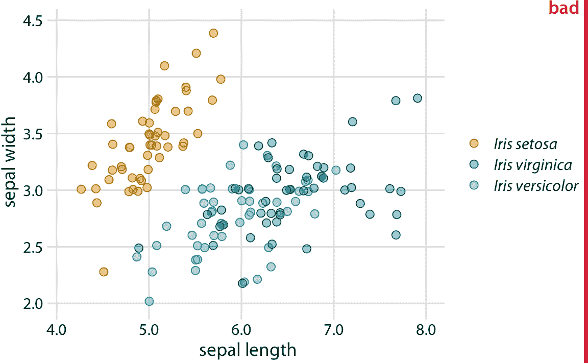

图 20.1：三个不同鸢尾花物种（山鸢尾，弗吉尼亚鸢尾和杂色鸢尾）的萼片宽度与萼片长度的关系。每个点代表一个植物样本的测量值。对所有点位置施加了少量抖动以防止过度绘图。该图被标记为“不好”，因为弗吉尼亚鸢尾的绿点和杂色鸢尾的蓝点难以彼此区分。

令人惊讶的是，对于具有红绿色视觉缺陷（deuteranomaly 或 protanomaly）的人而言，绿色和蓝色点看起来比具有正常色觉的人更明显（比较图 20.2 的最上面一行，和图 20.1 ）。另一方面，对于蓝黄色缺陷（tritanomaly）的人来说，蓝色和绿色点看起来非常相似（图 20.2 ，左下）。如果我们打印出灰度图（即我们对图去饱和），我们就无法区分任何鸢尾花种类（图 20.2 ，右下图）。

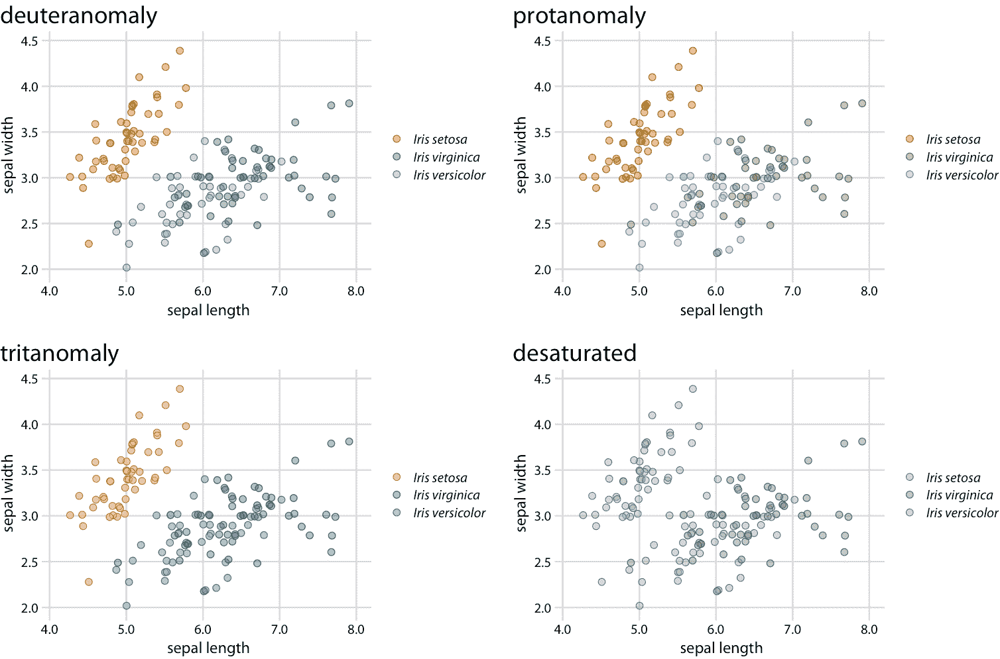

图 20.2：图 20.1 的色觉缺陷模拟。

我们可以对图 20.1 进行两项简单的改进，来缓解这些问题。首先，我们可以交换用于山鸢尾和杂色鸢尾的颜色，这样蓝色不再直接在绿色旁边（图 20.3 ）。其次，我们可以使用三种不同的符号形状，因此这些点看起来都不同。通过这两个变化，图形的原始版本（图 20.3 ）和颜色视觉缺陷和灰度（图 20.4 ）的版本变得清晰。

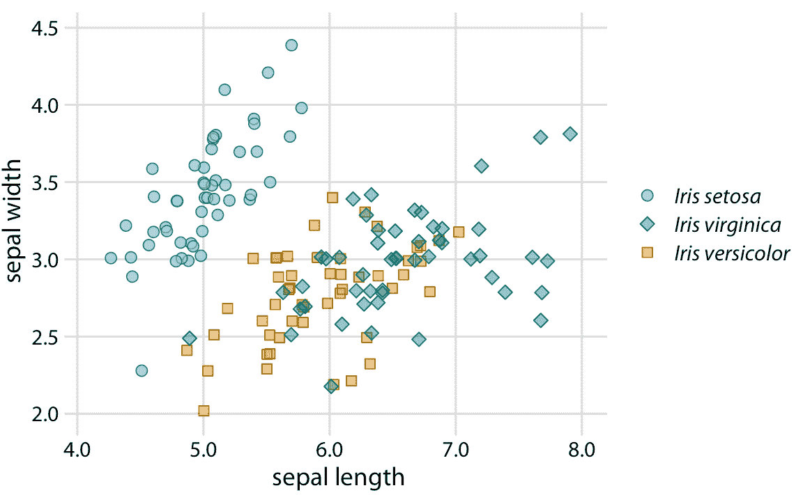

图 20.3：三个不同鸢尾花物种的萼片宽度与萼片长度的关系。与图 20.1 相比，我们交换了山鸢尾和杂色鸢尾的颜色，我们给每个鸢尾花物种提供了自己的点形状。

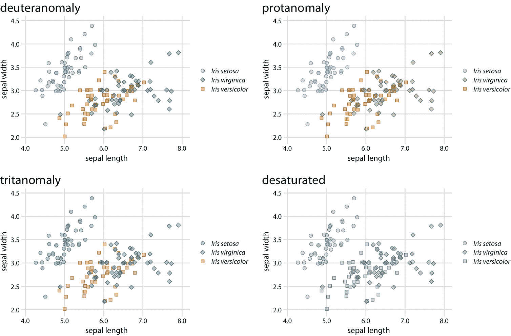

图 20.4：图 20.3 的色觉缺陷模拟。由于使用了不同的点形状，即使是完全去饱和的灰度版本也很清晰。

更改点的形状是散点图的简单策略，但它不一定适用于其他类型的图。在折线图中，我们可以更改线型（实线，虚线，点虚线等，另请参见图 2.1 ），但使用虚线或点虚线通常会产生次优结果。特别是，虚线或点虚线通常看起来不太好，除非它们完全笔直或仅轻微弯曲，并且在任何一种情况下它们都会产生视觉噪音。此外，从绘图到图例匹配不同类型的虚线或点划线图案，经常需要大量的精力。那么我们如何处理可视化，如图 20.5 ，它使用线条来显示四个不同主要科技公司的随时间变化的股票价格？

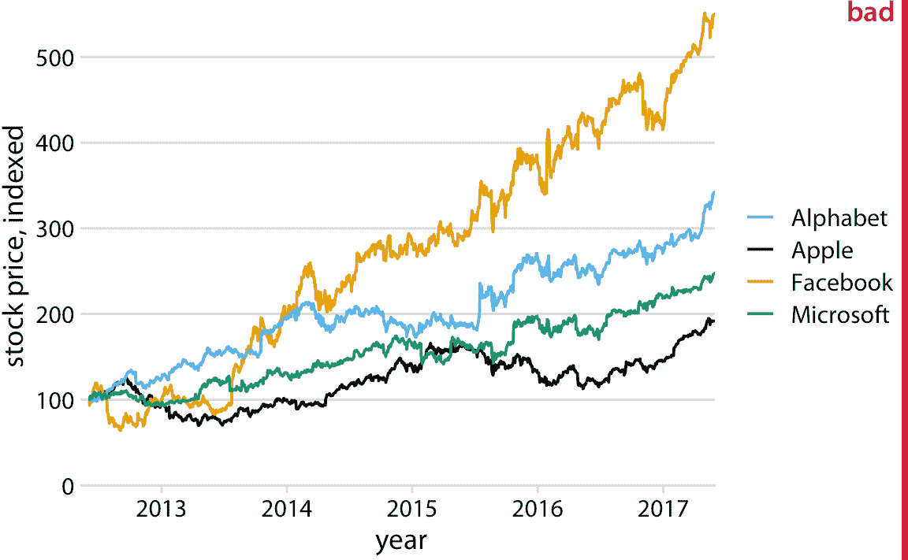

图 20.5：四家主要科技公司的随时间变化的股票价格。 2012 年 6 月，每家公司的股票价格已经标准化为 100。这个数字被标记为“不好”，因为需要相当大的精力，才能将图例中的公司名称与数据曲线相匹配。数据来源：雅虎财经

该图包含四条线，代表四家不同公司的股票价格。这些线条采用色觉缺陷友好的颜色刻度进行颜色编码。因此，将每条线与相应的公司相关联应该是相对直接的。但事实并非如此。这里的问题是数据线具有清晰的视觉顺序。代表 Facebook 的黄线显然是最高的线，代表 Apple 的黑线显然是最低的，其中 Alphabet 和 Microsoft 介于此之间。然而，图例中四家公司的顺序是 Alphabet，Apple，Facebook，Microsoft（字母顺序）。因此，数据线的感知顺序不同于图例中的公司顺序，并且将数据线与公司名称匹配需要花费大量精力。

这个问题通常出现在绘制自动生成图例的软件上。绘图软件没有观察者将感知的视觉顺序的概念。相反，该软件按其他顺序排序图例，最常见的是按字母顺序排列。我们可以通过手动重新排序图例中的条目来解决这个问题，使它们与数据中的先前排序相匹配（图 20.6 ）。结果是一个图表，使图例更容易与数据匹配。

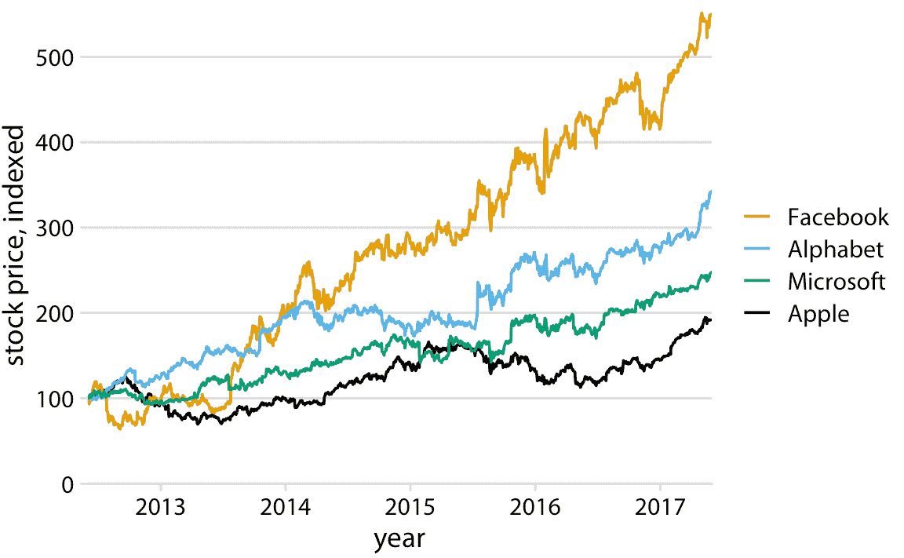

图 20.6：四家主要科技公司的随时间变化的股票价格。 2012 年 6 月，每家公司的股票价格已经标准化为 100。数据来源：雅虎财经

如果数据中有清晰的视觉顺序，请确保在图例中与其匹配。

将图例顺序与数据顺序匹配总是有帮助的，但在色觉缺陷模拟下，这些好处尤为明显（图 20.7 ）。例如，它有助于图的蓝绿弱视版本，其中蓝色和绿色变得难以区分（图 20.7 ，左下）。它也有助于灰度版本（图 20.7 ，右下角）。虽然 Facebook 和 Alphabet 的两种颜色几乎具有相同的灰度值，但我们可以看到微软和苹果以较暗的颜色代表并占据最下面的两个位置。因此，我们正确地假设最高的线对应于 Facebook，而第二高的线对应于 Alphabet。

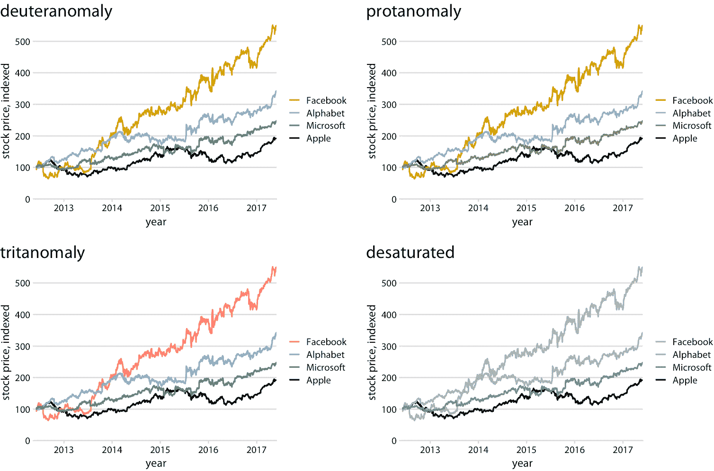

图 20.7：图 20.6 的色觉缺陷模拟。

## 20.2 设计没有图例的图表

尽管通过冗余编码数据可以提高图例的易读性，但是在多种美学中，图例总是给读者带来额外的精神负担。在阅读图例时，读者需要在可视化的一部分中获取信息，然后将其转移到不同的部分。如果我们完全消除这个图例，我们通常可以让读者更轻松。然而，消除图例并不意味着我们根本不提供一个图例，并在图标题中写出诸如“黄点代表杂色鸢尾”的句子。消除图例意味着我们以这样的方式设计图形，即使没有明确的图例，各种图形元素所代表的内容也是不言自明的。

我们可以采用的一般策略称为直接标记，我们将适当的文本标签或其他视觉元素放置在图的其余部分作为指导。我们之前在第 19 章（图 19.2 ）中遇到了直接标记，作为绘制具有 50 多种不同颜色的图例的替代方法。为了将直接标记概念应用于股票价格图表，我们将每个公司的名称放在其各自数据线末尾的旁边（图 20.8 ）。

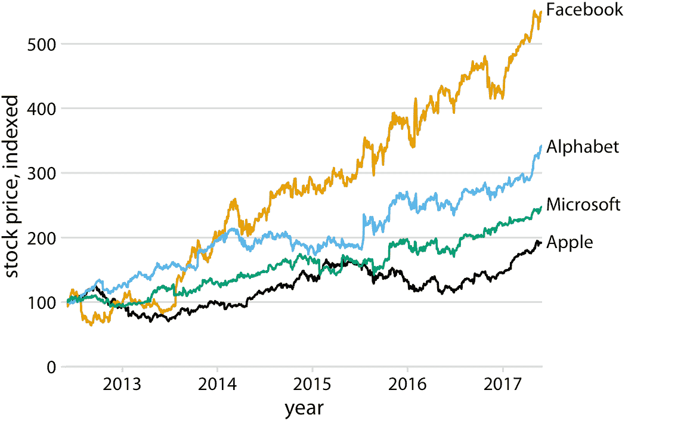

图 20.8：四家主要科技公司的随时间变化的股票价格。 2012 年 6 月，每家公司的股票价格已经标准化为 100。数据来源：雅虎财经

只要有可能，设计您的图表，使他们不需要图例。

我们也可以从本章开始就将直接标记概念应用于鸢尾花数据，特别是图 20.3 。因为它是分成三个不同组的许多点的散点图，所以我们需要直接标记组而不是单个点。一种解决方案是绘制包围大部分点的椭圆，然后标记椭圆（图 20.9 ）。

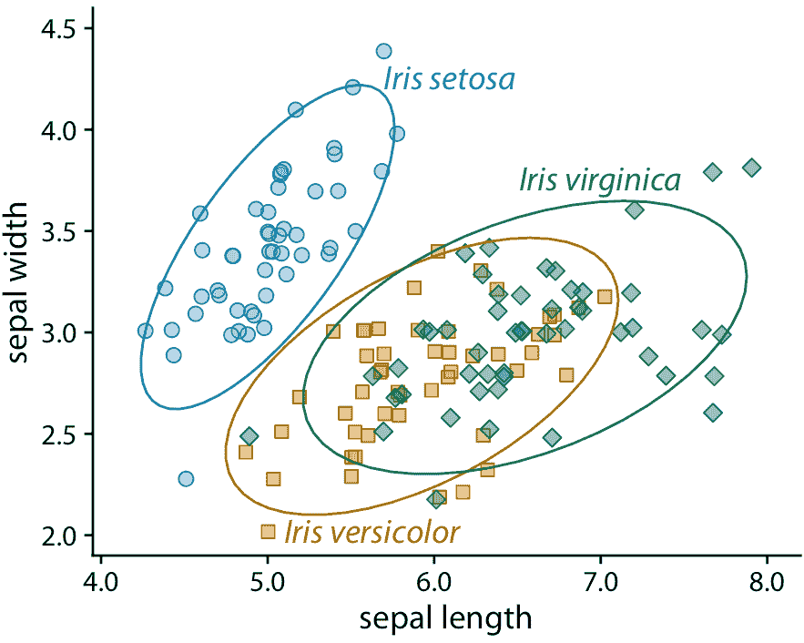

图 20.9：三个不同鸢尾花物种的萼片宽度与萼片长度的关系。我已从此图中删除了背景网格，因为否则图形变得太嘈杂了。

对于密度图，我们可以类似地直接标记曲线而不是提供颜色编码的图例（图 20.10 ）。在图 20.9 和 20.10 中，我将文本标签着色为与数据相同的颜色。彩色标签可以大大增强直接标记的效果，但它们也可能变得很差。如果文本标签以太浅的颜色打印，则标签变得难以阅读。并且，由于文本由非常细的线组成，因此彩色文本通常看起来比相同颜色的相邻填充区域更亮。我通常通过使用每种颜色的两种不同色调来避开这些问题，对于填充区域使用浅色，对于线条，轮廓和文本使用深色。如果仔细检查图 20.9 或 20.10 ，您将看到每个数据点或阴影区域如何填充为浅色，并且轮廓以相同色调的深色绘制。同时，文本标签以相同的深色绘制。

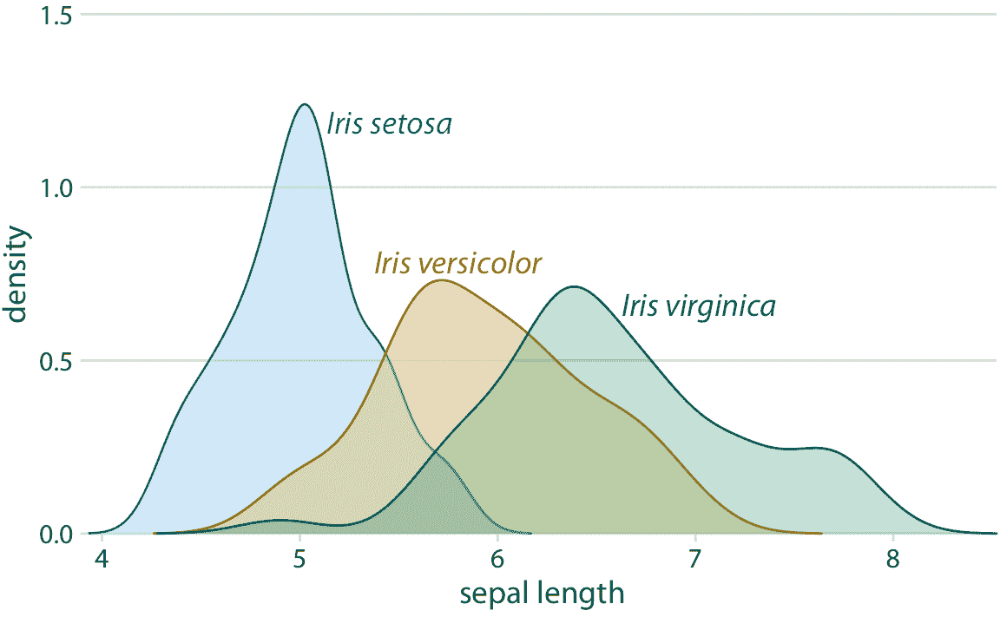

图 20.10：三个不同鸢尾花物种萼片长度的密度估计。每个密度估计直接用相应的物种名称标记。

我们还可以使用密度图（例如图 20.10 作为图例的替代方案，通过将密度图放入散点图的边缘（图 20.11 ）。这允许我们直接标记边缘密度图而不是中心散点图，因此得到的图形比具有直接标记椭圆的图 20.9 稍微杂乱一些。

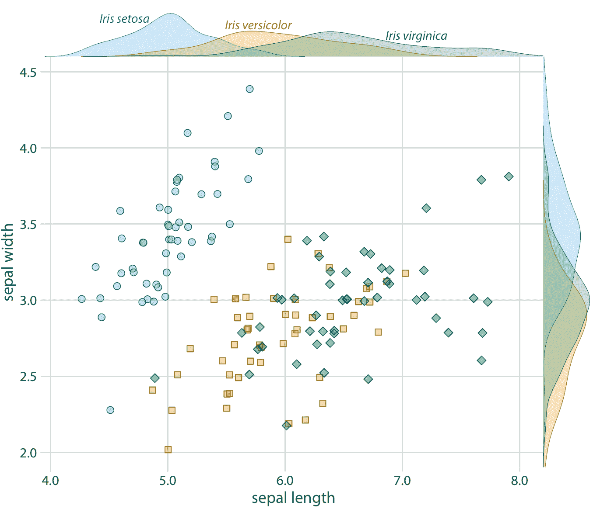

图 20.11：三个不同鸢尾花物种的萼片宽度与萼片长度的关系，带有每个物种的每个变量的边缘密度估计。

最后，每当我们在多个美学中编码单个变量时，我们通常不需要多个单独的图例来表示不同的美学。相反，应该只有一个类似图例的视觉元素，一次传达所有映射。在我们将相同变量映射到沿主轴的位置和颜色的情况下，这意味着参考颜色条应该沿着并且被集成到同一轴中。图 20.12 显示的情况是，我们将温度映射到沿 *x* 轴的位置和颜色，我们因此将颜色图例整合到 *x* 轴中。

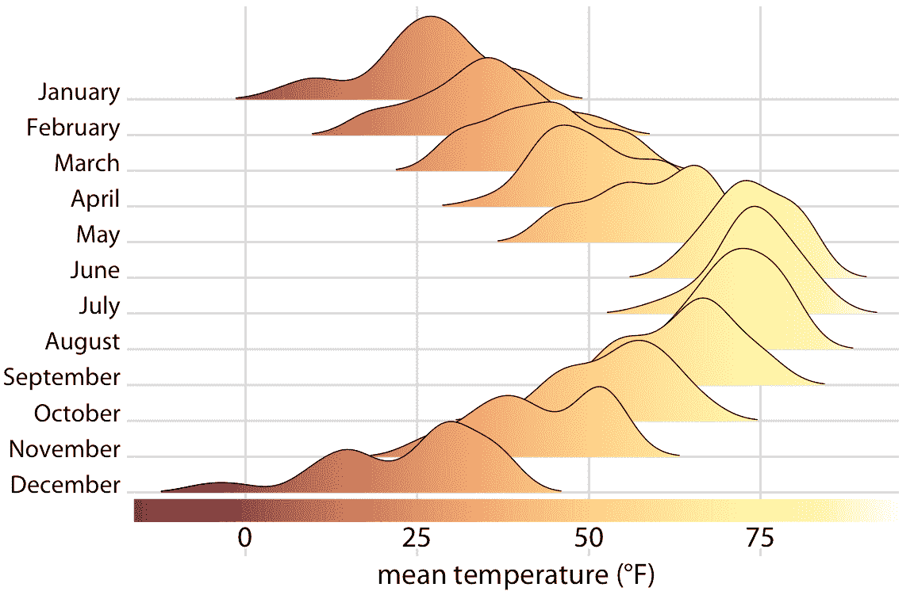

图 20.12：2016 年内布拉斯加州林肯市的气温。该图是图 9.9 的变体。现在通过沿 *x* 轴的位置和颜色显示温度，沿 *x* 轴的颜色条显示将温度转换为颜色的刻度。