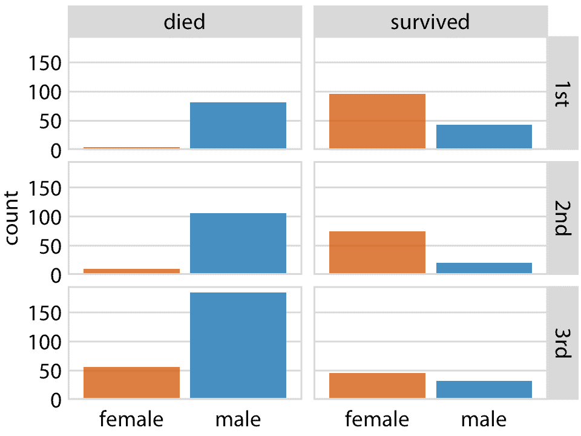
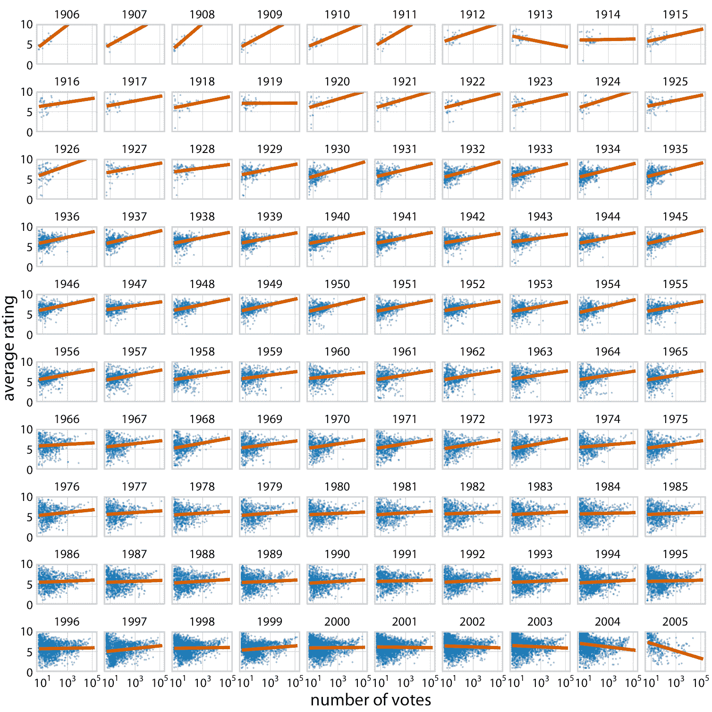
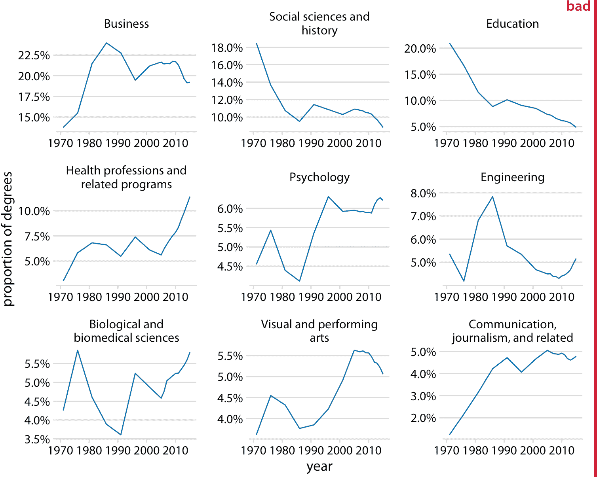
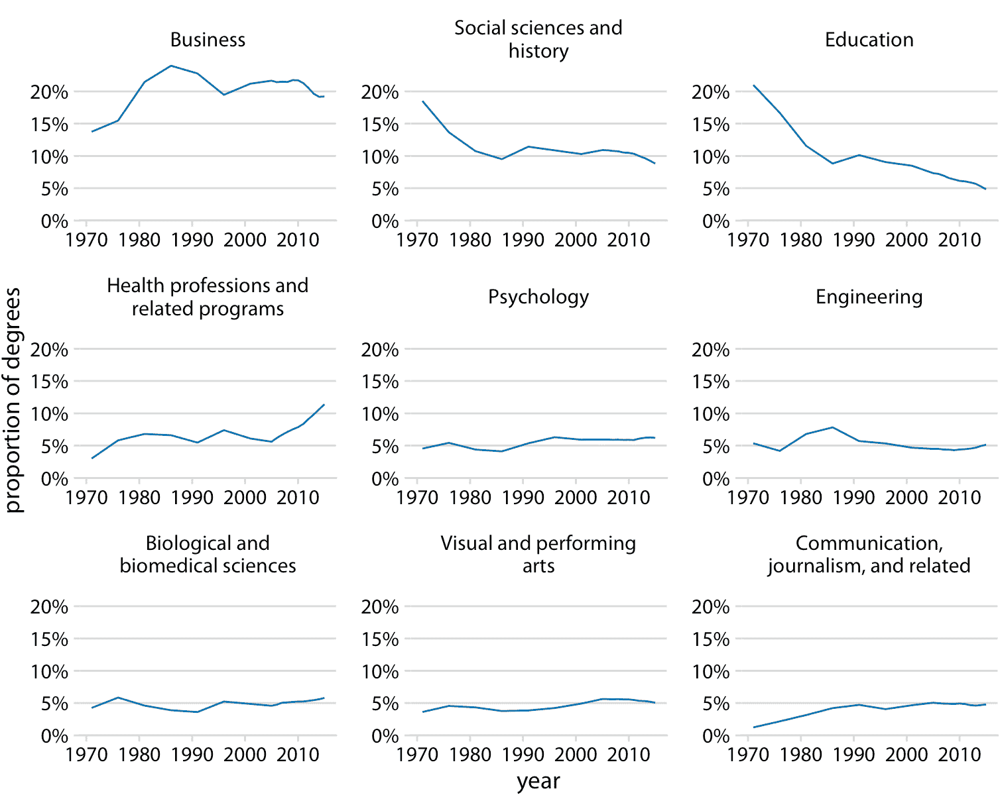
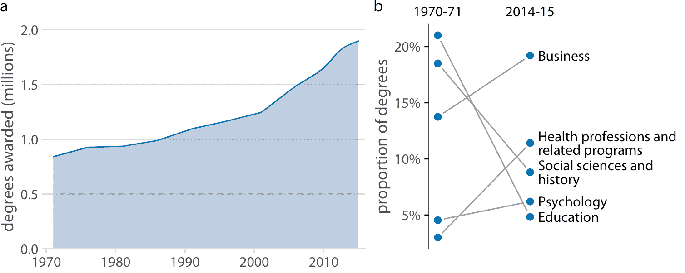
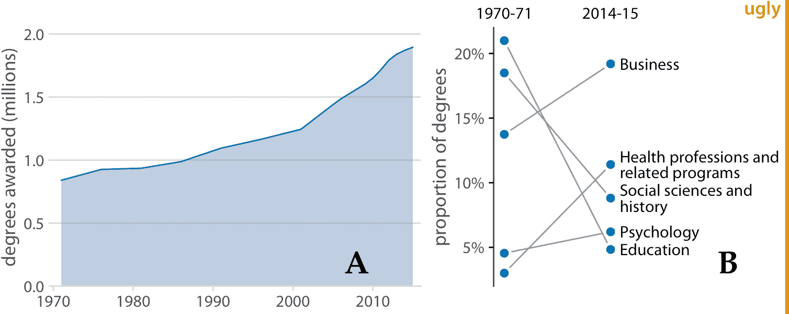
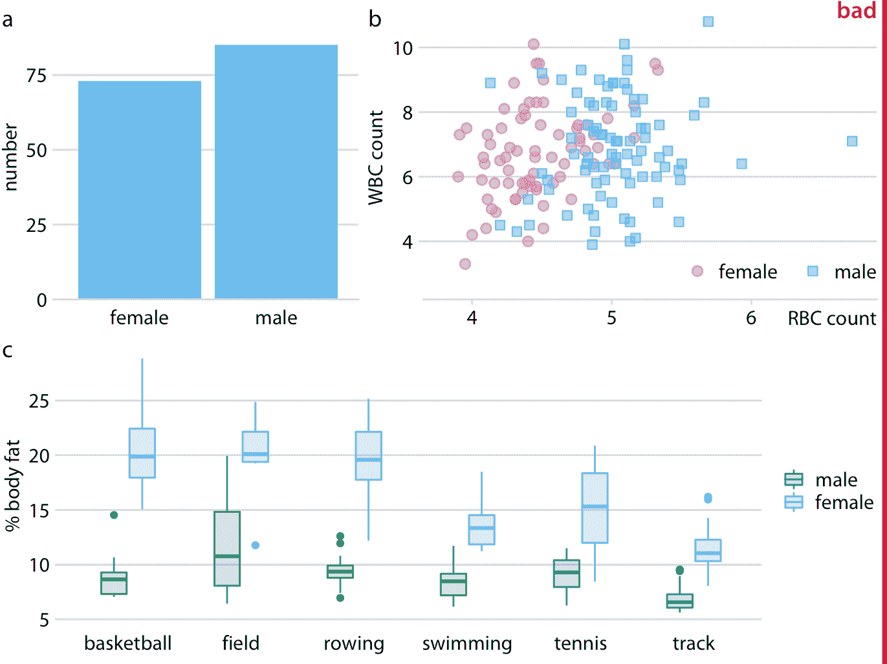
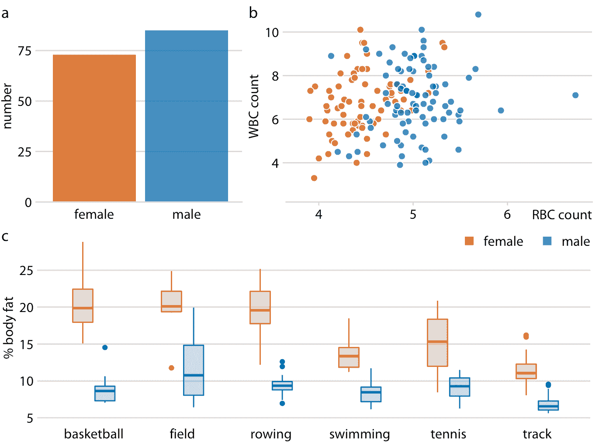
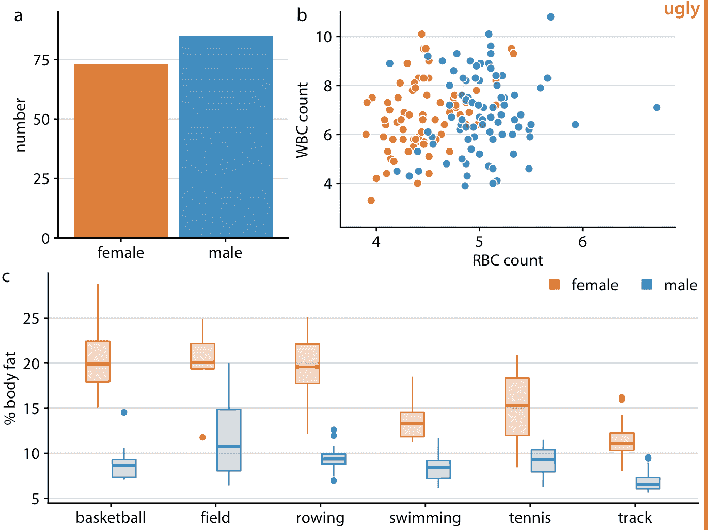

# 21 多面板数字

> 原文： [https://serialmentor.com/dataviz/multi-panel-figures.html](https://serialmentor.com/dataviz/multi-panel-figures.html)

当数据集变得庞大且复杂时，它们通常包含的信息比单个图形面板中合理显示的信息要多得多。要可视化此类数据集，创建多面板图形会很有帮助。这些是由多个图形面板组成的图形，其中每个图形面板显示数据的一些子集。这些数字有两种截然不同的类别：1。小倍数是由以规则网格排列的多个面板组成的图。每个面板显示数据的不同子集，但所有面板使用相同类型的可视化。 2.复合图包括以任意排列（可能是或可能不是基于网格）组装的单独的图形面板，并且显示完全不同的可视化，或甚至可能甚至不同的数据集。

在本书的许多地方，我们遇到过两种类型的多面板图形。通常，这些数字直观且易于理解。但是，在准备这些数字时，我们需要注意一些问题，例如适当的轴缩放，对齐以及单独面板之间的一致性。

## 21.1 小倍数

术语“小倍数”由 Tufte（ [1990](#ref-TufteEnvisioning) ）推广。贝尔实验室（WS Cleveland [1993](#ref-Cleveland1993) ; Becker，Cleveland 和 Shyu [1996] [Cleveland，Becker 及其同事]同时推广了另一个术语“格子图”。 HTG9]）](#ref-Becker-Cleveland-Shyu-1996)。无论术语如何，关键思想是根据一个或多个数据维度将数据切片为部分，分别可视化每个数据切片，然后将各个可视化排列成网格。网格中的列，行或单个面板由定义数据切片的数据维的值标记。最近，这种技术有时也称为“刻面”，以在广泛使用的 ggplot2 绘图库中创建此类绘图的方法命名（例如，`facet_grid()`，参见 Wickham（ [2016](#ref-Wickham2016) ））。

作为第一个例子，我们将这种技术应用于泰坦尼克号乘客的数据集。我们可以根据每位乘客所乘坐的等级以及乘客是否幸存来细分该数据集。在这六个数据片段中的每一个中，都有男性和女性乘客，我们可以使用条形图来显示他们的数字。结果是六个柱状图，我们排列成两列（一个用于死亡的乘客，一个用于幸存者）三行（每个类别一个）（图 21.1 ）。标记列和行，因此可以立即清楚六个图中的哪一个对应于生存状态和类的哪个组合。

图 21.1：按性别，生存和他们旅行的班级（第 1，第 2 或第 3）划分的泰坦尼克号乘客。

这种可视化为泰坦尼克号乘客的命运提供了直观且高度可解释的可视化。我们清楚地看到，大多数男性死亡，大多数女性幸免于难。此外，几乎所有死亡的女性都在三等舱旅行。

小倍数是一次可视化大量数据的强大工具。图 21.1 使用六个独立的面板，但我们可以使用更多。图 21.2 显示了互联网电影数据库（IMDB）上电影的平均排名与电影收到的投票数之间的关系，分别对于 100 年时间内发布的电影。在这里，数据集仅按一个维度，年份进行切片，每年的面板按从左上角到右下角的行排列。该可视化显示平均排名和投票数之间存在总体关系，使得具有更多投票的电影倾向于具有更高的排名。然而，这种趋势的强度随着年份的不同而变化，对于 21 世纪初期发行的电影来说，没有任何关系，甚至是负面关系。

图 21.2：从 1906 年到 2005 年的电影的平均电影排名与投票数。点表示单个电影，线表示每部电影的平均排名与电影收到的投票数的对数的线性回归。在大多数年份中，具有较高票数的电影平均具有较高的平均排名。然而，这种趋势在 20 世纪末已经趋于衰弱，并且在 21 世纪初发布的电影中可以看到负面关系。数据来源：互联网电影数据库（IMDB， [http://imdb.com/](http://imdb.com/) ）

为了使这些大图易于理解，重要的是每个面板使用相同的轴范围和刻度。人类心灵预计会出现这种情况。如果不是，那么读者很可能会错误地解释图中显示的内容。例如，考虑图 21.3 ，其中介绍了不同学位领域的学士学位比例随时间的变化情况。该图显示了 1971 年至 2015 年间平均超过所有度数的 4％的 9 度区域。面板的 *y* 轴被缩放，使得每个度数字段的曲线覆盖整个 *y* - 轴范围。因此，对图 21.3 的粗略检查表明，九度区域都同样受欢迎，并且所有经历的变化都相似。

图 21.3：美国高等教育机构授予的学士学位趋势。显示的是所有学位区域，平均占所有学位的 4％以上。该图标记为“差”，因为所有面板使用不同的 *y* 轴范围。这种选择模糊了不同学位区域的相对大小，并且过度夸大了某些学位领域发生的变化。数据来源：国家教育统计中心

然而，将所有面板放置在相同的 *y* 轴上显示出这种解释具有高度误导性（图 21.4 ）。某些学位领域比其他领域更受欢迎，同样一些领域比其他领域增长或缩小得多。例如，教育程度已经下降很多，而视觉和表演艺术几乎保持不变或者可能略有增加。

图 21.4：美国高等教育机构授予的学士学位趋势。显示的是所有学位区域，平均占所有学位的 4％以上。数据来源：国家教育统计中心

我通常建议不要在小倍数图的单独面板中使用不同的轴刻度。但是，有时，这个问题确实是无法避免的。如果遇到这种情况，那么我认为至少你需要在图标题中引起读者注意这个问题。例如，您可以添加一个句子，例如：“请注意， *y* -axis 缩放在此图的不同面板之间有所不同。”

在小倍数图中考虑单个面板的排序也很重要。如果排序遵循一些逻辑原则，则该图将更容易解释。在图 21.1 中，我排列了从最高级（第 1 级）到最低级（第 3 级）的行。在图 21.2 中，我通过从左上角到右下角增加年份来排列面板。在图 21.4 中，我通过降低平均度受欢迎程度来排列面板，使得最受欢迎的度数位于顶行和/或左侧，最不受欢迎度数位于底行和/或在右边。

始终按照有意义的逻辑顺序将面板排列在一个小的多个图中。

## 21.2 化合物数字

并非每个具有多个面板的图形都符合小倍数的模式。有时我们只是想将几个独立的面板组合成一个组合图，传达一个总体点。在这种情况下，我们可以采用不同的情节并按行，列或其他更复杂的方式排列它们，并将整个排列称为一个数字。例如，见图 21.5 ，它继续分析美国高等教育机构收集的学士学位的趋势。图 21.5 的图（a）显示了从 1971 年到 2015 年授予的学位总数的增长，在此期间，授予的学位数大约翻了一番。 （b）小组显示了五个最受欢迎学位区域在同一时期内获得的学位百分比的变化。我们可以看到社会科学，历史和教育从 1971 年到 2015 年经历了大幅下降，而商业和卫生专业则出现了大幅增长。

请注意，在我的小倍数示例中，复合图形的各个面板按字母顺序标记。通常使用拉丁字母表中的大写或小写字母。需要标签来唯一地指定特定面板。例如，当我想谈谈图 21.5 的部分显示所授予的学位百分比的变化时，我可以参考该图的图（b）或简单地参考图 21.5 ] b。如果没有标签，我将不得不尴尬地谈论图 21.5 的“右侧面板”或“左侧面板”，并且对于更复杂的面板布置而言，提及特定面板会更加尴尬。不需要标记，通常不会对小倍数进行标记，因为每个面板都由作为图形标签提供的刻面变量唯一指定。

图 21.5：美国高等教育机构授予的学士学位的趋势。 （a）从 1970 年到 2015 年，学位总数几乎翻了一番。 （b）在最受欢迎的学位领域中，社会科学，历史和教育经历了重大衰退，而商业和卫生专业则有所增长。数据来源：国家教育统计中心

标记复合图形的不同面板时，请注意标签如何适合整体图形设计。我经常看到这样的图形，标签看起来就像是由另一个人在事实上拍了拍。看到标签制作得过于庞大和突出，放置在一个尴尬的位置，或者以与图中其他部分不同的字体排版，这种情况并不少见。 （参见图 21.6 的例子。）当你看一个复合图时，标签不应该是你看到的第一件事。事实上，他们根本不需要脱颖而出。我们通常知道哪个图形面板具有哪个标签，因为约定是从左上角开始，带有“a”，标签从左到右，从上到下连续。我认为这些标签等同于页码。您通常不会阅读页码，并且毫无疑问哪个页面具有哪个号码，但有时使用页码来引用书籍或文章中的特定位置会很有帮助。

图 21.6：标记差的图 21.5 的变异。标签太大而且很厚，它们的字体不对，而且它们放在一个尴尬的位置。此外，虽然用大写字母标记很好并且实际上很常见，但标签需要在文档中的所有数字中保持一致。在本书中，惯例是多面板数字使用较小的小写标签，因此这个数字与本书中的其他数字不一致。

我们还需要注意复合图形的各个面板如何组合在一起。可以制作一组图形面板，它们各自都很好，但是不能共同工作。特别是，我们需要采用一致的视觉语言。 “视觉语言”是指我们用来显示数据的颜色，符号，字体等。简而言之，保持语言的一致性意味着相同的事物在数字上看起来相同或至少基本相似。

让我们看一个违反这一原则的例子。图 21.7 是一个三面板图，可视化关于男性和女性运动员的生理和身体成分的数据集。小组（a）显示数据集中的男性和女性数量，小组（b）显示男性和女性的红细胞和白细胞计数，小组（c）显示男性和女性的体脂百分比，细分通过运动。每个面板都是可接受的数字。但是，三个面板组合起来不起作用，因为它们不共享共同的视觉语言。首先，小组（a）对男性和女性运动员使用相同的蓝色，小组（b）仅用于男性运动员，小组（c）用于女运动员。此外，面板（b）和（c）引入了额外的颜色，但这两种面板之间的颜色不同。最好是为男性和女性运动员使用相同的两种颜色，并将相同的着色方案应用于面板（a）。其次，在图（a）和（b）中，女性在左侧，男性在右侧，但在图（c）中，顺序是相反的。应切换面板（c）中的箱图顺序，使其与面板（a）和（b）相匹配。

图 21.7：男性和女性运动员的生理和身体成分。 （a）数据集包括 73 名女性和 85 名男性职业运动员。 （b）男性运动员往往有较高的红细胞（红细胞，以每公升 \（10 ^ {12} \] 为单位报告）计数比女运动员，但白人没有这种差异血细胞计数（WBC，以 \（10 ^ {9} \] /升为单位报告）。 （c）男运动员的体脂百分比往往低于在同一运动中表演的女运动员。数据来源：特尔福德和坎宁安（ [1991](#ref-Telford-Cunningham-1991) ）

图 21.8 解决了所有这些问题。在这个图中，女运动员一直以橙色显示，并且在男性运动员的左侧显示为蓝色。请注意，阅读此图比图 21.7 更容易。当我们使用一致的视觉语言时，确定不同面板中哪些视觉元素代表女性和哪些男性并不需要花费太多精力。另一方面，图 21.7 可能非常令人困惑。特别是，乍一看，它可能会产生一种印象，即男性的体脂百分比往往高于女性。另请注意，我们只需要图 21.8 中的单个图例，但需要图 21.7 中的两个。由于视觉语言是一致的，因此相同的图例适用于面板（b）和（c）。

图 21.8：男性和女性运动员的生理和身体组成。该图显示的数据与图 21.7 完全相同，但现在使用的是一致的可视语言。女性运动员的数据总是显示在男性运动员的相应数据的左侧，并且性别在图的所有元素中始终采用颜色编码。数据来源：特尔福德和坎宁安（ [1991](#ref-Telford-Cunningham-1991) ）

最后，我们需要注意复合图中各个图形面板的对齐。各个面板的轴和其他图形元素应全部彼此对齐。使对齐正确可能非常棘手，特别是如果单独的面板可能由不同的人和/或在不同的程序中单独准备，然后在图像处理程序中粘贴在一起。为了引起你对这种对齐问题的注意，图 21.9 显示了图 21.8 的变体，现在所有的图形元素都略微不对齐。我已经在图 21.9 的所有面板上添加了轴线，以强调这些对齐问题。请注意，没有轴线与图中任何其他面板的任何其他轴线对齐。

图 21.9：图 21.8 的变化，其中所有图形面板略微未对准。不对称是丑陋的，应该避免。

### 参考

Tufte，E.R。1990\. _ 构想信息 _。康涅狄格州柴郡：图形出版社。

Cleveland，W。1993.“Visualizing Data。”Summit，New Jersey：Hobart Press。

Becker，R。A.，W。S. Cleveland 和 M.-J.徐中雄。 “格子显示器的视觉设计和控制。”_ 计算和图形统计学杂志 _ 5：123-55。

Wickham，H。2016\. _ggplot2：优雅的数据分析图形 _。第 2 版​​。纽约：施普林格。

特尔福德，R。D.和 R. B. Cunningham。 1991 年。“高度训练的运动员的血液学的性别，体育和身体尺寸依赖性。”_ 运动和运动中的医学和科学 _ 23：788-94。