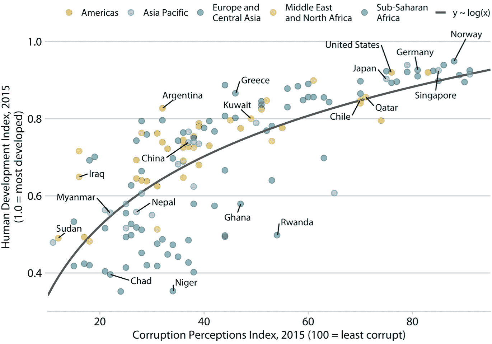
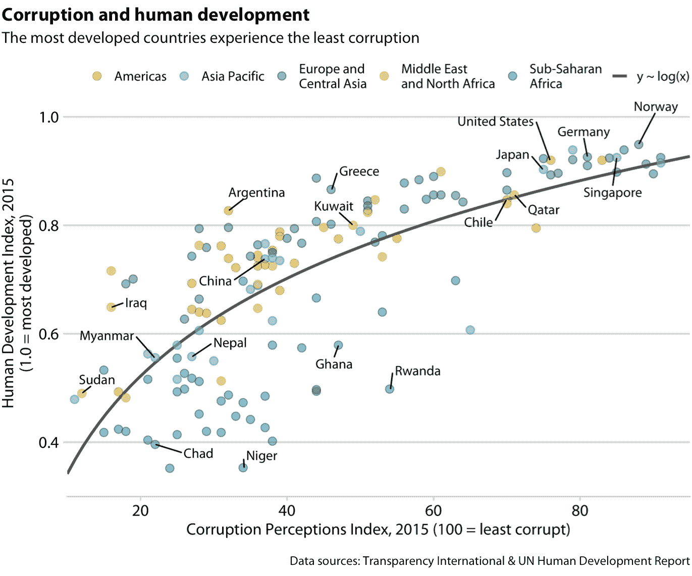
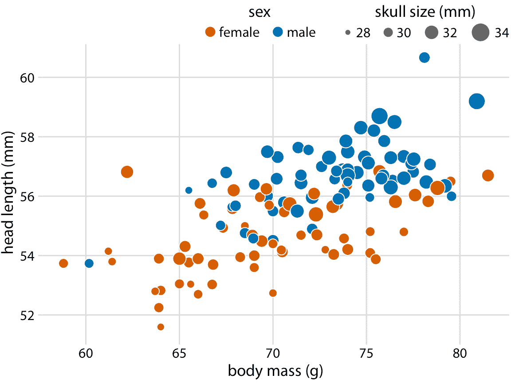
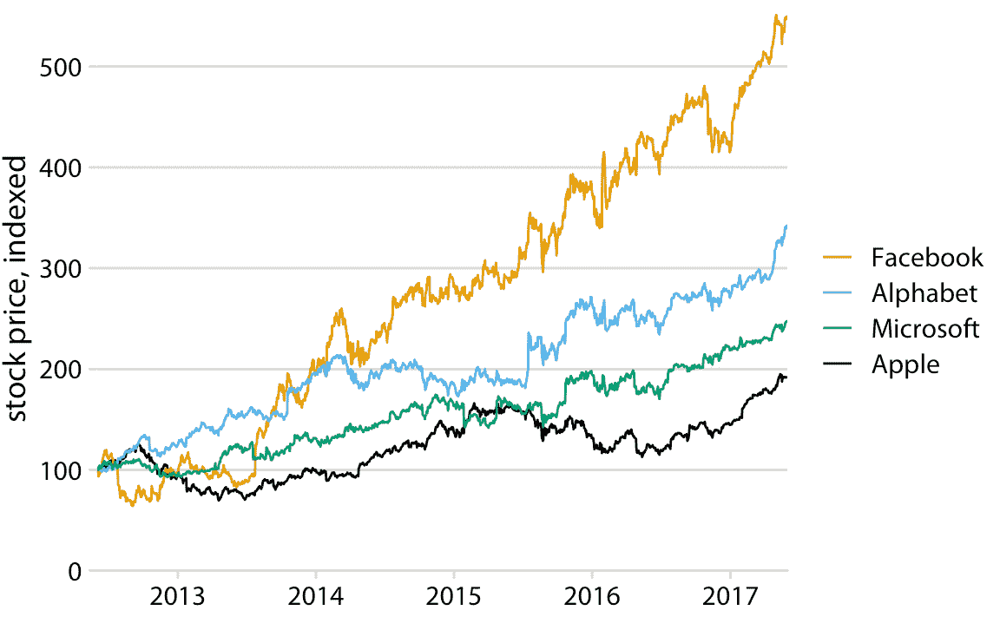
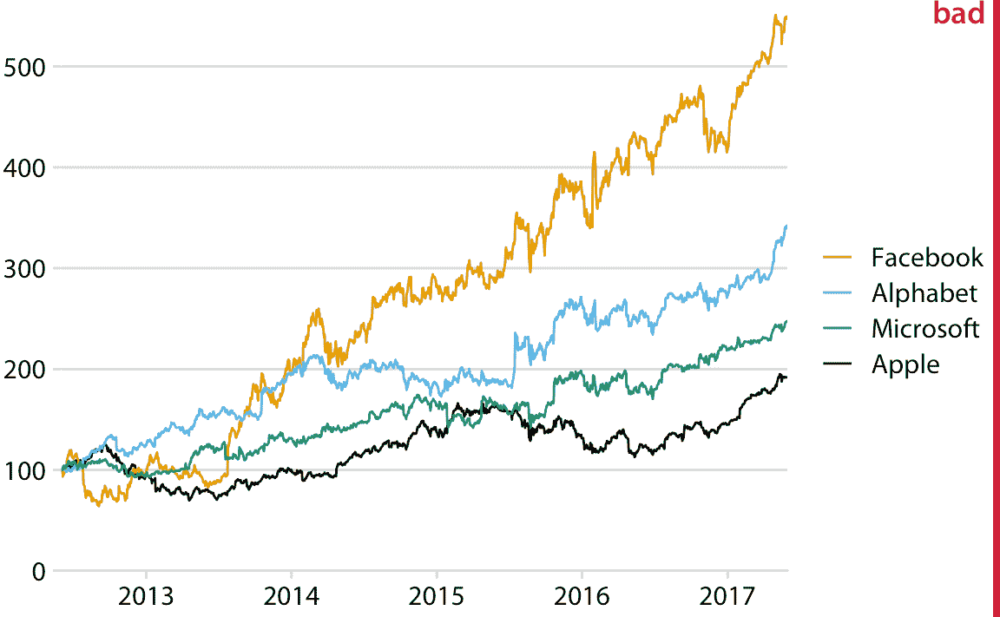
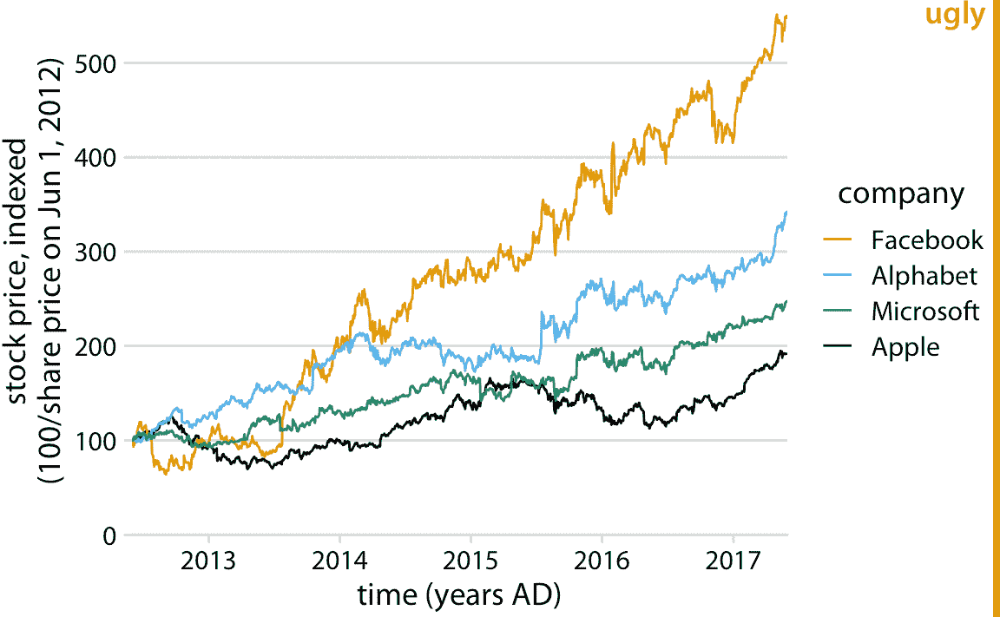
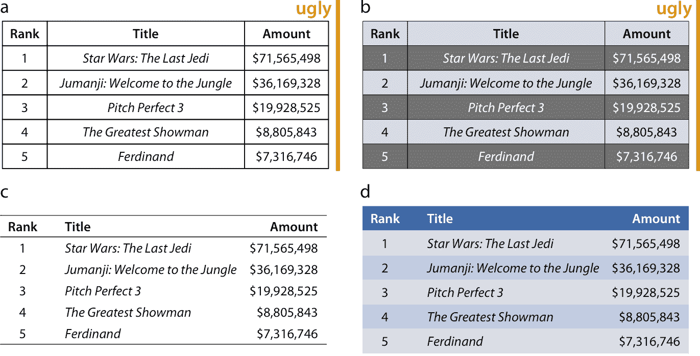

# 22 标题，标题和表格

> 原文： [https://serialmentor.com/dataviz/figure-titles-captions.html](https://serialmentor.com/dataviz/figure-titles-captions.html)

数据可视化不是一件仅仅因其美学上令人愉悦的特征而被关注的艺术品。相反，它的目的是传达信息并提出一个观点。为了在准备可视化时可靠地实现此目标，我们必须将数据放入上下文并提供附带的标题，标题和其他注释。在本章中，我将讨论如何正确标题和标注数字。我还将讨论如何以表格形式呈现数据。

## 22.1 图标题和标题

每个图的一个关键组成部分是图标题。每个人都需要标题。标题的工作是准确地向读者传达这个数字是关于什么，它是什么点。但是，图标题可能不一定出现在您期望看到它的位置。考虑图 [22.1](figure-titles-captions.html#fig:corruption-development) 。它的标题是“腐败和人类发展：最发达的国家经历了最少的腐败。”然而，这个标题并未在图上方显示。相反，标题作为字幕块的第一部分提供，位于图形显示下方。这是我在本书中使用的风格。我一直显示没有综合标题和单独标题的数字。 （一个例外是 [5](directory-of-visualizations.html#directory-of-visualizations) 章节中的程式化情节示例，它们有标题而没有字幕。）

图 22.1：腐败和人类发展：最发达国家的腐败程度最低。这个数字的灵感来自经济学人在线（ [2011](#ref-Economist-corruption) ）。数据来源：Transparency International＆amp;联合国人类发展报告

或者，我可以将图标题以及标题的其他元素（例如数据源语句）合并到主显示中（图 [22.2](figure-titles-captions.html#fig:corruption-development-infographic) ）。在直接比较中，您可能会发现图 [22.2](figure-titles-captions.html#fig:corruption-development-infographic) 比图 [22.1](figure-titles-captions.html#fig:corruption-development) 更具吸引力，您可能想知道为什么我在本书中选择后者的风格。我这样做是因为这两种风格具有不同的应用领域，具有集成标题的数字不适合传统的书籍布局。基本原则是一个数字只能有一个标题。标题被集成到实际的图形显示中，或者作为图形下方标题的第一个元素提供。并且，如果出版物的布局使得每个图形在显示项目下面都有一个常规字幕块，则标题 _ 必须在该文本块中提供 _。出于这个原因，在传统书籍或文章出版的背景下，我们通常不会将标题整合到数字中。具有集成标题，副标题和数据源语句的数字是合适的，但是，如果它们旨在用作独立信息图表或者在社交媒体或网页上发布而不附带标题文本。

图 22.2：图 [22.1](figure-titles-captions.html#fig:corruption-development) 的信息图版本。标题，副标题和数据源语句已合并到图中。这个数字可以原样张贴在网上，也可以在没有单独的标题栏的情况下使用。

如果您的文档布局在每个图形下方使用标题块，则将图形标题作为每个标题块的第一个元素放置，而不是在图形的顶部。

我在图标题中看到的最常见的错误之一是遗漏了一个正确的数字标题作为标题的第一个元素。回顾图 [22.1](figure-titles-captions.html#fig:corruption-development) 的标题。它以“腐败和人类发展”开头。_ 并没有 _ 开头“这个图显示了腐败与人类发展的关系。”标题的第一部分始终是标题，而不是对该图的内容。标题不一定是完整的句子，尽管做出明确断言的短句可以作为标题。例如，对于图 [22.1](figure-titles-captions.html#fig:corruption-development) ，诸如“最发达国家是最不腐败的”这样的标题就可以正常工作。

## 22.2 轴和传奇头衔

就像每个情节都需要一个标题，轴和传说也需要标题。 （轴标题通常通俗地称为 _ 轴标签 _。）轴和图例标题和标签说明了显示的数据值以及它们如何映射到绘图美学。

为了展示所有轴和图例都经过适当标注和标题的图表示例，我在第 [12](visualizing-associations.html#visualizing-associations) 章节中详细讨论了蓝色的 jay 数据集，并将其显示为气泡图（图 [22.3](figure-titles-captions.html#fig:blue-jays-scatter-bubbles2) ）。在该图中，轴标题清楚地表明 _x_ 轴显示以克为单位的体重， _y_ 轴显示以毫米为单位的头部长度。同样，图例标题显示点着色表示鸟类的性别，点大小表示鸟类的头骨大小，以毫米为单位。我强调，对于所有数值变量（体重，头长和头骨大小），相关标题不仅说明所显示的变量，还说明变量的测量单位。这是一种很好的做法，应该尽可能地完成。分类变量（例如性别）不需要单位。

图 22.3：123 只蓝鸟的头长与体重的关系。鸟的性别用颜色表示，鸟的头骨大小用符号大小表示。头部长度测量包括账单的长度，而头骨尺寸测量则不包括。数据来源：欧柏林学院的 Keith Tarvin

但是，有些情况下，可以省略轴或图例标题，即标签本身完全解释时。例如，显示标记为“女性”和“男性”的两个不同颜色的点的图例清楚地表明颜色编码性别。标题“性别”不需要澄清这一事实，事实上在本书中我经常省略表示性别或性别的传说的图例标题（参见例如图 [6.10](visualizing-amounts.html#fig:titanic-passengers-by-class-sex) ， [12.2](visualizing-associations.html#fig:blue-jays-scatter-sex) ，或 [21.1](multi-panel-figures.html#fig:titanic-passenger-breakdown) ）。同样，国名通常不需要标题表明它们是什么（图 [6.11](visualizing-amounts.html#fig:Americas-life-expect) ），电影标题（图 [6.1](visualizing-amounts.html#fig:boxoffice-vertical) ）或年份（图 [22.4](figure-titles-captions.html#fig:tech-stocks-minimal-labeling) ）也不需要）。

图 22.4：四家主要科技公司的股价随时间变化。 2012 年 6 月，每家公司的股票价格已经标准化为 100。这个数字是 [20](redundant-coding.html#redundant-coding) 章节 [20.6](redundant-coding.html#fig:tech-stocks-good-legend) 的略微修改版本。这里，表示时间的 _x_ 轴没有标题。从上下文可以清楚地看出，2013 年，2014 年等数字是指年份。

但是，在省略轴或图例标题时我们必须要小心，因为很容易误判上下文中的内容和不明显的内容。我经常看到大众媒体中的图表将省略轴标题推到一个让我感到不舒服的地方。例如，一些出版物可能会产生一个数字，例如图 [22.5](figure-titles-captions.html#fig:tech-stocks-minimal-labeling-bad) ，假设轴的含义从图表标题和副标题中清楚（这里：“四个主要科技公司的股票价格随着时间的推移”和“2012 年 6 月，每家公司的股票价格已经标准化为 100”。我不同意上下文明确定义轴的观点。因为标题通常不包括诸如“ _x_ / _y_ 轴显示”之类的单词，所以总是需要一定量的猜测来解释该图。根据我自己的经验，没有正确标记轴的数字往往会让我感到不安 - 即使我 95％确定我明白所展示的内容，我也不会 100％肯定。作为一般原则，我认为让读者猜出你的意思是一种不好的做法。你为什么要在读者中产生一种不确定感？

图 22.5：四家主要科技公司的股价随时间变化。 2012 年 6 月，每家公司的股票价格已经标准化为 100.图 [22.4](figure-titles-captions.html#fig:tech-stocks-minimal-labeling) 的这个变体被标记为“坏”，因为 _y_ 轴现在没有标题或者， _y_ 轴上显示的值表示从上下文中不是立即显而易见的。

另一方面，我们可以过度标注。如果图例列出了四家知名公司的名称，则图例标题“公司”是多余的，并没有添加任何有用的东西（图 [22.6](figure-titles-captions.html#fig:tech-stocks-labeling-ugly) ）。同样地，即使我们通常应该报告所有定量变量的单位，如果 _x_ 轴显示近几年将其标题为“时间（AD 年）”是尴尬的（图 [22.6](figure-titles-captions.html#fig:tech-stocks-labeling-ugly) ）。

图 22.6：四家主要科技公司的股价随时间变化。 2012 年 6 月，每家公司的股票价格已经标准化为 100.图 [22.4](figure-titles-captions.html#fig:tech-stocks-minimal-labeling) 的这个变体被标记为“丑陋”，因为它被过度标记。特别地，为 _x_ 轴上的值提供单位（“年 AD”）是不方便的。

最后，在某些情况下，不仅可以省略轴标题而且可以省略整个轴。饼图通常没有明确的轴（例如，图 [10.1](visualizing-proportions.html#fig:bundestag-pie) ），树图也没有（图 [11.4](nested-proportions.html#fig:bridges-treemap) ）。如果图的含义清楚，则可以显示没有一个或两个轴的马赛克图或条形图（图 [11.3](nested-proportions.html#fig:bridges-mosaic) 和 [6.10](visualizing-amounts.html#fig:titanic-passengers-by-class-sex) ）。省略带有轴刻度和刻度标签的显式轴向读者发出信号，表明图的定性特征比特定数据值更重要。

## 22.3 表

表是可视化数据的重要工具。然而，由于它们显而易见的简单性，它们可能并不总能得到所需的关注。我在本书中展示了一些表，例如表 [6.1](visualizing-amounts.html#tab:boxoffice-gross) ， [7.1](histograms-density-plots.html#tab:titanic-ages) 和 [19.1](color-pitfalls.html#tab:color-codes) 。花点时间找到这些表格，查看它们的格式，并将它们与您或同事最近制作的表格进行比较。很有可能，存在重要的差异。根据我的经验，如果没有适当的表格格式培训，很少有人会本能地做出正确的格式选择。在自行发布的文档中，格式较差的表格比设计不佳的数据更为普遍。此外，通常用于创建表的大多数软件都提供了不推荐的默认值。例如，我的 Microsoft Word 版本提供了 105 种预定义的表格样式，其中至少 70-80 违反了我将在这里讨论的一些表格规则。因此，如果您随机选择 Microsoft Word 表格布局，则有 80％的机会选择一个有问题的表格。如果你选择默认值，那么每次都会得到一张格式不佳的表格。

表格布局的一些关键规则如下：

1.  不要使用垂直线。
2.  不要在数据行之间使用水平线。 （水平线作为标题行和第一个数据行之间的分隔符，或者作为整个表的框架都可以。）
3.  文本列应保持对齐。
4.  数字列应右对齐，并且应始终使用相同数量的十进制数字。
5.  包含单个字符的列居中。
6.  标题字段与其数据对齐，即，文本列的标题将左对齐，数字列的标题将右对齐。

图 [22.7](figure-titles-captions.html#fig:table-examples) 以四种不同的方式从章 [6](visualizing-amounts.html#visualizing-amounts) 中复制表 [6.1](visualizing-amounts.html#tab:boxoffice-gross) ，其中两个（a，b）违反了其中一些规则，其中两个（c） ，d）不要。

图 22.7：使用第 [6](visualizing-amounts.html#visualizing-amounts) 章节 [6.1](visualizing-amounts.html#tab:boxoffice-gross) 中的数据，表格格式不合适的示例。 （a）该表违反了许多正确的表格格式惯例，包括使用垂直线，使用数据行之间的水平线和使用居中数据列。 （b）该表遇到表（a）的所有问题，此外，它通过在非常暗和非常轻的行之间交替产生额外的视觉噪声。此外，表头在视觉上与表体强烈分离。 （c）这是一个格式适当的表格，设计极少。 （d）颜色可以有效地用于将数据分组成行，但颜色差异应该是微妙的。可以使用更强的颜色来设置表头。数据来源：Box Office Mojo（ [http://www.boxofficemojo.com/](http://www.boxofficemojo.com/) ）。经许可使用

当作者在数据行之间绘制具有水平线的表时，目的通常是帮助眼睛跟随各个线。但是，除非桌子非常宽且稀疏，否则通常不需要这种视觉辅助。我们也不会在一段常规文本中的行之间绘制水平线。水平（或垂直）线的成本是视觉混乱。比较图 [22.7](figure-titles-captions.html#fig:table-examples) 的（a）和（c）部分。 （c）部分比（a）部分更容易阅读。如果我们觉得需要一个分隔表行的视觉辅助，那么行的较浅和较暗的阴影往往会很好地工作而不会产生太多的混乱（图 [22.7](figure-titles-captions.html#fig:table-examples) d）。

最后，标题相对于显示项目所在的图形和表格之间存在关键区别。对于数字，习惯上将标题放在下面，而对于表格，通常将标题放在上面。此标题放置由读者处理图形和表格的方式指导。对于数字，读者倾向于首先查看图形显示，然后阅读上下文的标题，因此标题在图下方有意义。相比之下，表格往往像文本一样从上到下进行处理，在阅读标题之前读取表格内容通常没有用处。因此，字幕位于表格上方。

### 参考

经济学人在线。 “腐蚀性腐败。” [https://www.economist.com/graphic-detail/2011/12/02/corrosive-corruption](https://www.economist.com/graphic-detail/2011/12/02/corrosive-corruption) 。