# 23 平衡数据和上下文

> 原文： [23 Balance the data and the context](https://serialmentor.com/dataviz/balance-data-context.html)

> 校验：[飞龙](https://github.com/wizardforcel)

> 自豪地采用[谷歌翻译](https://translate.google.cn/)

我们可以将任何可视化中的图形元素，大致细分为表示数据的元素和不表示数据的元素。前者是诸如散点图中的点，直方图或条形图中的条形，或热图中的阴影区域等元素。后者是诸如绘图的轴，轴刻度和标签，轴标题，图例和绘图注解等元素。这些元素通常为图的数据和/或视觉结构提供上下文。在设计绘图时，考虑用于表示数据和上下文的墨水量（第 17 章）会很有帮助。一个常见的建议是减少非数据墨水量，遵循这些建议往往可以减少混乱，并产生更优雅的可视化。同时，背景和视觉结构是重要的，过度缩减提供它们的绘图元素，可能产生难以阅读，令人混淆或根本不引人注目的图形。

## 23.1 提供适当数量的背景

Edward Tufte 在他的着作“定量信息的视觉显示”（Tufte 2001）中推广了一个想法，即区分数据和非数据墨水可能是有用的。 Tufte 引入了“数据-墨水比”的概念，他将其定义为“用于数据信息的非冗余显示的图形墨水比例。”然后他写道（强调我的）：

> 在合理范围内最大化数据墨水比。

我强调了“在合理范围内”这一短语，因为它很重要并经常被遗忘。事实上，我认为 Tufte 自己在他的书的其余部分中忘记了它，在那里他提倡过于简约的设计，在我看来，这些设计既不优雅也不容易破译。如果我们将“最大化数据墨水比”这一短语，解释为“消除混乱并努力获得干净和优雅的设计”，那么我认为这是合理的建议。但是，如果我们将其解释为“尽你所能去除非数据墨水”那么它将导致糟糕的设计选择。如果我们在任何一个方向走得太远，我们最终会得到丑陋的图形。然而，远离极端情况，有各种各样的设计都是可以接受的，并且可能适用于不同的环境。

为了探索极端情况，让我们考虑一个明显有太多非数据墨水的图形（图 23.1 ）。绘图面板中的彩色点（包含数据点的方框中心区域）是数据墨水。其他一切都是非数据墨水。非数据墨水包括围绕整个图形的方框，围绕绘图面板的方框以及围绕图例的方框。这些方框都不是必需的。我们还看到一个突出且密集的背景网格，将注意力从实际数据点上移开。通过移除方框和次要网格线，并以浅灰色绘制主要网格线，我们得到图 23.2 。在该版本的图中，实际数据点更加清晰，并且它们被认为是该图中最重要的成分。

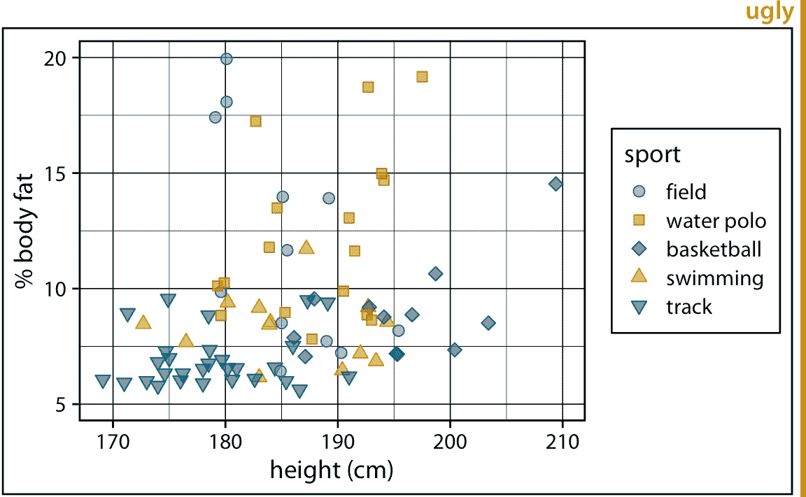

图 23.1：澳大利亚职业男性运动员的体脂百分比与身高的关系。每个点代表一名运动员。这个图形为非数据提供了太多的墨水。整个图形周围，绘图面板周围和图例周围都有不必要的方框。坐标网格非常突出，其存在将注意力从数据点移开。数据来源：Telford and Cunningham（1991）

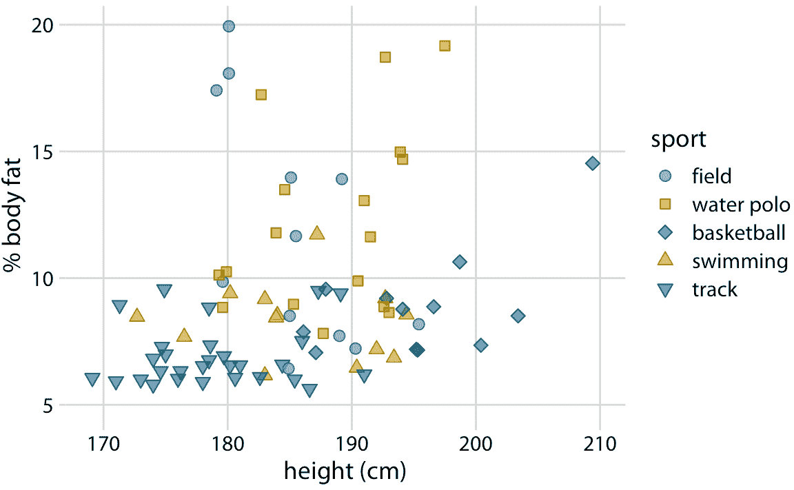

图 23.2：澳大利亚职业男性运动员的体脂百分比与身高的关系。该图是图 23.1 的清理版本。已删除不必要的方框，删除了较小的网格线，并且以浅灰色绘制了主要网格线，来相对于数据点后移。数据来源：Telford and Cunningham（1991）

在另一个极端，我们可能会得到一个图形，如图 23.3 ，这是图 23.2 的极简版。在这个图中，轴刻度标签和标题已经变得如此微小，以至于很难看到。如果我们只是看一下这个图形，我们就不会立即看到实际显示的数据。我们只看到漂浮在空间中的点。此外，图例注解非常微小，以至于图例中的点可能会被误认为是数据点。这种效果被放大，因为在绘图区域和图例之间没有明显的视觉分离。注意图 23.2 中的背景网格如何锚定空间中的点，并从图例区域中突出数据区域。这些效果都已在图 23.3 中丢失。

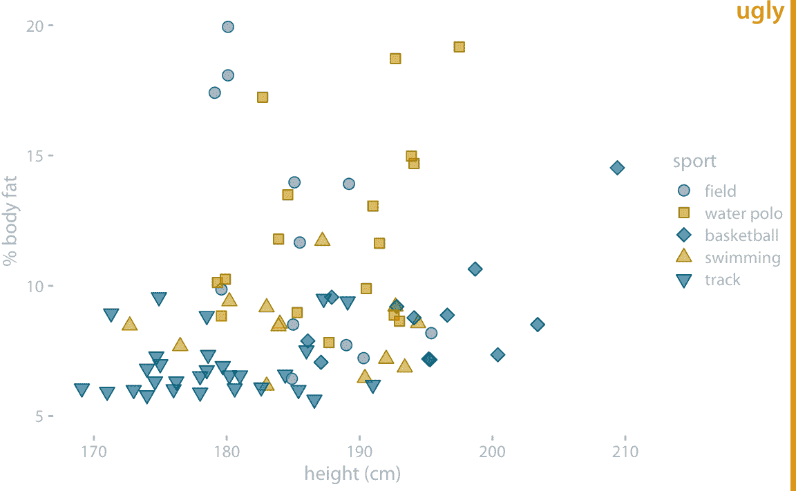

图 23.3：澳大利亚职业男性运动员的体脂百分比与身高的关系。在这个例子中，删除非数据墨水的概念已经走得太远了。轴刻度标签和标题太模糊，几乎看不到。数据点似乎漂浮在空间中。图例中的点相对于数据点不够突出，不经意的观察者可能会认为它们是数据的一部分。数据来源：Telford and Cunningham（1991）

在图 23.2 中，我使用的是开放的背景网格，并且在绘图面板周围没有轴线或方框。我喜欢这种设计，因为它向读者传达，一系列可能的数据值超出轴限制。例如，尽管图 23.2 显示没有高于 210 厘米的运动员，但这样的运动员可能存在。然而，一些作者更倾向于通过在其周围画一个框，来描绘绘图面板的范围（图 23.4 ）。这两种选择都是合理的，而且更可取的主要是个人意见问题。方框版本的一个优点是它清晰地将图例与绘图面板分开。

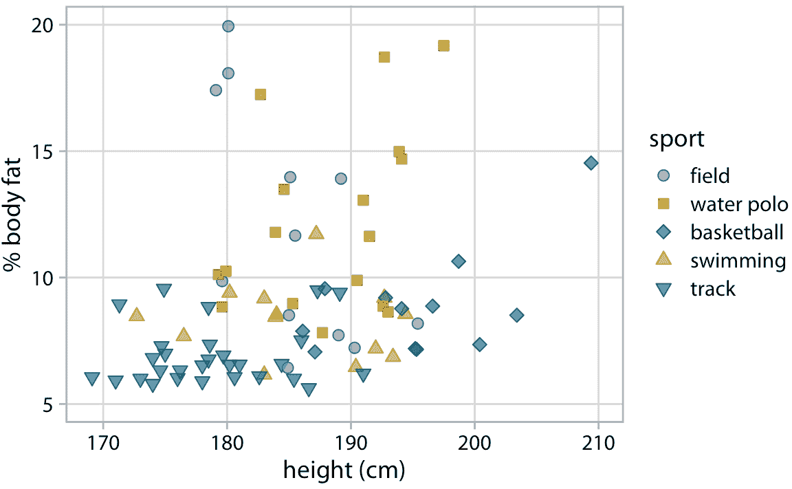

图 23.4：澳大利亚职业男性运动员的体脂百分比与身高的关系。此图在图 23.2 的绘图面板周围添加了一个方框，此方框有助于将图例与数据分开。数据来源：Telford and Cunningham（1991）

具有太少的非数据墨水的图形，通常受到图形元素看起来漂浮在空间中的影响，没有对任何东西的明确的连接或引用。在小型多图中，这个问题往往特别严重。图 23.5 显示了一个比较六个不同条形图的小型多图，但它看起来更像是一个现代艺术而非有用的数据可视化。条形没有锚定到清晰的基线，并且没有清楚地描绘单个绘图面板。我们可以通过在每个面板添加浅灰色背景和细水平网格线来解决这些问题（图 23.6 ）。

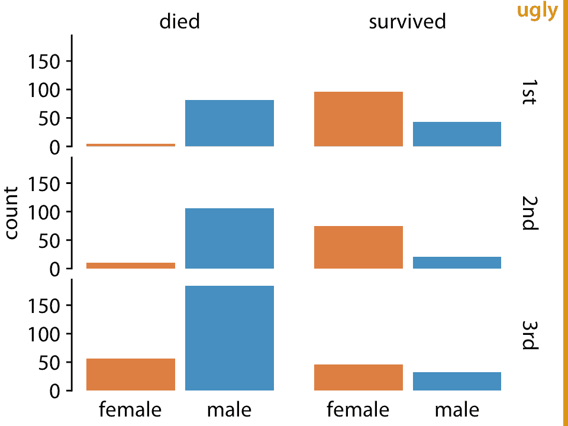

图 23.5：按性别和舱位划分的泰坦尼克号乘客的生存情况。这个小型多图过于简约。各个图案没有方框，因此很难看出图中的哪个部分属于哪个面板。此外，单个条形不锚定到清晰的基线，它们似乎是漂浮的。

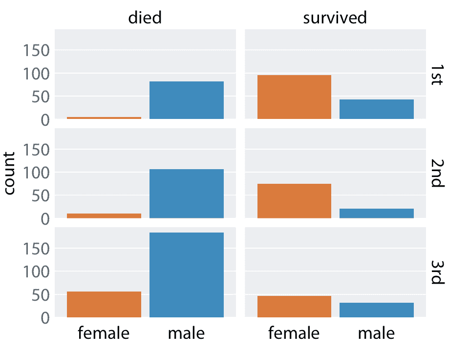

图 23.6：按性别和舱位划分的泰坦尼克号乘客的生存情况。这是图 23.5 的改进版本。每个面板的灰色背景清楚地描绘了构成该绘图的六个分组（在第一，第二或第三等舱中幸存或死亡）。背景中的水平细线在面板之间提供了条形高度的参考，和条形高度的比较设施。

## 23.2 背景网格

绘图背景中的网格线可以帮助读者识别特定数据值，并将绘图的一部分中的值与另一部分中的值进行比较。同时，网格线可能增加视觉噪声，特别是当它们突出或密集间隔时。理性的人可能在是否使用网格上产生分歧，如果是这样，如何格式化它，以及使它的间隔多么密集。在本书中，我使用了各种不同的网格样式，来强调不一定存在最佳选择。

R 软件 ggplot2 推广了一种风格，在灰色背景上使用相当突出的白线背景网格。图 23.7 显示了这种风格的一个例子。该图显示了 2012 至 2017 的五年窗口期间，四家主要科技公司的股价变化。对 ggplot2 作者 Hadley Wickham 感到抱歉，我非常尊重他，我并不觉得白加灰背景网格特别有吸引力。在我看来，灰色背景可能减损实际数据，并且具有主线和次线的网格可能太密集。我也发现图例中的灰色方块令人困惑。

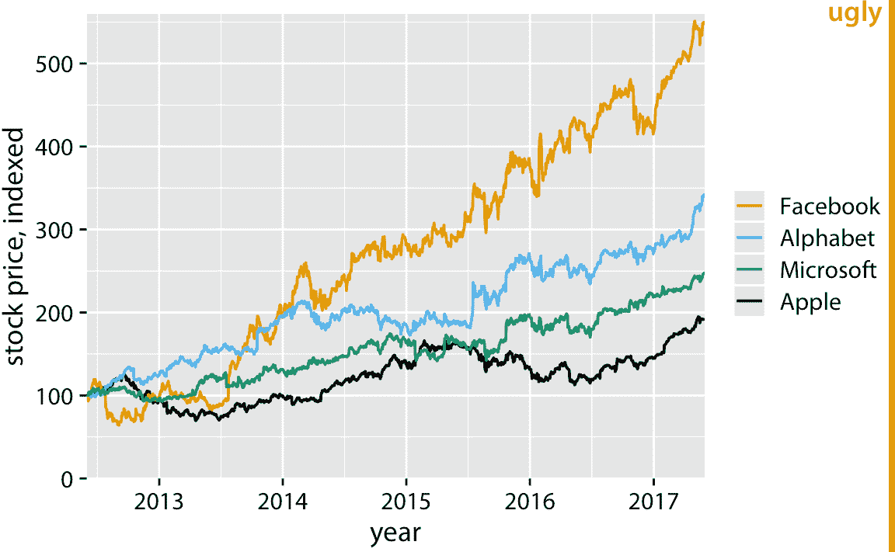

图 23.7：四家主要科技公司的随时间变化的股票价格。 2012 年 6 月，每家公司的股票价格已经标准化为 100。这个图形模仿了 ggplot2 的默认外观，灰色背景上有白色的主要和次要网格线。在这个特定的例子中，我认为网格线压倒了数据线，结果是一个不均衡的图形，并没有充分强调数据。数据来源：雅虎财经

赞成灰色背景的论据包括它（i）帮助将绘图视为单个视觉实体，以及（ii）防止绘图在周围的黑暗文本中显示为白色框（Wickham 2016）。我完全同意第一点，这就是我在图 23.6 中使用灰色背景的原因。对于第二点，我要提醒一下，文本的感知暗度将取决于字体大小，字体和行间距，并且图形的感知暗度将取决于所用墨水的绝对量和颜色，包括所有数据墨水。以密集的 10 号 Times New Roman 排版的科学纸张，看起来比行间距为 1.5，以 14 号 Palatino 排版的咖啡桌书本要深一些。同样，五个黄点的散点图看起来要比 10,000 个黑点的散点图浅得多。如果要使用灰色图形背景，请考虑图形前景的颜色强度，以及图形周围文本的预期布局和排版，并相应地调整背景灰色的选择。否则，可能会发生这样的情况：您的图形最终会在周围较浅的文本中突出显示为深色盒子。此外，请记住，用于绘制数据的颜色需要配合灰色背景。我们倾向于在不同背景下不同地感知颜色，并且灰色背景需要比白色背景需要更暗且更饱和的前景色。

我们可以在相反的方向上一直移动，并移除背景和网格线（图 23.8 ）。在这种情况下，我们需要可见的轴线来绘制图表，并将其保持为单个视觉单元。对于这个特殊的图形，我认为这个选择是一个更糟糕的选择，我把它标记为“不好”。在没有任何背景网格的情况下，曲线似乎在空间中漂浮，并且很难将右侧的最终值匹配左侧的轴标签。

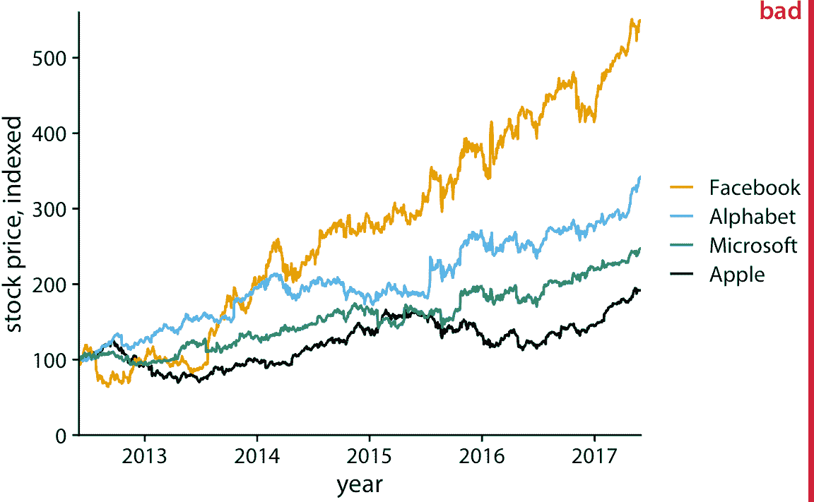

图 23.8：四家主要科技公司的随时间变化的股票价格。在图 23.7 的该变体中，数据线没有充分锚定。这使得难以确定在所覆盖时间间隔的末尾，它们偏离指数值 100 的程度。数据来源：雅虎财经

在最小程度上，我们需要添加一个水平参考线。由于图 23.8 的股票价格在 2012 年 6 月指数为 100，因此在 *y* = 100 处用水平细线标记该值有很大帮助（图 23.9 ）。或者，我们可以使用水平线的最小“网格”。对于我们主要关注 *y* 值变化的图，不需要垂直网格线。而且，仅位于主轴上的网格线通常就足够了。并且，轴线可以省略或制作得非常细，因为水平线清楚地标出了图的范围（图 23.10 ）。

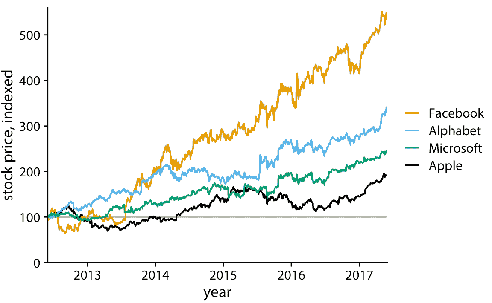

图 23.9：四家主要科技公司的随时间变化的股票价格。向图 23.8 在索引值 100 处添加水平细线，有助于在绘图跨越的整个时间段内提供重要参考。数据来源：雅虎财经

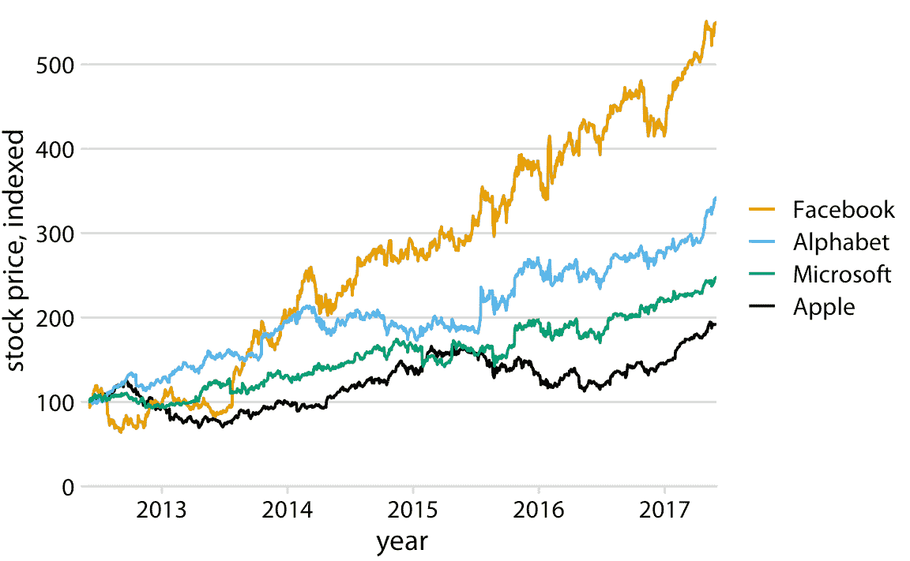

图 23.10：四家主要科技公司的随时间变化的股票价格。在所有主要 *y* 轴刻度处添加水平细线，提供了比图 23.9 的一条水平线更好的参考点集。这种设计还消除了对突出的 *x* 和 *y* 轴线的需求，因为均匀间隔的水平线为绘图面板创建了可视方框。数据来源：雅虎财经

对于这样的最小网格，我们通常将线条垂直于兴趣量变化的方向。因此，如果不是随着时间的推移绘制股票价格，而是绘制五年的增长作为水平条形，那么我们将要使用垂直线代替（图 23.11 ）。

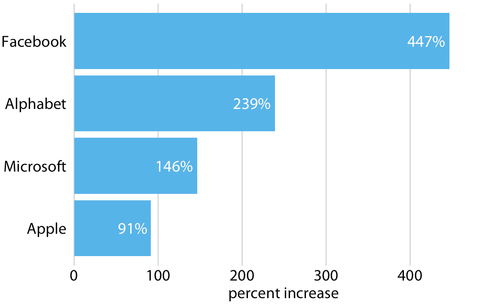

图 23。11：四家主要科技公司 2012 年 6 月至 2017 年 6 月的股价上涨百分比。由于条形水平延伸，因此垂直网格线是合适的。数据来源：雅虎财经

垂直于关键的兴趣变量延伸的网格线往往是最有用的。

对于条形图，如图 23.11 ， Tufte（2001）建议在条形图上方绘制白色网格线，而不是下方绘制黑色网格线（图  23.12 ）。这些白色网格线具有将条形分成相等长度的不同区段的效果。我对这种风格有两个看法。一方面，对人类感知的研究表明，将条形断裂成不连续的区段有助于读者感知条长（Haroz，Kosara 和 Franconeri 2015）。另一方面，在我眼中，条形看起来像是分开，并没有形成清晰的视觉单元。事实上，我在图 6.10 中有目的地使用这种风格，来直观地分隔代表男性和女性乘客的堆叠条形。哪种效应占主导地位可取决于条宽，条形之间的距离和白色网格线的厚度的具体选择。因此，如果您打算使用此样式，我建议您更改这些参数，直到您有一个可以创建所需视觉效果的图形。

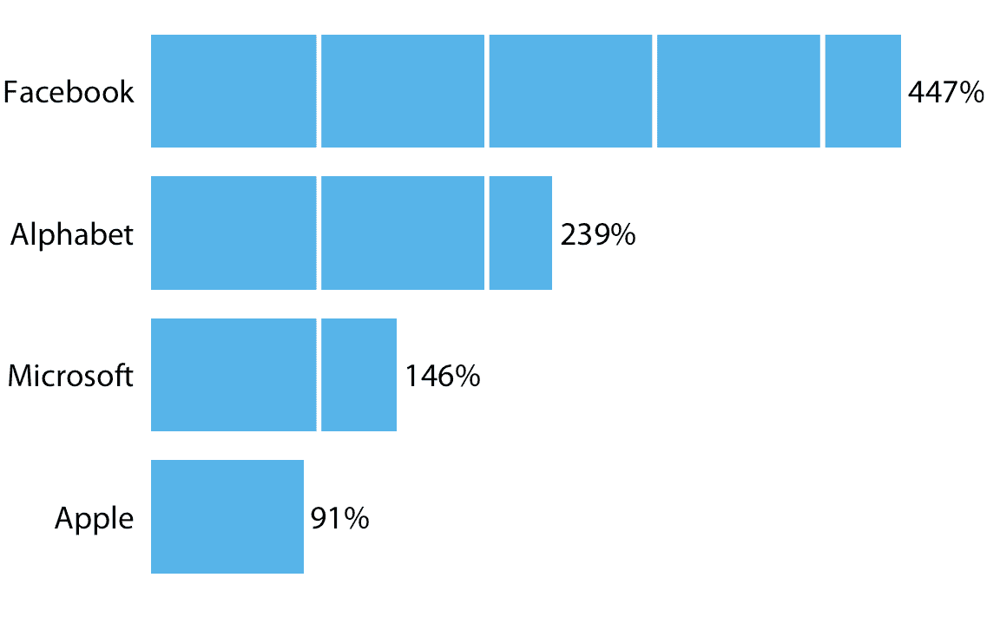

图 23.12：四家主要科技公司 2012 年 6 月至 2017 年 6 月的股价上涨百分比。条形顶部的白色网格线可以帮助读者感知条形的相对长度。与此同时，他们也可以产生条形分裂的感觉。数据来源：雅虎财经

我想指出图 23.12 的另一个缺点。我不得不将百分比值移到条形之外，因为标签不能放在几个条形的最后一段。然而，这种选择不适当地在视觉上拉长了条形，应尽可能避免。

沿着两个轴方向的背景网格，最适合于没有感兴趣的主轴的散点图。图 23.2 在本章开头提供了一个例子。当图形具有完整的背景网格时，通常不需要轴线（图 23.2）。

## 23.3 配对数据

对于相关比较是直线 *x = y* 的图，例如在配对数据的散点图中，我更喜欢绘制对角线而不是网格。例如，考虑图 23.13 ，其将突变病毒中的基因表达水平与非突变（野生型）变体进行比较。通过绘制对角线，我们可以立即看到相对于野生型，突变体中哪些基因表达得更高或更低。当图形具有背景网格而没有对角线时，相同的观察更难以实现（图 23.14 ）。因此，即使图 23.14 看起来令人愉悦，我也将其标记为不好。特别是基因 10A，其突变体的表达水平相对于野生型明显降低（图 23.13），在图 23.14 中看不出来。

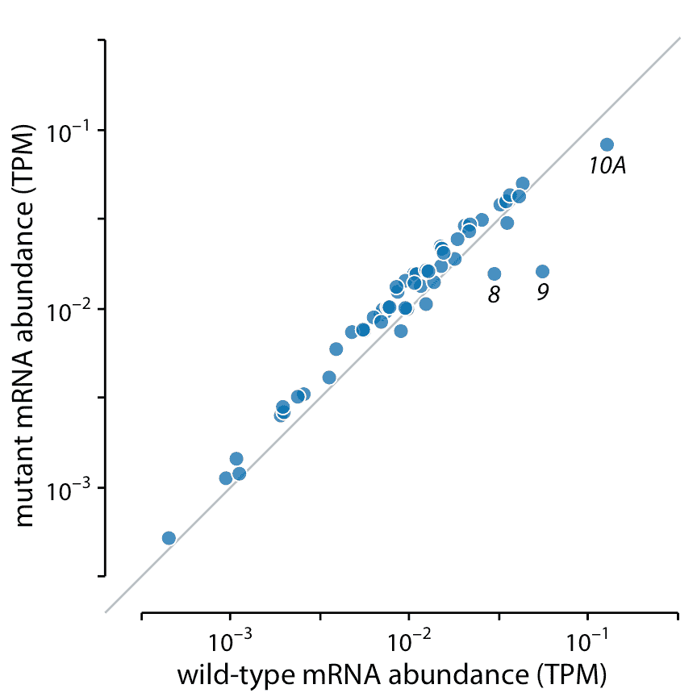

图 23.13：突变噬菌体 T7 相对于野生型的基因表达水平。基因表达水平通过 mRNA 丰度测量，以百万分之一转录物（TPM）表示。每个点对应一个基因。在突变噬菌体 T7 中，基因 *9* 前面的启动子被删除，这导致基因 *9* 以及邻近基因 *8* 和 *10A* 的 mRNA 丰度降低。数据来源： Paff 等（2018）

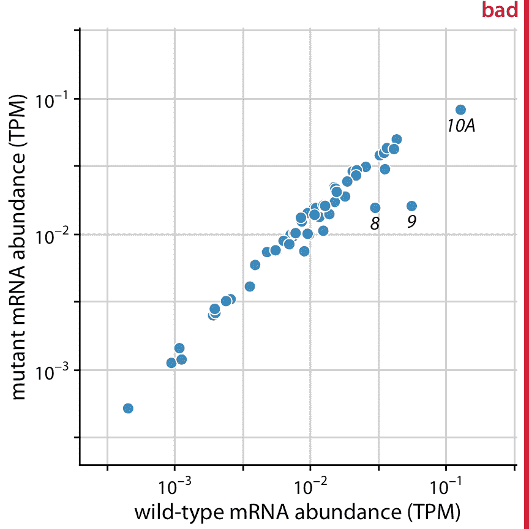

图 23.14：突变噬菌体 T7 相对于野生型的基因表达水平。通过将该数据集绘制在背景网格而不是对角线上，我们模糊了突变体中哪些基因比野生型噬菌体更高或更低。数据来源： Paff 等（2018）

当然我们可以从图 23.13 中取对角线，并将其添加到图 23.14 的背景网格之上，来确保存在相关的视觉参考。然而，由此产生的图形变得非常嘈杂（图 23.15）。我不得不使对角线更暗，以便它在背景网格上突出，但现在数据点似乎几乎淡入背景。我们可以通过使数据点更大或更暗来改善这个问题，但所有人都认为我宁愿选择图 23.13 。

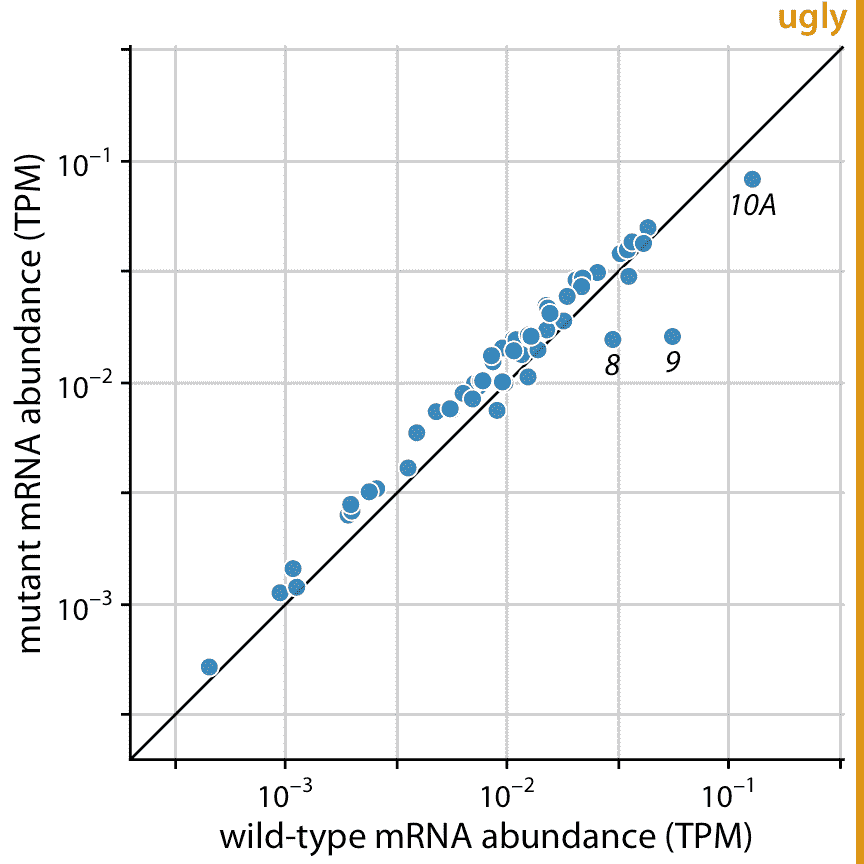

图 23.15：突变噬菌体 T7 相对于野生型的基因表达水平。该图将图 23.14 的背景网格与图 23.13 的对角线相结合。在我看来，与图 23.13 相比，这个图形在视觉上太嘈杂了，我更喜欢图 23.13。数据来源： Paff 等（2018）

## 23.4 总结

使用非数据墨水使图形过载，和过度擦除非数据墨水，都会导致图形设计不佳。我们需要找到一种健康的媒介，其中数据点是图形的重点，同时提供所显示的数据的足够上下文，即点相对于彼此在哪里，以及它们的含义。

关于背景和背景网格，没有一种选择在所有情况下都是优选的。我建议对网格线要谨慎。仔细考虑哪些特定网格或引导线对您正在制作的图表最有用，然后仅显示这些。我更喜欢白色背景上的最小的浅色网格，因为白色是纸上的默认中性色，几乎支持任何前景色。但是，阴影背景有助于绘图显示为单个视觉实体，这在小型多图中可能特别有用。最后，我们必须考虑所有这些选择如何与视觉品牌和身份相关。许多杂志和网站都喜欢具有立即可识别的内部风格，阴影背景和背景网格的特定选择有助于创建独特的视觉身份。

### 参考

```
Tufte, E. 2001. The Visual Display of Quantitative Information. 2nd ed. Cheshire, Connecticut: Graphics Press.

Telford, R. D., and R. B. Cunningham. 1991. “Sex, Sport, and Body-Size Dependency of Hematology in Highly Trained Athletes.” Medicine and Science in Sports and Exercise 23: 788–94.

Wickham, H. 2016. ggplot2: Elegant Graphics for Data Analysis. 2nd ed. New York: Springer.

Haroz, S., R. Kosara, and S. L. Franconeri. 2015. “ISOTYPE Visualization: Working Memory, Performance, and Engagement with Pictographs.” ACM Conference on Human Factors in Computing Systems, 1191–1200. doi:10.1145/2702123.2702275.

Paff, M. L., B. R. Jack, B. L. Smith, J. J. Bull, and C. O. Wilke. 2018. “Combinatorial Approaches to Viral Attenuation.” bioRxiv, 29918. doi:10.1101/299180.
```