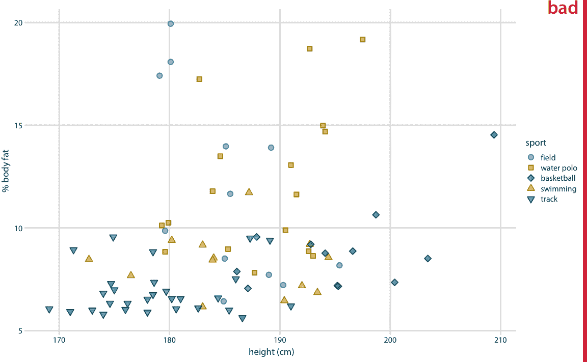
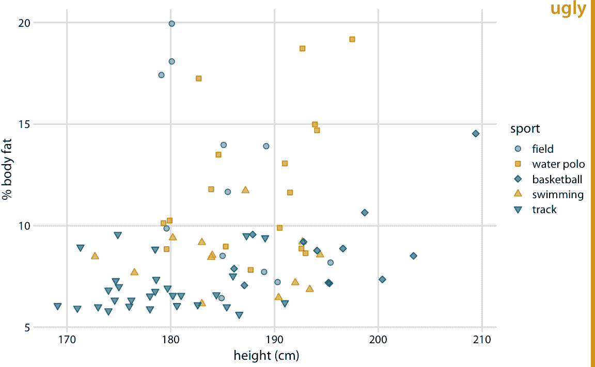
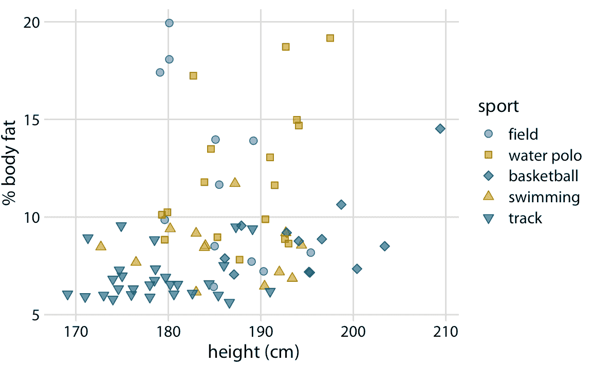
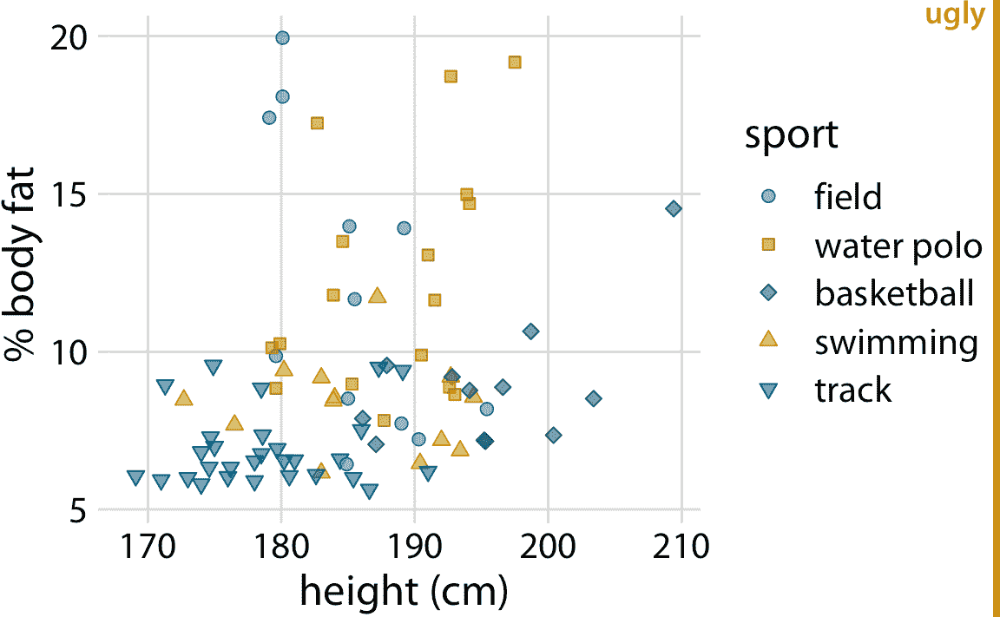
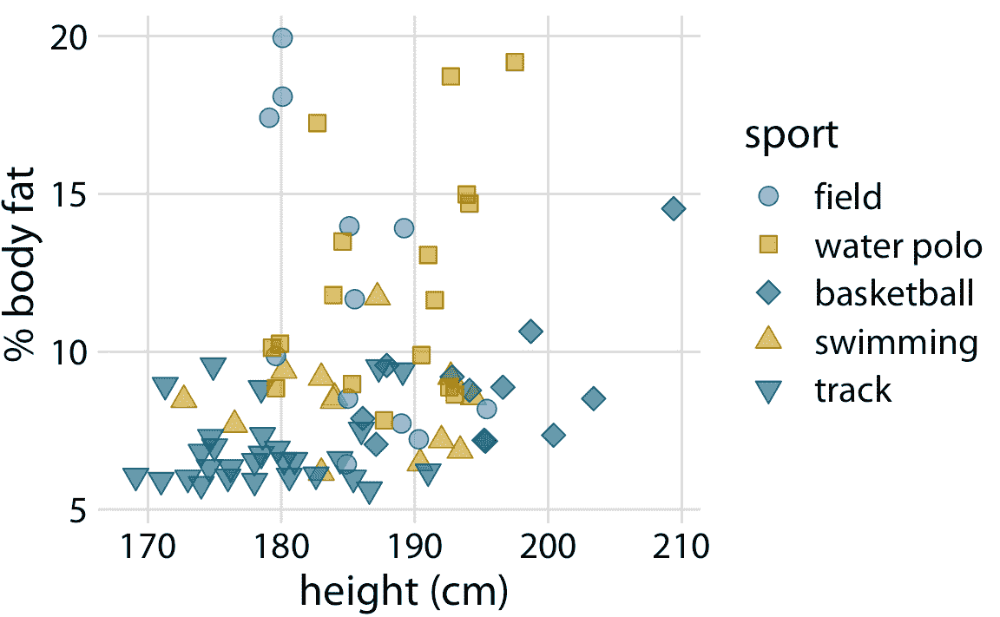

# 24 使用较大的轴标签

> 原文： [https://serialmentor.com/dataviz/small-axis-labels.html](https://serialmentor.com/dataviz/small-axis-labels.html)

如果你只拿走本书中的一节课，那么就是这个：注意轴标签，轴刻度标签和其他各种绘图注解。情况就是他们太小了。根据我的经验，几乎所有的绘图库和图形软件都有很差的默认值。如果你使用默认值，你几乎肯定做出了糟糕的选择。

例如，考虑图 24.1 。我一直看到这样的图形。轴标签，轴刻度标签和图例标签都非常小。我们几乎看不到它们，我们可能需要放大页面来阅读图例中的注解。



图 24.1：澳大利亚职业男性运动员的体脂百分比与身高的关系。 （每个点代表一名运动员。）这个图形存在常见的问题，即文本元素太小而且几乎不易辨认。数据来源：Telford 和 Cunningham（1991）

该图的一个更好的版本如图 24.2 所示。我认为字体仍然太小，这就是为什么我把这个图形标记为丑陋。但是，我们正朝着正确的方向前进。在某些情况下，这个图形可能是合理的。我在这里的主要批评并不是标签不清晰，因为图形不平衡；与图的其余部分相比，文本元素太小。



图 24.2：男性运动员体脂百分比与身高的关系。这个图形是对图 24.1 的改进，但是文本元素仍然太小而且图形不平衡。数据来源：Telford 和 Cunningham（1991）

下图使用了我在本书中应用的默认设置。我认为它很平衡，文字清晰可见，并且符合图形的整体大小。



图 24.3：男性运动员的体脂百分比与身高的关系。所有图形元素都适当缩放。数据来源：Telford 和 Cunningham（1991）

重要的是，我们可以做过头并使标签太大（图 24.4 ）。有时我们需要大标签，例如，如果要减小图形的大小，但图形的各种元素（特别是标签文本和图形符号）需要组合在一起。在图 24.4 中，用于可视化数据的点相对于文本而言太小。一旦我们解决了这个问题，这个图形就会再次被接受（图 24.5 ）。



图 24.4：男性运动员的体脂百分比与身高的关系。文本元素相当大，如果要以非常小的比例复制图形，它们的大小可能是合适的。但是，这个图形总体上并不平衡；这些点相对于文本元素来说太小了。数据来源：Telford 和 Cunningham（1991）



图 24.5：男性运动员的体脂百分比与身高的关系。所有图形元素都调整了大小，使得图形平衡并且可以在小型比例尺上再现。数据来源：Telford 和 Cunningham（1991）

您可以查看图 24.5 ，发现一切都太大了。但是，请记住，它应该按比例缩小。缩小图形，使其宽度只有一英寸或两英寸，看起来很好。实际上，在本章中，这是在这个比例尺下唯一看起来很好的图形。

始终查看图形的缩小版本，来确保轴标签大小合适。

我认为有一个简单的心理原因，为什么我们经常制作轴标签太小的图形，它与大型，高分辨率的电脑显示器有关。我们经常在计算机屏幕上预览图形，通常我们这样做，而图形在屏幕上占用了大量空间。在这种查看模式中，即使相对较小的文本看起来也非常精细和清晰，大文本看起来很笨拙和突出。事实上，如果你从本章中取出第一个图形并将其放大到填满整个屏幕，你可能会认为它看起来很好。解决方案是始终确保以真实的打印尺寸查看图形。你可以在屏幕上将它们缩小只有三到五英寸的宽度，或者你可以去你房间的另一边检查这个图形是否在相当长的距离内看起来很好。

### 参考

```
Telford, R. D., and R. B. Cunningham. 1991. “Sex, Sport, and Body-Size Dependency of Hematology in Highly Trained Athletes.” Medicine and Science in Sports and Exercise 23: 788–94.
```