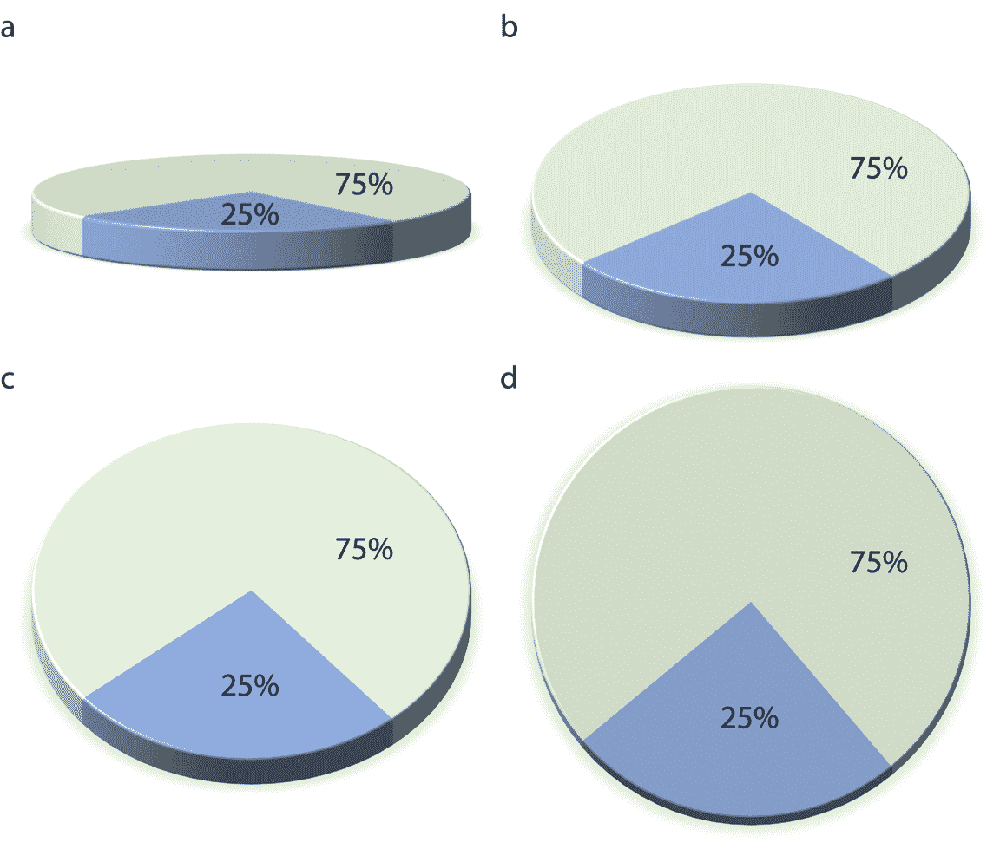
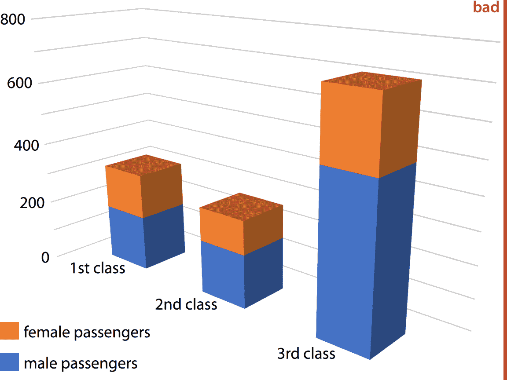
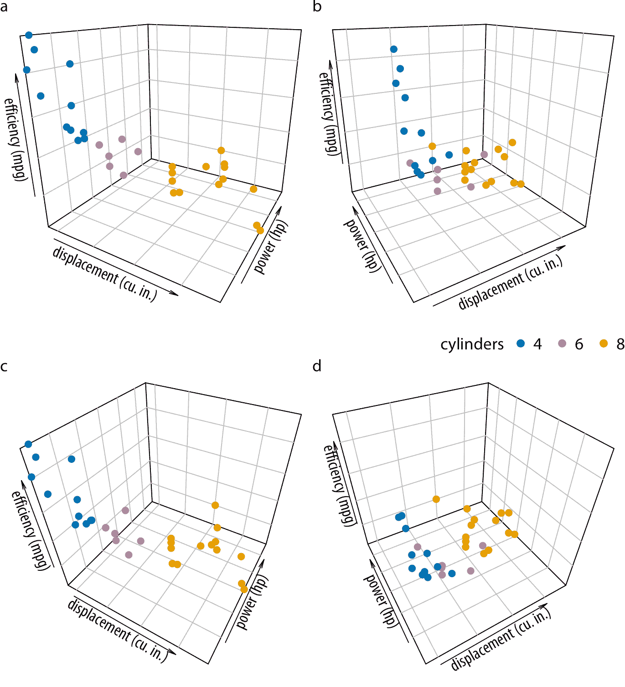
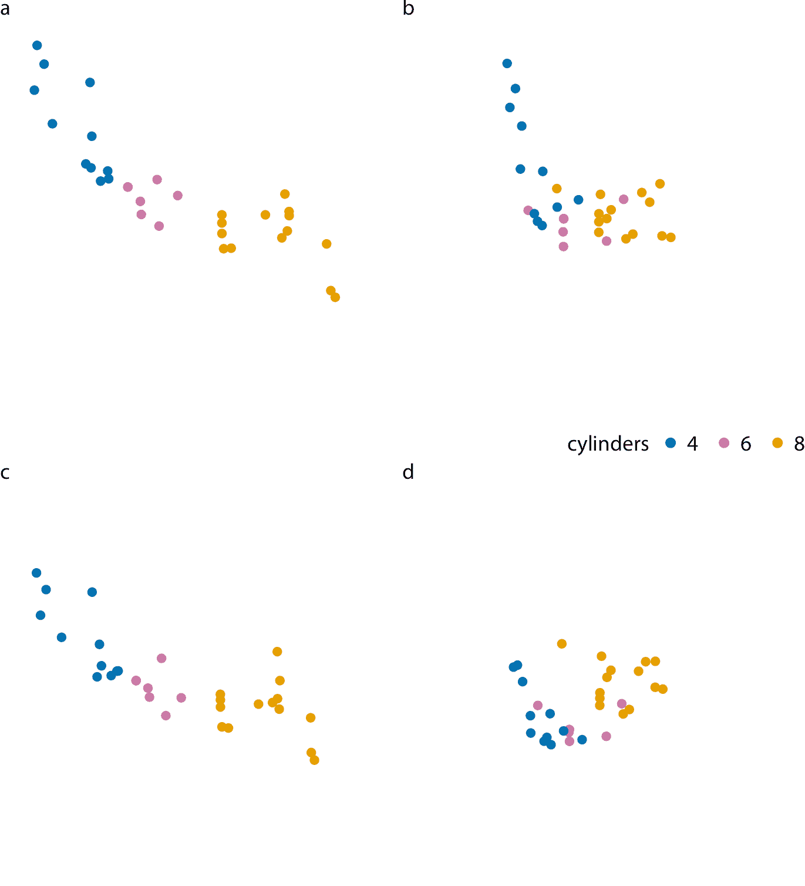
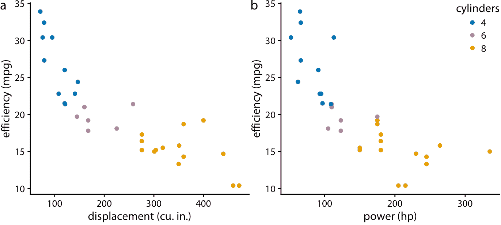
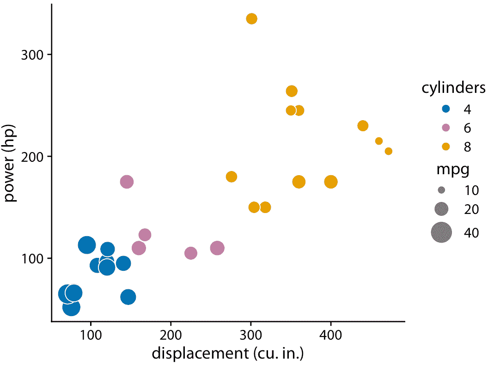
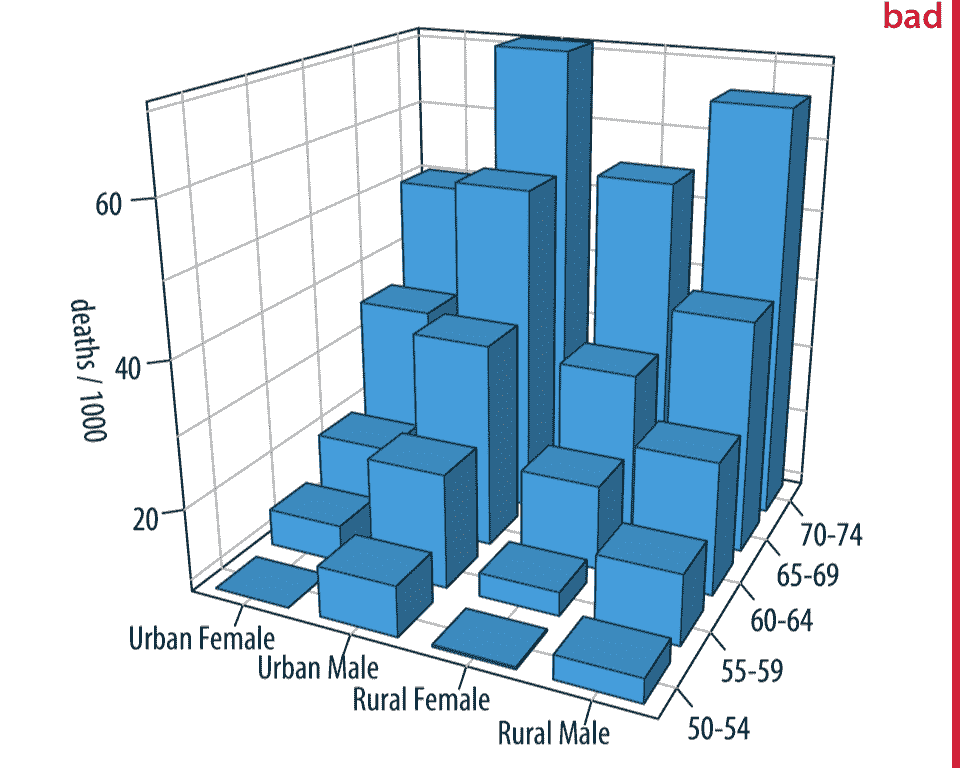
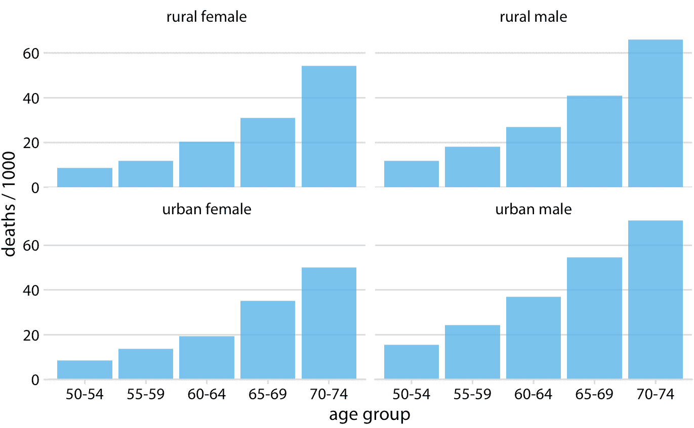
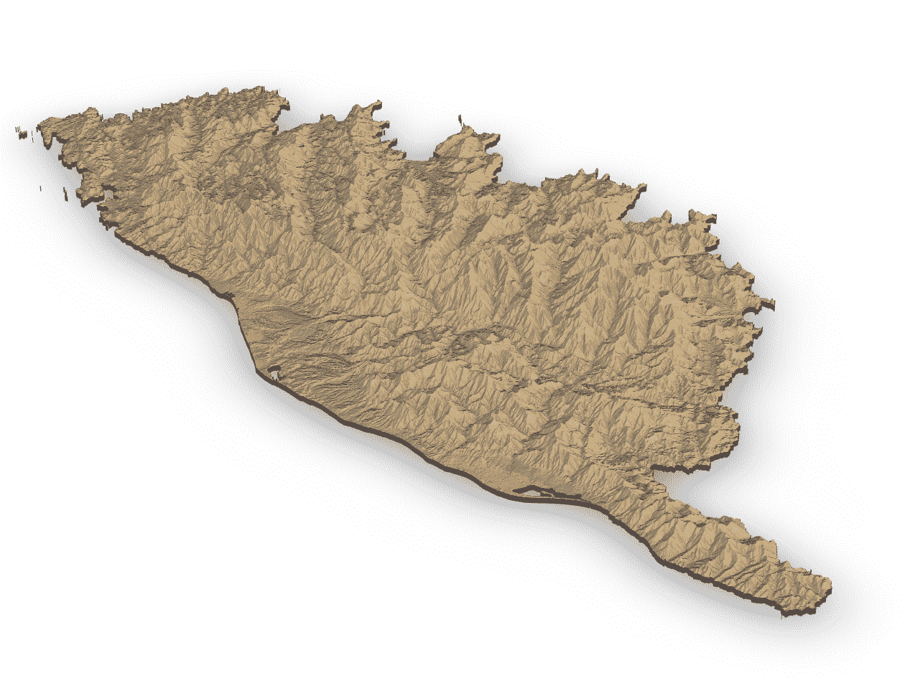
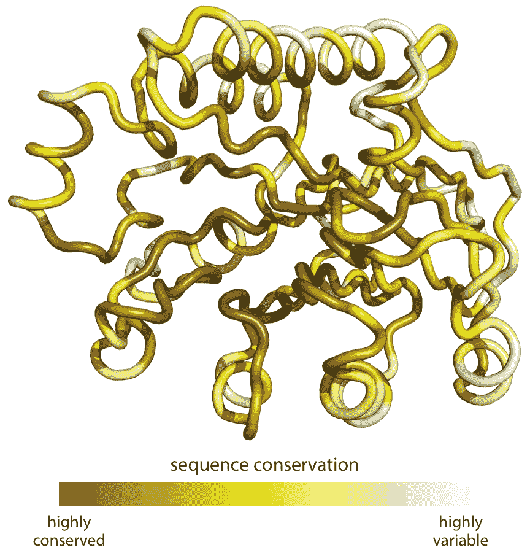

# 26 不要去 3D

> 原文： [https://serialmentor.com/dataviz/no-3d.html](https://serialmentor.com/dataviz/no-3d.html)

3D 情节非常受欢迎，特别是在商业演示中，也在学术界中。它们也几乎总是被不恰当地使用。我很少看到 3D 图形通过将其转换为常规 2D 图形而无法改进。在本章中，我将解释为什么 3D 图存在问题，为什么通常不需要它们，以及在有限的情况下 3D 图可能是合适的。

## 26.1 避免无偿 3D

许多可视化软件使您可以通过将图形的图形元素转换为三维对象来修改图形。最常见的是，我们看到饼图变成了在空间中旋转的圆盘，条形图变成了列，线图变成了条带。值得注意的是，在这些情况中，第三维都没有传达任何实际数据。 3D 仅用于装饰和装饰情节。我认为 3D 的使用是无偿的。这是非常糟糕的，应该从数据科学家的视觉词汇中删除。

无偿 3D 的问题在于将 3D 对象投影到二维以便在监视器上打印或显示会使数据失真。当人类视觉系统将 3D 图像的 2D 投影映射回 3D 空间时，人类视觉系统试图校正这种失真。但是，这种修正只能是局部的。举个例子，让我们看一个带有两个切片的简单饼图，一个代表 25％的数据，一个代表 75％，并在空间中旋转这个饼图（图 [26.1](no-3d.html#fig:rotated-pie) ）。当我们改变我们看馅饼的角度时，切片的大小似乎也会改变。特别是，当我们从平面角度观察馅饼时，位于馅饼前面的 25％切片看起来比 25％大得多（图 [26.1](no-3d.html#fig:rotated-pie) a）。

图 26.1：从四个不同角度显示的相同 3D 饼图。将饼图旋转到第三个维度会使前面的饼图切片看起来比实际大，后面的饼图片看起来更小。这里，在部分（a），（b）和（c）中，对应于 25％的数据的蓝色切片在视觉上占据了代表馅饼的区域的 25％以上。只有（d）部分是数据的准确表示。

对于其他类型的 3D 绘图也会出现类似的问题。图 [26.2](no-3d.html#fig:titanic-3d) 显示使用 3D 条形图按类别和性别划分的泰坦尼克号乘客。由于杆相对于轴线的布置方式，杆都看起来比它们实际上短。例如，一等乘客共有 322 名乘客，但图 [26.2](no-3d.html#fig:titanic-3d) 表明这个数字小于 300.这种错觉的产生是因为代表数据的列位于距离两个背面一定距离的位置在其上绘制灰色水平线。要查看此效果，请考虑延伸其中一列的任何底边，直到它到达最低灰线（表示 0）。然后，想象对任何顶边执行相同操作，您将看到所有列比第一眼看上去要高。 （有关此图的更合理的 2D 版本，请参见 [6](visualizing-amounts.html#visualizing-amounts) 中的图 [6.10](visualizing-amounts.html#fig:titanic-passengers-by-class-sex) 。）

图 26.2：泰坦尼克号上一，二，三级旅行的女乘客人数，显示为三维叠加条形图。第 1 级，第 2 级和第 3 级的乘客总数分别为 322,279 和 711（见图 [6.10](visualizing-amounts.html#fig:titanic-passengers-by-class-sex) ）。然而在这个情节中，一级酒吧似乎代表不到 300 名乘客，第三级酒吧似乎代表不到 700 名乘客，而二级酒吧似乎比实际的 279 名乘客更接近 210-220 名乘客。此外，第三级酒吧在视觉上占主导地位，并使第三类乘客的数量看起来比实际大。

## 26.2 避免 3D 位置刻度

虽然使用免费 3D 的可视化很容易被视为坏，但使用三个真正的位置标度（ _x_ ， _y_ 和 _z_ 对可视化的想法却不太清楚]）表示数据。在这种情况下，第三维的使用用于实际目的。然而，由此产生的情节经常难以解释，在我看来应该避免。

考虑一下 32 辆汽车的燃油效率与排量和功率的三维散点图。我们之前在章节 [2](aesthetic-mapping.html#aesthetic-mapping) ，图 [2.5](aesthetic-mapping.html#fig:mtcars-five-scale) 中看到过这个数据集。在这里，我们绘制沿 _x_ 轴的位移，沿 _y_ 轴的动力，沿 _z_ 轴的燃油效率，我们用点表示每辆车（图 [26.3](no-3d.html#fig:mtcars-3d) ）。尽管从四个不同的角度展示了这种 3D 可视化，但很难想象这些点在空间中的确切分布情况。我发现图 [26.3](no-3d.html#fig:mtcars-3d) 的部分（d）特别令人困惑。它几乎似乎显示了一个不同的数据集，即使除了我们看到点的角度之外没有任何变化。

图 26.3：32 辆汽车（1973-74 型号）的燃油效率与排量和功率的关系。每个点代表一辆汽车，点颜色代表汽车的汽缸数。四个面板（a） - （d）显示完全相同的数据，但使用不同的视角。数据来源：_ 电机趋势，_ 1974。

这种 3D 可视化的基本问题是它们需要两个独立的连续数据转换。第一个转换将数据从数据空间映射到 3D 可视化空间，如位置比例上下文中的章节 [2](aesthetic-mapping.html#aesthetic-mapping) 和 [3](coordinate-systems-axes.html#coordinate-systems-axes) 中所讨论的。第二个将来自 3D 可视化空间的数据映射到最终图形的 2D 空间。 （对于在真实 3D 环境中显示的可视化，显然不会发生第二次转换，例如当显示为物理雕塑或 3D 打印对象时。我的主要目标是在 2D 显示器上显示 3D 可视化。）第二次转换是非因为 2D 显示器上的每个点对应于 3D 可视化空间中的一行点。因此，我们无法唯一地确定任何特定数据点在 3D 空间中的位置。

然而，我们的视觉系统试图将 3D 转换为 2D 转换。然而，这个过程是不可靠的，充满了错误，并且高度依赖于图像中的适当线索，这些线索传达了一些三维感。当我们删除这些提示时，反转变得完全不可能。这可以在图 [26.4](no-3d.html#fig:mtcars-3d-no-axes) 中看到，除了所有深度线索都被删除外，它与图 [26.3](no-3d.html#fig:mtcars-3d) 相同。结果是四个随机排列的点，我们根本无法解释，甚至不容易相互关联。你能说出（a）部分中哪些点对应（b）部分中的哪些点？我当然不能。

图 26.4：32 辆汽车（1973-74 型号）的燃油效率与排量和功率的关系。四个面板（a） - （d）对应于图 [26.3](no-3d.html#fig:mtcars-3d) 中的相同面板，只是所有提供深度线索的网格线都已被移除。数据来源： _Motor Trend，_ 1974。

我认为通常应该只应用一个适当的可逆转换并将数据直接映射到 2D 空间，而不是应用两个单独的数据转换，其中一个是不可逆的。由于变量也可以映射到颜色，大小或形状比例上，因此很少需要将第三维添加为位置比例。例如，在章节 [2](aesthetic-mapping.html#aesthetic-mapping) 中，我同时绘制了五个燃料效率数据集的变量，但仅使用了两个位置标度（图 [2.5](aesthetic-mapping.html#fig:mtcars-five-scale) ）。

在这里，我想展示两种替代方法来精确绘制图 [26.3](no-3d.html#fig:mtcars-3d) 中使用的变量。首先，如果我们主要关注燃料效率作为响应变量，我们可以绘制两次，一次针对位移，一次针对功率（图 [26.5](no-3d.html#fig:mtcars-2d-multiple) ）。其次，如果我们对排量和功率如何相互关联更感兴趣，将燃油效率作为感兴趣的第二变量，我们可以绘制功率与排量的关系，并将燃油效率映射到点的大小（图 [26.6](no-3d.html#fig:mtcars-2d-size) ）。这两个数字比图 [26.3](no-3d.html#fig:mtcars-3d) 更有用，更少混淆。

图 26.5：燃油效率与排量（a）和功率（b）。数据来源：_ 电机趋势，_ 1974。

图 26.6：32 辆汽车的功率与排量，燃料效率由点尺寸表示。数据来源：_ 电机趋势，_ 1974。

您可能想知道 3D 散点图的问题是实际数据表示（点）本身不会传达任何 3D 信息。例如，如果我们使用 3D 条形码会发生什么？图 [26.7](no-3d.html#fig:VA-death-rates-3d) 显示了一个典型的数据集，可以用 3D 条形图显示，1940 年弗吉尼亚州的死亡率按年龄组和性别和住房位置分层。我们可以看到 3D 条确实帮助我们解释情节。人们不太可能将前景中的条形图误认为背景中的条形图，反之亦然。然而，在图 [26.2](no-3d.html#fig:titanic-3d) 的背景下讨论的问题也存在于此。很难准确判断单个条的高度，并且很难进行直接比较。例如，在 60-64 岁年龄组中，65-69 岁年龄组的城市女性死亡率是高于还是低于城市男性？

图 26。7：弗吉尼亚州 1940 年的死亡率，可视化为 3D 条形图。显示四组人（城市和农村女性和男性）和五个年龄组（50-54,55-59,60-64,65-69,70-74）的死亡率，并以单位为单位报告每 1000 人死亡。这个数字标记为“坏”，因为 3D 视角使得绘图难以阅读。数据来源： Molyneaux，Gilliam 和 Florant（ [1947](#ref-Molyneaux-et-al-1947) ）

通常，最好使用 Trellis 图（章 [21](multi-panel-figures.html#multi-panel-figures) ）而不是 3D 可视化。当显示为 Trellis 图时，弗吉尼亚死亡率数据集仅需要四个图（图 [26.8](no-3d.html#fig:VA-death-rates-Trellis) ）。我认为这个数字清晰易懂。很明显，男性的死亡率高于女性，城市男性的死亡率似乎高于农村男性，而城市和农村女性的死亡率并不明显。

图 26。8：1940 年弗吉尼亚州的死亡率，可视化为 Trellis 图。显示四组人（城市和农村女性和男性）和五个年龄组（50-54,55-59,60-64,65-69,70-74）的死亡率，并以单位为单位报告每 1000 人死亡。数据来源： Molyneaux，Gilliam 和 Florant（ [1947](#ref-Molyneaux-et-al-1947) ）

## 26.3 适当使用 3D 可视化

但是，使用 3D 位置刻度的可视化有时是合适的。首先，如果可视化是交互式的并且可以由观看者旋转，或者如果它在 VR 或增强现实环境中显示，其中可以从多个角度检查，则前一部分中描述的问题是较少关注的。其次，即使可视化不是交互式的，显示它慢慢旋转，而不是从一个角度看作为静态图像，将允许观看者辨别不同图形元素所在的 3D 空间中的哪个位置。人脑非常善于从不同角度拍摄的一系列图像重建 3D 场景，图形的慢速旋转恰好提供了这些图像。

最后，当我们想要显示实际的 3D 对象和/或映射到它们的数据时，使用 3D 可视化是有意义的。例如，显示山区的地形起伏是一个合理的选择（图 [26.9](no-3d.html#fig:corsica-relief) ）。类似地，如果我们想要将映射到其结构上的蛋白质的进化序列保守性可视化，则将结构显示为 3D 对象是有意义的（图 [26.10](no-3d.html#fig:protein-3d) ）。然而，在任何一种情况下，如果它们被显示为旋转动画，这些可视化仍将更容易解释。虽然这在传统印刷出版物中是不可能的，但是当在网上发布数字或进行演示时，可以很容易地完成。

图 26.9：地中海科西嘉岛的救济。数据来源：哥白尼土地监测服务

图 26.10：蛋白质进化变异的模式。有色管代表来自细菌 _ 大肠杆菌 _ 的蛋白质外切核酸酶 III 的主链（蛋白质数据库标识符：1AKO）。着色表示该蛋白质中各个位点的进化保守性，暗色表示保守氨基酸，浅色表示可变氨基酸。数据来源： Marcos 和 Echave（ [2015](#ref-Marcos-Echave-2015) ）

### 参考

Molyneaux，L.，S。K. Gilliam 和 L. C. Florant。 1947 年。“按颜色，性别，年龄，农村或城市居住的弗吉尼亚州死亡率的差异。” _American Sociological Review_ 12：525-35。

Marcos，M。L.和 J. Echave。 “太过改变：蛋白质进化中的侧链包装和位点特异性替代率。” _PeerJ_ 3：e911。