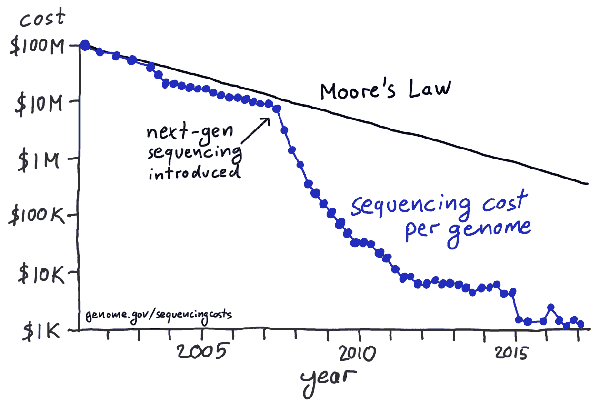
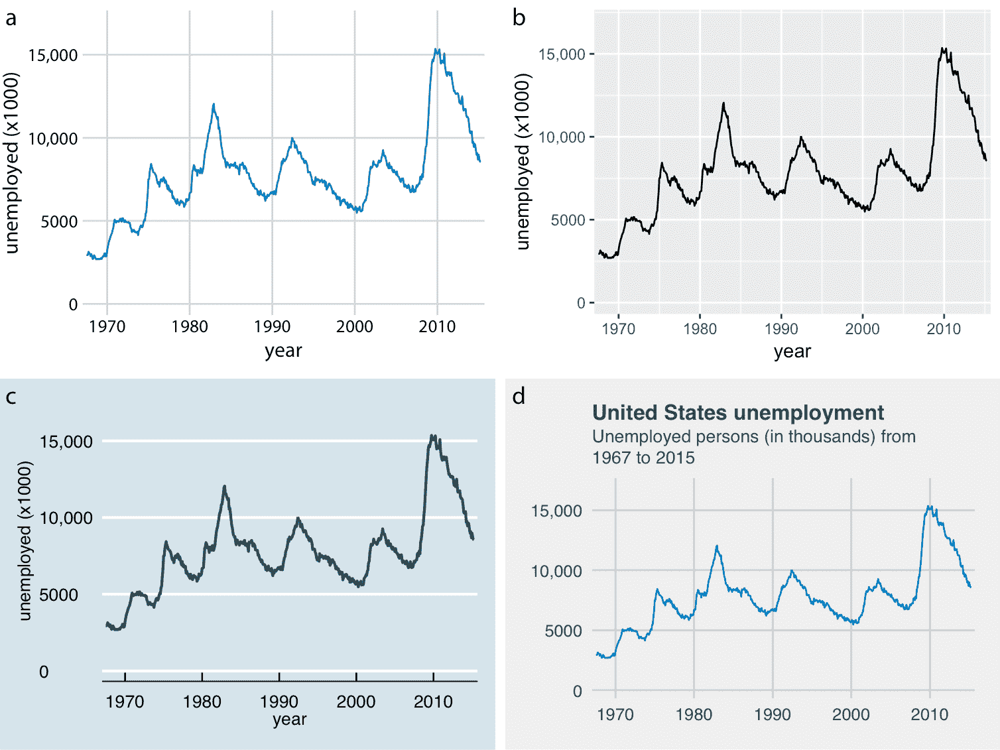

# 28 选择合适的可视化软件

> 原文： [https://serialmentor.com/dataviz/choosing-visualization-software.html](https://serialmentor.com/dataviz/choosing-visualization-software.html)

在本书中，我有目的地避免了数据可视化的一个关键问题：我们如何实际生成数据？我们应该使用什么工具？这个问题可以产生激烈的讨论，因为许多人对他们熟悉的特定工具有强烈的情感纽带。我经常看到人们大力捍卫他们自己喜欢的工具，而不是花时间学习新的方法，即使新方法有客观的好处。我会说坚持使用你知道的工具并非完全不合理。学习任何新工具都需要时间和精力，而且你将不得不经历一个痛苦的过渡期，使用新工具完成任务比使用旧工具要困难得多。无论是经过这段时间还是值得付出努力，通常只有在人们投入资金来学习新工具之后才能回顾一下。因此，无论不同工具和方法的优缺点如何，最重要的原则是您需要选择适合您的工具。如果你能够制作想要制作的数字，而不需要过多的努力，那就重要了。

最好的可视化软件是允许您制作所需图形的软件。

话虽如此，我确实认为我们可以使用一般原则来评估不同方法产生可视化的相对优点。这些原则大致可分解的是可视化的可重现性，快速浏览数据的容易程度，以及输出的视觉外观可以调整到何种程度。

## 28.1 重复性和重复性

在科学实验的背景下，如果不同的研究小组进行相同类型的研究，如果工作的总体科学发现将保持不变，我们将工作称为可重复的。例如，如果一个研究小组发现一种新的止痛药可以显着减轻感知的头痛，而不会引起明显的副作用，并且不同的小组随后在不同的患者组中研究相同的药物并且具有相同的发现，那么该工作是可重复的。相反，如果同一个人在同一设备上重复完全相同的测量程序可以获得非常相似或相同的测量结果，则工作是可重复的。例如，如果我称我的狗，并且发现她重 41 磅，然后我在相同的秤上再次称重她并再次发现她重 41 磅，那么这个测量是可重复的。

通过微小的修改，我们可以将这些概念应用于数据可视化。如果绘制的数据可用并且可能已经应用的任何数据转换被精确指定，则可视化是可再现的。例如，如果你制作一个数字然后向我发送你绘制的确切数据，那么我可以准备一个看起来非常相似的数字。我们可能使用稍微不同的字体或颜色或点大小来显示相同​​的数据，因此这两个数字可能不完全相同，但您的数字和我的传达相同的信息，因此是彼此的复制品。另一方面，如果可以从原始数据重建完全相同的视觉外观（直到最后一个像素），则可视化是可重复的。严格来说，重复性要求即使图中有随机元素，例如抖动（章节 [18](overlapping-points.html#overlapping-points) ），这些元素也是以可重复的方式指定的，并且可以在将来的日期重新生成。对于随机数据，可重复性通常要求我们指定一个特定的随机数发生器，我们为其设置和记录种子。

在本书中，我们已经看到许多重现但不重复其他数字的数字示例。例如，章 [25](avoid-line-drawings.html#avoid-line-drawings) 显示了几组图，其中每组中的所有数字显示相同的数据，但每组中的每个数字看起来有些不同。类似地，图 28.1 a 是图 9.7 的重复，直到应用于每个数据点的随机抖动，而图 28.1 b 只是一个再现这个数字。图 28.1 b 具有与图 9.7 不同的抖动，并且它还使用了完全不同的视觉设计，即使它们清楚地传达有关数据的相同信息，这两个数字看起来也非常不同。

图 28.1：重复和再现图形。 （a）部分重复图 9.7 。两个数字相同，直到应用于每个点的随机抖动。相比之下，（b）部分是复制而不是重复。特别是，（b）部分的抖动与（a）部分或图 9.7 中的抖动不同。

当我们使用交互式绘图软件时，很难实现可重复性和可重复性。许多交互式程序允许您转换或以其他方式操纵数据，但不会跟踪您执行的每个单独的数据转换，而只跟踪最终产品。如果你使用这种程序制作一个图形，然后有人要求你重现图形或用不同的数据集创建类似的图形，你可能很难这样做。在我担任博士后和年轻的助理教授期间，我使用了一个交互式程序来完成我所有的科学可视化，这个确切的问题在我身上发生了好几次。例如，我为科学手稿制作了几个数字。几个月之后，当我想要修改手稿并需要重现其中一个数字的略微修改版本时，我意识到我不太确定我是如何制作原始人物的。这种经历教会我尽可能远离互动节目。我现在以编程方式编写数字，编写从原始数据生成数字的代码（脚本）。任何能够访问生成脚本和编程语言以及使用的特定库的人通常都可以重复编程生成的数字。

## 28.2 数据探索与数据表示

数据可视化有两个不同的阶段，它们的要求非常不同。首先是数据探索。每当您开始使用新数据集时，您需要从不同角度查看它并尝试各种方式对其进行可视化，以便了解数据集的主要功能。在这个阶段，速度和效率至关重要。您需要尝试不同类型的可视化，不同的数据转换以及数据的不同子集。您可以越快地浏览不同的数据查看方式，您将探索的越多，您注意到数据中您可能忽略的重要功能的可能性就越高。第二阶段是数据呈现。一旦您了解了数据集，就可以输入它，并了解要向观众展示的内容。这一阶段的关键目标是准备一个高质量，出版物就绪的数字，可以打印在文章或书籍中，包含在演示文稿中，或发布在互联网上。

在探索阶段，你制作的数字是否具有吸引力是次要的。如果缺少轴标签，图例混乱或符号太小，只要您可以评估数据中的各种模式，就可以了。然而，重要的是，您可以轻松地更改数据的显示方式。要真正探索数据，您应该能够快速从散点图转移到重叠密度分布图到箱图到热图。在第 [2](aesthetic-mapping.html#aesthetic-mapping) 章节中，我们讨论了所有可视化如何包含从数据到美学的映射。精心设计的数据探索工具将允许您轻松更改哪些变量映射到哪个美学，并且它将在单个一致框架内提供各种不同的可视化选项。然而，根据我的经验，许多可视化工具（特别是用于编程图形生成的库）没有以这种方式设置。相反，它们按照绘图类型进行组织，其中每种不同类型的绘图需要稍微不同的输入数据并且具有其自己的特殊接口。这些工具可能妨碍高效的数据探索，因为很难记住所有不同的绘图类型是如何工作的。我鼓励您仔细评估您的可视化软件是否允许快速数据探索，或者它是否会妨碍您。如果它更频繁地妨碍，您可以从探索替代可视化选项中受益。

一旦我们确定了我们想要可视化数据的确切程度，我们想要进行哪些数据转换以及使用什么类型的绘图，我们通常都希望准备一个高质量的数据用于发布。在这一点上，我们有几种不同的途径可以追求。首先，我们可以使用我们用于初步探索的相同软件平台来确定数字。其次，我们可以将平台切换到一个可以让我们更好地控制最终产品的平台，即使该平台更难以探索。第三，我们可以使用可视化软件生成草图，然后使用图像处理或插图程序（如 Photoshop 或 Illustrator）手动后处理。第四，我们可以手动重绘整个图形，使用笔和纸或使用插图程序。

所有这些途径都是合理的。但是，我想提醒您不要在常规数据分析管道或科学出版物中手动修改数据。图形准备管道中的手动步骤使得重复或再现图形本身是困难且耗时的。根据我从事自然科学工作的经验，我们很少只做一次数字。在研究过程中，我们可能会重做实验，扩展原始数据集，或者在稍微改变条件的情况下重复几次实验。我在出版过程的后期已多次看到它，当我们认为一切都已完成并最终确定时，我们最终对我们如何分析数据进行了一些小修改，因此所有数字都必须重新绘制。我也看到，在类似的情况下，决定不重做分析或不重绘数字，无论是由于所涉及的努力还是因为制作原始人物的人已经移动并且不是'再也没用了。在所有这些场景中，不必要的复杂且不可重现的数据可视化管道会干扰产生最佳科学。

话虽如此，我对手工绘制的图形或手动后处理的图形没有任何原则性的关注，例如更改轴标签，添加注解或修改颜色。这些方法可以产生美丽而独特的图形，这些图形无法以任何其他方式轻松制作。事实上，随着复杂和精致的计算机生成的可视化变得越来越普遍，我观察到手动绘制的数字正在复苏（参见图 28.2 的例子）。我认为情况就是这样，因为这些数字代表了一种独特的个性化视角，可能是一种有点无菌和常规的数据呈现。

图 28.2：引入下一代测序方法后，每个基因组的测序成本下降得比摩尔定律预测的要快得多。这个手绘的图形再现了由美国国立卫生研究院制作的广泛宣传的可视化。数据来源：国家人类基因组研究所

## 28.3 分离内容和设计

一个好的可视化软件应该允许您分别思考图形的内容和设计。根据内容，我指的是所显示的特定数据集，应用的数据转换（如果有的话），从数据到美学的特定映射，比例，轴范围和绘图类型（散点图，线图，条形图） ，boxplot 等）。另一方面，设计描述了诸如前景色和背景色，字体规格（例如字体大小，面部和族），符号形状和大小，图例的位置，轴刻度，轴标题和绘图标题等功能，以及该图是否具有背景网格。当我处理新的可视化时，我通常首先确定内容应该是什么，使用前一小节中描述的快速探索。一旦设置了内容，我可能会调整设计，或者更有可能我将应用我喜欢的预定义设计和/或在更大的工作环境中给出图形一致的外观。

在我用于本书的软件 ggplot2 中，内容和设计的分离是通过主题实现的。主题指定图形的视觉外观，并且很容易拍摄现有图形并对其应用不同的主题（图 28.3 ）。主题可以由第三方编写并作为 R 包分发。通过这种机制，围绕 ggplot2 开发了一个蓬勃发展的附加主题生态系统，它涵盖了各种不同的风格和应用场景。如果您使用 ggplot2 制作数字，几乎可以肯定找到满足您设计需求的现有主题。

图 28。3：1970 年至 2015 年美国失业人数。使用四种不同的 ggplot2 主题显示相同的数字：（a）本书的默认主题; （b）ggplot2 的默认主题，我用来绘制本书中所有数字的绘图软件; （c）模仿经济学人所显示的可视化主题; （d）模仿 FiveThirtyEight 所显示的可视化的主题。 FiveThirtyEight 经常使用轴标签来支持剧情标题和字幕，因此我相应调整了数字。数据来源：美国劳工统计局

内容和设计的分离使数据科学家和设计师能够专注于他们最擅长的事情。大多数数据科学家不是设计师，因此他们主要关注的是数据，而不是可视化的设计。同样，大多数设计师不是数据科学家，他们应该能够为数字提供独特而吸引人的视觉语言，而不必担心特定数据，适当的转换等。在书籍，杂志，报纸和网站的出版界，长期以来一直遵循分离内容和设计的相同原则，其中作者提供内容但不提供布局或设计。布局和设计由一组专门从事该领域的人员创建，他们确保出版物以视觉上一致和吸引人的风格出现。这个原则是合乎逻辑且有用的，但在数据可视化领域尚未普及。

总之，在选择可视化软件时，请考虑如何轻松地再现图形并使用更新或以其他方式更改的数据集重做它们，是否可以快速浏览相同数据的不同可视化，以及您可以在多大程度上单独调整视觉设计从生成图形内容。根据您的技能水平和编程的舒适度，在数据探索和数据展示阶段使用不同的可视化工具可能是有益的，您可能更愿意以交互方式或手动方式进行最终的视觉调整。如果您必须以交互方式制作数字，特别是使用不能跟踪所有数据转换和您已应用的视觉调整的软件，请考虑仔细记录您如何制作每个数字，以便所有工作都可以重现。