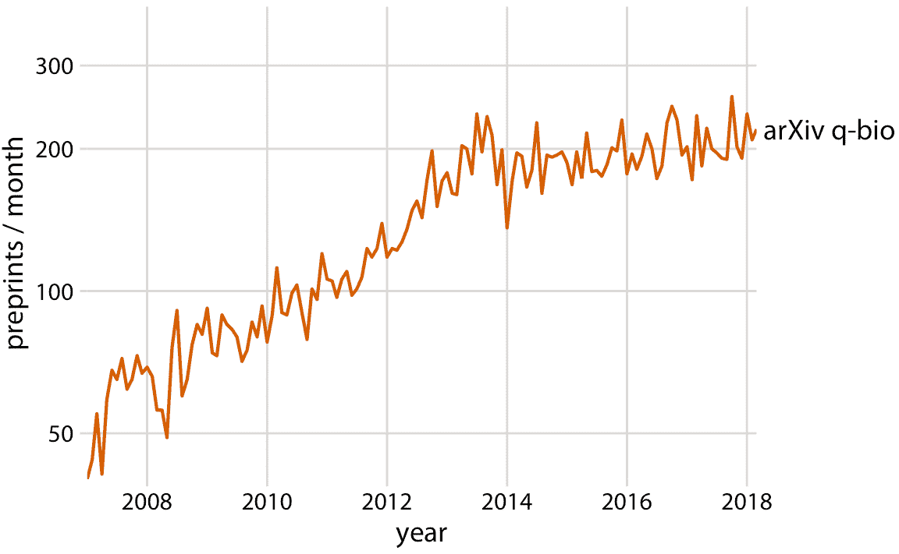
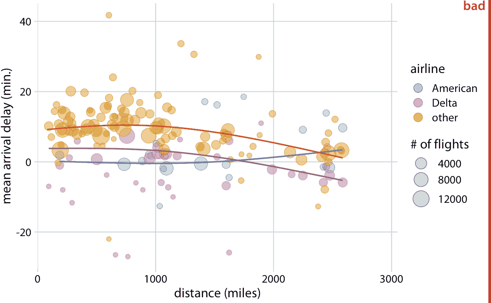
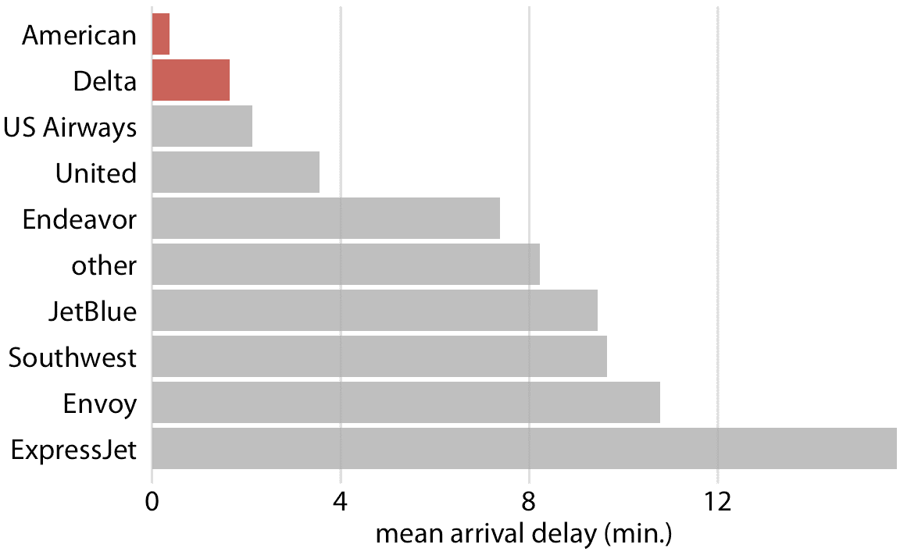
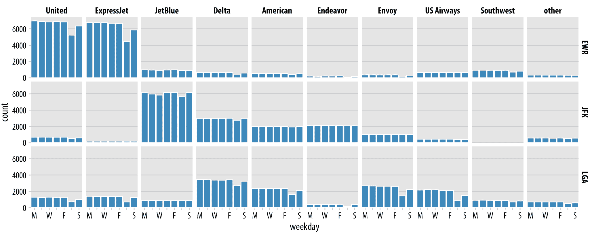
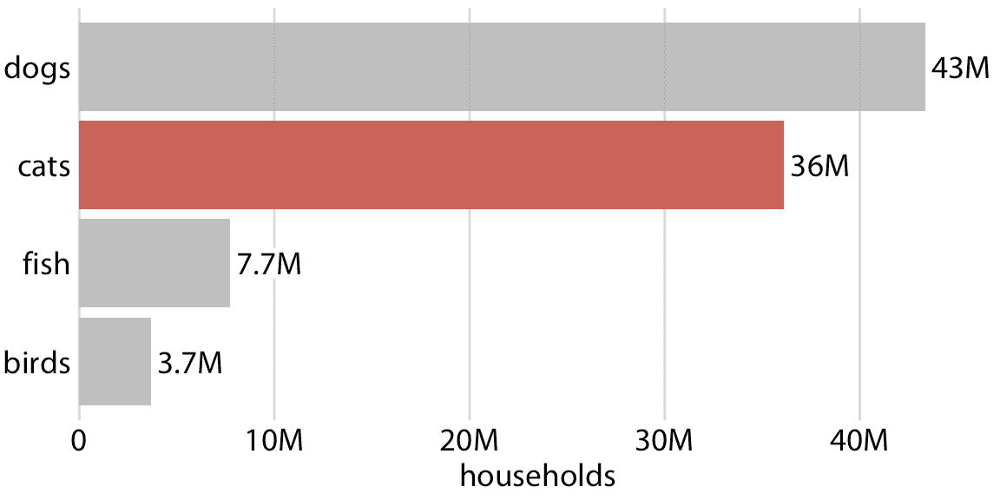
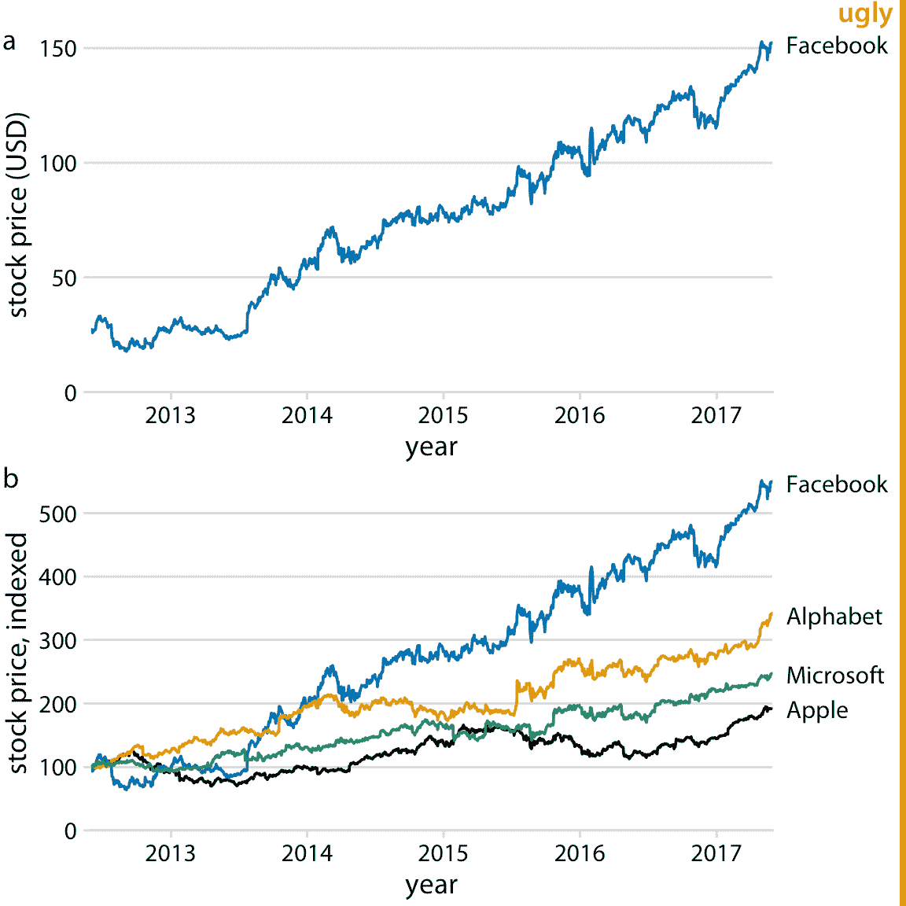
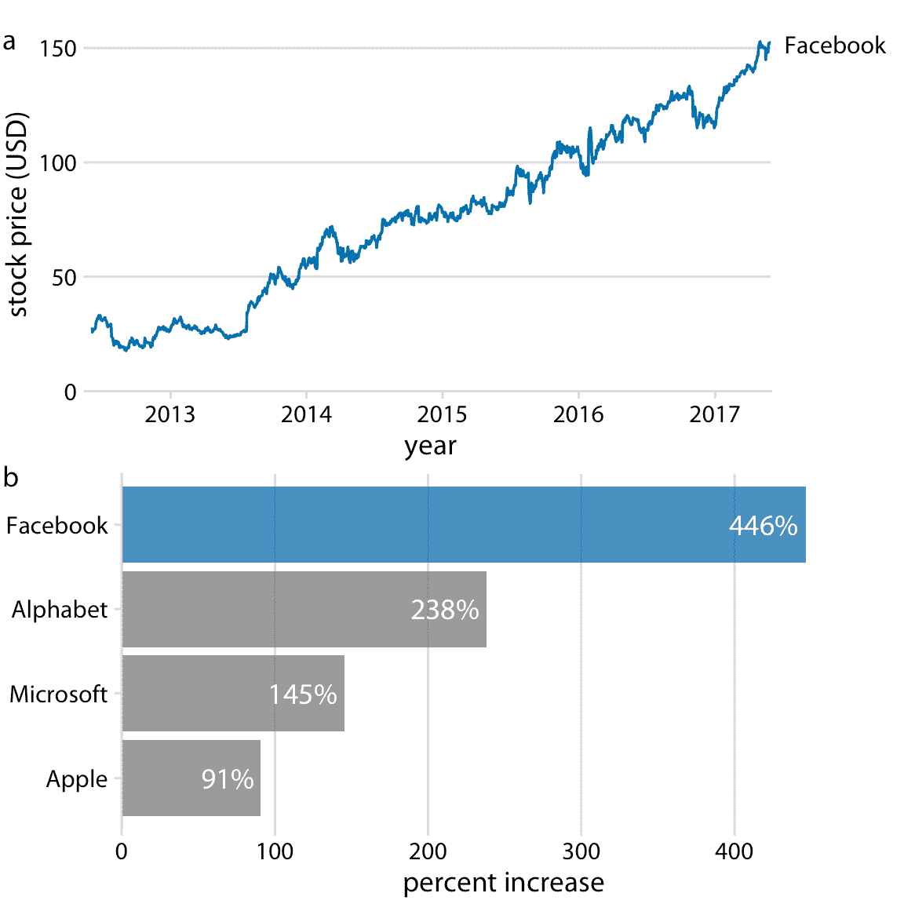

# 29 讲述一个故事并提出一个观点

> 原文： [29 Telling a story and making a point](https://serialmentor.com/dataviz/telling-a-story.html)

> 校验：[飞龙](https://github.com/wizardforcel)

> 自豪地采用[谷歌翻译](https://translate.google.cn/)

大多数数据可视化都是为了沟通目的而完成的。我们对数据集有深刻见解，我们有潜在的观众，我们希望向观众传达我们的见解。为了成功传达我们的见解，我们必须向观众展示一个清晰而令人兴奋的故事。对于科学家和工程师来说，对一个故事的需求似乎令他们感到不安，他们可能会把它等同于制造东西，把事情搞得一团糟，或者说过度吹捧结果。然而，这种观点忽略了故事在推理和记忆中所起的重要作用。当我们听到一个好故事时，我们会很兴奋，当故事很糟糕或没有故事时，我们会感到无聊。此外，任何沟通都会在观众心中创造一个故事。如果我们自己不提供一个清晰的故事，那么我们的观众就会制造一个。在最佳情况下，他们制造的故事与我们对所呈现材料的看法相当接近。然而，它可能并且往往更糟糕。这个虚构的故事可能是“这很无聊”，“作者错了”或“作者无能”。

讲故事的目的应该是运用事实和逻辑推理来让观众觉得有趣和兴奋。让我告诉你一个关于理论物理学家斯蒂芬霍金的故事。他在 21 岁 - 一年内被诊断出患有运动神经元疾病，并只剩下了两年的生命。霍金并没有接受这种困境，而是开始将全部精力投入到科学中。霍金最终活到 76 岁，成为他那个时代最有影响力的物理学家之一，并在严重残疾时完成了他所有的开创性工作。我认为这是一个令人信服的故事。它也完全基于事实和现实。

## 29.1 什么是故事？

在我们讨论将可视化转化为故事的策略之前，我们需要了解故事究竟是什么。故事是一组观测值，事实或事件，真实的或发明的，以特定的顺序呈现，以便它们在观众中产生情绪反应。情绪反应是通过故事开始时的冲突的构建以及故事结束时的某种类型的结局产生的。我们也将从冲突到结局的流程称为故事弧线度，每个好故事都有清晰，可识别的弧度。

经验丰富的作家知道，讲故事的标准模式与人类的思考方式产生共鸣。例如，我们可以使用“开头-挑战-行动-结局”的格式来讲述故事。事实上，这是我在前一小节中用于霍金故事的格式。我通过介绍物理学家斯蒂芬霍金的话题开启了这个故事。接下来，我提出了挑战，21 岁时运动神经元疾病的诊断。然后是行动，他对科学的激烈奉献。最后，我提出了结局，霍金过着漫长而成功的生活，最终成为他那个时代最有影响力的物理学家之一。其他故事格式也是常用的。报纸文章经常遵循“前导-发展-结局”格式，或者甚至更短的，只是“前导-发展”，其中前导部分预先给出了主要观点，随后的材料提供了更多细节。如果我们想以这种形式讲述霍金的故事，我们可能会开始用一句话来说，“有影响力的物理学家斯蒂芬霍金，他彻底改变了我们对黑洞和宇宙学的理解，比他的医生的预言多活了 53 年，并在他严重残疾的情况下，做出了所有最有影响力的工作。”这是前导。在发展阶段中，我们可以对霍金的生活，疾病和对科学的热爱进行更深入的描述。另一种形式是“行动 - 背景 - 发展 - 高潮 - 结束”，它比“开头 - 挑战 - 行动 - 结局”更快地发展故事，但不像“前导 - 发展”那么快。在这种格式中，我们可能以一句话开头，如“年轻的斯蒂芬霍金，面临衰弱的残疾和早逝的前景，决定将他所有的努力投入到他的科学中，决心在他仍然可以的时候留下他的印记。”这种格式的目的是吸引观众并尽早建立情感联系，但不会立即泄露最终结局。

我在本章的目标不是更详细地描述这些标准的故事讲述形式。这些材料有很好的资源。对于科学家和分析师，我特别推荐 Schimel（2011）。相反，我想讨论如何将数据可视化引入故事弧线。最重要的是，我们需要意识到单个（静态）可视化很少会讲述整个故事。可视化可以说明开场，挑战，动作或解决，但不太可能同时传达故事的所有这些部分。要讲一个完整的故事，我们通常需要多个可视化。例如，在进行演示时，我们可能首先展示一些背景或动机材料，然后是创建挑战的图形，最后是提供结局的其他图形。同样，在一篇研究论文中，我们可能会呈现一系列绘图，共同创造令人信服的故事弧线。然而，也可以将整个故事弧线压缩成单个图形。这样的图形必须同时包含挑战和结局，并且它与以导演开头的故事弧线相当。

为了提供一个将图形融入故事的具体例子，我现在将根据两个图形讲述一个故事。第一个创造挑战，第二个用做结局。我的故事背景是生物科学中预印本的增长（另见第 13 章）。预印本是草稿形式的手稿，科学家在正式同行评审和官方出版之前与他们的同事分享它们。只要科学手稿存在，科学家就一直在分享手稿草稿。然而，在 20 世纪 90 年代早期，随着互联网的出现，物理学家意识到在中央存储库中存储和分发手稿草稿要高效得多。他们发明了预印本服务器，这是一个网络服务器，科学家可以上传，下载和搜索手稿草稿。

由物理学家开发并今天仍在使用的预印本服务器，称为 arXiv.org。成立不久后，arXiv.org 开始拓展并在相关的量化领域受到欢迎，包括数学，天文学，计算机科学，统计学，量化金融和量化生物学。在这里，我对 arXiv.org 的量化生物学（q-bio）部分的预印本提交感兴趣。从 2007 年到 2013 年底，每月提交量呈指数增长，但随后增长突然停止（图 29.1 ）。 2013 年末必定会发生一些事情，从根本上改变了量化生物学预印本提交的格局。是什么原因导致了提交增长的巨大变化？



图 29.1：预印本服务器 arXiv.org 的量化生物学（q-bio）部分每月提交量的增长。 2014 年左右可以看到增长率的急剧转变。虽然 2014 年之前增长迅速，但从 2014 年到 2018 年几乎没有增长。请注意， *y* 轴是对数的，因此 *y* 线性增长对应于预印本提交量的指数增长。数据来源：Jordan Anaya，[prepubmed.org](http://www.prepubmed.org/)

我认为 2013 年末标志着预印本在生物学上起飞的时间点，具有讽刺意味的是，这导致 q-bio 归档减缓其增长。 2013 年 11 月，生物特定的预印本服务器 bioRxiv 由冷泉港实验室（CSHL）出版社推出。 CSHL Press 是一家在生物学家中备受推崇的出版商。CSHL Press 的支持极大有助于通用预印本特别是 bioRxiv 在生物学家中的认可。那些对 arXiv.org 非常怀疑的生物学家对 bioRxiv 更加满意。因此，bioRxiv 迅速获得生物学家的认可，达到了 arXiv 从未到达的程度。实际上，在其推出后不久，bioRxiv 的每月提交量开始经历快速的指数级增长，并且 q-bio 提交量的减缓恰好与 bioRxiv 的这种指数增长的开始一致（图 29.2 ）。许多量化生物学家可能已经在 q-bio 存放了的预印本，决定将其存放在 bioRxiv。


图 29.2： q-bio 的提交量增长的平缓，与 bioRxiv 服务器的引入相吻合。显示了通用预印本服务器 arxiv.org 的 q-bio 部分和生物学专用的预印本服务器 bioRxiv 的月度提交量的增长。 bioRxiv 服务器于 2013 年 11 月投入使用，其提交量自此以来呈指数级增长。似乎许多会向 q-bio 提交预印本的科学家，选择提交给 bioRxiv。数据来源：Jordan Anaya，[www.prepubmed.org](http://www.prepubmed.org/)

这是我关于生物学预印本的故事。我故意用两个图形讲述它，即使第一个（图 29.1 ）完全包含在第二个图形中（图 29.2 ）。我认为这个故事在分成两部分时影响最大，这就是我在演讲中的表现方式。然而，图 29.2 本身可以用来讲述整个故事，而单图版本可能更适合于观众可能会有短暂注意力的媒体，例如社交媒体发布。

## 29.2 为将军制作一个图形

在本章的其余部分，我将讨论制作单个图形和图形集的策略，以帮助您的观众与您的故事联系，并在整个故事中保持参与。首先，最重要的是，您需要向观众展示他们真正能够理解的数据。遵循我在本书中提供的所有建议，并仍然制作令人混淆的图形，是完全有可能的。当这种情况发生时，你可能已经成为两个常见误解的受害者；首先，观众可以看到你的图形并立即推断出你想要的要点；第二，观众可以快速处理复杂的可视化并理解所显示的关键趋势和关系。这些假设都不是真的。我们需要尽一切努力帮助读者理解可视化的含义，并在我们看到的数据中展示相同的模式。这通常意味着少即是多。尽可能简化您的图形。删除与您的故事不相关的所有特性。只能保留重点。我将这个概念称为“为将军制作一个图形”。

几年来，我负责一项由美国陆军资助的大型研究项目。对于我们的年度进度报告，项目经理指示我排除很多数据。我所做的任何图形都应该清楚地表明我们的项目是如何取得成功的。项目经理告诉我，一位将军应该能够看到每个图形，并立即看到我们正在做的，如何改进或超过先前的能力。然而，当参与该项目的同事向我发送年度进展报告的图形时，许多图形都不符合这一标准。这些图形通常过于复杂，以在令人困惑的技术术语标注，或者根本没有明显的要点。大多数科学家没有接受过训练来为将军制作图形。

> 永远不要假设您的受众可以快速处理复杂的视觉显示。

有些人可能会听到这个故事，并得出结论，将军不是很聪明，或者只是不科学。我认为这是错误的带回家的消息。将军们非常忙碌。他们不能花 30 分钟试图破译一个神秘的图形。当他们向科学家提供数百万美元的纳税人资金进行基础研究时，他们可以期待的最少的回报，是一些明确的证据，证明有价值和有趣的事情已经完成。这个故事也不应该被误解为仅仅关于军事资金。将军是您可能想要通过可视化实现的任何图形的隐喻。它可以是您的论文或资助提案的科学审稿人，可以是报纸编辑，也可以是您所在公司的主管或主管的老板。如果你想要讲述你的故事，你需要制作适合所有这些将军的图形。

具有讽刺意味的是，阻碍为将军制作图形的第一件事，就是现代可视化软件使我们能够轻松地制作复杂的数据可视化。凭借几乎无限的可视化功能，在更多维度上钻取数据变得很诱人。事实上，我认为数据可视化领域的趋势使最复杂，多方面的可视化成为可能。这些可视化可能看起来非常令人印象深刻，但它们不太可能传达一个清晰的故事。考虑图 29.3，显示了 2013 年离开纽约市区的所有航班的到达延误。我怀疑这将需要一段时间来处理这个图形。



图 29.3：平均到达延误与距离纽约市的距离。每个点代表一个目的地，每个点的大小代表 2013 年从纽约市三个主要机场（纽瓦克，肯尼迪国际机场或拉瓜迪亚）之一到该目的地的航班数量。负延误意味着航班早到。实线表示到达延误和距离之间的平均趋势。无论行程距离如何，达美的到达延误始终低于其他航空公司。平均而言，美国航空在短距离内的延误率最低，但是对于长途旅行来说，延误最大。这个图形被标记为“不好”，因为它过于复杂。大多数读者会发现它令人困惑，并且不会直观地掌握图中显示的内容。数据来源：美国运输部，交通运输统计局。

我认为图 29.3 最重要的特征是美国和达美的到达时间最短。在简单的条形图中更好地传达了这种见解（图 29.4）。因此，图 29.4 是正确的图形，显示该故事是否与航空公司的到达延误有关，即使该图表不会挑战您的数据可视化技能。如果你当时想知道，这些航空公司的延误较小，是否因为他们没有飞出纽约市那么长时间，你可以提出第二个条形图，强调美国和达美都是纽约市的主要航空公司（图 29.5）。这两个条形图都丢弃了图 29.3 中显示的距离变量。还行吧。我们不需要可视化与我们的故事无关的数据维度，即使我们拥有它们，即使我们可以制作一个显示它们的图形。简单清晰比复杂混乱更好。



图 29.4：2013 年飞出纽约市区的航班的平均到达延误，按航空公司分组。所有飞出纽约市区的航空公司中，美国航空和达美航空的平均到达延误最低。数据来源：美国运输部，交通运输统计局。


图 29.5：2013 年飞往纽约市区的航班数量，按航空公司分组。在所有飞出纽约市区的航班中，达美航空和美国航空是第四和第五。数据来源：美国运输部，交通运输统计局。

当您尝试一次显示太多数据时，最终可能无法显示任何内容。

## 29.3 建立复杂的数字

但是，有时我们确实想要显示包含大量信息的更复杂的图形。在这些情况下，如果我们首先向他们展示图的简化版本，然后再展示完全复杂的最终版本，我们可以让读者更轻松。同样强烈建议使用相同的方法进行演示。永远不要直接跳到高度复杂的图形；首先展示一个容易消化的子集。

如果最终图形是一个小型多图（第 21 章
），显示了具有相似结构的的子图网格，这个建议特别相关。如果观众自己第一次看到单个子图，则整个网格更容易消化。例如，图 29.6 显示 2013 年美国联合航空公司离开纽瓦克机场（EWR）的起飞总数，按工作日细分。一旦我们看到并消化了这个图形，同时查看十个航空公司和三个机场的相同信息就更容易处理（图 29.7 ）。


图 29.6：美国联合航空离开纽瓦克机场（EWR）的出发次数，按照工作日分组。大多数工作日具有大致相同的出发次数，但周末出发次数较少。数据来源：美国运输部，交通运输统计局。



图 29.7：按航空公司，机场和工作日拆解的 2013 年纽约市区机场的出发次数。美国联合航空公司和 ExpressJet 组成了离开纽瓦克机场（EWR）的绝大多数出发，而捷蓝，达美，美国航空和 Endeavor 的大部分航班，组成了离开肯尼迪机场（JFK）的大部分出发，达美，美国航空，Envoy 和 US Airways 组成了离开拉瓜迪亚（LGA）的大部分出发。大多数但不是所有航空公司在周末离开的次数少于工作日。数据来源：美国运输部，交通运输统计局。

## 29.4 让你的图形令人难忘

简单而干净的图形（如简单的条形图）具有以下优点：它们可以避免分散注意力，易于阅读，并让您的观众专注于您想要传达的最重要的要点。然而，简单性可能产生缺点：图形最终看起来很一般。他们没有任何突出的特性，让他们难忘。如果我快速连续向你展示十个条形图，那么你很难将它们分开，然后记住它们显示的内容。例如，如果您快速查看图 29.8 ，您会注意到与图 29.5 的视觉相似性，我在本章前面已经讨论过。然而，除了条形图之外，这两个图形没有任何共同之处。图 29.5 按照航空公司显示了离开纽约市区的航班数量，而图 29.8 显示了美国家庭中最受欢迎的宠物。这两个图都没有任何元素可以帮助您直观地感知图中所涵盖的主题，因此这两个图都不是特别难忘。



图 29.8：拥有一种或多种最受欢迎​​宠物的家庭数量：狗，猫，鱼或鸟类。这个条形图非常清晰，但不一定特别难忘。 “猫”一列仅用于创建与图 29.5 的视觉相似性。数据来源：2012 年美国宠物所有者和人口统计学资料手册，美国兽医协会

对人类感知的研究表明，视觉上更复杂性和更加独特的图形更令人难忘（Bateman 等 2010； Borgo 等 2012）。然而，视觉独特性和复杂性不仅影响可记忆性，因为它们可能妨碍人们快速浏览信息的能力，或使得值的微小差异难以区分。在极端情况下，一个图形可能是非常令人难忘，但完全令人困惑。这样的图形不是一个好的数据可视化，即使它作为一个令人惊叹的艺术作品不错。在另一个极端，图形可能非常清晰，但是可能容易忘记和无聊，这些图形可能没有我们可能预期的影响。总的来说，我们希望在两个极端之间取得平衡，并使我们的图形既令人难忘又清晰。 （然而，目标读者也很重要。如果一个图形是用于科学技术出版物，而不是广泛阅读的报纸或博客，我们通常会担心可记忆性。）

通过添加反映数据特征的视觉元素，我们可以使图形更难忘，例如数据集相关的事物或对象的绘图或象形图。通常采用的一种方法是以重复图像的形式显示数据值本身，使得图像的每个副本对应于所展示变量的特定数量。例如，我们可以将图 29.8 中的条形图替换为狗，猫，鱼和鸟的重复图像，按一定刻度绘制，使每个完整的动物对应 500 万个家庭（图 29.9）。因此，在视觉上，图 29.9 仍然可以作为条形图，但我们现在增加了一些视觉复杂性，使图形更令人难忘，我们还使用直接反映数据意义的图像显示数据。只需快速浏览一下这个图形，您就可以记住，除了鱼或鸟之外，还有更多的狗和猫。重要的是，在这样的可视化中，我们希望使用图像来表示数据，而不是简单地使用图像来装饰可视化或注解轴。在心理学实验中，选择后者倾向于分散注意力而不是有用（Haroz，Kosara 和 Franconeri 2015）。


图 29.9：拥有一种或多种最受欢迎​​宠物的家庭数量，显示为同型图。每只完整的动物代表着拥有这种宠物的 500 万个家庭。数据来源：2012 年美国宠物所有者和人口统计学资料手册，美国兽医协会

图 29.9 等可视化通常称为同型图。同型（isotype）这个词是作为国际体系图像教育系统（International System Of TYpographic Picture Education）的首字母缩写而引入的，严格来说它指的是代表物体，动物，植物或人的类似 logo 的简化象形图（Haroz，Kosara 和 Franconeri 2015）。但是，我认为更广泛地使用术语同型图，来应用于任何类型的可视化，它使用相同图像的重复副本来指示值的大小，是有意义的。毕竟，前缀“iso”表示“相同”，“类型”可以表示特定类型，类别或组。

## 29.5 保持一致，但不要重复

在讨论 21.2 章节中的复合图形时，我提到对较大图形的不同部分使用一致的视觉语言很重要。图形也是如此。如果我们制作的三个图形都是一个更大的故事的一部分，那么我们需要设计这些图形，使它们看起来像是在一起。但是，使用一致的视觉语言并不意味着一切看起来应该完全相同。反之。重要的是，描述不同分析的图形在视觉上是截然不同的，以便您的受众可以轻松识别一个分析的结束和另一个分析的开始位置。最好通过对总体故事的不同部分使用不同的可视化方法来实现。如果您已经使用了条形图，则接下来使用散点图，箱线图或折线图。否则，不同的分析会在观众心中模糊在一起，并且他们很难将故事的一部分与另一部分区分开来。例如，如果我们从章节 21.2 重新设计图 21.8，使得它只使用条形图，结果显然不那么明显，更令人困惑（图 29.10 ）。


图 29.10：男性和女性运动员的生理机能和身体组成。误差条表示平均值的标准误差。这个图形过于重复。它显示与图 21.8 相同的数据，并且它使用一致的可视语言，但所有子图使用相同类型的可视化（条形图）。这使得读者难以明白部分（a），（b）和（c）显示完全不同的结果。数据来源：特尔福德和坎宁安（1991）

在制作演示文稿或报告时，目标是为每个不同的分析使用不同类型的可视化。

重复图形集通常是多部分故事的结果，其中每个部分基于相同类型的原始数据。在这些情况下，为每个部分使用相同类型的可视化可能很诱人。但总的来说，这些图形不会引起观众的注意。作为一个例子，让我们分两部分来考虑 Facebook 股票的故事：（i）Facebook 股票价格从 2012 年到 2017 年迅速增长; （ii）价格涨幅超过其他大型科技公司。您可能希望用两个显示随时间变化的股票价格的数据来显示这两个陈述，如图 29.11 所示。然而，虽然图 29.11a 有一个明确的目的并且应该保持原样，但 29.11b 同时重复并且模糊了主要观点。我们并不特别关心 Alphabet，Apple 和 Microsoft 的股票价格的确切时间演变，我们只想强调它比 Facebook 的股价的增长得少。



图 29.11：Facebook 股票价格在五年内的增长以及与其他科技股的比较。 （a）Facebook 股票价格从 2012 年中期的每股约 25 美元上涨至 2017 年中期的每股 150 美元。 （b）其他大型科技公司的价格在同一时期内并未等量上涨。2012 年 6 月 1 日的价格已变为指数 100，以便于比较。该图标记为“丑陋”，因为部分（a）和（b）是重复的。数据来源：雅虎财经

我建议部分（a）保留原样，但用一个显示百分比增长的条形图代替部分（b）（图 29.12 ）。现在我们有两个截然不同的图形，每个图形都有一个独特，清晰的要点，并且组合起来很好。 部分（a）允许读者熟悉原始的基础数据，部分（b）突出显示效果的大小，同时删除任何切向信息。



图 29.12：Facebook 股票价格在五年内的增长以及与其他科技股的比较。 （a）Facebook 股价从 2012 年中期的每股约 25 美元/股上涨至 2017 年中期的每股 150 美元，增幅接近 450%。 （b）其他大型科技公司的价格在同一时期内并未等量上涨。价格涨幅介于 90% 至 240% 之间。数据来源：雅虎财经

图 29.12 强调了我在制作一组图形来讲述一个故事时所遵循的一般原则：我从一个尽可能接近显示原始数据的图形开始，在随后的图形中我展示越来越多的派生量。派生量（例如百分比增长，平均值，拟合模型的系数等）可用于总结大型和复杂数据集中的关键趋势。但是，因为它们是派生的，所以它们不那么直观，如果我们在显示原始数据之前显示派生量，我们的观众会发现很难遵循。另一方面，如果我们试图通过显示原始数据来显示所有趋势，我们最终将需要太多和/或重复的图形。

你应该用多少个图形来讲述你的故事？答案取决于出版位置。对于一篇简短的博文或推文，请制作一个图形。对于科学论文，我建议三到六个图形。如果我有一份超过六个图形的科学论文，那么其中一些需要被移入附录或补充材料部分。记录我们收集的所有证据是很好的，但我们不能通过提供过多的几乎相似的图形来消磨我们的观众。在其他情况下，更多的图形可能是合适的。但是，在这些情况下，我们通常会讲述多个故事，或者是一个包含子图的总体故事。例如，如果我被要求进行一个小时的科学演示，我通常打算讲三个不同的故事。同样，一本书或论文将包含不止一个故事，实际上每章或每节可能包含一个故事。在这些情景中，每个不同的故事绘图或子绘图应该展示不超过三到六个图形。在本书中，你会发现我在章节的各个层面都遵循这个原则。每个部分大致是独立的，并通常展示不超过六个图形。

### 参考

```
Schimel, J. 2011. Writing Science: How to Write Papers That Get Cited and Proposals That Get Funded. Oxford University Press.

Bateman, S., R. Mandryk, C. Gutwin, A. Genest, D. McDine, and C. Brooks. 2010. “Useful Junk? The Effects of Visual Embellishment on Comprehension and Memorability of Charts.” ACM Conference on Human Factors in Computing Systems, 2573–82. doi:10.1145/1753326.1753716.

Borgo, R., A. Abdul-Rahman, F. Mohamed, P. W. Grant, I. Reppa, and L. Floridi. 2012. “An Empirical Study on Using Visual Embellishments in Visualization.” IEEE Transactions on Visualization and Computer Graphics 18: 2759–68. doi:10.1109/TVCG.2012.197.

Haroz, S., R. Kosara, and S. L. Franconeri. 2015. “ISOTYPE Visualization: Working Memory, Performance, and Engagement with Pictographs.” ACM Conference on Human Factors in Computing Systems, 1191–1200. doi:10.1145/2702123.2702275.

Telford, R. D., and R. B. Cunningham. 1991. “Sex, Sport, and Body-Size Dependency of Hematology in Highly Trained Athletes.” Medicine and Science in Sports and Exercise 23: 788–94.
```