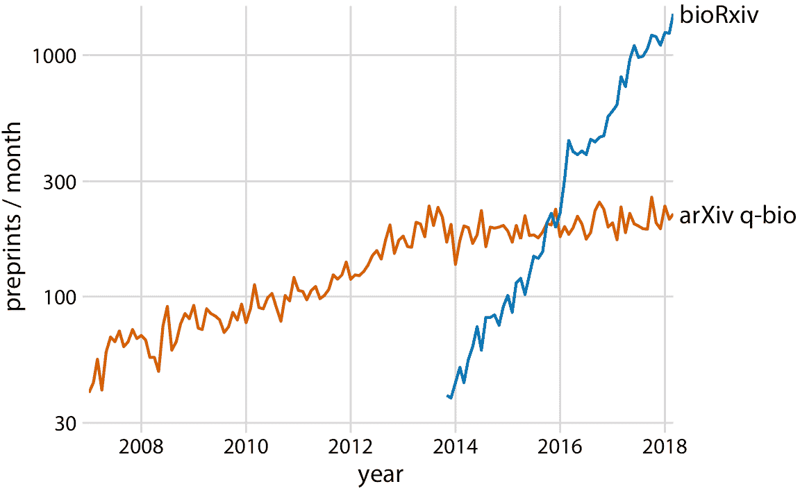
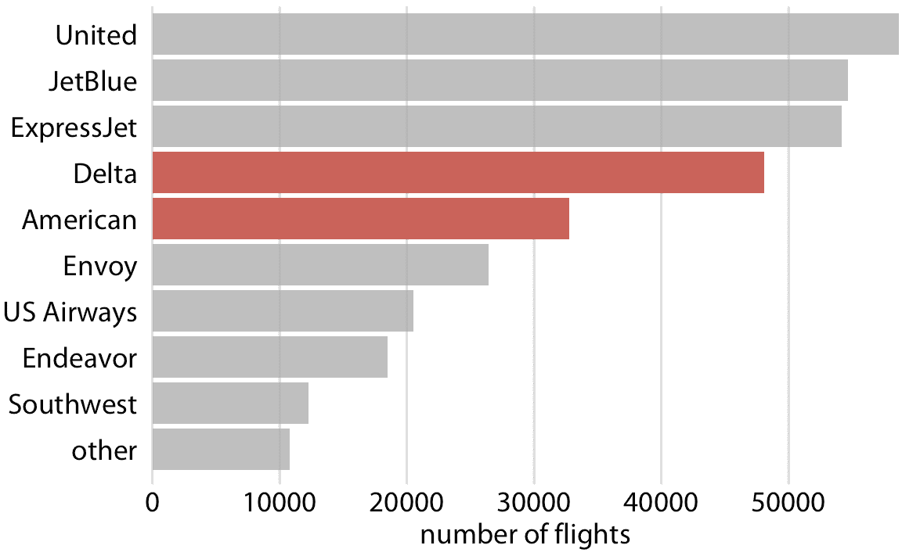
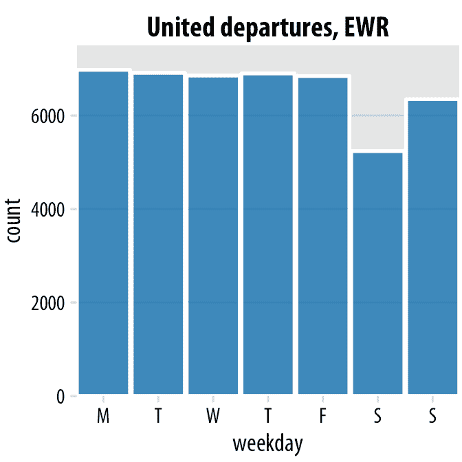
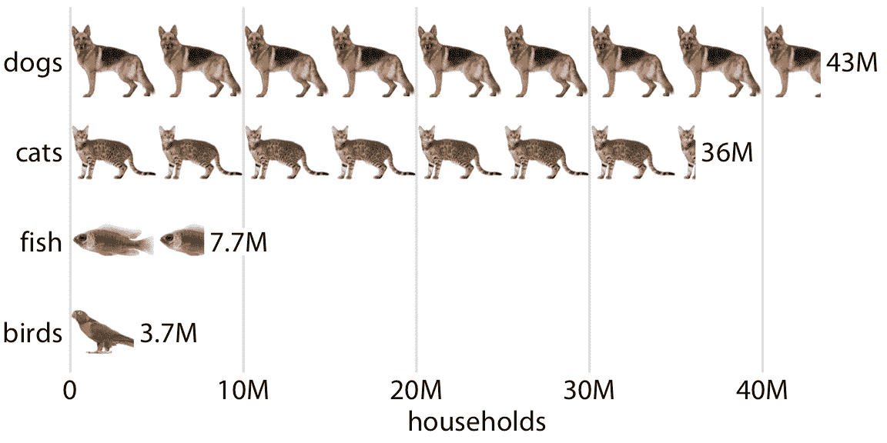
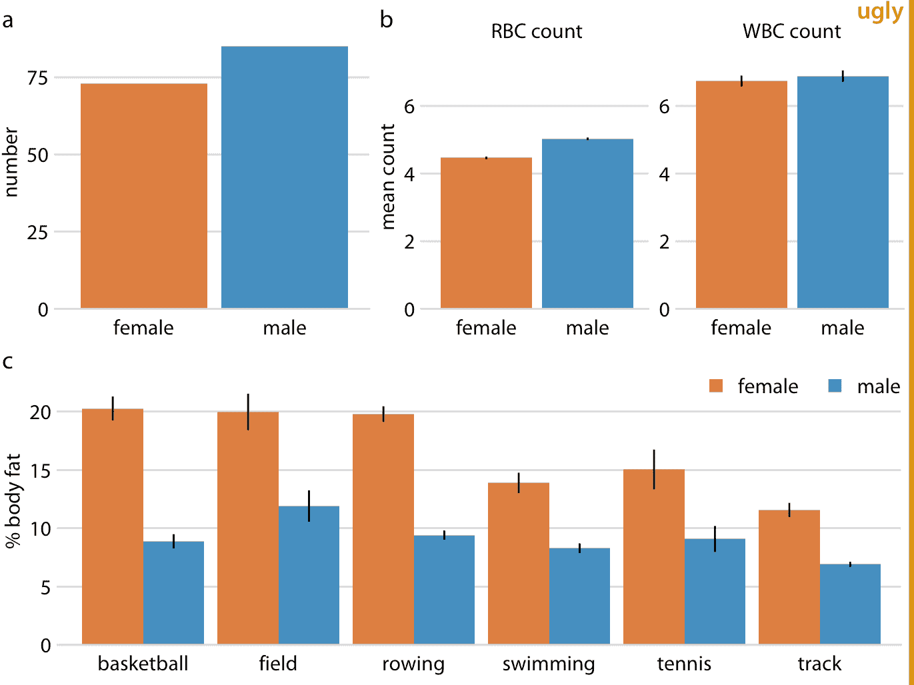

# 29 讲述一个故事并提出一个观点

> 原文： [https://serialmentor.com/dataviz/telling-a-story.html](https://serialmentor.com/dataviz/telling-a-story.html)

大多数数据可视化都是为了通信目的而完成的。我们对数据集有深刻见解，我们有潜在的受众，我们希望向观众传达我们的见解。为了成功传达我们的见解，我们必须向观众展示一个清晰而令人兴奋的故事。对于科学家和工程师来说，对一个故事的需求似乎令他们感到不安，他们可能会把它等同于制造东西，把事情搞得一团糟，或者说超卖结果。然而，这种观点忽略了故事在推理和记忆中所起的重要作用。当我们听到一个好故事时，我们会很兴奋，当故事很糟糕或没有故事时，我们会感到无聊。此外，任何沟通都会在观众心中创造一个故事。如果我们自己不提供一个清晰的故事，那么我们的观众就会提出一个问题。在最佳情况下，他们构成的故事与我们对所呈现材料的看法相当接近。然而，它可能并且往往更糟糕。这个虚构的故事可能是“这很无聊”，“作者错了”或“作者无能”。

讲故事的目的应该是运用事实和逻辑推理来吸引观众的兴趣和兴奋。让我告诉你一个关于理论物理学家斯蒂芬霍金的故事。他在 21 岁 - 一年内被诊断出患有运动神经元疾病，并获得了两年的生命。霍金并没有接受这种困境，而是开始将全部精力投入到科学中。霍金最终活到 76 岁，成为他那个时代最有影响力的物理学家之一，并在严重残疾时完成了他所有的开创性工作。我认为这是一个令人信服的故事。它也完全基于事实和真实。

## 29.1 什么是故事？

在我们讨论将可视化转化为故事的策略之前，我们需要了解故事究竟是什么。故事是一组观察，事实或事件，真实的或发明的，以特定的顺序呈现，以便它们在观众中产生情绪反应。情绪反应是通过故事开始时紧张的积累以及故事结束时的某种类型的解决方式产生的。我们将从张力到分辨率的流程也称为故事绘图，每个好故事都有清晰，可识别的弧度。

经验丰富的作家知道，讲故事的标准模式与人类的思考方式产生共鸣。例如，我们可以使用 Opening-Challenge-Action-Resolution 格式来讲述故事。事实上，这是我在前一小节中用于霍金故事的格式。我通过介绍物理学家斯蒂芬霍金的话题开启了这个故事。接下来，我提出了挑战，21 岁时运动神经元疾病的诊断。然后是行动，他对科学的激烈奉献。最后，我提出了决议，霍金过着漫长而成功的生活，最终成为他那个时代最有影响力的物理学家之一。其他故事格式也是常用的。报纸文章经常遵循 Lead-Development-Resolution 格式，或者甚至更短的，只是 Lead-Development，其中领导者预先给出了主要观点，随后的材料提供了更多细节。如果我们想以这种形式讲述霍金的故事，我们可能会开始用一句话来说，“有影响力的物理学家斯蒂芬霍金，他彻底改变了我们对黑洞和宇宙学的理解，使他的医生的预后超过了 53 年，并做了所有在他严重残疾的情况下，他最有影响力的工作。“这是领先。在发展过程中，我们可以对霍金的生活，疾病和对科学的热爱进行更深入的描述。另一种形式是行动 - 背景 - 发展 - 高潮 - 结束，它比开放 - 挑战 - 行动 - 决议更快地发展故事，但不像铅 - 发展那么快。在这种格式中，我们可能打开一句话，如“年轻的斯蒂芬霍金，面临衰弱的残疾和早逝的前景，决定将他所有的努力投入到他的科学中，决心在他仍然可以的时候留下他的印记。 “这种格式的目的是吸引观众并尽早建立情感联系，但不会立即泄露最终解决方案。

我在本章的目标不是更详细地描述这些标准的故事讲述形式。这些材料有很好的资源。对于科学家和分析师，我特别推荐 Schimel（ [2011](#ref-Schimel2011) ）。相反，我想讨论如何将数据可视化引入故事弧。最重要的是，我们需要意识到单个（静态）可视化很少会讲述整个故事。可视化可以说明开场，挑战，动作或解决方案，但不太可能同时传达故事的所有这些部分。要讲一个完整的故事，我们通常需要多个可视化。例如，在进行演示时，我们可能首先展示一些背景或动机材料，然后是创建挑战的图形，最后是提供分辨率的其他图形。同样，在一篇研究论文中，我们可能会呈现一系列共同创造令人信服的故事绘图的人物。然而，也可以将整个故事弧压缩成单个图形。这样的数字必须同时包含挑战和解决方案，并且它与以导演开头的故事弧相当。

为了提供一个将数字融入故事的具体例子，我现在将根据两个数字讲述一个故事。第一个是挑战，第二个是分辨率。我的故事背景是生物科学中预印本的增长（另见章节 [13](time-series.html#time-series) ）。预印本是草稿形式的手稿，科学家在正式同行评审和官方出版之前与他们的同事分享。只要科学手稿存在，科学家就一直在分享手稿草稿。然而，在 20 世纪 90 年代早期，随着互联网的出现，物理学家意识到在中央存储库中存储和分发稿件草稿要高效得多。他们发明了预印本服务器，这是一个网络服务器，科学家可以上传，下载和搜索稿件草稿。

今天开发并仍在使用的预印本服务器物理学家称为 arXiv.org。成立不久后，arXiv.org 开始拓展并在相关的数量领域受到欢迎，包括数学，天文学，计算机科学，统计学，定量金融和定量生物学。在这里，我对 arXiv.org 的定量生物学（q-bio）部分的预印本提交感兴趣。从 2007 年到 2013 年底，每月提交的数量呈指数增长，但随后增长突然停止（图 29.1 ）。 2013 年末必定会发生一些事情，从根本上改变了定量生物学预印本提交的格局。是什么原因导致了提交增长的巨大变化？

图 29.1：预印本服务器 arXiv.org 的定量生物学（q-bio）部分每月提交的增长。 2014 年左右可以看到增长率的急剧转变。虽然到 2014 年增长迅速，但从 2014 年到 2018 年几乎没有增长。请注意， *y* 轴是对数的，因此线性增长 *y* 对应于预印本提交中的指数增长。数据来源：Jordan Anaya， [http://www.prepubmed.org/](http://www.prepubmed.org/)

我认为 2013 年末标志着预印本在生物学上起飞的时间点，具有讽刺意味的是，这导致 q-bio 档案减缓其增长。 2013 年 11 月，生物特定的预印本服务器 bioRxiv 由冷泉港实验室（CSHL）出版社推出。 CSHL Press 是一家在生物学家中备受推崇的出版商。 CSHL Press 的支持极大地帮助了一般的预印本和 bioRxiv，尤其是生物学家。那些对 arXiv.org 非常怀疑的生物学家对 bioRxiv 更加满意。因此，bioRxiv 迅速获得生物学家的认可，达到了 arXiv 从未管理过的程度。实际上，在其推出后不久，bioRxiv 开始在月度提交中经历快速，指数级增长，并且 q-bio 提交的减缓恰好与 bioRxiv 的这种指数增长的开始一致（图 29.2 ）。似乎是许多定量生物学家，否则他们可能已经存放了 q-bio 的预印本决定将其与 bioRxiv 一起存放。

图 29.2：提交增长到 q-bio 的平衡与 bioRxiv 服务器的引入相吻合。显示了通用预印本服务器 arxiv.org 的 q-bio 部分和专用生物学预印本服务器 bioRxiv 的月度提交量的增长。 bioRxiv 服务器于 2013 年 11 月投入使用，其提交率自此以来呈指数级增长。似乎许多否则会向 q-bio 提交预印本的科学家选择提交给 bioRxiv。数据来源：Jordan Anaya， [http://www.prepubmed.org/](http://www.prepubmed.org/)

这是我关于生物学预印本的故事。我故意用两个数字告诉它，即使第一个（图 29.1 ）完全包含在第二个数字中（图 29.2 ）。我认为这个故事在分成两部分时影响最大，这就是我在演讲中的表现方式。然而，图 29.2 本身可以用来讲述整个故事，而单人版本可能更适合于观众可能会有短暂注意力的媒介，例如社交媒体发布。

## 29.2 为将军制作一个数字

在本章的其余部分，我将讨论制作个人数字和数字集的策略，以帮助您的观众与您的故事联系并在整个故事中保持参与。首先，最重要的是，您需要向观众展示他们真正能够理解的数据。完全有可能遵循我在本书中提供的所有建议，并仍然准备混淆的数字。当这种情况发生时，你可能已经成为两个常见误解的受害者;首先，观众可以看到你的数字并立即推断出你想要的分数;第二，观众可以快速处理复杂的可视化并理解所显示的关键趋势和关系。这些假设都不是真的。我们需要尽一切努力帮助读者理解可视化的含义，并在我们看到的数据中看到相同的模式。这通常意味着更少。尽可能简化您的数字。删除与您的故事相关的所有功能。只有重点才能保留。我将这个概念称为“为将军制作一个人物”。

几年来，我负责一项由美国陆军资助的大型研究项目。对于我们的年度进度报告，项目经理指示我不包括很多数据。我所做的任何数字都应该清楚地表明我们的项目是如何取得成功的。项目经理告诉我，一位将军应该能够看到每个数字，并立即看到我们正在做的是如何改进或超过先前的能力。然而，当我参与该项目的同事向我发送年度进展报告的数据时，许多数字都不符合这一标准。这些数字通常过于复杂，标注在令人困惑的技术术语中，或者根本没有明显的要点。大多数科学家没有接受过训练来为将军制作数字。

永远不要假设您的受众可以快速处理复杂的视觉显

有些人可能会听到这个故事，并得出结论，将军不是很聪明，或者只是不是科学。我认为这是错误的带回家的消息。将军们非常忙碌。他们不能花 30 分钟试图破译一个神秘的人物。当他们向科学家提供数百万美元的纳税人资金进行基础研究时，他们可以期待的最少的回报是一些明确的证据，证明有价值和有趣的事情已经完成。这个故事也不应该被误解为特别是军事资金。将军是您可能想要通过可视化实现的任何人的隐喻。它可以是您的论文或资助提案的科学评论员，可以是报纸编辑，也可以是您所在公司的主管或主管的老板。如果你想要讲述你的故事，你需要制作适合所有这些将军的数字。

具有讽刺意味的是，现代可视化软件使我们能够轻松地制作复杂的数据可视化的第一件事就是为将军制作人物。凭借几乎无限的可视化功能，在更多维度的数据上保持打桩变得很诱人。事实上，我认为数据可视化领域的趋势使最复杂，多方面的可视化成为可能。这些可视化可能看起来非常令人印象深刻，但它们不太可能传达一个清晰的故事。考虑图 29.3 ，其中显示了 2013 年离开纽约市区域的所有航班的到达延误。我怀疑这将需要一段时间来处理这个数字。

图 29.3：平均到达延迟与距离纽约市的距离。每个点代表一个目的地，每个点的大小代表 2013 年从纽约市三个主要机场（纽瓦克，肯尼迪国际机场或拉瓜迪亚）到该目的地之一的航班数量。负延误意味着航班早到。实线表示到达延迟和距离之间的平均趋势。无论行程距离如何，达美航空的到达延误始终低于其他航空公司。平均而言，美国人在短距离内的延误率最低，但是对于长途旅行的延误来说，这是最大的延迟。这个数字被标记为“坏”，因为它过于复杂。大多数读者会发现它令人困惑，并且不会直观地掌握图中显示的内容。数据来源：美国运输部，交通运输统计局。

我认为图 29.3 最重要的特征是美国和三角洲的到达时间最短。在简单的条形图中更好地传达了这种见解（图 29.4 ）。因此，图 29.4 是正确的数据，以显示该故事是否与航空公司的到达延迟有关，即使该图表不会挑战您的数据可视化技能。如果你当时想知道这些航空公司是否因为他们没有从纽约市那么多飞行而有小延迟，你可以提出第二个条形图，强调美国和三角洲都是纽约市的主要航空公司（图 29.5 ）。这两个条形图都丢弃了图 29.3 中显示的距离变量。还行吧。我们不需要可视化与我们的故事相关的数据维度，即使我们拥有它们，即使我们可以制作一个显示它们的数字。简单明了比复杂和混乱更好。

图 29。4：2013 年按航空公司飞往纽约市区的航班的平均到达延误。所有航空公司飞出纽约市区的美国航空和达美航空的平均到达延误率最低。数据来源：美国运输部，交通运输统计局。

图 29.5：2013 年按航空公司飞出纽约市区的航班数量。乘坐飞往纽约市区的航班，达美航空和美国航空是第四和第五大航空公司。数据来源：美国运输部，交通运输统计局。

当您尝试一次显示太多数据时，最终可能无法显示任何内容。

## 29.3 建立复杂的数字

但是，有时我们确实想要显示包含大量信息的更复杂的数字。在这些情况下，如果我们首先向他们展示图的简化版本，我们可以让读者更轻松，然后再展示完全复杂的最终版本。同样强烈建议使用相同的方法进行演示。永远不要直接跳到高度复杂的身影;首先展示一个容易消化的子集。

如果最终数字是一个小的多重图（章节 [21](multi-panel-figures.html#multi-panel-figures) ），这个建议特别相关，显示了具有相似结构的子图的网格。如果观众自己第一次看到单个子绘图，则整个网格更容易消化。例如，图 29.6 显示 2013 年美国联合航空公司离开纽瓦克机场（EWR）的总数，按工作日细分。一旦我们看到并消化了这个数字，同时查看十个航空公司和三个机场的相同信息就更容易处理（图 29.7 ）。

图 29.6：美国联合航空公司于 2013 年平均离开纽瓦克机场（EWR）。大多数工作日显示出大致相同的出发次数，但周末出发次数较少。数据来源：美国运输部，交通运输统计局。

图 29.7：按航空公司，机场和工作日分列的 2013 年纽约市机场的出发距离。美国联合航空公司和 ExpressJet 组成了纽瓦克机场（EWR），捷蓝航空，达美航空，美国航空和奋进航空的大部分航班，构成了肯尼迪机场的大部分航班，三角洲，美国航空，特使和美国航空公司组成了大部分航班。离开拉瓜迪亚（LGA）。大多数但不是所有航空公司在周末离开的次数少于工作周。数据来源：美国运输部，交通运输统计局。

## 29.4 让你的数字令人难忘

简单而干净的数字（如简单的条形图）具有以下优点：它们可以避免分散注意力，易于阅读，并让您的观众专注于您想要带来的最重要的点。然而，简单性可能带来缺点：数字最终看起来很通用。他们没有任何突出的功能，让他们难忘。如果我快速连续向你展示十个条形图，那么你很难将它们分开，然后记住它们显示的内容。例如，如果您快速查看图 29.8 ，您会注意到与图 29.5 的视觉相似性，我在本章前面已经讨论过。然而，除了条形图之外，这两个数字没有任何共同之处。图 29.5 显示了航空公司离开纽约市区的航班数量，而图 29.8 显示了美国家庭中最受欢迎的宠物。这两个图都没有任何元素可以帮助您直观地感知图中所涵盖的主题，因此这两个图都不是特别难忘。

图 29.8：拥有一种或多种最受欢迎​​宠物的家庭数量：狗，猫，鱼或鸟类。这个条形图非常清晰，但不一定特别难忘。 “猫”栏目仅用于创建与图 29.5 的视觉相似性。数据来源：2012 年美国宠物所有权＆amp;人口统计学资料手册，美国兽医协会

对人类感知的研究表明，更具视觉复杂性和独特性的数字更令人难忘（Bateman 等 [2010](#ref-Bateman_et_al_2010) ; Borgo 等 [2012](#ref-Borgo_et_al_2012) ）。然而，视觉独特性和复杂性不仅影响可记忆性，因为它们可能妨碍人们快速浏览信息或难以区分值的微小差异。在极端情况下，一个数字可能是非常令人难忘，但完全令人困惑。这样的数字不是一个好的数据可视化，即使它作为一个令人惊叹的艺术作品很好。在另一个极端，数字可能非常清楚，但是可以忘记和无聊，这些数字可能没有我们可能希望的影响。总的来说，我们希望在两个极端之间取得平衡，并使我们的数字既令人难忘又清晰。 （然而，目标读者也很重要。如果一个数字是用于技术科学出版物，我们通常会担心备忘录，而不是这个数字是用于广泛阅读的报纸或博客。）

通过添加反映数据特征的视觉元素，我们可以使图形更难忘，例如数据集所涉及的事物或对象的图形或象形图。通常采用的一种方法是以重复图像的形式显示数据值本身，使得图像的每个副本对应于所表示的变量的定义量。例如，我们可以将图 29.8 中的条形图替换为狗，猫，鱼和鸟的重复图像，绘制成一定比例，使每个完整的动物对应 500 万个住所（图 29.9 ）。因此，在视觉上，图 29.9 仍然可以作为条形图，但我们现在增加了一些视觉复杂性，使图形更令人难忘，我们还使用直接反映数据意义的图像显示数据。只需快速浏览一下这个数字，您就可以记住，除了鱼或鸟之外，还有更多的狗和猫。重要的是，在这样的可视化中，我们希望使用图像来表示数据，而不是简单地使用图像来装饰可视化或注解轴。在心理学实验中，后者的选择倾向于分散注意力而不是有用（Haroz，Kosara 和 Franconeri [2015](#ref-Haroz_et_al_2015) ）。

图 29.9：拥有一种或多种最受欢迎​​宠物的家庭数量，显示为同型图。每只完整的动物代表着拥有这种宠物的 500 万个家庭。数据来源：2012 年美国宠物所有权＆amp;人口统计学资料手册，美国兽医协会

图 29.9 等可视化通常称为同种型图。 isotype 这个词是作为国际体系图像教育系统的首字母缩写而引入的，严格来说它指的是代表物体，动物，植物或人的徽标式简化象形图（Haroz，Kosara 和 Franconeri [2015](#ref-Haroz_et_al_2015) ）。但是，我认为更广泛地使用术语同种型图来应用于任何类型的可视化是有意义的，其中使用相同图像的重复副本来指示值的大小。毕竟，前缀“iso”表示“相同”，“类型”可以表示特定种类，类别或组。

## 29.5 保持一致，但不要重复

在讨论 21.2 章节中的复合数字时，我提到对较大数字的不同部分使用一致的视觉语言很重要。数字也是如此。如果我们制作三个数字都是一个更大的故事的一部分，那么我们需要设计这些数字，使它们看起来像是在一起。但是，使用一致的视觉语言并不意味着一切看起来应该完全相同。反之。重要的是，描述不同分析的图形在视觉上是截然不同的，以便您的受众可以轻松识别一个分析结束的位置和另一个分析的开始。最好通过对总体故事的不同部分使用不同的可视化方法来实现。如果您已经使用了条形图，则接下来使用散点图，箱线图或线图。否则，不同的分析会在观众心中一起模糊，并且他们很难将故事的一部分与另一部分区分开来。例如，如果我们从章节 21.2 重新设计图 21.8 ，所以它只使用条形图，结果明显不那么明显，更令人困惑（图 29.10 ）。

图 29.10：男性和女性运动员的生理和身体组成。误差棒表示平均值的标准误差。这个数字过于重复。它显示与图 21.8 相同的数据，并且它使用一致的可视语言，但所有子图使用相同类型的可视化（条形图）。这使得读者难以处理部分（a），（b）和（c）显示完全不同的结果。数据来源：特尔福德和坎宁安（ [1991](#ref-Telford-Cunningham-1991) ）

在准备演示文稿或报告时，目标是为每个不同的分析使用不同类型的可视化。

重复数字集通常是多部分故事的结果，其中每个部分基于相同类型的原始数据。在这些情况下，为每个部分使用相同类型的可视化可能很诱人。但总的来说，这些数字不会引起观众的注意。作为一个例子，让我们分两部分来考虑关于 Facebook 股票的故事：（i）Facebook 股票价格从 2012 年到 2017 年迅速增长; （ii）价格涨幅超过其他大型科技公司。您可能希望用两个显示随时间变化的股票价格的数据来显示这两个陈述，如图 29.11 所示。然而，虽然图 29.11 a 有一个明确的目的并且应该保持原样，但 29.11 b 同时重复并且模糊了主要观点。我们并不特别关心 Alphabet，Apple 和 Microsoft 的股票价格的确切时间演变，我们只想强调它的增长低于 Facebook 的股价。

图 29.11：Facebook 股票价格在五年间隔内的增长以及与其他科技股的比较。 （a）Facebook 股票价格从 2012 年中期的每股约 25 美元上涨至 2017 年中期的每股 150 美元。 （b）其他大型科技公司的价格在同一时期内并未同比上涨。价格已于 2012 年 6 月 1 日编入指数 100，以便于比较。该图标记为“丑陋”，因为部分（a）和（b）是重复的。数据来源：雅虎财经

我建议保留（a）部分原样，但用一个显示百分比增加的条形图代替（b）部分（图 29.12 ）。现在我们有两个截然不同的数字，每个数字都有一个独特，清晰的点，并且组合起来很好。 （a）部分允许读者熟悉原始的基础数据，（b）部分突出显示效果的大小，同时删除任何切向信息。

图 29.12：Facebook 股票价格在五年间隔内的增长以及与其他科技股的比较。 （a）Facebook 股价从 2012 年年中的每股约 25 美元/股上涨至 2017 年中期的每股 150 美元，增幅接近 450％。 （b）其他大型科技公司的价格在同一时期内并未同比上涨。价格涨幅介于 90％至 240％之间。数据来源：雅虎财经

图 29.12 强调了我在准备一组数字时所遵循的一般原则来讲述一个故事：我从一个尽可能接近显示原始数据的数字开始，在随后的数字中我表现得越来越多派生数量。派生量（例如百分比增加，平均值，拟合模型的系数等）可用于总结大型和复杂数据集中的关键趋势。但是，因为它们是派生的，所以它们不那么直观，如果我们在显示原始数据之前显示派生数量，我们的观众会发现很难遵循。另一方面，如果我们试图通过显示原始数据来显示所有趋势，我们最终将需要太多的数字和/或重复。

你应该用多少个数字来讲述你的故事？答案取决于出版地点。对于一篇简短的博文或推文，请做一个数字。对于科学论文，我建议三到六个数字。如果我有一份超过六个数字的科学论文，那么其中一些需要被移入附录或补充材料部分。记录我们收集的所有证据是很好的，但我们不能通过提供过多的大多数相似的数字来消磨我们的观众。在其他情况下，更多的数字可能是合适的。但是，在这些情况下，我们通常会讲述多个故事，或者是一个包含子图的总体故事。例如，如果我被要求进行一个小时的科学演示，我通常打算讲三个不同的故事。同样，一本书或论文将包含不止一个故事，实际上每章或每节可能包含一个故事。在这些情景中，每个不同的故事绘图或子绘图应该呈现不超过三到六个数字。在本书中，你会发现我在章节的各个层面都遵循这个原则。每个部分大致是独立的，通常不会超过六个数字。

### 参考

Schimel，J。2011\. _ 写作科学：如何撰写被引用的论文和获得资助的提案 _。牛津大学出版社。

Bateman，S.，R。Mandryk，C。Gutwin，A。Genest，D。McDine 和 C. Brooks。 2010.“有用的垃圾？视觉点缀对图表理解和可记忆性的影响。“ _ACM 计算系统中的人为因素会议 _，2573-82。 doi： [10.1145 / 1753326.1753716](https://doi.org/10.1145/1753326.1753716) 。

Borgo，R.，A。Abdul-Rahman，F。Mohamed，P. W. Grant，I。Reppa 和 L. Floridi。 “关于在可视化中使用视觉装饰的实证研究。” _IEEE 可视化与计算机图形学交易 _ 18：2759-68。 doi： [10.1109 / TVCG.2012.197](https://doi.org/10.1109/TVCG.2012.197) 。

Haroz，S.，R。Kosara 和 S. L. Franconeri。 2015 年。“ISOTYPE 可视化：工作记忆，表现和与象形文字的结合。” _ACM 计算系统中的人为因素会议 _，1191-1200。 doi： [10.1145 / 2702123.2702275](https://doi.org/10.1145/2702123.2702275) 。

特尔福德，R。D.和 R. B. Cunningham。 1991 年。“高度训练的运动员的血液学的性别，体育和身体尺寸依赖性。”_ 运动和运动中的医学和科学 _ 23：788-94。