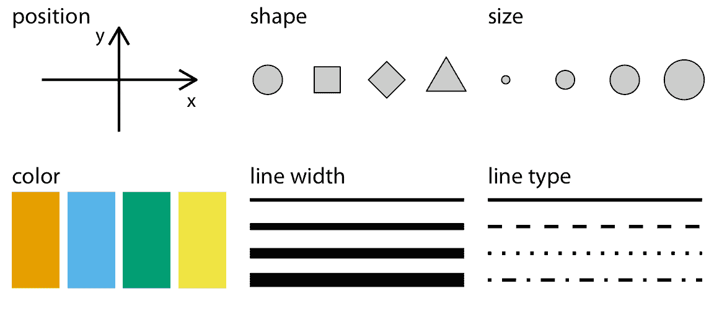
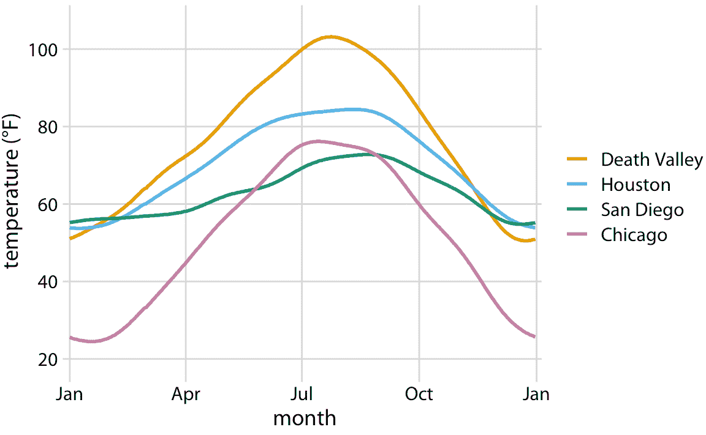
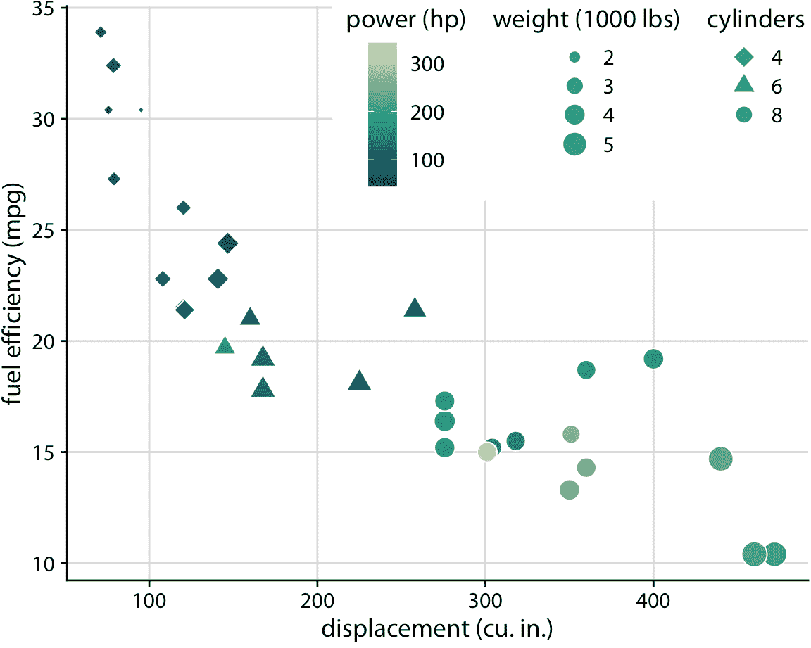

# 2 可视化数据：将数据映射到美学上

> 原文： [https://serialmentor.com/dataviz/aesthetic-mapping.html](https://serialmentor.com/dataviz/aesthetic-mapping.html)

每当我们可视化数据时，我们都会采用数据值并将它们以系统和逻辑的方式转换为构成最终图形的视觉元素。尽管存在许多不同类型的数据可视化，并且乍一看散点图，饼图和热图似乎没有太多共同点，但所有这些可视化都可以用一种通用语言来描述，它捕获了数据如何变成纸上的墨水斑点，或屏幕上的彩色像素。主要的见解如下：所有数据可视化将数据值映射到所得图形的可量化特征。我们将这些特征称为美学。

## 2.1 美学和数据类型

美学描述了给定图形元素的每个方面。图 2.1 中提供了一些示例。每个图形元素的关键组成部分当然是它的位置，描述了元素的位置。在标准 2D 图形中，我们通过`x`和`y`值来描述位置，但是其他坐标系和一维或三维可视化也是可能的。接下来，所有图形元素都具有形状，尺寸和颜色。即使我们正在准备黑白图纸，图形元素也需要有可见的颜色，例如，如果背景为白色，则为黑色；如果背景为黑色，则为白色。最后，我们使用线条来可视化数据，这些线条可能具有不同的宽度或点划线图案。除了图 2.1 中显示的示例之外，我们在数据可视化中可能会遇到许多其他美学。例如，如果我们想要显示文本，我们可能必须指定字体系列，字体界面和字体大小，如果图形对象重叠，我们可能必须指定它们是否部分透明。



图 2.1：数据可视化中常用的美学：位置，形状，大小，颜色，线宽，线型。这些美学中的一些可以表示连续和离散数据（位置，大小，线宽，颜色），而其他美学通常仅表示离散数据（形状，线型）。

所有美学都属于两类：可以代表连续数据的那些和不能代表连续数据的那些。连续数据值是存在任意精细中间体的值。例如，持续时间是连续值。在任何两个持续时间（例如 50 秒和 51 秒）之间，存在任意多个中间体，例如 50.5 秒，50.51 秒，50.50001 秒等。相比之下，房间中的人数是离散值。一个房间可以容纳 5 人或 6 人，但不能容纳 5.5 人。对于图 2.1 中的示例，位置，大小，颜色和线宽可以表示连续数据，但形状和线型通常只能表示离散数据。

接下来，我们将考虑可能要在可视化中表示的数据类型。您可能会将数据视为数字，但数字只是我们可能遇到的几种数据类型中的两种。除连续和离散数值外，数据还可以以离散类别的形式，以日期或时间的形式出现，也可以作为文本（表 2.1）。当数据是数字时我们也称它为定量的，当它是类别时我们称它为定性的。保存定性数据的变量是因子，不同的类别称为水平。最常见的一个因子的水平是没有顺序的（如表 2.1 中的“狗”，“猫”，“鱼”的例子），但是当存在内在因素时也可以在水平之间的对因子排序（如表 2.1 中的“好”，“一般”，“差”的例子）。

| 变量的类型 | 例子 | 适当的规模 | 描述 |
| :-- | :-- | :-- | :-- |
| 定量/数值连续 | 1.3,5.7,83,1.5x10 &lt;sup&gt;-2&lt;/sup&gt; | 连续 | 任意数值。这些可以是整数，有理数或实数。 |
| 定量/数值离散 | 1,2,3,4 | 离散的 | 离散单位中的数字。这些是最常见但不一定是整数。例如，如果给定数据集中不存在中间值，则数字 0.5,1.0,1.5 也可视为离散。 |
| 定性/无序类别 | 狗，猫，鱼 | discrete | 没有顺序的类别。这些是离散且独特的类别，没有固有的顺序。这些变量也称为 _ 因子 _。 |
| 定性/有序类别 | 好，公平，穷人 | discrete | 带顺序的类别。这些是具有顺序的离散且唯一的类别。例如，“公平”总是介于“好”和“差”之间。这些变量也称为 _ 有序因子 _。 |
| 日期或时间 | 2018 年 1 月 5 日，上午 8:03 | 连续的或离散的 | 特定日期和/或时间。也是通用日期，例如 7 月 4 日或 12 月 25 日（没有年份）。 |
| 文本 | 敏捷的棕色狐狸跳过了懒狗。 | 无，或离散 | 自由格式文本。如果需要，可以视为分类。 |

要查看这些不同类型数据的具体示例，请查看表 2.2 。它显示了数据集的前几行，它们提供了美国四个地点的日常温度法线（30 年窗口中的平均日常温度）。此表包含五个变量：月，日，位置，站点 ID 和温度（以华氏度为单位）。月是有序因子，日是离散数值，位置是无序因子，站点 ID 同样是无序因子，温度是连续数值。

| 月 | 天 | 地点 | 站点 ID | 温度 |
| :-: | :-: | :-- | :-: | :-: |
| Jan | 1 | Chicago | USW00014819 | 25.6 |
| Jan | 1 | San Diego | USW00093107 | 55.2 |
| Jan | 1 | Houston | USW00012918 | 53.9 |
| Jan | 1 | Death Valley | USC00042319 | 51.0 |
| Jan | 2 | Chicago | USW00014819 | 25.5 |
| Jan | 2 | San Diego | USW00093107 | 55.3 |
| Jan | 2 | Houston | USW00012918 | 53.8 |
| Jan | 2 | Death Valley | USC00042319 | 51.2 |
| Jan | 3 | Chicago | USW00014819 | 25.3 |
| Jan | 3 | San Diego | USW00093107 | 55.3 |
| Jan | 3 | Death Valley | USC00042319 | 51.3 |
| Jan | 3 | Houston | USW00012918 | 53.8 |

## 2.2 将地图数据值缩放到美学上

为了将数据值映射到美学上，我们需要指定哪些数据值对应于哪些特定的美学值。例如，如果我们的图形具有 _x_ 轴，那么我们需要指定哪些数据值沿着该轴落在特定位置上。同样，我们可能需要指定哪些数据值由特定形状或颜色表示。数据值和美学值之间的映射是通过刻度创建的。刻度定义了数据和美学之间的唯一映射（图 2.2）。重要的是，刻度必须是一对一的，这样对于每个特定的数据值，只有一个美学值，反之亦然。如果刻度不是一对一的，那么数据可视化就变得模棱两可。


图 2.2：将一串数据值缩放到美学。这里，数字 1 到 4 已被映射到位置，形状和颜色刻度。对于每个刻度，每个数字对应于唯一的位置，形状或颜色，反之亦然。

让我们把事情付诸实践。我们可以采用表 2.2 中显示的数据集，将温度映射到 _y_ 轴上，一年中的日期映射到 _x_ 轴上，位置映射到颜色上，并可视化这些美学与实线。结果是一个标准线图，显示了四个位置随着一年中的变化的温度法线（图 2.3）。



图 2.3：美国四个选定位置的每日温度法线，温度映射到 _y_ 轴，一年中的某一天映射到 _x_ 轴，以及位置到线的颜色。数据来源：NOAA。

图 2.3 是一个相当标准的温度曲线可视化，可能是大多数数据科学家首先直观选择的可视化。但是，由我们决定哪些变量映射到哪个刻度。例如，不将温度映射到 _y_ 轴上，不将位置映射到颜色上，我们可以做相反的事情。因为现在感兴趣的关键变量（温度）显示为颜色，我们需要显示足够大的颜色区域，以便颜色传达有用信息（Stone，Albers Szafir 和 Setlur [2014](#ref-Stone_et_al_2014)）。因此，对于这种可视化，我选择了正方形而不是线条，每个月和位置都有一个，我用每个月的平均温度法线对它们着色（图 2.4）。


图 2.4：美国四个地点的每月正常平均温度数据来源：NOAA

我想强调的是，图 2.4 使用两个位置刻度（沿着 _x_ 轴的月份和沿着 _y_ 轴的站点），但两者都不是连续刻度。月份是一个有 12 个水平的有序因子，位置是一个有四个水平的无序因子。因此，两个位置刻度都是离散的。对于离散位置刻度，我们通常将因子的不同水平沿轴线以相等的间距放置。如果因子是有序的（就像这里的月份一样），则需要按适当的顺序放置水平。如果因子是无序的（这里是站点的情况），那么顺序是任意的，我们可以选择我们想要的任何顺序。我排列了整体最冷（芝加哥）到整体最热（死亡谷）的地点，来产生令人愉快的惊人色彩。但是，我可以选择任何其他顺序，这个图表同样有效。

图 2.3 和 2.4 总共使用了三个刻度，两个位置刻度和一个颜色刻度。这是基本可视化的典型刻度数，但我们可以同时使用三个以上的刻度。图 2.5 使用五个刻度，两个位置刻度，一个颜色，一个尺寸和一个形状刻度，所有刻度表示来自数据集的不同变量。



图 2.5：32 辆汽车（型号为 1973-74）的燃油效率与排量。该图使用五个单独的刻度来表示数据：

(i) *x* 轴（排量）；

(ii) *y* 轴（燃油效率）；

(iii) 数据点的颜色（功率）；

(iv) 数据点的大小（重量）；

(v) 数据点的形状（缸数）。

显示的五个变量中的四个（位移，燃料效率，功率和重量）是数值连续的。剩余的一个（缸数）可以被认为是数值离散的或定性的。数据来源：Motor Trend，1974。

### 参考

```
Stone, M., D. Albers Szafir, and V. Setlur. 2014. “An Engineering Model for Color Difference as a Function of Size.” In 22nd Color and Imaging Conference. Society for Imaging Science and Technology.
```