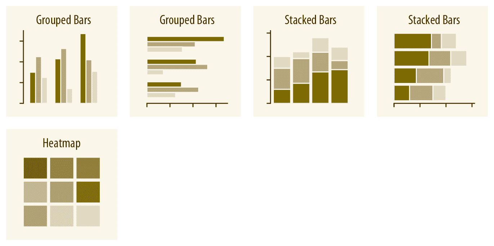
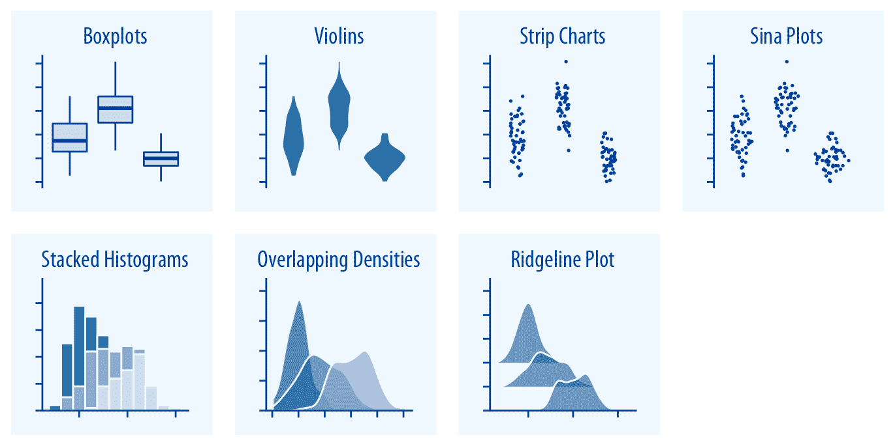

# 5 可视化的目录

> 原文： [5 Directory of visualizations](https://serialmentor.com/dataviz/directory-of-visualizations.html)

> 校验：[飞龙](https://github.com/wizardforcel)

> 自豪地采用[谷歌翻译](https://translate.google.cn/)

本章提供了通常用于可视化数据的各种图表的简单可视化概述。它既可以作为目录，也可以用来查找您可能不知道的特定名称的可视化，如果您需要找到您经常制作的图表的替代方案，则可以作为灵感来源。

## 5.1 数量

可视化数量的最常见方法（即，针对某些类别显示的数值）是使用垂直或水平排列的条形（第六章）。但是，我们也可以将点放在相应条形的结束位置（第六章），而不是使用条形图。

如果有两组或多组我们想要显示数量的类别，我们可以对条形图进行分组或堆叠（第六章）。我们还可以将类别映射到 *x* 和 *y* 轴上，并通过热图（第六章）按颜色显示数量。

## 5.2 分布

直方图和密度图（第七章）提供了最直观的分布可视化，但两者都需要任意参数的选择，并且可能会产生误导。累积密度和分位数-分位数（q-q）图（第八章）总是忠实地表示数据，但可能更难以解释。

当我们想要一次可视化许多分布，和/或我们主要感兴趣的是分布之间的整体变化时，箱形图，提琴图，带状图和 Sina 图是很有用的（9.1 节 ）。堆叠的直方图和密度图允许更深入地比较较少数量的分布，尽管堆叠的直方图可能难以解释并且最好避免（7.2 节）。Ridgeline 图可以作为提琴图的有用替代品，并且在可视化非常大量的分布或随时间的分布变化时通常是有用的（9.2 节）。

## 5.3 比例

比例可以显示为饼图，并排条形或堆叠条形图（第 10 章），并且就数量而言，条形可以垂直或水平排列。饼图强调单个部分加起来是整体并突出显示简单的部分。然而，在并排的条形中更容易比较各个部分。对于一组比例，堆叠条形看起来很尴尬，但在比较多组比例时可能很有用（见下文）。

当在多个条件下可视化多组比例或比例变化时，饼图往往是空间效率低下且关系模糊的。只要比较的条件数量适中，分组条形就可以工作得很好，并且堆叠条形可以适用于大量条件。当比例沿连续变量变化时，堆叠密度图（第 10 章）是合适的。

当根据多个分组变量指定比例时，马赛克图，树形图或平行集图是有用的可视化方法（第 11 章）。马赛克图假设一个分组变量的每个水平都可以与另一个分组变量的每个水平组合，而树形图不会做出这样的假设。即使一个组的细分完全不同于另一个细分，树形图也能工作得很好。当有两个以上的分组变量时，平行集图比马赛克图或树形图更好。

## 5.4 *x* - *y* 的关系

当我们想要相对于另一个定量变量显示一个定量变量时，散点图代表了原型可视化（12.1 节）。如果我们有三个定量变量，我们可以将一个定位到点大小，创建一个称为气泡图的散点图变体。对于配对数据，沿 *x* 和 *y* 轴的变量以相同单位测量，添加一条表示 *x = y* 的直线通常很有帮助（12.4 节）。配对数据也可以显示为由直线连接的成对点的斜率图（12.4 节）。

对于大量的点，由于过度绘图，常规散点图可能变得无法提供信息。在这种情况下，等值线图，2D 箱形图或六角箱形图可以提供替代方案（第 18 章）。另一方面，当我们想要可视化两个以上的数量时，我们可以选择以相关图的形式而不是基础原始数据来绘制相关系数（章节 12.2 ）。

当 *x* 轴表示时间或严格增加的量（例如治疗剂量）时，我们通常绘制线形图（第 13 章）。如果我们有两个响应变量的时间序列，我们可以绘制一个连通的散点图，我们首先在散点图中绘制两个响应变量，然后连接对应于相邻时间点的点（13.3 节）。我们可以使用平滑线图来表示更大数据集中的趋势（第 14 章）。

## 5.5 地理空间数据

显示地理空间数据的主要模式是地图形式（第 15 章）。地图采用地球上的坐标并将它们投影到平面上，使得地球上的形状和距离大致由 2D 表示中的形状和距离表示。此外，通过根据数据对地图中的这些区域着色，我们可以显示不同区域的数据值。这样的地图称为等值区图（15.3 节）。在某些情况下，根据一些其他数量（例如，人口数量）扭曲不同区域或将每个区域简化为正方形可能是有帮助的。这种可视化称为统计地图。

## 5.6 不确定性

误差条表示某些估计或测量的可能值的范围。它们从表示估计或测量的某个参考点水平和/或垂直延伸（第 16 章）。参考点可以以各种方式显示，例如通过点或条形。渐变误差条同时显示多个范围，其中每个范围对应于不同的置信度。它们实际上是多个误差条，其中不同的线厚度彼此叠加。

为了实现比误差条或分级误差条更详细的可视化，我们可以看到实际的置信度或后验分布（第 16 章）。置信区域提供清晰的视觉不确定感，但难以准确读取。眼睛图和半眼图将误差条与可视化分布（分别为提琴和脊线）的方法相结合，因此显示了一些置信水平和整体不确定性分布的精确范围。分位点图可以作为不确定性分布的替代可视化（16.1  节）。通过以离散单位显示分布，分位点点图不是那么精确，但比提琴或脊线图所示的连续分布更容易阅读。

对于平滑线图，误差条的等效值是置信带（16.3 节）。它显示了线条在给定置信水平下可能通过的一系列值。与误差条的情况一样，我们可以绘制分级置信带，一次显示多个置信水平。我们还可以显示单独的拟合绘图来代替置信带或放在一起。